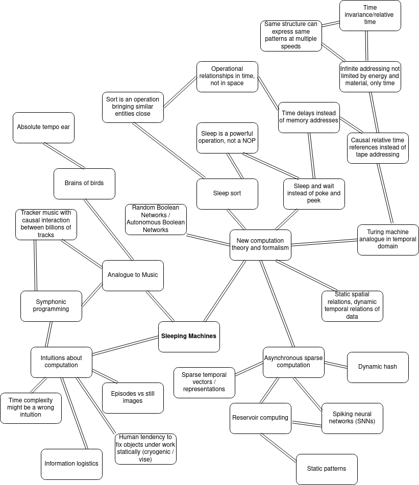

# Sleeping Machines
A manifesto for temporal computing where memory indexing is replaced by temporal delays and relative, causal, temporal referencing.

## A Mind Map

## Notes

- We believe Sleep Sort exposes something fundamental about computation in the time domain that is critical in understanding sparse asynchronous computing like that happening in biological neural networks.
- Formulating a theory of computation in a Turing machine analogue where the tape read/write is replaced by parallel, asynchronous nodes sleeping, waiting and sending causal signals should offer us ways to understand fast processes in biological neural networks better.
- It is likely that disabling Long-Term Potentiation (LTP) in a human brain would still allow the human to solve a Sudoku. It is therefore putting a carriage before the horse to go on with the hypothesis that neural signaling purpose is to effect LTP such as Spike Timing-Dependent Plasticity (STDP). Instead, LTP happens to support the primary process of fast time-domain distributed, sparse, asynchronous computation.
- In classical computers, the operations are dynamic in terms of space and topology; it is fast to access any memory location and read/write them. Hence sorting algorithms are based on swapping items around across arrays. The time dimension dynamics are synchronous, lockstep and inflexible.
- In biological neural networks, the topological connectivity and arbitrary spatial access are extremely static and limited, but time domain is flexible, asynchronous and rich in arbitrary dynamics. Hence sorting algorithms in such architectures would be conveniently based on delays.
- In quantum computing, the computation can be imagined to be offloaded to parallel universes where all potentials happen. The resulting signal of the computation results need to be communicated back over a shared channel, which limits the information bandwidth. This might be analogous to neural (non-quantum) computing where we can say that there are "enough" parallel units, but their signaling goes over a shared channel with cross-talk. The resulting computational complexity theory might have some shared results and analogies in quantum computation results.

## Causal Logic

- Emit A after delay x if no B before that.

## Computational Challenges

- Find a best alternative out of alternative signals.
- Predict the future signal.

## References

- [Sleep Sort](https://rosettacode.org/wiki/Sorting_algorithms/Sleep_sort): "Basically if you transform set L into the time domain, when collecting it back you get it back sorted.", "the time and space complexity for Sleep sort are O(1)."
- [Synapses and Memory Storage](https://www.ncbi.nlm.nih.gov/pmc/articles/PMC3367555/): "For example, certain genetic manipulations that disrupt hippocampal LTP do not impair forms of memory believed to require the hippocampus (e.g., Zamanillo et al. 1999)."
- [On the origin of chaos in autonomous Boolean networks](https://royalsocietypublishing.org/doi/10.1098/rsta.2009.0235): "An autonomous Boolean network (ABN) is a set of nodes with binary values coupled by links with associated time delays. Each node is updated continuously according to a designated Boolean function of the values of its inputs at the appropriate previous times."
- [Causal Logic Models](https://sites.stat.washington.edu/tsr/uai-causal-structure-learning-workshop/papers/dash.pdf): "We define Causal Logic Models (CLMs), a new probabilistic, first-order representation which uses causality as a fundamental building block. Rather than merely converting causal rules to first-order logic as various methods in Statistical Relational Learning have done, we treat the causal rules as basic primitives which cannot be altered without changing the system."
- [Learning and Memory](http://michaeldmann.net/mann18.html): Explains how learning works on biology in-depth detail in the synapses.
- [A Memory without a Brain](https://www.tum.de/nc/en/about-tum/news/press-releases/details/36462/)
- [Quantum Parallelism](https://www.sciencedirect.com/topics/mathematics/quantum-parallelism): "Like most factorization algorithms, Shor's algorithm reduces the factorization problem to the problem of finding the period of a function, but uses quantum parallelism to find a superposition of all values of the function in one step.", "In 1996 Grover described a quantum algorithm for searching an unsorted database D containing N items in a time of order N; on a classical computer, the search requires a time of order N."
