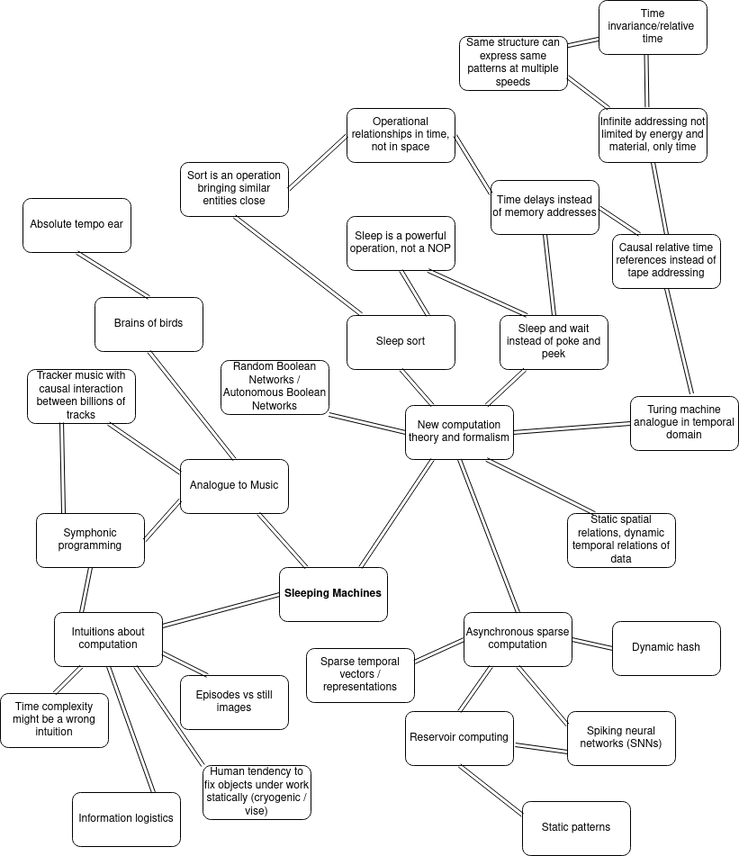

# Sleeping Machines
A manifesto for temporal computing where memory indexing is replaced by temporal delays and relative, causal, temporal referencing.

## A Mind Map


## Notes

- We believe Sleep Sort exposes something fundamental about computation in the time domain that is critical in understanding sparse asynchronous computing like that happening in biological neural networks.
- Formulating a theory of computation in a Turing machine analogue where the tape read/write is replaced by parallel, asynchronous nodes sleeping, waiting and sending causal signals should offer us ways to understand fast processes in biological neural networks better.
- It is likely that disabling Long-Term Potentiation (LTP) in a human brain would still allow the human to solve a Sudoku. It is therefore putting a carriage before the horse to go on with the hypothesis that neural signaling purpose is to effect LTP such as Spike Timing-Dependent Plasticity (STDP). Instead, LTP happens to support the primary process of fast time-domain distributed, sparse, asynchronous computation.
- In classical computers, the operations are dynamic in terms of space and topology; it is fast to access any memory location and read/write them. Hence sorting algorithms are based on swapping items around across arrays. The time dimension dynamics are synchronous, lockstep and inflexible.
- In biological neural networks, the topological connectivity and arbitrary spatial access are extremely static and limited, but time domain is flexible, asynchronous and rich in arbitrary dynamics. Hence sorting algorithms in such architectures would be conveniently based on delays.
- In quantum computing, the computation can be imagined to be offloaded to parallel universes where all potentials happen. The resulting signal of the computation results need to be communicated back over a shared channel, which limits the information bandwidth. This might be analogous to neural (non-quantum) computing where we can say that there are "enough" parallel units, but their signaling goes over a shared channel with cross-talk. The resulting computational complexity theory might have some shared results and analogies in quantum computation results.

## Causal Logic

- Emit A after delay x if no B before that.

## Computational Challenges

- Find a best alternative out of alternative signals.
- Predict the future signal.

## Relation to Quantum Computing

In quantum computing the computation formalism is generally defined based on memories and gates. The memories have states which can be represented as complex numbers, and the gates operate on these states to produce new states. The operations are represented by matrix multiplications.

While state superpositions allow computational speed up compared to classical computing, in a way computing all the simultaneous state computational circuits simultaneously, and utilizing entanglement, constructive and destructive interference to make the alternatives fall into measurable consensus state, time dimension is not represented at all.

The formalism is spatial in nature, and defines way different memories are spatially separate and the relations between those spatially discrete states. Interestingly anti-causal phenomena can happen in quantum circuits.

However, complex numbers in principle can represent time-domain phenomena such as frequencies and phases in signals, so maybe analogous formalism could be used in neural computation, where something analogous to constructive and destructive interference can happen in neuronal connectivity in excitatory and inhibitory synaptic connections. The complex algebra might allow us to represent relative temporal characteristics of signals and how they interact.

We still need to define the formalism in a way which relates state to state evolution through operations. Instead of discrete memories I suggest we might consider representing the state as a mixture of signals, forming a reservoir computing -kind of a pool of dynamic interaction. Additionally, the fundamental computing operations should be causal in kind so that it matters which precondition triggers first, and these operations should have a tendency to "collapse" out the future alternatives which were made counterfactual.

Note that the state here is a single global spatial location (or region), and computation happens in the causal time dimension interactions within it. When we have formalism defined for one region, we can look into how to expand it (continuously?) into imperfectly connected sets of regions, which might form either discrete units (unrealistic?) or a continuum of units which blend into each other continuously.

## Relation to Neural Controlled Differential Equations

Controlled differential equations have a natural relationship with time and sparse signals. It is unclear to me if causality can be strictly incorporated into these formalisms so that the control for example always depends only on the past signal values. Additionally, as it currently is, controlled differential equations and even neural controlled differential equations don't seem to have appropriate focus on parallel reservoir computing where multiple branches of computations compete with each others in time, and where the numbers of parallel branches on-going could be abstracted as a continuous distribution over states in a reservoir instead of explicitly defining micro-level functions.

## Some Initial Thoughts

Let's divide the time into causal split, where the past and the present is represented as a state.

Let's represent the future as a pool of potential events, every event having an associated distribution of latency from the current time.

Let's represent the operation of rolling the time forward one infinitesimal step as some iterative operator `W` which weaves the future potential events into the present state representation. In specific:

`s', f' = W(s, f)`, where `s` is the state before weaving, `s'` is the state after weaving, `f` is the pool of future potential events, and `f'` is a next time slice modulated pool of future potential events. `W` operator is stochastic, and samples the latency distributions in `f` so that some subset of `f` is picked to be applied, and that subset applies to `f` to produce `f'` and to `s` to produce `s'`.

When `x in f` applies, it needs to be self-canceling, so that it removes itself from the pool of future potential events. Every time step also needs to modulate the `f` to take an infinitesimal time step forward, we call that a trivial modulation `t`. The trivial modulation simply reduces the expected latencies of all future potential events uniformly. In general, `x in f` can increase or decrease latencies of future potential events in a non-uniform fashion. Causality cannot be broken, so expected latencies cannot be negative.

The beef is in how the iterative weaving operator `W` is defined. It can be defined as follows:

1. Slice the next infinitesimal time slice of all the future potential event probability distributions in `f` so that we get the independent probability for each potential event at this next time slice. Note that event probabilities are causally dependent over successive time slices, but independent within a time slice.
2. Sample the set of modulations to apply, `m subset_of f`, where `x in m`.
3. Combine these modulations with the trivial modulation `t`.
4. Apply these modulations conditioned by `s` to `f` so that latency probability distributions of different events shift to produce `f'`, which also cancels all `m` in `f'` so that `f' intersection m = 0`.
5. Apply the state transformations related to these modulations to `s` to produce `s'`.

The pool of future potential events needs to have the following operators defined:
1. Sample `m` from `f`.
2. Apply `m + t` conditioned by `s` to `f` to produce `f'`.

The state needs to have the following operators defined:
1. Apply `m + t` to `s` to produce `s'`.

## Wild Ideas

- What if neurons which roughly integrate and fire actually integrate confidence in some interpretation of the world, and fire as soon as the confidence for this achieves large enough value? Populations of neurons would then listen to signals from the external world, each increasing and decreasing its own internal confidence, and compete in which neuron fires its own subsymbol first, thus broadcasting this opinion of truth which the other neurons then need to take into account in their own continuously integrated confidences.

## Experiments

The first preregistered experiments on the core ideas (event races, cancellation, learning from the traces of cancelled events, and energy estimates from measured operation counts) are written up in **[REPORT.md](REPORT.md)**. Code is under `sleeping_machines/` and `experiments/`; the earlier v2/v3 experiments are kept in `legacy/`.

## Citing

Sleeping Machines

```
@article{keskival2021sleeping,
  title={Sleeping Machines},
  author={Keski-Valkama, Tero},
  year={2021},
  doi={10.5281/zenodo.13207423}
}
```

[](https://zenodo.org/doi/10.5281/zenodo.13207423)

## References

- [Sleep Sort](https://rosettacode.org/wiki/Sorting_algorithms/Sleep_sort): "Basically if you transform set L into the time domain, when collecting it back you get it back sorted.", "the time and space complexity for Sleep sort are O(1)."
- [Synapses and Memory Storage](https://www.ncbi.nlm.nih.gov/pmc/articles/PMC3367555/): "For example, certain genetic manipulations that disrupt hippocampal LTP do not impair forms of memory believed to require the hippocampus (e.g., Zamanillo et al. 1999)."
- [On the origin of chaos in autonomous Boolean networks](https://royalsocietypublishing.org/doi/10.1098/rsta.2009.0235): "An autonomous Boolean network (ABN) is a set of nodes with binary values coupled by links with associated time delays. Each node is updated continuously according to a designated Boolean function of the values of its inputs at the appropriate previous times."
- [Causal Logic Models](https://sites.stat.washington.edu/tsr/uai-causal-structure-learning-workshop/papers/dash.pdf): "We define Causal Logic Models (CLMs), a new probabilistic, first-order representation which uses causality as a fundamental building block. Rather than merely converting causal rules to first-order logic as various methods in Statistical Relational Learning have done, we treat the causal rules as basic primitives which cannot be altered without changing the system."
- [Learning and Memory](http://michaeldmann.net/mann18.html): Explains how learning works on biology in-depth detail in the synapses.
- [A Memory without a Brain](https://www.tum.de/nc/en/about-tum/news/press-releases/details/36462/)
- [Quantum Parallelism](https://www.sciencedirect.com/topics/mathematics/quantum-parallelism): "Like most factorization algorithms, Shor's algorithm reduces the factorization problem to the problem of finding the period of a function, but uses quantum parallelism to find a superposition of all values of the function in one step.", "In 1996 Grover described a quantum algorithm for searching an unsorted database D containing N items in a time of order N; on a classical computer, the search requires a time of order N."
- [Machine Learning With Neural Controlled Differential Equations](https://www.maths.ox.ac.uk/node/38559): "Neural controlled differential equations are actually the continuous-time limit of recurrent neural networks."
- [Towards Causal Representation Learning](https://arxiv.org/abs/2102.11107): "A central problem for AI and causality is, thus, causal representation learning, the discovery of high-level causal variables from low-level observations."
- ["It’s really important not just how many [neuron activations] occur, but when exactly they occur."](https://www.quantamagazine.org/a-new-kind-of-information-coding-seen-in-the-human-brain-20210707/)
- ["This strategy, introduced in a paper published in Nature Machine Intelligence, is a rigorous adaptation of a time-to-first-spike (TTFS) coding scheme, together with a corresponding learning rule implemented on certain networks of artificial neurons. TTFS is a time-coding approach, in which the activity of neurons is inversely proportional to their firing delay."](https://techxplore.com/news/2021-10-framework-deep-first-spike.html)
- ["We see bio-plausible simulations implemented by digital computers or spiking networks memristive hardware as promising bridge or middleware between digital and (neuro)biological domains."](https://arxiv.org/abs/2205.06538)
- ["Why would the brain maintain different delays with such precision if spike timing were not important?"](https://www.izhikevich.org/publications/spnet.pdf)
- ["We show how the brain achieves this feat: Different sounds are responded to with different neural populations. And, each sound is time-stamped with how much time has gone by since it entered the ear. This allows the listener to know both the order and the identity of the sounds that someone is saying to correctly figure out what words the person is saying.”](https://www.nyu.edu/about/news-publications/news/2022/november/our-brains--time-stamp--sounds-to-process-the-words-we-hear.html)
- ["Neurons in the brain exhibit two types of sparsity; they are sparsely interconnected and sparsely active. These two types of sparsity, called weight sparsity and activation sparsity, when combined, offer the potential to reduce the computational cost of neural networks by two orders of magnitude."](https://iopscience.iop.org/article/10.1088/2634-4386/ac7c8a)
- ["...we define an implementation of neural computation that can both decompile computations from existing neural connectivity and compile distributed programs as new connections."](https://www.nature.com/articles/s42256-023-00668-8)


## Related Prior Art

Existing work that the ideas above overlap with or build on, grouped by the idea it bears on. Any claim of novelty has to be made against these.

**Computing with delays and races**
- Madhavan, Sherwood & Strukov (2014). *Race logic: a hardware acceleration for dynamic programming algorithms.* ISCA 2014. Encodes values as arrival times and computes shortest paths and sequence alignment by racing signals through delay elements: the closest existing form of "time replaces addressing".
- Alur & Dill (1994). *A theory of timed automata.* Theoretical Computer Science 126. The standard formalism for computation with clocks and timing constraints.
- Maass (1997). *Networks of spiking neurons: the third generation of neural network models.* Neural Networks 10. Computational power of networks whose values are spike times.
- Maass (2000). *On the computational power of winner-take-all.* Neural Computation 12. A single winner-take-all race is computationally as powerful as a layer of threshold gates.
- Izhikevich (2006). *Polychronization: computation with spikes.* Neural Computation 18. Precise axonal delays create reproducible time-locked firing groups.
- Thorpe, Delorme & Van Rullen (2001). *Spike-based strategies for rapid processing.* Neural Networks 14. Rank-order and first-spike codes: information in which neuron fires first.

**Decisions as races between accumulators**
- Wald (1945). *Sequential tests of statistical hypotheses.* Annals of Mathematical Statistics 16. Optimal stopping on accumulated evidence.
- Baum & Veeravalli (1994). *A sequential procedure for multihypothesis testing.* IEEE Transactions on Information Theory 40. The MSPRT used as the reference in E2.
- Ratcliff (1978). *A theory of memory retrieval.* Psychological Review 85. The drift-diffusion model of decision time.
- Usher & McClelland (2001). *The time course of perceptual choice: the leaky, competing accumulator model.* Psychological Review 108. Competing accumulators with mutual inhibition, very close to the "integrate confidence and fire first" idea.
- Bogacz, Brown, Moehlis, Holmes & Cohen (2006). *The physics of optimal decision making.* Psychological Review 113. When accumulator races implement optimal sequential tests.

**Learning from spike timing**
- Bohte, Kok & La Poutré (2002). *Error-backpropagation in temporally encoded networks of spiking neurons.* Neurocomputing 48. SpikeProp: gradient descent on spike times.
- Gütig & Sompolinsky (2006). *The tempotron: a neuron that learns spike timing-based decisions.* Nature Neuroscience 9.
- Mostafa (2018). *Supervised learning based on temporal coding in spiking neural networks.* IEEE TNNLS 29. Exact gradients for time-to-first-spike networks.
- Comsa et al. (2020). *Temporal coding in spiking neural networks with alpha synaptic function.* ICASSP 2020.
- Göltz et al. (2021). *Fast and energy-efficient neuromorphic deep learning with first-spike times.* Nature Machine Intelligence 3.
- Kheradpisheh & Masquelier (2020). *Temporal backpropagation for spiking neural networks with one spike per neuron.* International Journal of Neural Systems 30.
- Hammouamri, Khalfaoui-Hassani & Masquelier (2024). *Learning delays in spiking neural networks using dilated convolutions with learnable spacings.* ICLR 2024. Learned delays; state of the art on spiking speech benchmarks.

**Local and delayed credit assignment**
- Frey & Morris (1997). *Synaptic tagging and long-term potentiation.* Nature 385. Synapses keep a tag that a later signal can convert into lasting change.
- Izhikevich (2007). *Solving the distal reward problem through linkage of STDP and dopamine signaling.* Cerebral Cortex 17. Eligibility traces bridging a delay to reward.
- Frémaux & Gerstner (2016). *Neuromodulated spike-timing-dependent plasticity, and theory of three-factor learning rules.* Frontiers in Neural Circuits 9.
- Gerstner, Lehmann, Liakoni, Corneil & Brea (2018). *Eligibility traces and plasticity on behavioral time scales.* Frontiers in Neural Circuits 12.
- Zenke & Ganguli (2018). *SuperSpike: supervised learning in multilayer spiking neural networks.* Neural Computation 30.
- Neftci, Mostafa & Zenke (2019). *Surrogate gradient learning in spiking neural networks.* IEEE Signal Processing Magazine 36. The counterfactual distance-to-threshold trace plays a similar role, stored once per event.
- Bellec et al. (2020). *A solution to the learning dilemma for recurrent networks of spiking neurons.* Nature Communications 11. e-prop: online, local eligibility-based learning.
- Lillicrap, Cownden, Tweed & Akerman (2016). *Random synaptic feedback weights support error backpropagation for deep learning.* Nature Communications 7. Feedback alignment, used for hidden-layer credit in E6.
- Diehl & Cook (2015). *Unsupervised learning of digit recognition using spike-timing-dependent plasticity.* Frontiers in Computational Neuroscience 9.
- Mozafari et al. (2018). *First-spike-based visual categorization using reward-modulated STDP.* IEEE TNNLS 29.

**Event-driven hardware, simulation and energy**
- Brette et al. (2007). *Simulation of networks of spiking neurons: a review of tools and strategies.* Journal of Computational Neuroscience 23. Clock-driven vs event-driven simulation.
- Merolla et al. (2014). *A million spiking-neuron integrated circuit with a scalable communication network and interface.* Science 345. TrueNorth.
- Furber, Galluppi, Temple & Plana (2014). *The SpiNNaker project.* Proceedings of the IEEE 102.
- Davies et al. (2018). *Loihi: a neuromorphic manycore processor with on-chip learning.* IEEE Micro 38. Source of the measured per-operation energies used in the report.
- Horowitz (2014). *Computing's energy problem (and what we can do about it).* ISSCC 2014. Source of the 45 nm arithmetic and memory energies used in the report.
- Cramer, Stradmann, Schemmel & Zenke (2022). *The Heidelberg spiking data sets for the systematic evaluation of spiking neural networks.* IEEE TNNLS 33. Spiking Heidelberg Digits, the planned timing-dependent benchmark.

## Repository

- [https://github.com/keskival/sleeping_machines](https://github.com/keskival/sleeping_machines)
