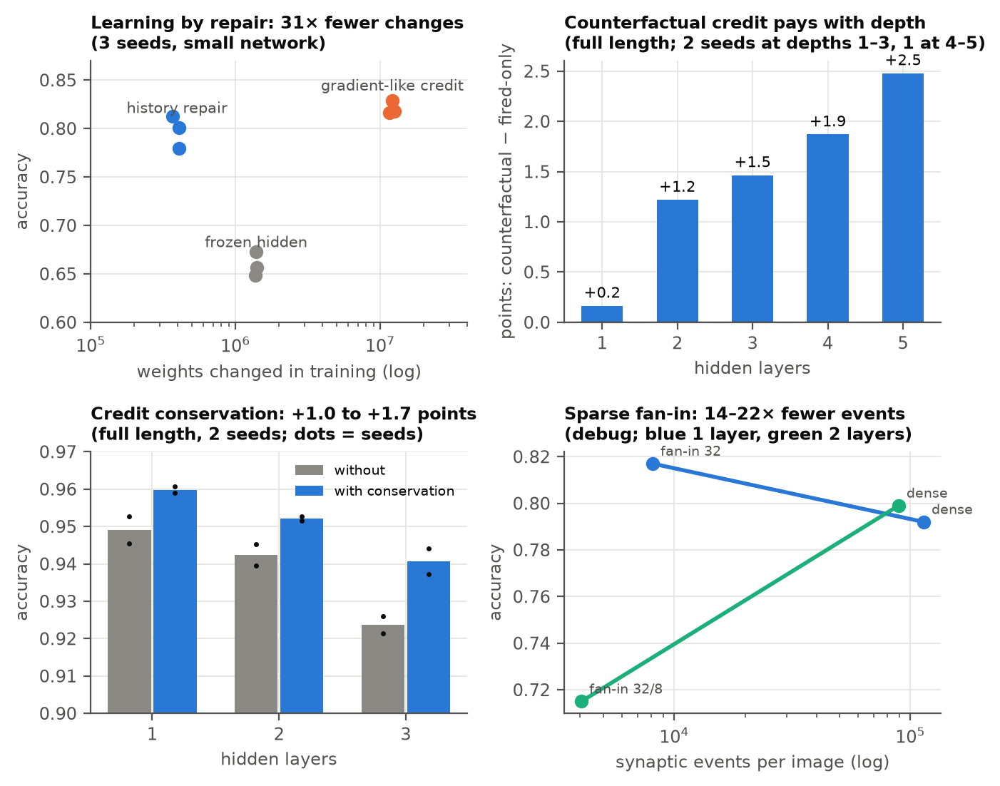
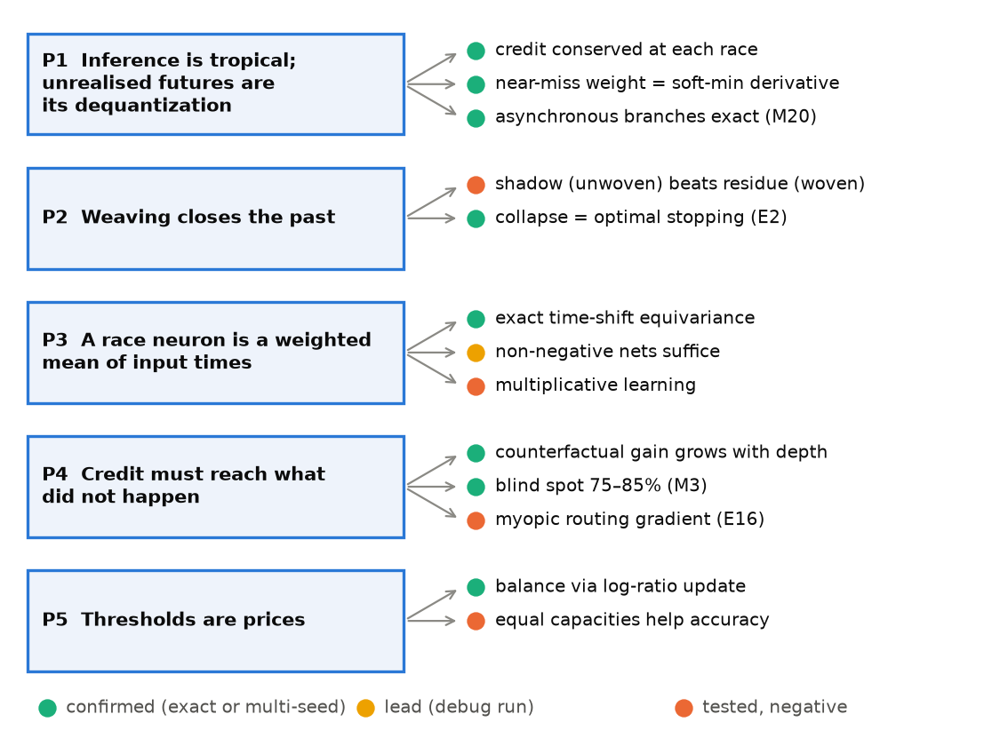

# Sleeping Machines: status report

*Status as of 26 September 2026. The fuller, illustrated version is the PDF built by `report/make_pdf.py`
(`report/sleeping_machines_status.pdf`). The theory is in `experiments/THEORY.md`, the running log in
`experiments/FINDINGS.md`, and every experiment's predictions in `experiments/E*_PREREGISTRATION.md`,
written before evaluation.*

Sleeping Machines proposes that computation can happen **in time rather than memory**: candidate events
race, the first to fire cancels the rest, and the cancelled ones keep a **trace of how close they came**, so
that a later teaching signal can use it. This report says what has held up, what has not, what the theory
now explains, and what is being tested.


**Contents:** [In one page](#in-one-page) · [The model](#the-model) · [Experiments](#experiments) ·
[Theory](#theory) · [E7 and E17: living in time](#e7-and-e17-living-in-time) · [Energy](#energy) ·
[Lessons](#lessons) · [Next](#next) · [Reproducing](#reproducing)

## In one page

**What holds up**
- **A cancelled node can be taught (E4).** At K = 128 classes, crediting near misses reaches 0.79 where the
  reward-modulated rule is at chance, with 6% of the weight updates of uniform credit.
- **Races decide as fast as the evidence allows (E2).** An accumulator race beats a fixed-time decoder at
  every decision time and matches the optimal MSPRT with additions and a threshold.
- **Learning work tracks activity, not capacity (E5):** about 300× fewer weight updates than a sparse
  softmax on the same connectivity.
- **Local, event-driven learning reaches about 96% on latency-coded MNIST** (E6 round 3, test; E14 with
  credit conservation, validation, 2 seeds: 0.960).
- **Counterfactual credit pays with depth (E14, full length).** Over fired-only credit: +0.2, +1.2, +1.5
  points at depths 1–3 (2 seeds), +1.9 and +2.5 at depths 4–5 (1 seed). A frozen hidden stack collapses.
- **Credit conservation, predicted by the theory, holds at full length:** +1.0 to +1.7 points at every
  depth, both seeds (0.960 / 0.952 / 0.941 vs 0.949 / 0.942 / 0.924 at depths 1 / 2 / 3).

**What does not (yet)**
- **Depth still costs accuracy.** The theory now names three reasons (credit contraction, activity drift,
  pattern chaos), each with a predicted remedy; all are untested.
- **Energy.** Only the single racing layer beats an equally accurate dense model at inference (about 2.4×).
  Sparse fan-in (14–22× fewer events in pilots) is the candidate fix.
- **Leads that reversed.** The shadow neuron (+5 points in debug runs, −0.8 at full length); the
  counterfactual routing gradient in mixture-of-experts (a tie with load balancing at 10 seeds).
- **Market stream (E17): no edge.** The race matches simple baselines while deciding a third earlier, but
  continual learning did not help, learned trade selection had no skill, and every learner loses money after costs.
- **Not yet run:** the E7 stream learner and most theory predictions (M31–M43).

## The model

Nodes are non-leaky integrate-to-threshold units with ramp synapses, in groups of 10; the first k = 3 to cross
threshold in a group fire, and the rest are cancelled, each freezing its distance to threshold. There is no
global clock: the simulator jumps from event to event and counts every operation.

**How a decision unfolds (weaving; [WEAVING.md](experiments/WEAVING.md)).** Each group holds an open set of
possible futures: its members' projected crossing times, which only move earlier as input arrives. A crossing
is *woven*, fixed history. When k members have crossed, the group closes and each loser's residue is frozen as
a near miss. Spikes from closed groups drive the next layer, so the settled region spreads through the network
as a diagonal front in layers and time, until the first output crossing decides. Learning rereads the woven
record, near misses included.

## Experiments

| experiment | question | result |
|---|---|---|
| **E4** counterfactual credit | can a cancelled node be taught? | yes: K = 128, 0.79 vs chance for fired-only rules; 6% of the updates of uniform credit; global-gradient reference 0.93 |
| **E2** adaptive decisions | does a race decide as fast as the evidence allows? | yes: dominates fixed-time decoding, matches MSPRT; 0.29 s easy vs 1.69 s hard |
| **E5** capacity | does work track activity? | inference flat in K (as is sparse softmax); learning 25–560× fewer updates |
| **E6** hidden layers | does local learning train hidden layers on MNIST? | round 3: about 0.96 (test); hidden learning +6 points over frozen random |
| **E14** depth | where does counterfactual credit pay? | gap over fired-only grows with depth (+0.2 → +2.5, depths 1–5); conservation +1.0–1.7 at every depth |
| **E16** routing (MoE) | does the counterfactual routing gradient help MoE? | myopic as derived; with lookahead, ties load balancing (10 seeds). No MoE claim |
| **M18** history repair | learn by fixing the pivotal event? | within 2.3 points of gradient-like rules with 31× fewer weight changes (3 seeds) |



**Depth, full length (validation; mean of 2 seeds unless noted).**

| hidden layers | counterfactual | fired-only | frozen | counterfactual + conservation |
|---|---|---|---|---|
| 1 | 0.949 | 0.947 | 0.873 | **0.960** |
| 2 | 0.942 | 0.930 | 0.708 | **0.952** |
| 3 | 0.924 | 0.909 | 0.565 | **0.941** |
| 4 (1 seed) | 0.910 | 0.891 | | |
| 5 (1 seed) | 0.897 | 0.872 | | |

Non-negative (excitatory-only) weights cost 0.5 points at depth 3 (0.932 vs 0.937, 1 seed).

## Theory

The theory note (`experiments/THEORY.md`, §1–41) reduces to five principles, now extended by a set of exact
results and derived mechanisms.



**What the theory added since (§27–41).** *Exact* means a derivation without approximation. *Scaling* means
an order-of-magnitude argument whose exponent or sign is the prediction. None of the predictions has been
confirmed yet; the tests are queued.

| result | kind | prediction / status |
|---|---|---|
| Timing credit sums to the deadline's credit: a Ward identity from time-shift symmetry (§30.1) | exact | centring timing credit is the symmetry, not a heuristic |
| Excitatory race networks are topical maps: timing noise is never amplified; each decision has a certified jitter radius (§34) | exact | zero flips among certified samples (M36) |
| Committing to a branch costs σ × surprisal; near-miss credit is the gradient of that cost; the supervised loss is the cost of weaving the teacher's branch (§35) | exact | self-supervised commitment objective widens margins (M37) |
| Deep credit contracts like a Markov chain; exact kernels conserve errors in the sum (§30–31) | scaling | share Jacobian + centring trains depth 3 (M34) |
| Credit through positive weights collapses to an activity (Perron) mode (§27, §29) | scaling; the outlier mode is prior art | Perron centring ≥ mean centring (M33) |
| Prices (thresholds) must be the faster timescale; our default is 10× too slow (§36) | scaling | threshold near κ ≈ η for pivotal credit (M38) |
| Firing *patterns* are chaotic, ρ' ≈ A√ρ, with no ordered phase; A ∝ 1/√k; topographic codes damp it (§41) | scaling | slope ½ in log ρ across layers (M43) |
| Winner–fan-in coupling k·F ≥ G; widths from the data's entropy exponent (§37) | scaling | entropy exponent measured as α ≈ 0.95, which **refuted** an input-redundancy pyramid |
| Optimal weaving prices commitment cost (MSPRT); race neurons are blind to absence unless referenced to their own onset (§38) | scaling; MSPRT is prior art | relative stopping beats the absolute race (M40) |
| A neuron's firing time is concave piecewise-linear, one piece per causal set (§34.1) | prior art | polyhedral geometry of first-spike networks (2026) |

The mathematics is borrowed (Noether and Ward identities, Perron–Frobenius and topical maps, Birkhoff
contraction, Gibbs and Landauer identities, two-timescale stochastic approximation, mean-field propagation).
Its application to race networks was not found in a few targeted searches (THEORY §32), which is not a claim
of priority.

**Open problems the theory names but does not solve:** learning dynamics beyond the timescale argument,
generalisation (only a robustness-based trend, §40), what σ is on real hardware (§39), and recurrent,
asynchronous regimes (only stability, §34.5).

## E7 and E17: living in time

**E7 (causal stream with scarce, late, or requested labels)** is built and tested, with its preregistration
written; its pilots have not run yet.

**E17 (a continually learning race on a live market stream; [preregistration](experiments/E17_PREREGISTRATION.md)).**
Binance BTCUSDT trades (a crypto market; freely available stock tick data with raw timestamps was not found),
7 pilot days and 21 confirmatory days as one stream. Every 10 s the race restarts, trades stream in as spikes,
and the network commits at its first output crossing or abstains; the label is the move over the next 10 s
from the moment it decided. The backtest is prequential: every learner except the frozen control keeps
learning at test time, and look-ahead is impossible by construction. A three-output variant (up / down /
**hold**) learns whether a move will pay the trading cost, that is, when to trade. **Not a trading system; no
live trading.**

**Results (21 confirmatory days, prequential; 95% day-block intervals).**

| learner | direction accuracy | episodes decided | mean decision time | profit proxy, bp per episode (2 bp cost) |
|---|---|---|---|---|
| race (continual) | 0.593 [0.583, 0.605] | 88% | 6.7 s | −1.61 |
| race, frozen after pilot | 0.595 [0.585, 0.608] | 78% | 7.0 s | −1.42 |
| race with **hold** (learns when to trade) | 0.511 [0.493, 0.524] | 1.4% | 3.6 s | −0.03 |
| online logistic regression (B1) | 0.583 [0.574, 0.594] | 100% | 10 s | −1.85 |
| momentum (B0) | 0.591 [0.580, 0.604] | 79% | 10 s | −1.44 |

- **Preregistered verdicts:** the race is *competitive* (met: it decides 33% earlier) and nominally *better*
  than B1 (+1.0 point [0.6, 1.5]). **A fairness check made after seeing the results overturns "better":** B1
  restricted to its most confident 88% of episodes, the race's coverage, is as accurate (race − B1 = +0.1
  [−0.3, +0.5]), and the race ties plain momentum (+0.2 [−0.3, +0.6]). The race's edge came from abstaining on
  hard windows. **What survives: baseline accuracy while deciding a third earlier.**
- **Continual learning did not help:** continual − frozen = −0.2 points [−0.6, +0.1]. Over these three weeks
  the market's short-term dynamics did not drift in a way that test-time learning could exploit, or the rule
  did not find it.
- **Learning when to trade:** the hold race learned to almost never trade (1.4% of episodes), which is what
  the costs justify, but its trades are at chance (0.51), and its profit ties B1's most confident trades at
  the same rate (−0.03 vs −0.02 bp). No trade-selection skill.
- **Every learner loses money after costs.** Short-term direction is predictable at about 59% on moves of
  at least 1 bp (more than the ~50% null the preregistration expected; checked for look-ahead), but not by
  enough to pay a 2 bp cost, let alone the 10 bp taker fee.

## Energy

Operation counts priced with published per-operation energies (45 nm logic and SRAM; measured Loihi): order-of-
magnitude estimates, not chip measurements. At inference, only the single racing layer beats an equally
accurate dense model (about 2.4× at batch 1; it loses at batch 256). The dense hidden-layer networks use about
108k synaptic events per image, more than an equally accurate 32-unit MLP. Training is 1.2–1.5× cheaper than
unbatched dense training. Sparse fan-in is the lever: 14–22× fewer events in pilots.

## Lessons

- **Compute discipline.** Two heavy jobs at once hung the host three times (no swap and no container memory
  limit; two hard reboots corrupted the filesystem). The third time, an ad-hoc debug run ran beside the queue.
  Every computation now goes through a one-job queue (watchdog at 6 GB free, checked every second), and the
  container gets hard memory and CPU caps (`dev.sh`).
- **Debug leads reverse.** The shadow neuron led by 5 points in 1-epoch runs and trailed at full length;
  conservation's +8–10 became +1–1.7. Short runs are reported as leads only.
- **Theory can be wrong in informative ways.** A predicted pyramid was refuted by measuring the data; an early
  smoke test contradicts the predicted size of the activity mode. Both sit next to the claims they test.
- **Controls before claims.** Round 3 looked like a win for counterfactual hidden credit until the fired-only
  ablation matched it at one layer; the depth study then showed where it does pay.

## Next

1. **Make depth pay:** centre credit in time coordinates, run the prices on the faster timescale, use sparse
   fan-in with k·F ≥ G, and test topographic codes against pattern chaos. Each has a queued test.
2. **Decide better, not only faster:** relative (MSPRT) stopping by a shared free-energy inhibition, and
   onset-referenced inhibition so absent spikes count as evidence.
3. **Make the hidden layer cheap:** sparse fan-in at full length, for the energy table.
4. **Live in time:** E7 pilots, and E17's follow-ups if its preregistered rules come out positive.
5. **Seeds:** 3–5 for every headline number before any claim.

## Reproducing

```bash
experiments/run_queue.sh experiments/queue/e14_next.txt PYTHON   # all runs, strictly one at a time
python experiments/e17_market.py --learner race                  # E17 (data: data/binance, see the preregistration)
python experiments/e17_analyze.py                                # E17 decision rules
python report/make_pdf.py                                        # the PDF report
```

Earlier experiments (E2, E4, E5, E6) keep their exact commands in this file's git history
(`git log -p REPORT.md`) and in each script's docstring. Dependencies: `numpy`, `matplotlib`, `reportlab`.
