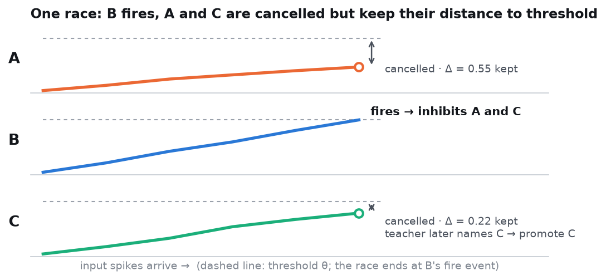
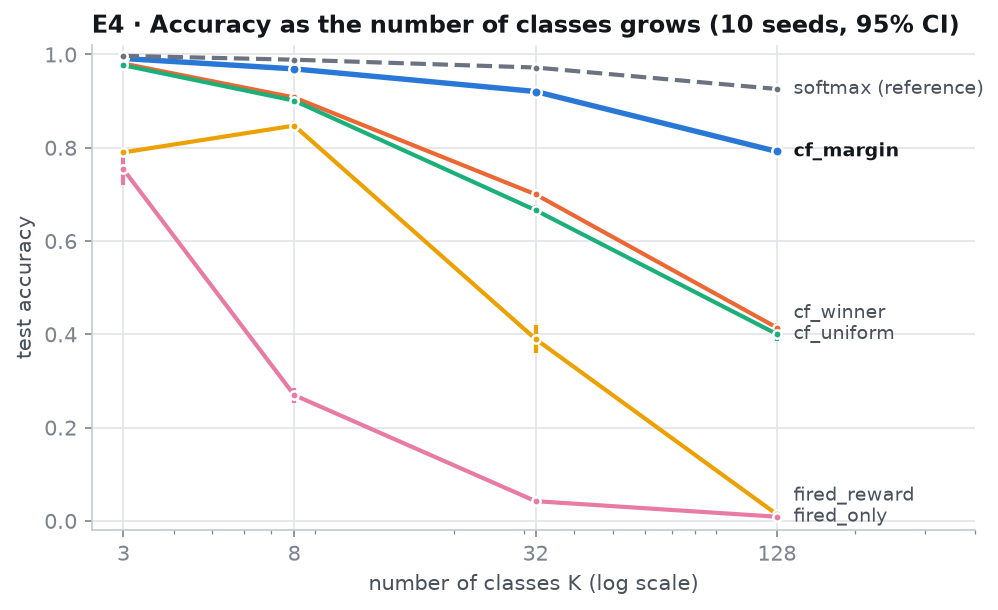
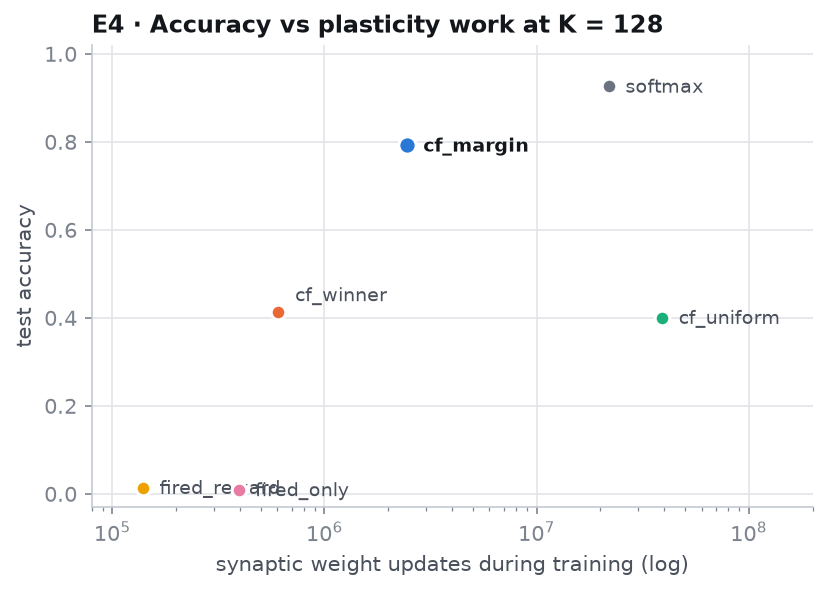
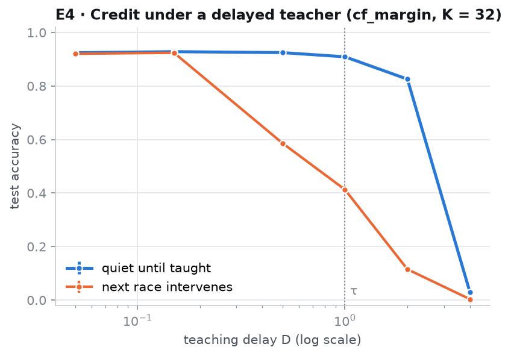
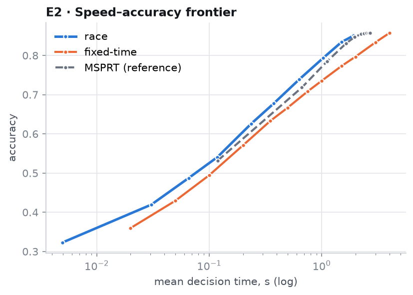
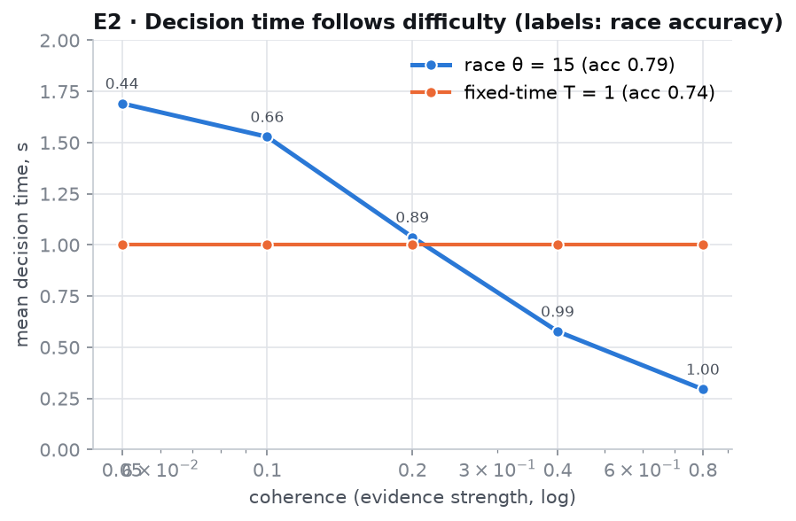
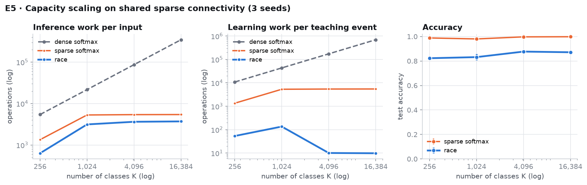
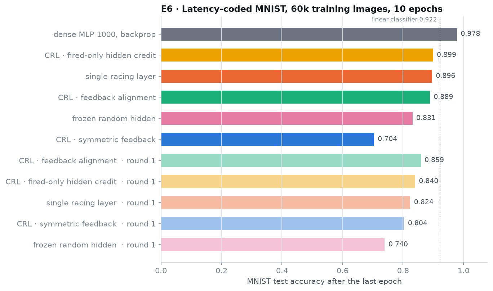
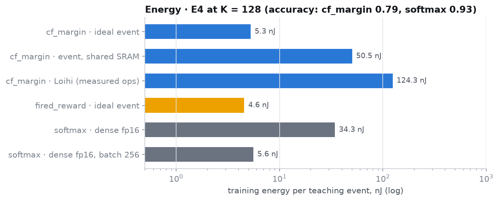

# Sleeping Machines: first experiments

*Experiment log, 23–24 September 2026. An interactive version of this report is built from `report/index.html`.*

Sleeping Machines proposes that computation can happen in **time rather than memory**: candidate events race, the first to fire cancels the rest, and the cancelled ones keep a **trace of how close they came** so that a later teaching signal can use it. This report covers the first experiments designed to test that proposal. Predictions were written down before each evaluation was run, and the report includes the parts that did not work.



**Contents:** [Summary](#summary) · [Method](#method) · [Scorecard](#scorecard) · [E4 Counterfactual credit](#e4--a-cancelled-node-can-be-taught) · [E2 Adaptive decisions](#e2--races-decide-as-fast-as-the-evidence-allows) · [E5 Capacity](#e5--work-tracks-activity-but-most-of-that-is-sparsity) · [E6 Hidden layers](#e6--hidden-layers) · [Energy](#energy) · [Limitations](#limitations) · [Next](#next-steps) · [Reproducing](#reproducing)

## Summary

**What held up**
- **A cancelled node can be taught (E4).** In a race among K output nodes, the right answer usually loses and never fires, so rules that credit only nodes that fired (the STDP / reward-modulated family) can only punish the wrong winner. Keeping each cancelled node's distance to threshold Δ lets a delayed teaching event promote the right answer and push down only the competitors that came close. At K = 128 this reaches **0.79** while the reward-modulated rule is at chance, with 6% of the plasticity updates of uniform credit. A global-gradient reference reaches 0.93.
- **Races decide as fast as the evidence allows (E2).** An accumulator race dominates a fixed-time decoder at every decision time and matches the MSPRT, the statistically optimal stopping reference, using only additions and a threshold. Decision time adapts to difficulty (0.29 s easy, 1.69 s hard), and 74% of input events are never processed.
- **Learning work tracks activity, not capacity (E5).** As K grows 64-fold, race work stays flat. The race needs **25–560× fewer weight updates** than a sparse softmax on the same connectivity.

**What did not**
- **Accuracy.** In E5 the race is 12–17 points less accurate than sparse softmax. In E6 (latency-coded MNIST) the best event network ends at **0.90**, below a plain linear classifier (0.92) and far below a dense MLP (0.98).
- **Depth.** Hidden layers trained by counterfactual race learning add about 7 points over a frozen random hidden layer, but end level with a single racing layer. Counterfactual hidden credit did not beat fired-only hidden credit.
- **Energy.** At matched accuracy, the savings are single-digit factors where the event network is competitive at all: 2.4× for the single racing layer on MNIST, 6.5× for E4 training, both against unbatched dense hardware. They vanish against batched dense hardware. The hidden-layer CRL networks cost about 30× *more* than an equally accurate small linear classifier. E5's large savings over dense models come mostly from sparsity, which a sparse dense model shares.

## Method

**Event engine.** `sleeping_machines/sim.py` is a discrete-event simulator with no global clock. It keeps a pool of pending future events, jumps to the next one, allows pending events to be cancelled, and counts every operation (events scheduled, fired and cancelled; synaptic operations; spikes; plasticity updates). All work and energy figures come from these counters or from closed-form solvers checked against them.

**Nodes.** Non-leaky integrate-to-threshold units: each input spike adds its weight to the potential, and the first node to reach threshold fires. In a race, the winner's fire event inhibits the others and cancels their pending fire events. At that moment every cancelled node freezes Δ = (θ − v)/θ, its normalised distance to threshold.

**Teaching.** A teaching event naming the correct answer arrives after the race, possibly after a delay. Each synapse holds a presynaptic trace x = exp(−age/τ). All learning rules are local and triggered only by the teaching event.

**Discipline.**
- Every experiment has a preregistration file (`experiments/E*_PREREGISTRATION.md`) written before its evaluation.
- Hyperparameters are tuned per rule and per problem size on separate tuning seeds or a validation split.
- Results are reported on held-out seeds or the test set, with 95% confidence intervals where there are several seeds.
- Amendments made after tuning or before running are dated and explained in the preregistration files.

## Scorecard

| Test | Prediction (written before the evaluation) | Verdict | Evidence |
|---|---|---|---|
| E4 · P1 | At K = 3, rules that credit only the fired node learn almost as well as counterfactual ones. | 🟡 Partly | fired rules learn (0.75–0.79) but trail cf_margin (0.99) by 20 points |
| E4 · P2 | As K grows, fired-only rules collapse while counterfactual rules keep learning. | 🟢 Supported | K = 128: fired_reward 0.014 vs cf_winner 0.414 |
| E4 · P3 | Near-miss weighting matches uniform credit with under 25% of the plasticity updates. | 🟢 Supported | 0.79 vs 0.40 accuracy with 6% of the updates (after two fixes to the uniform baseline) |
| E4 · P4 | Credit survives delays up to about τ; an intervening race erases it. | 🟢 Supported | 0.91 at D = τ in quiet conditions; 0.12 at D = 2 when races intervene |
| E2 · P1 | The race's speed–accuracy frontier lies above fixed-time decoding. | 🟢 Supported | higher accuracy at every matched decision time |
| E2 · P2 | Decision time falls monotonically with evidence strength. | 🟢 Supported | 1.69 s → 0.29 s across coherence 0.05 → 0.8 |
| E2 · P3 | The race needs under 20% more time than the MSPRT at equal accuracy. | 🟢 Supported | no extra time needed in this setting |
| E5 · P1 | Race and sparse-softmax work stay within 2× as K grows; dense grows ~64×. | 🟢 Supported | race inference work ×1.18 from K = 1,024 to 16,384; dense ×64 |
| E5 · P2 | Early termination saves 1.5–3× inference work over sparse softmax. | 🔴 Not supported (narrowly) | 1.46–2.1×; below 1.5× at K = 4,096 and 16,384 |
| E5 · P3 | The race needs at least 3× fewer weight updates than sparse softmax. | 🟢 Supported | 25–560× fewer |
| E5 · P4 | Race accuracy within 10 points of sparse softmax at every K. | 🔴 Not supported | gaps of 12–17 points |
| E6 · 6a | A hidden layer trained by CRL solves XOR-in-time; a single layer cannot. | 🟢 Supported | single layer 0.59, frozen hidden 0.63, CRL 0.92 |
| E6 · 6b | Latency-coded MNIST at 97% or better with local, event-driven learning. | 🔴 Not met | best final 0.899 (dense MLP 0.978, linear 0.922) |

## E4 · A cancelled node can be taught

*Single racing layer, sparse spike patterns over 256 channels, 6,000 teaching events, 10 held-out seeds.*

| rule | target (never fired) | competitors |
|---|---|---|
| `fired_only` | not updated | winner depressed on error |
| `fired_reward` | not updated | winner potentiated if right, depressed if wrong (reward-modulated STDP) |
| `cf_winner` | potentiated on error | winner depressed |
| `cf_uniform` | potentiated on error | every non-target depressed by 1/(K−1) |
| `cf_margin` | potentiated on error | non-target k depressed by exp(−Δₖ/σ), skipped when negligible |
| softmax (reference) | global gradient, not event-driven | |



| rule | K = 3 | K = 8 | K = 32 | K = 128 |
|---|---|---|---|---|
| softmax (reference) | 0.997 | 0.989 | 0.972 | 0.926 |
| fired_only | 0.753 | 0.270 | 0.042 | 0.009 |
| fired_reward | 0.790 | 0.847 | 0.390 | 0.014 |
| cf_winner | 0.980 | 0.908 | 0.700 | 0.414 |
| cf_uniform | 0.977 | 0.901 | 0.666 | 0.400 |
| **cf_margin** | **0.991** | **0.969** | **0.921** | **0.792** |

<p>


</p>

**Reading.**
- Counterfactual credit is what keeps learning working as the number of alternatives grows. `cf_margin` is also the cheapest learner at K = 128: 2.4M synaptic updates against 39M for `cf_uniform` and 22M for softmax.
- Credit survives a delayed teacher while nothing else happens. Once the trace decays past τ, or the next race overwrites the frozen record before the teacher arrives, it is lost.
- The gap to the global-gradient reference grows with K. Local counterfactual credit is better than fired-only credit, not a replacement for a gradient.

## E2 · Races decide as fast as the evidence allows

*Four classes; evidence arrives as Poisson spikes whose coherence (how strongly they favour the right class) varies unpredictably between trials; 5 seeds × 2,000 trials.*

The race node for class k adds 1 for each spike in its own group and subtracts 1/(K−1) for every other spike; the first node to reach θ fires, and all pending input events are cancelled. It is compared with a fixed-time decoder (count spikes until T, pick the largest) and with the MSPRT on the exact likelihoods.

<p>


</p>

| decoder | accuracy | mean decision time | input events processed |
|---|---|---|---|
| race θ = 15 | 0.794 | 1.03 s | 208 |
| MSPRT α = 0.2 | 0.785 | 1.12 s | 223 |
| fixed-time T = 1 | 0.735 | 1.00 s | 200 |
| fixed-time T = 2 | 0.797 | 2.00 s | 400 |

**Reading.** The race matches the optimal-stopping reference using only additions and a threshold. It reaches the fixed-time decoder's T = 2 accuracy in half the time and with half the events.

## E5 · Work tracks activity, but most of that is sparsity

*K classes from 256 to 16,384; each input activates about 21 channels; M = max(256, K/4) channels, so fan-out per channel is constant from K = 1,024 on; 3 seeds; about 8 training examples per class.*

**Design.**
- All models share one sparse connectivity: 64 synapses per node, starting random.
- All models grow synapses by one local rule: a taught node connects to the active inputs it lacks, replacing its weakest synapses.
- The fair baseline is a **sparse** softmax that touches only the synapses of active inputs, because most of what event computing saves comes from sparsity itself. Dense softmax work is counted analytically.
- The race's own contributions are early termination and learning that touches only near misses.
- The race uses a threshold that rises by β per input spike. This is global inhibition implemented as a single shared counter (O(1) per spike), and it makes the race run on relative evidence. Without it, tuning accuracy was 0.64; with it, 0.81.



| K | race acc | sparse acc | race inference | sparse inference | dense inference | race learning | sparse learning |
|---|---|---|---|---|---|---|---|
| 256 | 0.823 | 0.988 | 631 | 1,342 | 5,427 | 54 | 1,350 |
| 1,024 | 0.832 | 0.980 | 3,137 | 5,303 | 21,709 | 136 | 5,325 |
| 4,096 | 0.877 | 0.997 | 3,631 | 5,402 | 86,835 | 10 | 5,437 |
| 16,384 | 0.871 | 0.998 | 3,708 | 5,426 | 347,341 | 10 | 5,470 |

*Work is operations per input (inference) and per teaching event (learning): synaptic events or weight updates, or multiply-accumulates for dense.*

**Reading.**
- Race inference work is flat once the input code grows with K, and at K = 16,384 it is 94× below dense. But sparse softmax is flat too; early termination adds only 1.46–2.1×.
- Learning is where the race is distinctive. It learns only from errors and close calls and touches only near-miss nodes: at K = 16,384 it makes about 10 weight updates per teaching event, against about 5,500 for sparse softmax and about 700,000 for dense.
- The cost is accuracy: 12–17 points below sparse softmax.

## E6 · Hidden layers

*Latency-coded MNIST: a brighter pixel spikes earlier; one spike per pixel; 1,000 hidden nodes in competing groups of 10; 60,000 training images, 10 epochs, test set.*

**Counterfactual race learning (CRL).**
- The output error (+1 for the target; −exp(−Δ/σ) for near-miss competitors) is sent back as events through feedback synapses: symmetric, sign, or fixed random (feedback alignment).
- Hidden nodes that fired, *and hidden nodes that were cancelled close to threshold*, update their input synapses from their stored traces.
- For these non-leaky single-spike neurons, the firing time is piecewise constant in the weights, so the exact gradient is zero almost everywhere. The frozen Δ plays the role that a surrogate gradient plays in conventional spiking-network training.
- Training uses a batched closed-form solver. It agrees with the discrete-event engine on 100% of decisions once simultaneous events are given the same semantics in both: events at one instant are integrated together, and simultaneous crossings are resolved by overshoot.



| model | round | best (epoch) | final | synaptic events per image |
|---|---|---|---|---|
| dense MLP, 1000 hidden, backprop (reference) | — | 0.978 (10) | 0.978 | 794,000 MACs |
| linear classifier (reference) | — | | 0.922 | 7,840 MACs |
| CRL · fired-only hidden credit | 2 | 0.905 (4) | **0.899** | 66,261 |
| single racing layer, lateral inhibition | 2 | 0.898 (9) | 0.896 | 775 |
| CRL · feedback alignment | 2 | 0.903 (4) | 0.889 | 69,443 |
| frozen random hidden layer | 2 | 0.834 (5) | 0.831 | 82,468 |
| CRL · symmetric feedback | 2 | 0.704 (10) | 0.704 | 30,655 |
| CRL · feedback alignment | 1 | 0.883 (3) | 0.859 | 46,117 |
| CRL · fired-only hidden credit | 1 | 0.873 (3) | 0.840 | 41,350 |
| single racing layer | 1 | 0.864 (1) | 0.824 | 462 |

**How round 2 came about.**
1. **Diagnosis.** Comparing the output race with an offline linear readout of the full hidden spike pattern (`experiments/e6_diagnose.py`) showed that the representation, not the readout, was the limit. The race scored 0.805 against the readout's 0.835, and a random hidden layer supported 0.735.
2. **Cause.** The network decided within 0.8% of the input window. In latency-coded MNIST all saturated pixels spike at t = 0, and every hidden group picked its winner from that first instant.
3. **Fix.** A higher hidden threshold, three winners per group and learning-rate decay (every round-1 run peaked by epoch 3 and then declined). Lateral inhibition at the output, so the race runs on relative evidence, helped the single layer (0.82 → 0.90) but not the hidden networks.

**Reading.**
- Hidden learning works: it adds 7 points over a frozen random hidden layer.
- It did not make depth pay. The best hidden-layer network ends level with a single racing layer that uses 85× fewer synaptic events.
- Counterfactual hidden credit did not beat fired-only credit in round 2.
- Symmetric feedback was unstable with three winners per group.
- Local receptive fields (each hidden group sees a 10×10 patch) cut synaptic work 3–5× in validation pilots at a small accuracy cost. They have not yet been run on the full data.

## Energy

The simulators count synaptic events, spikes, plasticity updates and multiply-accumulates. `sleeping_machines/energy.py` prices those counts on hardware profiles built from published per-operation energies:

| profile | per operation |
|---|---|
| dense int8 accelerator, weights in local SRAM | 1.55 pJ per multiply-accumulate (0.31 pJ when a batch of 256 shares each weight fetch) |
| dense fp16 training | 4.0 pJ per multiply-accumulate, 5.4 pJ per weight update (both less when batched) |
| **idealized event-driven, near-memory** | 1.3 pJ per synaptic event (8-bit weight fetch + 16-bit add), 2 pJ per spike, 2.6 pJ per weight update |
| event-driven, weights in a large shared SRAM | 12.6 pJ per synaptic event |
| Loihi, measured (14 nm) | 23.6 pJ per synaptic event, 120 pJ per weight update |

Arithmetic and SRAM figures are 45 nm values from Horowitz (ISSCC 2014); Loihi figures are from Davies et al. (IEEE Micro 2018). The "suitable architecture" assumption is that a binary spike turns a synaptic operation into a weight fetch plus an addition, with no multiplication and no clock. These are order-of-magnitude estimates, not chip measurements.



**MNIST at matched accuracy.** Each event network is compared with the cheapest dense model that is at least as accurate. Dense training is counted only up to the first epoch that reaches the event network's accuracy.

| event network (round 2) | acc | event inference | cheapest dense model ≥ acc | dense int8 inference (batch 1 / batch 256) | event training | dense fp16 training (batch 1 / 256) |
|---|---|---|---|---|---|---|
| single racing layer | 0.896 | **1.3 nJ** | linear, 14×14 input (0.915) | 3.0 nJ / 0.6 nJ | **0.8 mJ** | 1.9 mJ / 0.7 mJ |
| CRL · fired-only hidden | 0.899 | 87 nJ | linear, 14×14 input (0.915) | 3.0 nJ / 0.6 nJ | 62 mJ | 1.9 mJ / 0.7 mJ |
| CRL · feedback alignment | 0.889 | 91 nJ | linear, 14×14 input (0.915) | 3.0 nJ / 0.6 nJ | 81 mJ | 1.9 mJ / 0.7 mJ |

**Reading.**
- Where the event networks are competitive in accuracy, the advantage is a small factor. At K = 128 in E4, `cf_margin` costs about **5.3 nJ per teaching event**: 6.5× less than unbatched dense softmax training (34 nJ), about equal to batched dense training (5.6 nJ), and 124 nJ on Loihi's measured costs. The single racing layer on MNIST is 2.4× cheaper per image than the cheapest equally accurate dense model at batch 1, and about 2× more expensive at batch 256.
- The hidden-layer CRL networks are about **30× more expensive** than an equally accurate small linear classifier (the frozen-hidden network about 140×). Every hidden node listens to every pixel, and the hidden layer does not buy accuracy.
- E5 shows where large savings over *dense* models do appear, in work that grows with capacity. Most of that saving comes from sparsity, which a sparse dense model shares. The race's own edge is in learning: far fewer weight updates.

## Limitations

- Everything runs in simulation on CPU. Energies are estimates from operation counts, not measurements.
- E4, E2 and E5 use synthetic tasks designed to isolate one mechanism each.
- The single-spike, non-leaky neuron is deliberately simple. Leaky neurons, multiple spikes per node and learned delays are untested.
- MNIST latency coding favours hasty decisions and is a poor showcase for timing. A benchmark where timing carries the information (Spiking Heidelberg Digits) is the fair test.
- E5's connectivity is a fixed fan-in with a structural rewiring rule; other sparse baselines (mixture-of-experts gating, sampled softmax) were not tried.
- One training seed per E6 configuration.

## Next steps

1. **Close the accuracy gap in the readout.** In E5 and E6 the race loses accuracy to argmax-style readouts. The rising threshold and lateral inhibition helped; a learned per-class threshold and a decision rule on the margin between the two leading nodes are the next candidates.
2. **E6 with local receptive fields and a larger hidden layer.** Validation pilots cut work 3–5×; the question is whether they make depth pay.
3. **Learned delays.** Train *when* inputs arrive, not only how much they count: the timing counterfactual from the design notes.
4. **Spiking Heidelberg Digits** on a GPU, against published learned-delay results.

## Reproducing

```bash
python experiments/e4_counterfactual.py tune && python experiments/e4_counterfactual.py main && python experiments/e4_counterfactual.py delay
python experiments/e2_race_decisions.py
python experiments/e5_capacity.py --tune && python experiments/e5_capacity.py --eta 0.1 --beta 0.06 --margin 0.3 --lr 0.5 --seeds 3
python experiments/e6_hidden.py mnist --variant crl_fa --hidden 1000 --winners 3 --hid-frac 0.6 --lr-decay 0.7 --epochs 10 --tag v2
python experiments/e6_hidden.py mnist --variant single_layer --lateral 1 --theta-out 3 --lr-decay 0.7 --epochs 10 --tag v2
python experiments/dense_frontier.py
python experiments/energy_report.py && python experiments/build_report.py && python experiments/make_figures.py
```

Dependencies: `numpy`, `matplotlib`. Related prior art is listed in the [README](README.md#related-prior-art).
