# Sleeping Machines: what is known

*28 September 2026. The illustrated version is the PDF built by `report/make_pdf.py`
(`report/sleeping_machines_status.pdf`); derivations and proofs are in `experiments/THEORY.md` (cited as §n);
the experiment log is `experiments/FINDINGS.md` and git history.*

## Frontier signals

Three measured capability leads make a concrete case for this architecture's potential: a real-language lead on a small
shared text8 split, local-credit retrieval that generalizes to longer contexts, and deep compositional networks that learn
structured tasks with far less data and counted computation. A new E77 result adds a distinct trainability signal: with
realized firing calibration, gradients reached all eight event layers in a depth-8 pilot.

- **Real language:** on the same 1M-character text8 training and test split, E79's native race mixture scores **1.808
  bpc frozen**, versus **2.179** for the completed LSTM and **2.367** for the 2-layer Transformer. At 10M training
  characters, E79 scores **1.613 bpc frozen** versus **1.799** for the completed two-layer, 512-unit LSTM on the same
  test segment and **1.908** for the completed four-layer Transformer—a **0.186 bpc lead** over the LSTM and
  **0.295 bpc** over the Transformer. The Transformer checkpoint was selected on validation, then scored **1.9083**
  bpc on held-out test after 4,882 updates. The runs share the text split but not model size or training schedule: the Transformer has
  3.24M parameters and four passes, versus the LSTM's 1.20M parameters and six passes. E79 also includes six native
  experts and copy memory. These are strong same-split results, not compute-matched architecture comparisons, and
  each uses one seed.
- **Learned associative retrieval:** on E61's synthetic recall task, local race attention reaches **100% at 4× context
  after at most 4,000 examples in all five runs**. The best of seven Transformer settings reaches **71.6%** on those
  longer contexts after as many as 1M examples.
- **Depth and composition:** on a depth-4 order task, the event model reaches **99.9–100% after 10–15k examples**
  (5/5 runs); a Transformer reaches **99.0% after 40k examples repeated 50 times**, and **99.2–99.6%** on 2M fresh
  examples. On a separate shared-motif composition task,
  the event model averages **99.65% after one pass**, at roughly **10,000× lower counted work** than its Transformer
  reference.
- **Deep-stack trainability (new, not a supremacy result):** after exact replay of each layer's threshold and reset
  dynamics, the E77 depth-8, width-8 pilot had nonzero gradients in **all eight layers at all 16 validation points**;
  test activity stayed between **0.075 and 0.217 spikes per character per layer**. This is evidence that the deep
  optimization path can remain open. It used one seed, 4,096 training characters, and 512 test characters; BPC was
  4.319, so it does not establish useful language-model quality or a scaling advantage.

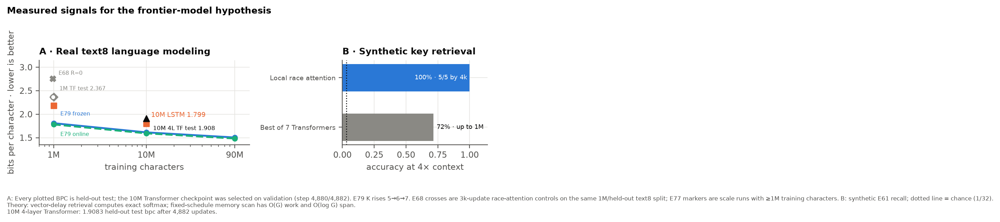

These are meaningful capability and performance signals, especially the text8 result and the ability to learn retrieval
and depth. They do not yet establish a general-language-model scaling advantage: E79 is a single-seed expert mixture
without matched compute, while the deepest wins are on synthetic tasks built around the architecture's event primitives.
On tested real streams, event models remain behind in speech and event-camera recognition, and the market world model
is still less accurate than its Transformer reference.


## In plain terms

Today's neural networks are **clocked and dense**: at every step, every input is multiplied by every weight, whether
or not anything happened. Many real signals are the opposite: long silences broken by precisely timed events (nerve
spikes, trades on a market, sensor alarms), where *when* something happens is the information.

**Sleeping Machines are networks that only work when an event arrives.** A node waits. It fires when the right inputs
arrive in the right time window ("B within 1.5 s after A"), and the first node to fire gives the answer, a *race*.
Silence costs nothing, and time itself does the computing: a delay or a waiting window plays the role that a weight
matrix plays in a dense network. A signal can also carry a small vector (a few numbers), and its content sets its own
delay: when it arrives decides how much it counts.

The questions are whether such networks can **learn** (with credit that flows only along the events that actually
happened: a node adjusts only its few connections that were active, like moving money between accounts under a fixed
budget) and whether they can **match or beat** MLPs and Transformers.

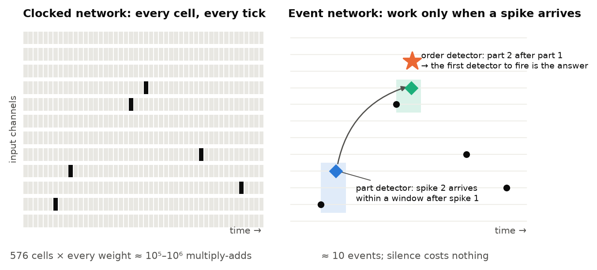

## Highlights

- **Same accuracy, 10,000–100,000× less computation.** On timing-pattern recognition a learned event network is
  perfect (1.000) using ≈ 7.5 events per example; Transformers reach 0.989–0.998 at 150k–1.2M multiply-adds after
  1–2M training examples.
- **It groks where a Transformer does not.** Trained on 30% of all (a, b, c) triples, it learns (a + b + c) mod 17 and
  is 99.4–99.9% correct on the triples it never saw; a Transformer with weight decay stays at 3–63%.
- **Ten times less data.** On the depth-3 order task the event network is 99.8–99.9% correct after 1,000–2,000 examples,
  each seen once; a Transformer allowed as many passes as it likes needs about 10,000–20,000 examples for 99% (with 2,000
  it reaches 33–41%, with 5,000 82–90%).
- **Learning to retrieve from ≥ 250× less data.** In a recall task where the network must learn which stored key a query
  refers to (what attention learns), race attention trained by local credit is 100% correct after 1,000–4,000 examples
  (5 of 5 runs) and stays 100% on contexts four times longer. Of seven Transformer configurations (width 64–128, 2–4
  layers, absolute or relative positions), only the two largest solve it, after 400k–1M examples, and they reach at most
  72% on the longer contexts (E61; the best configuration twice, solving it between 400k and 1M examples).
- **Deep order from a few thousand examples.** Recognizing which of 20 *orders* of four patterns occurred needs four
  levels of "this, then that". The network finds the right detectors among 55 million candidates and is 99.9–100%
  correct on 5 of 5 runs after 10–15k examples, with ≈ 2,000 learning updates, ≈ 150 events per example, and only
  ≈ 80k connections ever created. **At depth 4 a Transformer given the same 40k examples makes about ten times as many
  errors (0.990 vs 0.999–1.000), and even with 2M examples (≈ 150× the data) still 4–8 times as many (0.992–0.996)**, at
  ≈ 7,000× the computation per example; at depth 3 it reaches the same accuracy only with 8–400× more data.
- **Composing parts: Transformer-level accuracy from one pass over the data, at ≈ 10⁴× less computation.** On a task of 15 classes
  built from ordered pairs of shared motifs, the event network reaches 0.990–0.999 (mean 0.9965) from 40k examples
  seen once, learning its own timing windows, at ≈ 20 events per example; a Transformer needs 2M examples for
  0.9955–0.998, and given the same 40k examples 50 times it reaches 0.9935–0.9965 (0.955–0.985 with weight decay or 10k
  examples).
- **A world model of a real market stream within 0.08–0.19 nats of a Transformer at ≈ 1/3000 of the computation.**
  Predicting the next trade events of BTC on days it never saw, a small event network with slow "regime" counters beats
  a recurrent neural point process (GRU) and comes within 0.08–0.19 nats per event of a Transformer point process, using
  ≈ 40 operations per event instead of ≈ 110k–130k multiply-adds. The Transformer is the more accurate model.
- **Learning cost follows activity, not size.** Eight times more inputs (12 → 96 channels) costs no more learning
  mistakes.
- **New theory, proved:** exactly what one event node can compute and where depth is needed; why a fixed weight budget
  lets a node learn an AND without knowing which half was wrong; that deep order is trainable with the fewest mistakes
  any learner can guarantee; and that a race of clocks carries both the softmax (which clock fires) and its normalizer
  (when), so Transformer attention and its gradients are computed on average exactly by local rules: Transformers,
  including their training, are a limit of these networks. And event networks are exactly controlled differential
  equations driven by their events: the order detectors they learn are the universal features of event streams, the
  state-space units behind today's best event-stream models are a special case, and a race run in continuous time is more
  expressive than a softmax, the more so the longer it deliberates (§104). When signals carry vectors whose content sets
  their delays, a receiver whose state fades computes exactly softmax attention, paying only for the messages that match
  (§105), and the work attention then costs is set by how sharp it is, not by how much context there is (§106).

**Scope of the evidence.** The supremacy results (timing, composition, deep order, grokking) are on synthetic tasks built
to test one capability at a time, where the target is exactly expressible by the network's primitives. The theory behind
them (what a node computes, mistake bounds logarithmic in the candidate basis, cost proportional to events) is not
task-specific, which is the reason to expect them to carry over to sparse, precisely timed real streams. On the real data
tested so far the event network is competitive at a small fraction of the computation, but not ahead: spoken digits
0.675 vs ≈ 0.70 for an LSTM and 95–96% for event-by-event state-space models; a market-stream world model 0.08–0.19 nats per event behind a Transformer point process; and
no trading edge after fees in four markets; and on a real event-camera benchmark (DVS128 Gesture) far behind: 0.70 vs
94–98% published.


**What the network actually does** on one example: spikes arrive; part detectors fire when two spikes are close
enough in time; an order detector fires when part B follows part A; the class node holds that and fires when C
arrives. With the same motifs in another order, the "A then B" detector still fires but nothing completes the pattern.

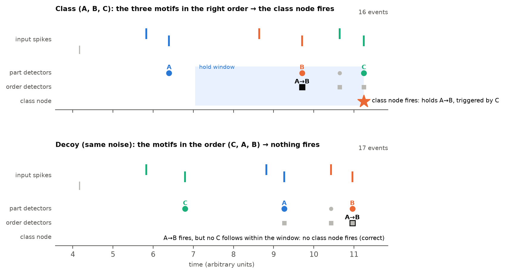

**Why learning it is not trivial.** When a detector for "A, then B, then C" fails to fire, which of its connections
should change? Crediting every candidate spreads the weight so thinly that the node never fires; crediting the
tempting shortcut ("A, then B" is shared with another class) traps it; exploring a little, then settling, finds the
right order and keeps it (§84).

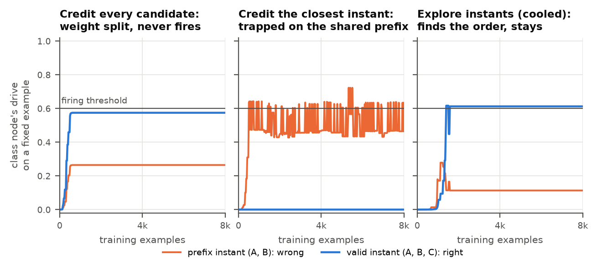

**Where it does not win yet:** event-camera gestures (0.70 vs 94–98% published), spoken digits (0.675 vs 0.70 for a
published LSTM and 95–96% for event-by-event state-space models, whose unit the new theory identifies as a special case of
ours; E74's initial time-vector pilot reached 0.146 peak held-out speaker accuracy, with the E82 readout sweep reaching
0.184), and trading, where no learner beats
buy-and-hold on this data (an audit shows why: the predictable edge, about 1 bp per trade, is below any taker fee).
**Next:** a path to generative language models built this way ([§10](#10-next-frontier-generative-language-models)).

---

Technically, Sleeping Machines proposes that computation can happen **in time rather than memory**: candidate events
race, the first to fire cancels the rest, and what a node computes is set by delays, by how long it holds an input,
and by inhibition that arrives in time. The rest of this report states what is now known about such networks, why,
and what remains open.


**Contents:** [Frontier signals](#frontier-signals) · [In plain terms](#in-plain-terms) · [Highlights](#highlights) · [Summary](#summary) · [1. What an event node computes](#1-what-an-event-node-computes) ·
[2. How event networks learn](#2-how-event-networks-learn) · [3. Against dense models and Transformers](#3-against-dense-models-and-transformers) ·
[4. Depth and composition](#4-depth-and-composition) · [5. Generalization and grokking](#5-generalization-and-grokking) ·
[6. The weight race](#6-the-weight-race) · [7. Real data](#7-real-data) · [8. Open problems](#8-open-problems-and-next-steps) · [9. Hardware](#9-hardware-what-these-networks-need-and-what-exists) · [10. Language models](#10-next-frontier-generative-language-models) ·
[Experiment index](#experiment-index) · [Reproducing](#reproducing)

## Summary

1. **What one node computes is exactly characterized, and it says where depth is needed.** A node with a trigger,
   hold and veto inputs accepts a product set in lag coordinates relative to its trigger; one node can order at most
   three events; two layers compute every conjunction of bounded time differences, three layers every union (§71,
   proved; checked by exhaustive search). Nodes with state (arm/disarm) are strictly stronger.
2. **Event networks learn timing with very few mistakes, if they obey two rules:** winning is positional (pull the
   event that should have won; never push a loser later), and order needs held intervals, not aligned delays. Under
   these rules a node's routing, hold duration and vetoes are learned in O(log N + its few parameters) mistakes.
3. **On a timing task, a learned event network matches or beats dense models at 10⁴–10⁵× lower cost**, with nothing
   given: 1.000 accuracy at 7.5 synaptic events per episode, against 0.989–0.996 for event-token Transformers at
   146k–1.16M multiply-adds and 0.995 for a clocked conv net at 3.07M.
4. **Depth is learned natively when credit is right (§83–§86).** Summed potentials with conserved multiplicative
   credit, credit given to one instant with cooled exploration, and synapses grown only when credited (provably the
   same decisions as dense weights) learn order among three and four parts: 0.999–1.000 on 5/5 seeds at depth 4, with
   ≈ 2,000 updates and ≈ 80k grown synapses out of 5.5·10⁷ candidates. With learned timing windows and credit given to
   the latest instant (complete evidence), the composition task that a Transformer led reaches 0.990–0.999 (mean
   0.9965) from 40k examples seen once, against 0.9955–0.998 for a Transformer after 2M examples (§88–§89).
5. **Grokking occurs, by a route change under sleep, and only for relations the substrate can express.** A network
   that can memorize, given a rhythm resource, memorizes without sleep and generalizes after a delay with sleep
   (0.95–0.99 on unseen pairs in 5/5 seeds with cooled timing noise at the right temperature); it stays at chance on relations
   the rhythm cannot express. A data × sleep phase diagram shows memorization, grokking and collapse regimes. Grokking
   also works with depth: (a + b + c) mod p through two composed rhythm stages (0.99–1.00, 3/3 seeds at p = 17 and 31).
6. **Learning cost follows activity, not model size.** Growing the candidate inputs from 12 to 96 channels leaves the
   number of learning mistakes flat and makes inference cheaper (§77).
7. **Not yet: real asynchronous benchmarks.** On spoken digits (SHD) the architecture has not beaten dense baselines;
   on the market stream, a correctly posed trading task (profit after costs) is not profitable for any learner, and
   the native learner learns to stay out. An online world model of the stream, built as an event network with state and
   window nodes, beats a neural point process by 0.5–0.9 nats per event, also on held-out days, at ≈ 19 synaptic
   operations per event.
8. **Transformers are a limit of these networks, including their training, and time adds what they lack (§96,
   §101–§106).** A race of random clocks computes softmax attention and its gradient on average from local quantities;
   event networks are controlled differential equations whose universal features are the order detectors they learn;
   content-dependent delays compute softmax attention exactly at a cost set by its sharpness; and a network laid out on
   positions and time scales is exactly equivariant to shifts and tempo changes, the two ways speakers differ. E79's race
   mixture leads the completed 1M text8 LSTM and Transformer baselines on the same split, and scores 1.613 test BPC
   against 1.799 for the 10M LSTM and 1.908 for the completed 10M four-layer Transformer. The Transformer checkpoint
   was selected on validation and then scored 1.9083 on held-out test. E79 uses a different model and training budget, so
   this is a same-split performance signal rather than a compute-matched result.

## Where the event paradigm wins, and where it does not

Each claim below is stated with its evidence and its caveat; "supremacy" here means a measured advantage over dense
networks (clocked conv nets, MLPs, GRUs, Transformers) given the same data.

| claim | evidence | caveat |
|---|---|---|
| **Equal or better accuracy at 10⁴–10⁵× lower cost on timing tasks** | E35: 1.000 at 7.5 synaptic events per episode, nothing given; best conv net 0.995 at 3.07M multiply-adds; event-token Transformer 0.989–0.996 at 146k–1.16M after 10× more training | one task family built around the primitives; the cost gap is largely the clock (an event-driven conv net would narrow it to ≈ 10×) |
| **Groks composed arithmetic where a Transformer does not** | E41, (a + b + c) mod 17 from 30% of triples: 0.994–0.999 on unseen triples (3/3 seeds) in 200 epochs; Transformer with AdamW and weight decay, 100k steps: 0.29 and 0.63 (seed 0, d = 32 / 64), 0.06 and 0.03 (seed 1; chance 0.06) | the event network is given a two-stage rhythm route as a resource (it chooses it over memorizing, E45 shows it can choose among routes); the Transformer might grok with far more steps |
| **A world model of a real market stream: better than a GRU point process, within 0.08–0.19 nats of a Transformer point process, at ≈ 1/3000 of its cost** | E48: online −2.11 nats per event vs −2.62 for a GRU neural point process; frozen on held-out days −2.38 / −2.10 vs −3.15 / −2.98; ≈ 19 synaptic operations per event vs thousands of multiply-adds | a Transformer Hawkes process is more accurate on the held-out days (−1.97 / −1.82 vs −2.16 / −1.97 with the same hazard family; E52, E57) |
| **Learning cost follows activity, not model size** | E35: 12 → 96 input channels: accuracy 0.999–1.000, learning mistakes flat, inference cheaper (7.5 → 3.2–4.0 synaptic events); §77, §81 give the reason and a mistake bound | measured up to 96 channels |
| **Structure discovery with an implicit Occam razor** | E45 (pilot): from a menu of routes the network picks one rhythm for a + b (1.000), the two-stage chain for a + b + c (0.999), nothing for random tables | pilot, 2 seeds; 5-seed runs queued |
| **Learned retrieval from ≥ 250× less data** | E61: race attention with a learned query–key match, 5/5 runs 100% after 1–4k examples (64–68 mistakes), 100% on 4× longer contexts; Transformers (7 configurations): only d = 128 with 4 layers solves it, after 400k–1M examples (absolute positions: 0.25 on 4× length; relative ALiBi: 0.72) | the event learner's candidate routes are (item, offset) pairs, i.e. relative offsets are its native coordinates (ALiBi gives the Transformer the same); one run per Transformer configuration, two for the best (solved between 400k–700k and 700k–1M examples) |
| **Deep order learned from few examples** | E54: which of 20 orders of four motifs occurred: 0.999–1.000 on 5/5 seeds after 10–15k examples, ≈ 2,000 updates, ≈ 150 events per example, ≈ 80k synapses grown out of 5.5·10⁷ candidates; depth 3: 0.997–0.999 from ≤ 5k examples seen once | depth 3: a Transformer reaches the same accuracy (0.996–0.999 given 40k × 50 or 2M fresh) at ≈ 5,000× the computation; depth 4: 0.990 given 40k × 50 and 0.992–0.996 given 2M fresh examples (4–10× the error rate) at ≈ 7,000× the computation |
| **Composition: Transformer-level accuracy from one pass, ≈ 10⁴× less computation** | E89: learned windows + latest-instant credit 0.990–0.999 (mean 0.9965) from 40k examples seen once, ≈ 20 events; Transformer 0.9955–0.998 after 2M examples, 0.9935–0.9965 given the same 40k × 50 passes without weight decay (0.982–0.985 with), 0.955–0.976 given 10k × 200 (≈ 175k multiply-adds) | one of five seeds at 0.990; post-convergence dips on two seeds without a margin |
| *Not supremacy:* spoken digits (SHD) | E59: class-conditional event world models with speaker-relative band coding reach 0.675 test (E51: 0.647), our best by far, but below a published LSTM (≈ 0.70) and far below the state of the art (95.9–96.3%, event-by-event state-space models) | unseen test speakers expose overfitting to training speakers |
| *Not supremacy:* trading profit | E42: no learner beats buy-and-hold after costs; the priced native one learns to stay out. E55, E55b (confirmed on 21 unseen days, four markets): the predictable edge is at most ≈ 1 bp per trade, below any taker fee | staying out is correct for a taker here (§87) |

## 1. What an event node computes

**Primitives.** Spike times; a delay; first-of (min) and all-of (max); hold (an input opens a window of given
duration); veto (an input blocks the node while it is within its window). A node fires at its trigger's arrival if
its hold conditions are met and no veto is active.

**Theorem (§71).** In lag coordinates relative to the trigger, a stateless node accepts a product set: each input's
lag is constrained independently. Consequences:
- one node orders at most three events on the scale-free domain (trigger the middle one, hold the first, veto the
  last until it arrives); for four or more, two inputs fall on the same side of the trigger and a product set cannot
  order them;
- two layers (one node per constraint, then all-of) compute every conjunction of bounded differences
  t_j − t_i ∈ [lo, hi] with exclusions: every zone in the sense of timed-automata verification;
- three layers (then first-of) compute every finite union of zones.

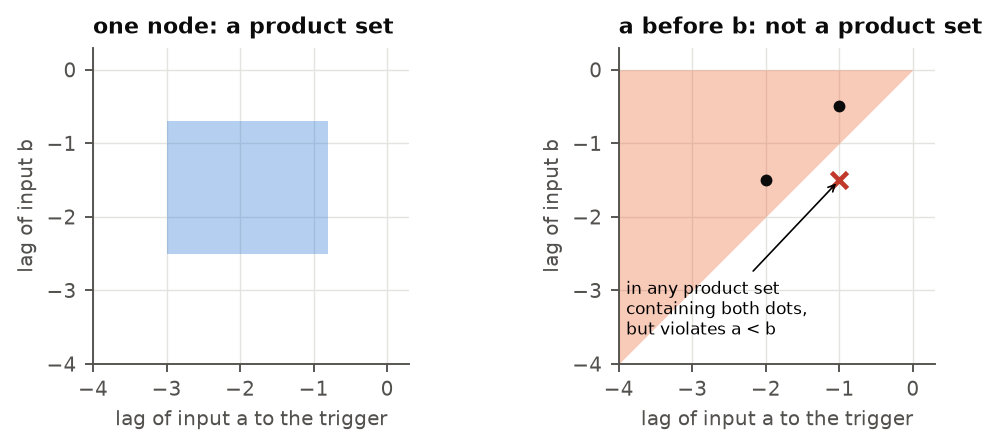

*Evidence.* An exhaustive search over single nodes (every trigger, role, delay and window on a grid) finds nodes for
the order of 2 and 3 events (for 3, exactly the construction in the proof) and none for 4 events on grids of 1,680
and 11,880 configurations (E39). All thirteen of Allen's interval relations, built as depth-2 networks, are exact on
~19,900 random interval pairs (E39).

**Stateful nodes are stronger.** A node armed by A, disarmed by C and fired by B computes "B after A and C not
between them", which is an XNOR of two order relations; it is not a product set, and no stateless node computes it
(exhaustive search, E39b). A toggle node computes the parity of the number of its input events (§75).

**Clockless computation computes relations, not sums.** A network of delays, first-ofs, coincidences and vetoes
commutes with time shifts, so it cannot add two times; one shared rhythm breaks the symmetry to shifts by a period
and makes cyclic arithmetic computable (§56).

**Completeness and reliability.** A two-counter Minsky machine wired from delay, first-of, coincidence and veto
nodes plus one oscillator runs every test program exactly, so the basis is Turing-complete given enough timing
precision (E30). Timing jitter accumulates like a random walk; one restoring coincidence per counter per cycle
makes reliability independent of program length (q/σ = 20: 1.00 at 25 and 81 steps, against 0.60 and 0.30
unrestored). Precision plays the role of the tape.

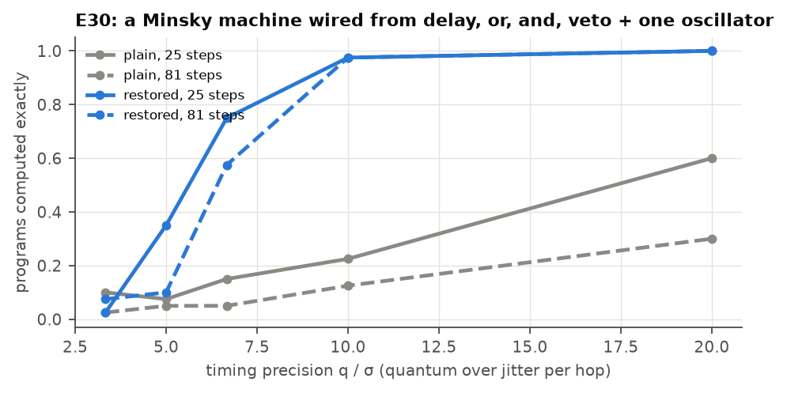

## 2. How event networks learn

**Winning is positional (§54).** In a race a class wins by being earliest; cancellation already does the competing.
Learning therefore pulls the event that should have won toward its anchored time and never pushes a loser later:
pushing makes the next loser the winner and collapses all detectors onto one phase. On (a + b) mod p with learned
delays (E26): push stays at chance in all 15 runs; pull-only reaches 0.97–0.98 (p = 31, half the pairs) with 10×
fewer updates. False positives are removed by veto, not by displacement (E27: displacement 0.195).

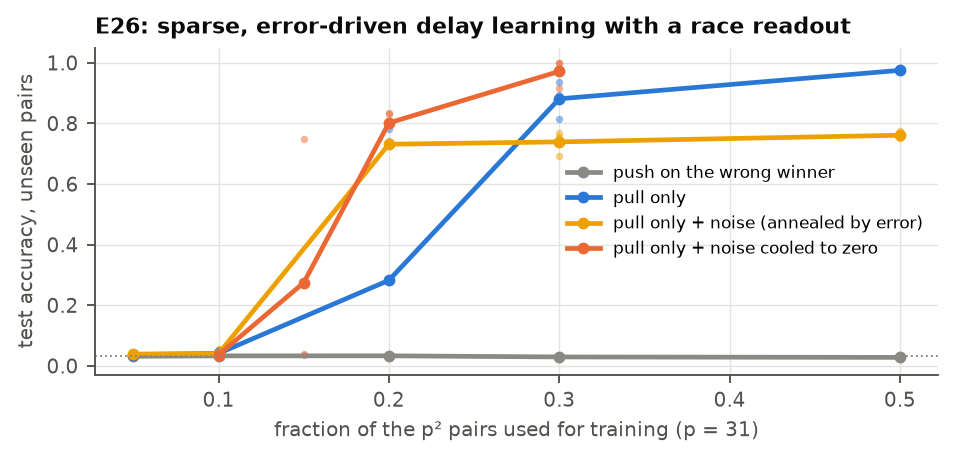

**Order needs held intervals, not aligned delays (§61).** Tolerance can come from delaying A to meet B (alignment) or
from A opening a window that B must fall into (holding). Alignment compresses the interval, so a veto cannot see
where C fell; holding keeps it. With directional holding the detector for "B within Δ after A unless C" reaches
1.000 on all 5 seeds with ~450 updates in 200k episodes, and the veto is worth 19 points; with alignment it reaches
0.914 and the veto is worth 1.8 (E27).

**The rules are online learning on the simplex (§68).** Pulls that move a fixed fraction of a node's conserved
synaptic budget are normalized (Winnow/Hedge-type) updates, with O(k log N) mistake bounds for choosing k of N
inputs; hold durations are interval learning (O(log range) mistakes), vetoes monotone disjunctions (≤ N). This is why
learning stops after a few hundred mistakes and why unnormalized pulls fail: they saturate every synapse. With
nothing given, detectors learn their channels, durations and vetoes: 1.000 ×4 and 0.9995, 443–1,530 updates (E35).

**Routing needs counterfactuals (§57).** A spike's time depends on one causal path, so credit along it cannot say
whether another route should have been taken. Cancelled near misses and runners-up supply that information; without
it a two-layer network stays at chance (E28: 0.17 vs 0.72–0.74).

**Timing noise helps search if it cools to zero.** Noise that shrinks with the learner's own update count makes
generalization at small data reliable (3/3 seeds instead of 1/3) without capping accuracy (E26c).

**A learning calculus for deep event networks (§83–§88).** Learning deep order natively needed five rules, each
derived from a failure, each local to a node and paid for by events:

| problem | rule | why it works | evidence |
|---|---|---|---|
| an AND fails: which half was wrong? | sum held and coincident inputs; multiplicative credit under a conserved budget | conservation moves weight toward the target on every false fire iff the threshold exceeds half the budget (§83, proved) | 4× more candidates cost 1.3× more updates (E34w) |
| candidates fire at different instants | credit one instant, chosen by cooled exploration | crediting all instants splits the weight forever (deadlock, proved); greedy credit cycles on shared prefixes; a valid route is absorbing (§84) | depth 3: 0.998–0.999 vs 0.71–0.85 greedy, 0.33 all-instants (E53) |
| the candidate basis grows as P^depth | grow a synapse only when it is first credited | exactly the decisions of dense weights (§85, proved and checked); memory and time follow activity | depth 4: 80k of 5.5·10⁷ synapses grown, 0.999–1.000 (E54) |
| converged nodes sit on their threshold | a margin kept by near-miss credit, earned by the node's recent precision | margins survive r demotions (θ_r ladder, §86); an unearned margin also protects wrong routes (§86b) | 0.997–0.999 at every checkpoint (E53g) |
| timing precision | tune one window per part from its own lags (version space) | selecting windows from a bank costs activity quadratic in resolution; tuning costs none (§88) | learned windows converge to the true intervals and equal hand-tuned ones (E56) |
| first-to-fire commits on partial evidence | on a miss, credit the latest candidate instant | the pattern is complete only at its last event; earlier instants are prefixes, valid only if unshared (§89) | composition 0.990–0.999 (from 0.988–0.995); depth 3 at half the updates (E89) |

**A derived law, measured (§91).** Crediting the latest instant works because noise after the pattern is inconsistent
between examples; the bound says learning slows as 1/(1 − q − 2f), with q the share of examples whose last event is
noise. Sweeping the noise level and measuring q directly, the updates needed follow the law with one fitted parameter
(f ≈ 0.03), and learning fails only as q approaches its limit:

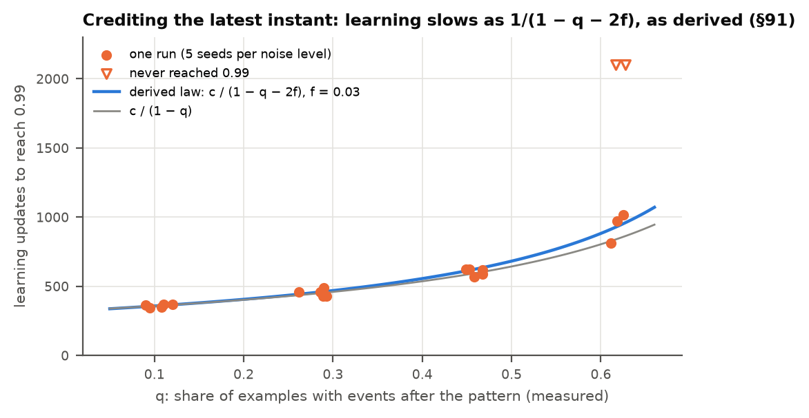

## 3. Against dense models and Transformers

On the timing task, with priors on both sides (hold/veto nodes; a receptive field matched to the pattern length for
the conv net):

| model | test accuracy | cost per episode | learning |
|---|---|---|---|
| **event network, nothing given (E35)** | **1.000 ×4, 0.9995** | **7.5 synaptic events** | 443–1,530 local updates, 200k episodes |
| event-token Transformer, 2M episodes (E36) | 0.989–0.996 | 146k–1.16M multiply-adds | backprop |
| Transformer with learned relative-time attention bias, 1M episodes (E36f) | 0.996, 0.998 | 149k–150k multiply-adds | backprop |
| event-token Transformer, 200k episodes | 0.65–0.97 | 5k–576k | backprop |
| clocked conv net (E32) | 0.995 / 0.984 / 0.895 | 3.07M / 123k / 1.9k | backprop, 200k episodes |

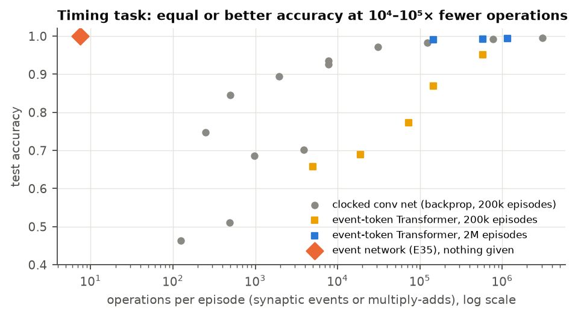

**Why.** Attention cannot see order without position information and must synthesize comparisons of times from dot
products at O(n²·d) per layer; a hold/trigger node computes the comparison as its primitive, at the cost of the
events it receives (§70). The advantage belongs to the event paradigm: it grows with silence (a clocked model pays
per time bin; 99% silence multiplies its cost by 100), and a conv net evaluated only where spikes are would cost
≈ 100 multiply-adds rather than millions (§63). Energy at published per-operation costs (≈ 24 pJ per synaptic event
on Loihi, ≈ 10 pJ per multiply-add with its weight read) gives ≈ 10⁴× at equal accuracy.

**Limits.** One task, designed around the primitives; the dense search covered a grid of sizes. The Transformer
needed 10× more training to reach parity. Giving it a learned relative-time attention bias (the fair strengthening:
time differences enter attention directly) brings it to 0.996–0.998 at ≈ 150k multiply-adds after 1M episodes,
still below the event network and ≈ 2·10⁴× its cost.

**Scaling with the size of the input basis (E35, §74, §77).** With the spikes per episode held fixed, widening the
candidate inputs from 12 to 96 channels leaves accuracy at ≈ 1.0 (96 channels: 1.000, 0.999, 1.000) and the number of
learning updates flat (566–1,493, 194–535, 330–1,198 and 267–1,056 per 100k episodes at 12, 24, 48 and 96 channels;
3 seeds each), while synaptic events per episode fall (7.2–8.2 → 3.2–4.0).
Learning touches only synapses of active inputs, so its cost scales with activity, not with the basis; a dense model
pays for every input at every step.

## 4. Depth and composition

Classes that are ordered combinations of shared parts (15 classes, each an ordered pair of 6 motifs) are zones over
part events, so the theorem prescribes two layers: parts (hold nodes on channel pairs) and class nodes that hold one
part's spike and are triggered by another's. A single part cannot satisfy both roles, so a class node is a
conjunction and an order by construction.

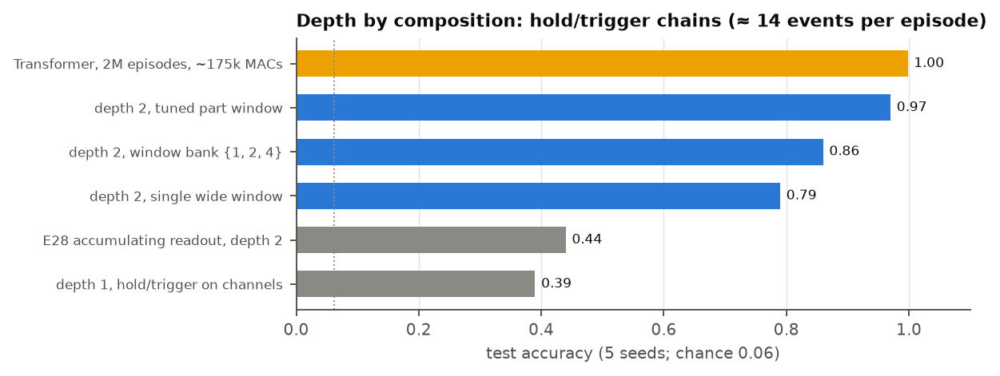

- Hold/trigger chains learned natively: 0.97 with part windows matched to the motif scale, 0.86 with a generic bank
  of window scales, 0.79 with one wide window; depth 1 with the same nodes 0.39 (5 seeds, 40k episodes; E34).
- A readout that accumulates evidence instead fails at conjunction: its hidden nodes do learn parts (86 of 124 draw
  both strongest inputs from one motif), but one detected part fires a class; 56% of its answers share one motif with
  the truth (E28).
- An event-token Transformer trained on 2M episodes reaches 0.998 at ≈ 175k–690k multiply-adds per episode, against
  ≈ 14 events for the chains. The chains are not training-limited: with 5× more training (200k episodes) they stay at
  0.954 (tuned windows, 0.90–0.99) and 0.87 (window bank, 0.81–0.96); two seeds in five plateau near 0.90 because
  some class routes lock onto the wrong parts (under E34's original credit rule; the rules below remove this). With the
  window bank, the chains' errors came mostly from classes that never form a route (copies of a part at several scales
  split the pulls).
- **What the credit rule must be (§83).** A class node should sum its held inputs and its coincident trigger inputs, as a
  membrane does, and learn by full-information multiplicative updates under a conserved budget. Proved: a false fire
  cannot say which half of the AND was wrong, yet conservation still moves the weights toward the target whenever the
  firing threshold exceeds half the budget. Measured (E34w, 5 seeds): 0.911–0.990 at 40k episodes with 890–1,531
  updates (E34: thousands), reached by 8k episodes; 4× more candidate parts (16 → 32 channels) costs 1.3× more updates,
  as the log-of-the-basis bound predicts. The remaining floor is partly the task setup: the class window (3.5) is
  shorter than the longest span between the two part events (4.0), leaving 0.07–1.4% of test examples unreachable.
- **Credit goes to one instant, found by cooled exploration (§84).** If units fire in every positive example at
  *different* instants, crediting them all keeps the mass split across instants: no instant crosses the threshold, the
  node never fires, and nothing corrects it (window bank under that rule: 0.05–0.10). Crediting the one instant closest
  to firing fixes the split but can cycle between invalid prefixes forever; choosing the instant with probability
  ∝ exp(potential/T) reaches the valid route, which is then absorbing. With the class window covering the task's span
  (4.2), E34's task gives per-seed plateaus of 0.988–0.995 by either credit rule, and the generic window bank now
  reaches 0.97–0.99 (E34x). Fixed windows cannot express the task's minimum intervals (a naive oracle route with the
  same windows scores 0.91–0.99); learned windows plus latest-instant credit close the gap (below).

**Order among three parts: depth 3 (E53, E54).** Classes that are different *orders* of the same motif sets (20
classes; decoys are the other orders) cannot be separated by summing held inputs, which is unordered. A layer of
composite units (u → v, firing at v if u fired within a window) supplies ordered intermediates; the candidate basis is
every ordered pair of parts (57,840 units), paid for only when both parts fire (≈ 41 events per episode).

| E53, 5 seeds, 40k episodes | test accuracy | updates |
|---|---|---|
| **depth 3, + margin earned by reliability (§86b)** | **0.997–0.999 at every checkpoint, 5/5 seeds** | ≈ 1,100–1,400 + ≈ 250 near-miss |
| depth 3, instant credit, cooled exploration (T = 0.3) | 0.998–0.999 on all seeds by 5k episodes; final 0.963–0.999 (dips) | ≈ 1,100 to converge |
| depth 3, greedy instant credit (T = 0) | 0.71–0.85 (cycles between shared prefixes) | 4k–11k |
| depth 3, credit to every candidate | 0.33–0.36 (never fires) | ≈ 26k |
| depth 2, same credit | 0.32–0.42 | ≈ 24k |
| *event-token Transformer, 2M fresh examples* | *0.997–0.999* | *≈ 215k–843k multiply-adds per example* |
| *event-token Transformer, 40k examples × 50 passes (no / 0.1 weight decay)* | *0.9975, 0.996 / 0.981, 0.994* | *≈ 215k multiply-adds per example* |

Without a margin, converged classes dip: a node sits just above its threshold and one demotion as a false winner knocks
it under until relearned. A margin kept by near-miss credit removes the dips but also protects wrong routes (3/5 seeds
freeze on a shared prefix); a margin *earned by reliability*, applied only when the node's recent fires were mostly
correct, keeps the search open for unreliable nodes and protects reliable ones (§86b): stable at 0.997–0.999. With synapses grown only when first credited (§85: provably the same
decisions as dense weights), depth 3 with 20 channels gives 0.981–1.000 (5 seeds) with 9.5k–13.7k synapses ever grown
out of 145k candidates.
At depth 4 (which of 20 orders of four motifs; 5.5·10⁷ candidate units per role), the same rules give 0.999–1.000 on
5/5 seeds after 10–15k examples, with ≈ 2,000 updates, ≈ 150 events per example and 77k–84k synapses ever grown; with
one level of composites too few the network cannot express the order and stays at 0.57–0.76 (E54). An event-token
Transformer given the same kind of data (40k examples, 50 passes) reaches 0.9895 / 0.9905 without weight decay (0.977 /
0.9705 with it): about ten times the chains' error rate, at ≈ 265k multiply-adds per example; with 2M fresh examples
0.992 / 0.996, still 4–8 times the error rate. At depth 3 it matched the chains; the gap opens with depth.
**Inference cost follows the learned structure (§93).** After a warm-up, a unit is extended to the next level only if one
of its children carries weight (checked periodically, like sleep): accuracy is unchanged (depth 3: identical per seed;
depth 4: 0.995–1.000) while events per example fall by 42% at depth 3 (44 → 26) and 75% at depth 4 (≈ 155 → 39); the
saving grows with depth (E93).
- A Transformer with a learned relative-time attention bias reaches 0.996–0.9985 on this task after 1M episodes
  (≈ 180k multiply-adds per episode).
- **Closing the gap: learned windows plus latest-instant credit (§88–§89).** The remaining errors were lost races to a
  *shortcut*: a class that fires as soon as its second motif begins, right about 99% of the time. Crediting the latest
  instant of an example (where the pattern is complete) removes it, once the windows (including the gap between the
  motifs) are learned: 0.9987 / 0.9967 / 0.9993 / 0.990 / 0.998 from 40k examples seen once (E89), against the
  Transformer's 0.9955–0.998 after 2M examples and 0.9935 / 0.9965 given the same 40k examples 50 times (without
  weight decay; 0.982 / 0.985 with): parity at equal data, from one pass instead of fifty, at ≈ 10⁴× less computation.
- **With 10k examples the chains are more accurate.** Given a fixed set of 10k examples and 200 passes over it (AdamW,
  weight decay), the Transformer reaches 0.955 and 0.976; the chains reach their plateaus (0.988–0.995) within 8k
  examples seen once each (E36g). With one credit rule (instant credit, cooled exploration, margin earned by precision),
  the chains are stable on every task tried: 0.988–0.995 with tuned windows, 0.984–0.992 with a generic window bank.

## 5. Generalization and grokking

**What counts (§58).** A learner generalizes by restriction (its class contains little besides the relation), by
forced generalization (above its capacity), or by grokking (it reaches the relation while memorizing solutions are
available). Every claim reports ρ = n/params.

**Per-class parameters cannot generalize on (a + b) mod p (§66).** For a fixed class each operand occurs in exactly
one pair, so a training pair constrains only its own parameters: generalization needs intermediates shared across
classes. In time, the natural shared intermediate is a sum, and a sum of times needs a rhythm (§56).

**Grokking as a route change (E37).** Each class has two routes: a pair-node lookup that can memorize every pair
(ρ ≈ 0.016) and fires first, and a shared route through a rhythm with learned delays. Learning is errors-only.

| condition (p = 31, half the pairs, 3 seeds) | train | test (chance 0.032) |
|---|---|---|
| no sleep | 1.000 | 0.03–0.04 |
| sleep λ = 0.02 / 0.05 / 0.2, no timing noise | ≈ 1.0 (2 seeds) | 0.93–0.97 (2 seeds); the third seed collapses |
| sleep + cooled timing noise σ = 2 on the shared route (5 seeds) | 1.0 | 0.95–0.99 (5/5 seeds; σ = 0, 1, 4: 4/5) |
| sleep, no rhythm | 0.45 | 0.00 |

**Phase diagram (data × sleep; 3 seeds per cell, cooled noise).**

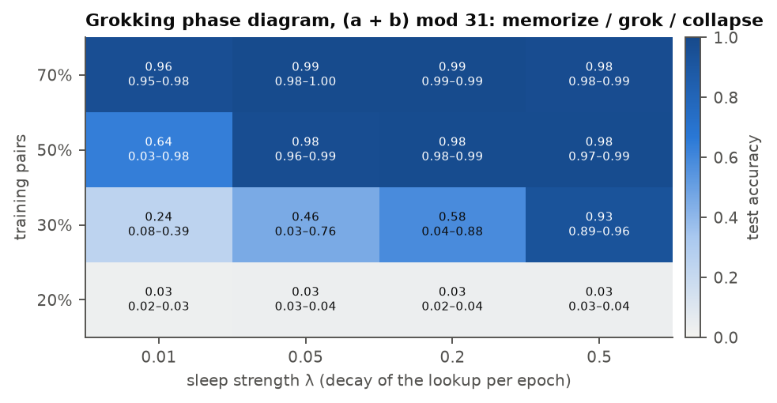

| fraction of pairs ↓ / sleep λ → | 0.01 | 0.05 | 0.2 | 0.5 |
|---|---|---|---|---|
| 0.2 | 0.02–0.03 | 0.03–0.04 | 0.02–0.04 | 0.03–0.04 |
| 0.3 | 0.08–0.39 | 0.03–0.76 | 0.04–0.88 | 0.89–0.96 |
| 0.5 | 0.03–0.98 | 0.96–0.99 | 0.98–0.99 | 0.97–0.99 |
| 0.7 | 0.95–0.98 | 0.98–1.00 | 0.99 | 0.98–0.99 |

**Scaling with the problem size (3 seeds, half the pairs, noise ∝ p):** p = 31: 2 of 3 seeds grok (0.95–0.99); p = 59:
2 of 3 (0.96–0.98); **p = 97: 3 of 3 (0.96–1.00) at ρ ≈ 0.005**. Larger problems grok more reliably although memorizers
are relatively more plentiful: at a fixed fraction each shared delay is reused ≈ n/p = p/2 times, which grows with p
(§72).

Below a data threshold (between 20% and 30% of pairs) no sleep strength groks: weak sleep memorizes, strong sleep
erodes the memorized pairs with nothing taking over (train falls to 0.64). Above it, grokking needs a minimum sleep
that falls with data: sleep must dismantle memorization faster than errors relearn it, and more data makes the shared
route learn faster.

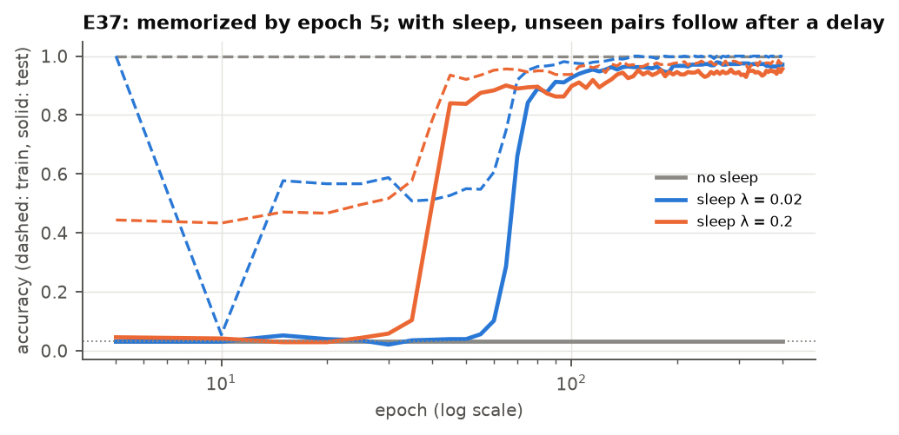

**Why (§69, §72).** With error-gated learning, once the lookup answers a pair correctly nothing else learns:
memorization is absorbing. Sleep decays parameters; a parameter used by m examples settles near m·e·η/λ and survives
only if m exceeds m* = λθ/(eη). Lookup entries serve one example and die; the rhythm's delays serve many and survive;
once the rhythm answers a pair, its decayed lookup entry is never relearned, so the relation becomes absorbing. This
predicts three regimes (memorization, grokking, collapse), all observed, and a data threshold n* ∝ p·λθ/(eη). The
delay shrinks with λ more slowly than 1/λ, because the shared route's own learning time dominates.

**The rhythm is used only where it fits.** On relations the rhythm can express the network groks; on relations it
cannot, it stays at chance on unseen pairs, and under sleep its memorized training pairs erode with nothing to take
over (3 seeds each, λ = 0.05, cooled timing noise on the shared route):

| relation | expressible by one rhythm | train | test (chance ≈ 0.03) |
|---|---|---|---|
| a + b, a − b, relabelled sum | yes | 1.00 | 0.95–0.98 |
| a · b (the delays must find the discrete logarithm) | yes | 0.53–1.00 | 0.98 in 1 seed, 0.51 and 0.08 in the others |
| a² + ab + b² | no | 0.48–0.56 | 0.03–0.04 |
| random table | no | 0.46–0.56 | 0.01–0.04 |

**Grokking with depth (E41, 3 seeds per cell).** (a + b + c) mod p cannot be computed by one rhythm read; the shared
route composes two stages (a and b set a spike time, which c then offsets). A memorizer for every triple is available.

| (a + b + c) mod p | p = 17 | p = 31 |
|---|---|---|
| 30% of triples, sleep | 0.994–0.999 (3/3) | 0.992–1.000 (3/3) |
| 10% of triples, sleep | 0.79–0.93 | 0.94, 0.98 (2/3; ρ ≈ 0.003) |
| no sleep | train 1.0, test at chance | train 1.0, test at chance |
| no chain (lookup only), sleep | train 0.23, test at chance | train 0.11, test at chance |

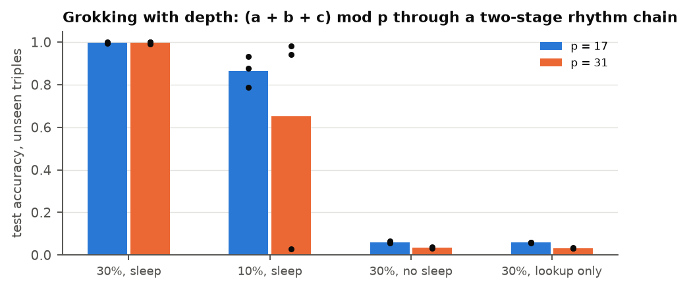

The network discovers the composed relation and generalizes almost perfectly. The fraction of data it needs is far
above the information-theoretic (Occam) bound of a few percent (§78): at 1–7% of triples it memorizes (train
0.75–1.00) and stays at chance on unseen triples, also when trained 7–10× longer (2%: 2,000 epochs; 4%: 1,500 epochs;
3 seeds each). Training time is therefore not what binds; the threshold at p = 17 lies between 7% and 30%.

**Limits.** The shared route's form (one rhythm, or a two-stage chain) is a resource that restricts which relations
can be grokked; the network chooses it over memorization but does not build it. Timing noise on the shared route
(cooled with its own updates) is needed for reliability across seeds.

## 6. The weight race

The original architecture, integrate-to-threshold nodes with learned weights racing in groups, holds its first
results, all at full length with 2–5 seeds:
- **A cancelled node can be taught (E4):** crediting near misses reaches 0.79 at K = 128 where reward-modulated
  rules are at chance, with 6% of the updates of uniform credit.
- **Races decide as fast as the evidence allows (E2):** an accumulator race beats fixed-time decoding at every
  decision time and matches the optimal MSPRT.
- **Learning work tracks activity (E5):** about 300× fewer weight updates than a sparse softmax.
- **Local learning reaches ≈ 0.96 on latency-coded MNIST** (E6, E14); counterfactual credit pays more with depth
  (+0.2 to +2.5 points at depths 1–5) and credit conservation adds +1.0 to +1.7.

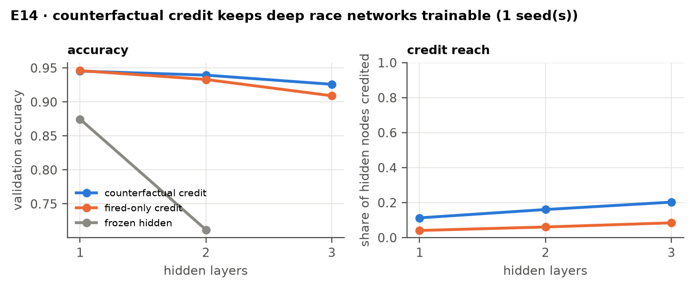

Its limits: depth still costs accuracy (0.960, 0.952, 0.941 at depths 1–3); only its single racing layer beats an
equally accurate dense model at inference (≈ 2.4×); it forgets more than SGD in class-incremental learning (E23); it
memorizes instead of grokking (E24); and the rules that fixed the timing networks (pull-only, conserved budgets,
prices) do not transfer to its weights (SHD 0.04–0.29 vs 0.35).

## 7. Real data

- **Spiking Heidelberg Digits (spoken digits as cochlear spike trains, 700 channels, 20 classes, unseen test speakers).**
  Class-conditional world models (E51): one semi-Markov event network per class, whose state is the last spike's band,
  the time since it (window bank) and the time since the utterance onset; an utterance is assigned to the class whose
  network predicts its spikes best. One counting pass, no gradients. Test 0.647 (validation on held-in speakers 0.734);
  timing adds +0.06, the onset reference +0.21. The gap is the voice: 81% of the test utterances come from two speakers
  never heard in training, and test accuracy barely moves across very different configurations (0.647–0.649), so
  selecting on held-in speakers optimized speaker-specific detail (§92). **Validating on held-out speakers and coding
  bands relative to the voice** (each utterance keeps a running sum and count of its spikes' bands; context and
  prediction are relative to that centroid) raises accuracy on held-out speakers from 0.36–0.38 to 0.44–0.46 at every
  configuration and, selected on held-out speakers only, reaches **0.675 on the test set** (absolute coding under the
  same protocol 0.657; E59). A published LSTM reaches ≈ 0.70; the state of the art is 95.1% (learned delays, Hammouamri et al. 2024), 95.9%
  (Event-SSM, Schöne et al. 2024) and 96.3% (S7, Soydan et al. 2024); the last two process the spikes one event at a time
  with linear state-space units, which §104 shows are event units of our kind with every unit updated on every event (both
  select checkpoints on the test set). These units do not compute with delays: time only fades their state. **E74's first
  time-vector pilot** tests the paradigm's own design: events carry small vectors, content sets each message's delay (and
  whether it is sent at all), the receiver's clock weights and rotates what arrives, units fire when their evidence crosses
  threshold and emit their state at that moment (§105). On 2,000 training and 500 held-out-speaker utterances, its best
  accuracy was 0.146 and its last-epoch accuracy 0.120 (20-class chance is 0.05). E82's 240-update readout diagnosis
  reached 0.184 with a nonspiking state readout and layer normalization; the normalized spiking readout stayed near chance.
  E75's exactly shift/tempo-covariant lattice passed its symmetry check, but its two-epoch pilot reached only 0.044 and
  layer-2 activity collapsed. Symmetry by itself has not solved the learning problem. An objective audit found that E83's
  original mean-over-time softmax let silent bins pull every utterance toward uniform and let co-batched duration change
  a sample's prediction. Its depth-2 runs are debug observations, not depth evidence; the queued depth-4 run was stopped.
  E83 now treats SHD as an utterance label with an online output race: emit the first class whose temperature-scaled
  softmax crosses a confidence threshold, and keep silent before that. Training maximizes the probability that the
  correct class wins, with an explicit latency discount; no class target is copied to every prefix. Cramer et al. used
  max-over-time SNN readout potentials, while Spyx applies cross-entropy to integrated potentials
  ([Cramer et al.](https://kip.uni-heidelberg.de/Veroeffentlichungen/download.php/6616/temp/4143-3.pdf),
  [Spyx tutorial](https://spyx.readthedocs.io/en/latest/examples/surrogate_gradient/SurrogateGradientTutorial/)).
  A tiny 80/40-example smoke reached 92.5% output coverage but only 10.8% accuracy among emitted answers after one
  epoch; full-sequence max-potential accuracy was 2.5%. In the guarded depth-4 screen (512 train / 128 held-out-speaker
  examples, two epochs), integral pooling ended at 4.69% max-over-time accuracy and 5.47% with terminal fallback;
  race-only coverage was 17.97% and accuracy among emitted answers 4.35%. Max pooling ended at 4.69%; its default
  threshold fallback accuracy was 3.91%. The stable-cause `anytime` run reached 6.25% max-over-time accuracy in epoch
  two (8/128; chance-tail probability 0.31) and 5.47% race accuracy at 100% coverage; all tested thresholds from 0.3 to
  0.9 emitted on every item, with peak confidence saturated at 1.0. Layer 4 activity rose from 932 to 1,024 spikes per
  utterance. This diagnoses false-confidence/activity growth, not reliable evidence above chance. The stable-cause
  race-only control ended at 3.12% max accuracy, 97.66% coverage, 4.8% emitted accuracy, and 0.981 peak confidence.
  A readout-only shadow probe at seed-2 initialization (not trained weights) forced 32 near-gate routes on four held-out
  utterances: 31 changed max-pooled CE by exactly zero and one reduced it by 0.045; its boundary-gradient norm was 2.2%
  of pathwise norm with cosine 0.012. Section 129 derives the max-pooling winner-gap dead zone that can erase a route's
  effect from terminal loss. This small probe says nothing conclusive about trained weights or hidden route births.
  `TVLayer` still detaches its hard content gate and computes spike identities inside `no_grad`, so closed routes and
  silent units get no pathwise task gradient for creating events. The event-prefix branch now adds the existing §§19/57
  counterfactual credit to near-boundary content routes: each shadow toggles one route through the full downstream stack
  and compares the same fixed, stratified 0–1000 ms causal prefix queries. This removes future-duration leakage from the
  earlier per-utterance normalized-time sampler. A PyTorch timestamp-grouping autograd bug was also fixed; the hidden
  simulator still scans a 1 ms grid.

  The matched depth-4 pathwise-only run (128 train / 32 held-out-speaker, two epochs) stayed numerically stable but near
  chance: 6.25% terminal accuracy (2/32), with epoch-2 prefix NLL [2.995, 3.202]. The first counterfactual implementation
  used the unbiased candidate-count/shadow-count multiplier; with about 480k eligible routes and 128 shadows per epoch,
  train loss and final-layer activity exploded. A bounded normalized update now averages sampled signals within each
  layer, clips the shadow loss difference to ±5 and the global correction-gradient norm to 1, then applies a separate
  0.001 SGD step. In the matched seed-6 depth-4 pilot it avoided that runaway, but did not improve recognition: terminal
  accuracy remained 6.25%, race coverage fell from 9.38% to 3.12% by epoch 2 with no correct emitted answers, and epoch-2
  prefix NLL was [2.996, 19.735]. Across 112 shadows, only 11.6% of sampled route openings helped; mean signed
  open-minus-closed loss was +0.0063 (SD 0.0644). The counterfactual/pathwise gradient cosine was 0.0038, and its raw
  norm was 1.6% of pathwise norm. At epoch 1 the per-layer mean route effects differed, but each was small relative to
  its shadow-to-shadow spread. A separate depth-2 smoke had a 1.17e−5 gradient-norm ratio and cosine −0.002. This is
  new evidence about estimator scale and route heterogeneity, not above-chance learning.

  THEORY §§131–132 derive why the total-estimator variance scales with candidate count, separate normalized-mean bias
  from update magnitude, and specify layerwise loss-delta/norm/cosine diagnostics. A weak Bayesian prior is appropriate
  at initialization, but these small shadow samples remain uncertain; the step size also needs an optimizer-metric trust
  region. The next discriminating work is to increase shadow samples or stratify them by layer and route score, then
  assess posterior sign and gradient variance before choosing any stronger gain. Hard silent-neuron firing still lacks
  its own counterfactual boundary term. Earlier: the weight race
  reaches 0.35 against 0.56–0.59 for a dense MLP (validation). For the timing
  architecture the representation is the bottleneck: local band-pair parts give a dense readout only 0.40; adding
  parts referenced to the utterance onset lifts it to 0.566 (a reference is what a clockless system needs to place
  events); a native learner on those parts overfits (test 0.27–0.33). SHD is also a weak test of the paradigm: at the
  10 ms bins dense models use, it is only ≈ 6× sparser than a clocked raster.
- **Market stream (BTCUSDT trades), posed as a trading problem (E42, preregistered; confirmed on 21 unseen days).** Position
  ∈ {short, flat, long}, decisions at price events, objective profit after costs (2 and 10 bp). Imitating a cost-aware
  hindsight teacher over-trades (7 pilot days at 2 bp: event learner −12k bp, logistic −4.9k), because a learner that
  predicts direction only ≈ 60% of the time pays for every switch. A profit-priced event learner (evidence
  accumulates against prices learned from realized profit) makes 26 changes in 7 days and nets −170 bp, close to
  buy-and-hold: it learns that trading does not pay here. **Confirmed on 21 unseen days (preregistered):** at 2 bp the
  imitating event learner loses 15,236 bp (4,760 position changes) and the logistic learner 24,302 bp; the priced event
  learner nets +226 bp with 8 changes; buy-and-hold +932 bp; the hindsight teacher +9,211 bp. At 10 bp every learner
  stays out (buy-and-hold +764 bp). No learner beats buy-and-hold; pricing the decision is what stops the losses.
- **Is staying out right? An edge audit (E55, §87).** Measuring executable round trips from the tape (buy at the ask,
  sell at the bid, so bid-ask bounce cannot fake predictability), states of BTC spot's own event stream carry a real
  out-of-sample edge of +0.3 to +0.9 bp per trade before fees, and adding lead–lag states of BTC perpetual futures and
  ETH raises it to +1.1 to +1.5 bp (pilot, held-out days): more markets do carry more information. But even a 2 bp
  round-trip fee (a tenth of a realistic taker fee) removes it: staying out is the correct policy for a taker on this
  data, and the edge that exists would need market-making economics. **Confirmed on the 21 untouched days**
  (preregistered; fit on the pilot days): before fees +0.26 to +1.05 bp per trade from the own state, +0.47 to +1.40 bp
  with perp and ETH; at 2 bp every selected state loses (−0.11 to −1.35 bp); at 5 bp no state qualifies.
  **Across four markets (E55b):** trading ETH spot, SOL spot or the BTC perpetual instead, each with the other three as
  leaders (horizon and side chosen on the pilot days, read once on the untouched days), the edge before fees is at most
  ≈ 1 bp (BTC ≈ +1.0, perpetual ≈ +0.6, ETH and SOL ≈ 0 to +0.5), and every selection is negative or empty at a 2 bp fee.
- **Event-camera gestures (DVS128 Gesture, E60; 11 gestures, 29 people, the official split).** Native motion events
  (coarse cells with a refractory hold, onset detection, direction-selective pair detectors with an opponent veto, verified
  on a synthetic moving edge) turn ≈ 410k raw events per gesture into ≈ 15k motion events. A bag of motion events scored
  by counting reaches 0.663 on unseen people; adding depth (pairs of successive motions in a region) and the
  multiplicative learner of §83 reaches 0.776 on held-out training users and **0.701 on the test users** (configuration
  chosen on validation only). Published systems reach 94–98% (trained spiking networks and CNNs). The representation is
  far from what these gestures need (rotation sense and trajectory shape); depth helps, but this is not yet competitive.
- **Against a Transformer point process (E52, E57, §90).** A Transformer Hawkes process given the event network's own
  hazard family (one intensity per event type and gap window) and 128 events of context, selected on day 5 and tested
  on days 6–7, scores −1.97 / −1.82 nats per event (≈ 108k multiply-adds per event); with 12 finer windows −1.83 / −1.65.
  The semi-Markov event network scores −2.38 / −2.10; adding slow regime state (leaky event counters at 5 s and 60 s
  and an order-flow counter, with backoff to the plain model) brings it to −2.18 / −2.00, and a third backoff level of per-type counters −2.16 / −1.97 (fine windows: −1.91 / −1.73; each chosen on day 5)
  at ≈ 30 operations per event. The Transformer is the better world model by 0.08–0.19 nats per event; the event network
  gets within that at ≈ 1/3000 of the computation. Estimating the slow state by counts transfers to unseen days;
  constant-step multiplicative factors track the end of training and do not (E58).
- **Deeper market event models (E84, queued).** E57 identifies slow rate and order-flow counters as useful market state,
  with a remaining 0.08–0.19 nats/event gap to the Transformer point process at a small fraction of its counted work.
  E84 carries the same point-process objective into strict adjacent-layer event chains at depth 2/4/8/16. It pairs auxiliary
  loss weights 0 and 0.2; predictions use only the deepest layer. The day-1–4/day-5 pilot logs gradients, candidate score
  pairs, accepted messages, state scans, and gradient alignment. Its work counters now aggregate across all training
  minibatches and overlapping day-5 windows, reporting per-event training work and per-scored-event inference work.
  No deeper-market result exists yet; confirmation days remain reserved.
- **The world model of the stream is an event network, and it beats a neural point process (E44, E48; pilot days).**
  Decomposing the likelihood showed where a recurrent neural point process (GRU) beat our first native model: in *which*
  event comes next, not when. Count baselines located the missing information: the time since the last event. A
  semi-Markov event network (state nodes armed by the last two event types, a bank of window nodes opened by the expiry
  events of a delay line, hazard and type detectors learned by synaptic counts) reproduces that model exactly and beats
  the GRU online and on held-out days:

  | nats per event | days 1–5, online (mean) | day 6, frozen | day 7, frozen |
  |---|---|---|---|
  | GRU neural point process (online Adam, then frozen) | −2.62 | −3.15 | −2.98 |
  | native Hawkes-type | −2.81 | −3.01 | −2.86 |
  | **semi-Markov event network** | **−2.11** | **−2.38** | **−2.10** |

  Cost: ≈ 4 network events and ≈ 19 synaptic operations per market event, against thousands of multiply-adds for the
  GRU. The model class is classical (Markov renewal processes); what is shown is that the event network with window
  nodes is the right world model here and generalizes across days. A GRU trained offline for several epochs on days
  1–5, the strongest recurrent baseline, scores −2.72 / −2.53 on the held-out days: the event network is ahead of it too
  (E49); the Transformer point process is ahead of both (below, E52).
- **Earlier native world model (E44, pilot days).** Four event types (price up/down moves, large aggressive
  buys/sells) as a temporal point process learned online from every event (§79), scored by the prequential
  log-likelihood of each event's type and timing:

  | model | nats per event, days 1 / 2 / 3 |
  |---|---|
  | constant rates (Poisson) | −3.00 / −3.42 / −3.32 |
  | Hawkes process, Adam | −2.62 / −2.94 / −2.84 |
  | native (normalized multiplicative learning) | −2.64 / −2.85 / −2.70 |
  | native + fast/slow surprise-gated plasticity | −2.64 / −2.85 / −2.69 |
  | recurrent neural point process (GRU, Adam) | – / −2.61 / −2.52 |

  The native world model matches or beats Hawkes but trailed the neural point process by ≈ 0.2 nats; the semi-Markov
  network of E48 (above) closed that gap. Adding pair-part state was neutral; adding inhibition (to express suppression)
  destabilized learning as implemented; learning-to-learn plasticity was neutral on whole-day averages.

## 8. Open problems and next steps

The cross-domain mathematical synthesis, scope limits, and falsifiable route to the language-model frontier are in [MATHEMATICAL_PROGRAM.md](experiments/MATHEMATICAL_PROGRAM.md).

The synthesis now treats topology and representation as separate experimental axes. Events may carry dense embeddings, low-rank features, sparse/codebook vectors, structured codes, or symbolic payloads with timing, and may interact with recurrent state or retrieved key–value memory. No payload form is assumed best. It also gives an amortized cost model that charges candidate search, topology learning, index construction, memory traffic, and synchronization alongside active events. E79's race mixture scores 1.808 frozen test bpc at 1M text8 characters, against 2.179 for the completed LSTM and 2.367 for the 2-layer width-256 Transformer on the same split. At 10M, E79 scores 1.613 frozen test bpc versus 1.799 for the completed 1.2M-parameter, two-layer 512-unit LSTM and 1.908 for the completed 3.24M-parameter, four-layer Transformer on the shared test segment. The four-layer Transformer checkpoint was selected on validation and scored 1.9083 held-out test bpc after 4,882 updates. The E79 comparisons are single-seed and include six experts plus copy memory; the Transformer and LSTM also use different pass counts. This is a same-split language-model result, not a compute- or parameter-matched architecture comparison. E77 has no completed scale-level LM result yet. A default-width depth-4 pilot showed why raw voltage quantiles were insufficient: they left the stack nearly silent. Matching the realized post-reset spike rate restored gradients through all four layers; an 8-layer, width-8 pilot then had gradients in every layer at all 16 validation points with sparse test activity. These are trainability diagnostics, not language-model quality or scaling results.

- **Stability of the full rule set on every task at once:** the margin earned by reliability is stable at depth 3 and
  4 and with fixed windows, but hurts when windows are learned: at the firing instant it entrenches early shortcuts, and
  at the latest instant it keeps promoting noise that follows the pattern (§89). The margin needs another anchor.
- **Deep time-vector networks on real streams (§§130–§132):** E83/E84 use strict adjacent-layer event chains and deepest-only
  inference. The old mean-over-silent-and-padded-time objective was confounded by sequence duration and batching. E83 now
  trains a causal prefix posterior with proper log loss at stratified queries in a fixed physical-time window; it then
  evaluates the first-crossing race separately. The 128/32 depth-4 pathwise control remained near chance (6.25% terminal
  accuracy). An unbiased total counterfactual estimator over roughly 480k near routes with 128 shadows per epoch exploded
  in loss and activity. A clipped normalized local route update avoided that runaway but did not improve accuracy; its
  matched seed-6 run stayed at 6.25%, with epoch-2 prefix NLL [2.996, 19.735] and only 11.6% helpful openings. Shadow
  effects varied by layer and had low gradient alignment, so gain selection remains open. Hard silent-unit firing and
  candidate edges outside the fixed route mask still lack boundary credit. E84 remains the guarded
  day-5 market likelihood comparison;
  no new market result exists.
- **Depth-credit redesign for SHD (§136; experiment pending):** the deepest-only classifier forces an early event to
  survive every later hard route before it can affect the final loss. E83 now has a sparse `all_depths` readout that adds
  causal class evidence from every layer at the same query prefix, while retaining the deepest-only control and local
  auxiliary losses. The lost-route counterfactual compares the fused end-to-end objective, so an opening can receive
  credit for its direct evidence as well as downstream changes. This relaxes serial credit but may let shallow branches
  solve the task; matched depth-4 controls and a depth-8 run will report branch ablations and sparse readout work. No
  accuracy gain is established yet. E83's separate silence gap also remains: logits do not evolve between hidden events
  until the next event or terminal EOS.
- **Anytime classification of sparse streams (§§119–§129):** for a true prefix posterior, emitting at its first
  confidence crossing of $1-\epsilon$ bounds the error among emitted answers by $\epsilon$; this is a derived guarantee,
  conditional on sequential calibration, not yet an E83 result. For point-process inputs, both observed events and
  class-dependent silence carry evidence, so between-event crossings may require scheduled clock updates. When an event
  changes only $r$ class logits, indexed max and log-sum-exp trees maintain the exact confidence threshold in
  $O(r\log C)$ work; a reference implementation is in `experiments/sparse_anytime_readout.py`, not integrated or
  benchmarked yet. Sampled-prefix log loss is proper for the posterior given a prefix despite having only one label per
  complete stream; the race objective alone does not determine calibrated prefix probabilities. The staged
  route-credit → posterior → stopping-policy plan is in §§127–§129. Max pooling can add a further dead zone: a shadow route
  gets no terminal loss credit unless it changes a temporal winner; smooth-max can soften this while retaining sparse
  event updates. This task structure covers SHD speech and event-camera
  clips with one label per stream.
- **A time-vector language model (§§107, 133–134; E77):** exact replay of threshold/reset dynamics restored gradients
  at default width, and the width-8 depth-8 pilot had gradients in all eight layers at all 16 validation points. This is
  the first evidence that initialization can support learning past depth 4; BPC remains a tiny-smoke diagnostic, not a
  quality result. Route-shadow effects remain small and uncertain, so the correction stays disabled. The next open
  questions are scale-level quality, evidence-conditioned local updates, and actual retrieved keys/work per character.
- **The work law of attention in language (§106a):** how many keys the queries of a trained character-level Transformer
  actually need, as the context grows (E76); this fixes how much delay-coded attention saves on text.
- **Structure discovery for grokking:** a bank of rhythms and chain depths from which the network must pick, so that
  grokking no longer relies on a provided route (E45 pilot: it picks correctly).
- **The data threshold of grokking** is far above the Occam bound (E41: between 7% and 30% of triples at p = 17); the
  sleep reuse filter (§72) is the candidate constraint; untested.
- **Native learning of sparse parity** with toggle nodes: representable by one node, learnability open (§75).
- **A real benchmark where the paradigm should win:** streams with rare, precisely timed events (§55), and a
  representation for speech that the native learner can use.
- **Joules, not operation counts:** run trained networks on neuromorphic hardware (§9).

**Working constraints.** Every mechanism is an event handler (local state, triggered by events, cost proportional to
events); dense procedures such as replay are used only as diagnostics. The time-vector networks (E73–E75) are trained by
gradients that flow only through the spikes that occurred (§104d), simulated on a 1 ms grid for speed; the same gradients
have an event-driven form (EventProp-style adjoints), which is how they would run natively. All computation runs one job at a time
through `experiments/queue/run_safe.sh` after parallel jobs repeatedly hung the host.

## 9. Hardware: what these networks need, and what exists

**What the model asks of hardware.** Each primitive the theory and experiments settled on maps to a hardware feature:

| what the network does | what hardware must provide | why (theory / evidence) |
|---|---|---|
| work only when an event arrives | event-driven execution, no global clock sweep; memory next to compute | cost follows activity (§55, §63, §77) |
| delays and hold windows (“B within 1.5 s after A”) | per-synapse programmable delays and per-node hold timers, fine time resolution, ideally timestamps rather than time steps | order is held intervals (§61); one node = a product set in lag coordinates (§71) |
| first to fire wins, the rest are cancelled | fast arrival-order resolution and inhibition (winner-take-all) | the race readout; timing precision bounds exact computation (§59) |
| summed held and coincident inputs | integrate-and-threshold at the event | §83 |
| learning: multiplicative credit under a conserved budget | per-synapse multiplicative update plus per-node renormalization, a tag marking which synapses contributed at the credited instant, a local random source, a per-node precision counter | §83–§86b, §89 |
| synapses grown only when first credited | run-time allocation of synapses in a sparse store (the candidate basis is 10⁵–10¹⁰ units; only 10⁴–10⁵ are ever grown) | §85 (exactly dense Winnow) |
| part windows tuned from their own lags | per-synapse window edges updated by a local rule | §88 |
| signals that carry small vectors whose content sets their delay | an 8–32-value payload per event, a small dense core per unit, a delay computed per message, and a jitter small against the delay scale | delay-coded attention (§105); latency × weight error = jitter × logit range (§106b) |

**The optimal machine (a sketch).** Clockless digital cores with timestamped events, per-synapse delay and window
fields, and per-node timers; arrival-order comparators and inhibition trees for the race; a small event-triggered
learning engine per core (multiply, renormalize, tag, random draw); and a content-addressed sparse synapse store with
allocation on credit. This is close to *race logic* (computing with the arrival times of signal edges: first arrival is
a minimum, a delay is an addition; the same tropical, max-plus algebra as the weaving operator of §79), plus learning.
At published costs of ≈ 24 pJ per synaptic event (Loihi, 2018), the networks of this report would spend about 0.2 nJ per
example on the timing task (7.5 events), ≈ 0.5 nJ on composition (≈ 20) and ≈ 4 nJ at depth 4 (≈ 150); a Transformer
at 175k multiply-adds per example on a GPU spends on the order of a microjoule (orders of magnitude, not measurements).

**What exists (September 2026).**

| system | availability | fit for these networks |
|---|---|---|
| Intel Loihi 2 (and Hala Point, 1,152 chips) | research access only (Intel's research community); Hala Point is a prototype at Sandia; Loihi 3 announced, specifications unpublished | **best current match for prototyping:** asynchronous event-driven cores; weight, delay (up to 62 time steps) and tag per synapse; learning rules programmable in microcode. Missing: synapses allocated at run time, delays beyond ~60 steps, continuous timestamps |
| SpiNNaker2 (SpiNNcloud) | commercially available systems (152 ARM cores per chip); deployed at Sandia | **most flexible:** every rule here, including synapse growth, can be written in software; less energy-efficient per event than dedicated logic; time-stepped |
| BrainChip Akida (AKD1000/1500; Akida Pico) | commercial; Pico in FPGA-cloud evaluation since Feb 2026; Akida 2 in development | built for converted convolutional spiking networks with limited on-device learning; no programmable delays of the kind needed: poor fit |
| Innatera Pulsar | in volume production (2026): spiking fabric plus RISC-V and CNN/FFT accelerators, µW–mW | deployment of small, already trained networks at the sensor; learning of the kind here not advertised |
| SynSense Speck (vision, with an event camera on chip) and Xylo (audio, time series) | commercial dev kits | inference-only spiking ASICs: deployment of small trained networks |
| DYNAP-SE2, BrainScaleS-2 | research | analog continuous-time dynamics (delays through synaptic time constants, ~10 ms); natural time, but device mismatch |
| IBM NorthPole | research | synchronous, dense near-memory inference: not event-driven, not a fit |
| FPGAs | commercial | delays as timestamp queues, synapses in block-RAM hash tables: **the most practical way to build the full rule set faithfully today** |
| event sensors: Sony/Prophesee IMX636/637, iniVation; event audio | commercial | natural front ends: they emit exactly the event streams these networks consume |
| CPUs / GPUs | commercial | a CPU simulates sparse events efficiently (all experiments here ran on a few CPU cores); GPUs suit dense, regular work and fit poorly |

**What to do with it.** (1) Measure joules, not operation counts: map trained networks onto Loihi 2 (inference) and
the full learning calculus onto SpiNNaker2 or an FPGA, against a Transformer on a GPU. (2) Deploy frozen networks on
sensor-edge chips (Pulsar, Xylo, Speck) where event sensors already exist. (3) The feature no commercial chip offers,
and the one these results say matters most, is **run-time synapse allocation on credit** (with per-node conserved
budgets): it is what lets a network search a basis of 10⁷–10¹⁰ candidates while storing only what it uses.

*Sources:* [Intel Hala Point](https://newsroom.intel.com/artificial-intelligence/intel-builds-worlds-largest-neuromorphic-system-to-enable-more-sustainable-ai) ·
[Loihi 2 overview](https://open-neuromorphic.org/neuromorphic-computing/hardware/loihi-2-intel/) ·
[Loihi 2 learning and delays](https://www.emergentmind.com/topics/loihi-2-neuromorphic-chip) ·
[SpiNNcloud SpiNNaker2 launch](https://siliconangle.com/2024/05/08/spinncloud-systems-launches-spinnaker2-first-commercial-neuromorphic-supercomputer/) ·
[SpiNNaker2 at Sandia](https://www.hpcwire.com/off-the-wire/sandia-deploys-spinnaker2-neuromorphic-system-from-spinncloud/) ·
[Akida Pico](https://brainchip.com/brainchip-announces-immediate-availability-of-akida-pico-for-remote-evaluation-via-fpga-cloud/) ·
[Innatera Pulsar](https://www.innatera.com/newsroom/innatera-unveils-pulsar-the-worlds-first-mass-market-neuromorphic-microcontroller-for-the-sensor-edge/) ·
[SynSense Speck and Xylo](https://www.synsense.ai/synsense-launches-speck-xylo-neuromorphic-development-kits-for-edge-ai-vision-and-audio-work/) ·
[DYNAP-SE2](https://arxiv.org/pdf/2310.00564) ·
[Sony event-based vision sensors](https://www.sony-semicon.com/en/products/is/industry/evs.html) ·
[Race logic (Madhavan, Sherwood, Strukov)](https://ieeexplore.ieee.org/document/6853226/) ·
[Loihi energy per synaptic operation (Davies et al., 2018)](https://redwood.berkeley.edu/wp-content/uploads/2021/08/Davies2018.pdf)

## 10. Next frontier: generative language models

**The aim** is not to approximate Transformers but to exceed them: the same or better quality, with work per word that does
not grow with model size or text length, learned by local rules from less data.

The clearest real-language signal so far is E79's race mixture: at 1M training characters it scores 1.808 bpc frozen
(1.782 with online weight adaptation), against 2.179 for the completed validation-selected LSTM and 2.367 for the
2-layer Transformer on the same text8 training and test split. This is a strong result for combining native predictive
experts and associative copy memory. The expert mixture has additional memory and its compute is not yet matched, so
this result motivates the deeper E77 test rather than standing in for it. In a separate synthetic task, E61 learned
query–key retrieval with local credit and generalized to four times the context. Together with the exact delay-coded
attention result and the associative state scan, these results make the architectural path concrete: learn to retrieve,
compose state in parallel, then build depth and measure the full model.

### Potential: a different route to frontier models

Sleeping Machines can combine mechanisms that dense sequence models usually bundle together. Event-state layers build and
update representations only when messages arrive. Time carries order, duration, and confidence; payload vectors carry
content. A separate retrieval interface can learn key/value attention when a query needs stored detail, while a recurrent
state path can carry useful summaries at linear sequence cost. Local event credit can train the active causal path, and
near-miss credit can recruit alternatives that did not win. This gives the architecture room to choose *how* to compute
for each input rather than forcing every layer to perform the same dense operation.

The strongest opportunity is to combine these parts into a deep, heterogeneous stack: temporal feature layers, selective
state updates, query-driven retrieval, and learned decision/readout layers. Softmax key/value attention is a one-step
modern Hopfield retrieval rule under its associative-memory interpretation; the attention/Hopfield connection is
established in the literature ([Ramsauer et al.](https://arxiv.org/abs/2008.02217)). E77 now applies a separate
query/key/value associative update directly to emitted event payloads, then carries the retrieved payload onward through
the event stream. The exact score gradient is centered around the retrieved value, so it teaches both which keys to
address and which payloads to transmit. This gives event message passing an attention-capable associative primitive
without making every temporal layer an attention layer.

The auto-associative case has additional structure: retrieval is the gradient of a convex log-partition function, and
its Hessian is a positive-semidefinite key covariance. Repeated retrieval is contractive when
β × key-diameter² / 4 < 1; above that sufficient threshold, this argument no longer ensures stable settling. Decoupling
keys from values enables hetero-associative memory but makes the query Jacobian a cross-covariance that need not be
symmetric. E77 therefore uses one gated Hopfield update per event layer and retains an identity path instead of assuming
that repeated associative settling will converge.

There is now a useful local depth result (§107(g–h)): for fixed stored keys and values, the query sensitivity is a
cross-covariance bounded by (inverse temperature × key diameter × value diameter / 4), independent of the number of
memories. For a full event sequence, however, a key shared by many later queries can amplify gradients. §107(h) bounds
the sequence Jacobian using each key's accumulated attention mass, plus query/key/value projection gains and the output
gate. If every event-level correction satisfies the resulting bound, residual scaling by 1/depth keeps the payload-path
Jacobian between positive, depth-independent bounds. E77 now logs key fan-out, the sequence-level bound, its scaled value
and layer sum, score spread, retrieval entropy, update size, key/value diameter bounds, and role-specific gradients.
The certificate is local to a fixed event order and candidate set; hard event births, route discovery, and changes in
top-k membership remain outside it. These measurements will show whether the 2/4/8/16-layer models meet the sufficient
condition rather than assuming they do.

Retrieval precision also trades off with learning credit. If the best key leads by score margin $m$, the non-winner
softmax mass is at most $(N-1)e^{-\beta m}$. Yet for two candidates the derivative is $\beta p(1-p)$: it is largest
at a tie and vanishes after one route becomes certain; a hard-excluded key receives no gradient. This derives a concrete
learning schedule: begin with broad associative retrieval and near-miss credit, then sharpen and sparsify only while
candidate recall and score-gradient coverage remain high. New analysis (§112) uses the law of total covariance to split
the query-gradient error from pruning into omitted within-set covariance and a between-set key/advantage term. Its norm is
at most $\\beta\\epsilon(3/2-\\epsilon)D_KD_A$, where $D_K$ is key diameter and $D_A$ is the range of the key's
loss advantage. Thus mass recall bounds absolute error but can miss all of a weak gradient: in a two-key example, retaining
99.9% of the mass leaves the sparse query gradient zero while the omitted key carries the entire dense gradient. The same
section shows that adding a missing key changes the loss by $rA+O(Hr^2D_V^2)$, where $A=\\nabla F(y)^\\top(v-y)$ is
the already-derived attention credit and $H$ bounds downstream curvature. This supplies an attention-specific, curvature-
controlled counterfactual loss estimate for the existing sparse-expert router (§§19, 57). Substituting it into the
existing route-boundary gradient gives an explicit counterfactual error budget; this can direct exact shadow work toward
near-miss keys where curvature makes the local estimate least reliable. It does not reduce the cost of finding keys. The
same analysis now closes the smooth-loss VJP gap: the query-gradient truncation error is bounded by
$\\beta\\epsilon D_K[(3/2-\\epsilon)D_A^C+HD_V^2/4]$, with matching key- and value-VJP bounds. The curvature term accounts
for the upstream gradient changing when retrieval changes the output; the bound remains absolute and gives no alignment
guarantee near a zero dense gradient. This is a mathematical result awaiting autodiff checks, not an experimental result. The
2/4/8/16-layer E77 and Transformer sweep now matches
context length, sampled training windows, 5M-token exposure, batch size, optimizer updates, and parameter count to within
4% (Transformer widths 104/104/112/136 at depths 2/4/8/16). A separate width-256, 20-pass depth-4 Transformer run
supplies a stronger convergence reference; it has a larger training budget and is reported separately from the matched sweep.

**Deep sparse-stack stability (§§113–114; derived, with a small numerical diagnostic).** Section 113 composes local output and
Jacobian error through residual depth; under $1/L$ residual scaling and bounded per-layer constants, the error bounds
remain depth-independent. Section 114 now lifts fixed-support softmax truncation to a full sequence Jacobian:
$\|D\mathcal A-D\tilde{\mathcal A}\|_{2\to2}\le\sqrt{RC}$, where $R$ is a per-query row-sum bound and $C$ is a
shared-key column-sum bound. Its $F_j$ term measures how truncation changes the influence of key $j$ across all queries,
so the certificate includes key fan-out rather than treating queries independently. These results compose for smooth,
fixed-support residual attention. For E77, constants must hold throughout the state region; the sparse Jacobian's
Lipschitz constant, parameter-VJP errors, and input-dependent gate terms still need bounds. Route changes remain the
existing §§19/57 boundary problem. This advances the analytic bridge but does not prove task-gradient alignment or
training convergence. E114 checked 144 fixed-support synthetic cases by central finite differences: no absolute bound
violation exceeded $10^{-8}$; among cases with nontrivial bounds, the largest Jacobian and forward-error ratios were
0.897 and 0.687. The largest positive absolute Jacobian excess was $1.32\times10^{-10}$. Exact-support cases have
essentially zero bounds, so their finite-difference residue is assessed absolutely instead of by relative ratio.
Autodiff checks, learned supports, and architecture-scale uniform constants remain to be tested.

#### If these mechanisms scale

If deep event stacks preserve the Hopfield address/value learning signal, learn the routes that matter, and find
retrieval candidates without scanning every stored key, frontier models could grow their useful memory and reasoning
capacity without making every token pay for every possible interaction. Training work would follow the examples and
routes that create predictive value; inference work would follow emitted events and retrieved candidates. The model
could retain a large associative store while only a small, input-dependent fraction participates in each prediction.

That would change the practical scaling strategy. More capability would come from composing sparse temporal features,
event-triggered memory updates, and content-addressed retrieval—not only from increasing dense matrix size and token
throughput. A stronger accuracy-per-compute curve would shift investment toward memory bandwidth, fast sparse routing,
event-capable processors, and distributed associative stores. Frontier development could become less dependent on
ever-larger dense GPU clusters, while training becomes more data- and update-efficient. The paradigm shift would be a
new way to scale model capacity and learning together: preserve Transformer-level associative recall, compose it deeply,
and spend computation where the learned model says information is needed.

The mathematical work now points to concrete levers for that outcome: keep score credit alive near competing routes,
bound payload and layer gains as depth grows, and reduce candidate search with an index that preserves retrieval mass.
The depth-4/8/16 queue is the first language-model test of whether those levers work together beyond shallow stacks.

### Evidence to date

The E79 text8 scores at 1M / 10M / 90M characters are 1.808 / 1.613 / 1.504 bpc frozen and 1.782 / 1.593 / 1.483
with online adaptation. The expert count also rises from five to seven, so this is a joint data-and-capacity trend. The
completed 1M same-split gradient baselines score 2.179 for the 256-unit LSTM and 2.367 for the two-layer Transformer.
At 10M, the completed two-layer, 512-unit LSTM scores 1.799 test bpc (1,199,323 parameters, six passes); E79's frozen
mixture scores 1.613 on the same test segment, a 0.186 bpc lead. The four-layer Transformer checkpoint was selected
on validation and scored 1.9083 held-out test bpc after 4,882 updates, 0.1090 above the LSTM's test score. The Transformer has 3.24M parameters and used four
passes; the LSTM has 1.20M parameters and used six. E79 combines six native experts and copy memory. These comparisons
share data and test segments, but not model capacity or training budget. E79 supplies the strongest completed
project-internal real-language result; compute-matched and deep-model comparisons remain open. E79's expert-race
mixture validates credit for allocating among component predictors, not gradient training through a deep event stack.
E77 is the separate deep time-vector language model with vector messages, delays, and causal key–value retrieval; it has
not produced a completed language-model result yet.

Depth is now a first-class variable in E77. Each deeper layer receives the retained event stream, appends its newly
emitted events, and also receives sparse raw-input skips; it does not add a dense per-token residual computation. THEORY
§107(f) proves a non-contracting inclusion path for existing event payloads under fixed topology, while §107(g–h) bounds
the Hopfield residual correction when its sequence-level gain and key fan-out are controlled. E77 logs per-layer
activity, associative score spread/entropy, update size, key/value diameter upper bounds, key fan-out, the payload
Jacobian certificate and its residual-scaled value, and role-specific gradients. Retaining events can increase pairwise
retrieval work with depth, so the same sweeps also report messages, events, and score candidates.

The first activity-bootstrap pilot at width 8 exposed a fixed-threshold failure, but its raw voltage quantile was not
enough at the default width. On a matched depth-4, width-128 run (10k training characters, 39 updates, one seed),
quantile-only initialization yielded selected-checkpoint test activity [0, 0.007, 0.009, 0.004] spikes/character and
nonzero gradients at only [1, 9, 12, 6] of 13 validation points. E77 now replays the exact threshold/reset recurrence
on saved voltage traces and chooses a threshold by realized firing rate. It matched the initial layer rates to
[0.096, 0.082, 0.094, 0.100] around a 0.1 target and reached all four layers at all 13 validation points. Activity
then grew to [0.204, 0.190, 0.456, 0.802] spikes/character by the selected checkpoint, showing that the learned
representation shifts event statistics; online homeostasis is not implemented. The held-out BPCs 3.765 and 3.824
were measured on 1,000 characters and do not support a quality comparison.

The same calibration carried a width-8 stack to depth 8 on 4,096 training characters and 16 updates. All eight layers
had nonzero gradients at all 16 validation points; initial rates were [0.102, 0.086, 0.109, 0.102, 0.086, 0.102,
0.098, 0.102], and test rates were [0.115, 0.125, 0.217, 0.075, 0.081, 0.138, 0.124, 0.121]. Its BPC of 4.319
on 512 test characters is too noisy to establish quality; the matched 4-layer smoke scored 4.254. This is the first
evidence that the initialized training path extends beyond four layers, not a depth-scaling law or supremacy result.

A fresh depth-4 route-shadow pass used 64 candidate openings per layer. Trajectory-cluster means ± SE for
$L_{open}-L_{closed}$ were [+0.000360 ± 0.000218, −0.001115 ± 0.000325, +0.000220 ± 0.000278,
−0.000435 ± 0.000290]. Layer 2's routes tended to help, but the network changed after each minibatch, so these are
not independent replicates. The mean counterfactual/pathwise norm ratio was 0.77% and cosine 0.0040; the correction
remains disabled. This is a weak route-utility signal, separate from the much stronger evidence that rate matching
reopens pathwise gradients.

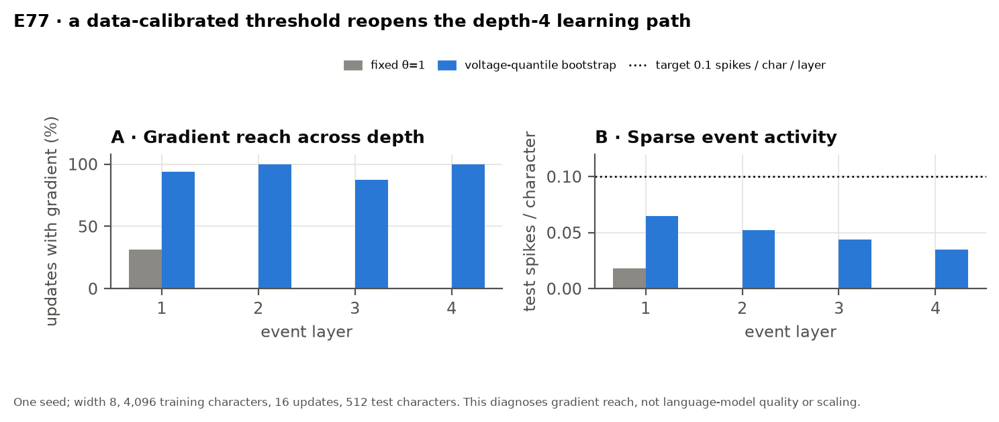
The token-level adaptive retrieval interface has a linear-time recurrent-state path, but both token retrieval and
event-level Hopfield lookup currently score every eligible query/key pair. In addition,
`TVLayer` simulates state in dense time-by-batch-by-unit tensors even though its synaptic connectivity is sparse. Thus
the design remains event-oriented and has sparse routing, while this implementation has not yet achieved fully sparse,
event-driven execution or demonstrated lower energy. Both simulator work and retrieval search must be measured and
optimized before claiming a compute advantage.

**Depth fairness is mandatory.** E77's two-block setting is a prototype configuration, not a frontier comparison. The
queued text Transformer baseline has two layers; the best E61 recall Transformer used four, and the published large-model
text8 numbers cited elsewhere are not matched in depth, parameters, or training budget. E79's 90M result is a contextual
reference, not proof that a small native mixture has lost to a comparable frontier model. Before drawing an architectural
conclusion, sweep event depth (2, 4, 8, 16), widen capacity, train to comparable validation convergence, and compare both
at matched depth and matched total training work. If loss is worse, inspect training loss, residual gradient norms, event
activity/route coverage, retrieval recall, and scaling with data; then fix the diagnosed bottleneck and rerun. Depth is a
core capability to build and measure, not an optional ablation.

The strategic upside is substantial: if learned topology keeps useful information and credit flowing while inactive
routes remain quiet, models can grow in representational capacity without making every token pay for every possible
interaction. That would change the practical scaling curve for both learning and inference. The E77 implementation is the
next concrete step toward this architecture; its adaptive interaction, residual depth, and resource frontier need the
depth and compute experiments above.

**Why that is a reasonable aim** (theory; details in §96–§98):
- *Nothing a Transformer computes is out of reach.* Every part of a Transformer layer has an event form: similarity between
  a query and stored keys is the overlap of their spike codes; a race among the stored keys picks the best match, and a
  race of randomly ticking clocks picks each key with exactly the probability softmax attention gives it; relative position
  is native (delays and windows measure time differences directly); the feed-forward block is threshold units over codes.
  Stacking layers is composition. So a Sleeping Machines network can express any Transformer.
- *It has freedoms a Transformer lacks.* The *order* in which signals fire is a second axis for information (n signals can
  carry up to log₂ n! extra bits in their order); only active units work, so a model can be very large while each word
  stays cheap; structure is grown where it proves useful; sampling is a race, and retrieval can aggregate only the keys
  that pass its match window. Finding those keys still requires candidate search.
- *Local learning is not a handicap in principle* (and for Transformer-style attention it is exact on average; below). A
  race computes with minima and sums; the exact gradient that
  backpropagation would compute for it runs only along the chain of spikes that caused the output, which each node can
  trace locally. Credit along that chain *is* backpropagation for these networks; what gradients cannot provide (a
  signal for the paths that lost) comes from near misses. For races of random clocks the exact gradient is also local.
- *Depth is trainable, and optimally so.* For networks that detect ordered patterns of depth d, the number of learning
  mistakes grows as d × log(size of the candidate pool), and no learner of any kind can do better in the worst case (§97, §98).

**Training, subsumed (theory, §101–§103).** A race of randomly ticking clocks splits its output into two independent
channels: *which* clock fires first (a sample from the softmax) and *when* (the decision time, which carries the softmax's
normalizer). Three consequences, each proved:
- every competitor can compute its own softmax probability from purely local information: its own rate times the decision
  time that everyone observes;
- if every stored key emits its value scaled by that product, the sum is, on average, exactly softmax attention: a native
  attention head with no normalization circuit;
- the gradient of this race with respect to its scores, computed locally at each key, is on average exactly the gradient
  of softmax attention.
So a network built from such races, with small dense cores for the rest, is trained by local message passing as stochastic
gradient descent on the Transformer objective, up to an error that shrinks as 1/R with R races per head. Transformers are,
in this precise sense, a limit of these networks, including how they are trained. The figure checks the three statements
numerically; E68 compares training curves directly (queued).

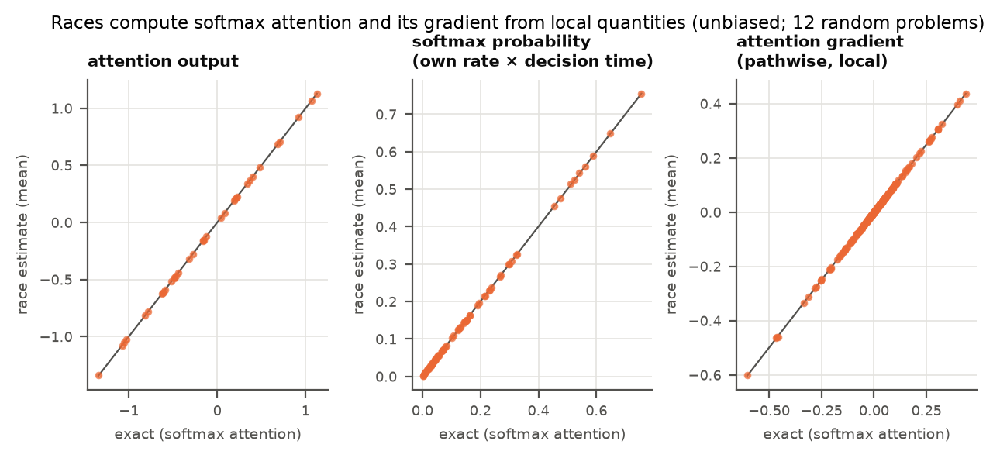

**Time and content, one system (theory, §104).** Continuous-time neural models describe a hidden state that flows and is
pushed by its input: neural ODEs, controlled differential equations, and the state-space models behind Mamba-class language
models. An event network is exactly such a system. Between events its state flows in closed form, and at each event it jumps.
The only nonlinearity is in *which* units fire *when*. Four consequences follow:
- *Order detectors are the natural features of event streams.* The iterated integrals that make these models universal (the
  "signature" of a path) are, for event streams, the counts of ordered event patterns: exactly what our "this, then that"
  detectors learn. Stacking such detectors builds the universal feature set.
- *Selection comes free.* Mamba-class models gain their power by letting the input set how fast the state forgets. In an
  event network, which channel fired is that signal. A unit that an event does not address need not be touched at all, and
  skipping it is exact, not an approximation (sleeping execution). The best published models on spoken digits (95.9–96.3%)
  are such units with every unit updated on every event, and time only fades their state: they do not compute with delays.
- *A race unit is an integrate-and-fire neuron with a random threshold.* It integrates its rate and fires when the integral
  crosses a random level. Its gradient is the event-based backpropagation used for spiking networks, but the random
  threshold keeps the expected loss smooth even when spikes appear or vanish. At the moment of decision, each unit's own
  integral is on average exactly its probability of winning, for any time-varying rates.
- *Time adds expressiveness.* If the scores change while the race runs, the race outputs a mixture of softmaxes over its own
  decision time. That is more expressive than the single softmax at the end of every Transformer (the "softmax bottleneck").
  A fast race is one softmax; a slower race buys expressiveness with time rather than with parameters.

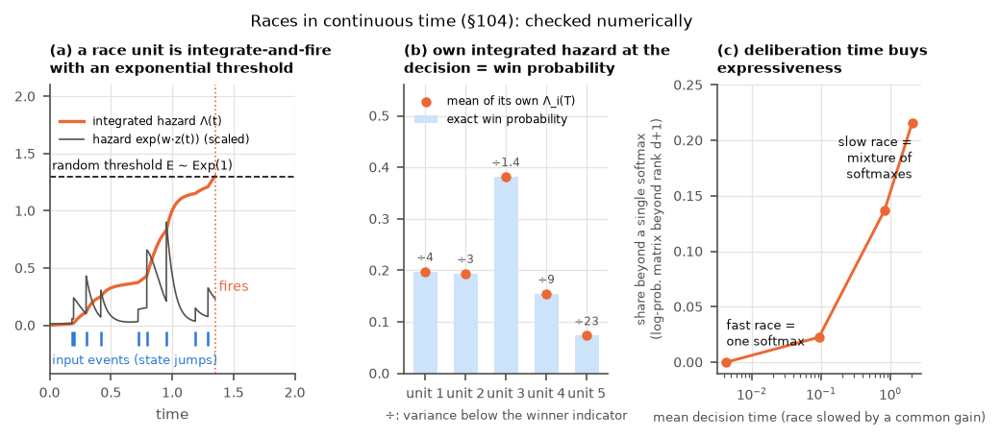

**Delays and vectors, computing together (theory, §105).** In this design an event carries a small vector, and its content
decides *when* it arrives: a message whose content matches the receiver is delayed in proportion to the match, and a message
that does not match is never sent. The receiver's state fades with time, so a later arrival counts more. Consequence, proved
and checked: the receiver holds exactly softmax attention over the matching messages, with no multiplications for the
weights and no sampling. Payload aggregation pays only for messages that were sent; an unindexed implementation still
scores every key, so total search work can grow with context length. Races compute the same softmax by *sampling* (fast,
slightly noisy); delays compute it by *waiting* (exact, slower for a wider range of scores). A unit then fires when its
evidence crosses threshold and sends on its state at that moment, so what it says and when it says it are one computation.
Networks built this way compute in the log semiring: delays add, and gains multiply. E74 has tested it in an initial spoken-digit pilot.

**Two memories (theory, §107).** A time-vector unit has a *restricted affine-accumulator resemblance* to exponential-gated
recurrent memories: for a fixed event schedule, elapsed time supplies decay, content-dependent delay supplies an
exponential write factor, and a count channel normalizes the read. This is not an algebraic identity with a full xLSTM
layer. Current E74/E77 do not implement sLSTM's learned gate/memory-mixing cell or mLSTM's matrix state of key/value
outer products. E77's causal event-Hopfield update and token query/key/value retrieval are separate associative
operations. xLSTM is a useful topology and scaling precedent: its 7B model was trained on 2.3T tokens, and a separate
672-run study covered 80M–7B parameters and 2B–2T tokens, reporting better compute/loss trade-offs than its tested
Llama2-style Transformer baseline ([xLSTM architecture](https://arxiv.org/abs/2405.04517), [xLSTM 7B](https://arxiv.org/abs/2503.13427), [xLSTM scaling study](https://arxiv.org/abs/2510.02228)).
Those results establish that a nonstandard recurrent/matrix-memory family can be built and scaled deeply; they do not
transfer to E77. For our design, the actionable lessons are explicit repeatable blocks, stable gate/residual settings,
systematic parameter/data/context sweeps, and kernel performance treated as part of the architecture. E77 should retain
event-state layers and sparse event routes while applying that disciplined scale methodology.

A write-time memory cannot answer arbitrary questions asked later: remembering N facts for any future question needs at
least N × (bits per fact) of state. So a language model built this way needs a second memory, *retrieval*, done natively:
a question is sent to stored keys, which reply sooner the better they match; the first reply opens a short window, and
replies inside it are weighted exponentially, which is exactly softmax attention over the good matches. Its aggregation
cost is the number of good matches. Its search cost is still linear in the context without an index. E77 combines a
configurable stack of spiking time-vector layers, recurrent state, and adaptive retrieval. Deeper layers have sparse
raw-event skips; retrieval can mix delay-coded attention with a linear-time state route. An indexed candidate search is
still needed to reduce total attention search work.

**Parallel state scan (theory, §107(i)).** With event arrivals/topology fixed, each time-vector memory step is an affine
map $z_k=A_kz_{k-1}+x_k$. These maps compose associatively, so an exact prefix scan computes all states in logarithmic
parallel depth while keeping linear arithmetic work. The count normalizer has the same form. This gives a concrete route
to parallelizing the recurrent state path without dense pairwise attention. It does not remove the current dense
time-by-batch-by-unit tensors, parallelize hard event births or reset decisions, or establish an energy advantage. The
next step is output/gradient equivalence on fixed event schedules, followed by a small, safe timing pilot.

**Local learning that provably suffices (theory, §108–§109).** When units predict the next character by racing (each
candidate's clock rate a weighted sum of the log-probabilities its inputs assign), a network of such units is a *gated
linear network*: every unit predicts the target itself and learns only its own convex loss, so no error ever has to be
sent backwards, and such networks are known to be universal and to learn well in a single pass (Veness et al., 2021). The
network is also never worse than its best part (a mixture's guarantee). What these units do not do is build features;
in this design features come from the time-vector layers and the native detectors, and the race units combine them.

**First evidence.**
- Deep order is learned from about ten times less data than a Transformer needs (§4).
- *Language, stage 1 (counting experts, copy memories, word-keyed memories, mixed by conserved multiplicative credit).*
  The stage is measured on text8 test text at 1M, 10M and 90M training characters. The mixture reaches 2.00, 1.79 and 1.65
  bits per character (E63), and word-keyed experts bring it to 1.98 and 1.73 at 1M and 10M (E66). Its stored contexts grow
  as D^0.41 and its pairs as D^0.49. Counting alone (E62, 2.31 → 1.81) fits a floor near 1.73 bpc, which the mixture
  already passes: that floor belongs to the component, not to the design. **Mixing by a race (§108)** instead of linear
  Hedge (each next-character candidate's clock rate is the weighted sum of the experts' log-probabilities: a product of
  experts, as the best text compressors mix) takes the same experts at 10M training characters from 1.80 to **1.61 bits
  per character**, with weights frozen after the validation text, at a few hundred operations per character (E79). Across
  the single-seed E79 runs, the 256-character-copy-window mixture scores 1.808 / 1.613 / 1.504 frozen and 1.782 / 1.593 /
  1.483 online at 1M / 10M / 90M training characters. Expert count also rises from 5 to 6 to 7, so this is a promising
  data-and-capacity scaling signal, not an isolated data-scaling law. Comparing unbounded copy against the 256-character
  window gives frozen scores 1.779 vs 1.808 at 1M, 1.612 vs 1.613 at 10M, and 1.512 vs 1.504 at 90M. Long-range copy
  helps modestly in the smallest run, but has no measured advantage at 10M or 90M; the small differences are single-seed
  results without uncertainty estimates. This supports testing bounded copy/retrieval spans at scale, while preserving
  long-range associative retrieval as a separate mechanism. For scale, published text8 results: a standard LSTM ≈ 1.43,
  stronger recurrent models 1.27–1.36, large
  Transformers ≈ 1.08; so at full scale the native model is near an LSTM and behind Transformers. Fixed share, which
  carries the §108 guarantee, gives 1.945 at 1M (E78). For scale, large Transformers reach ≈ 1.1 on
  text8 from 90M characters. The first gradient-trained 10M baselines (one pass: LSTM 2.17, Transformer 2.43) were
  unconverged. E64b's 1M, 20-pass validation-selected runs now score 2.179 for the LSTM and 2.367 for the 2-layer
  Transformer; both selected checkpoints were taken at their final validation points. At 10M, the two-layer 512-unit LSTM
  completed six passes and scored 1.7993 test bpc (1,199,323 parameters); its selected checkpoint is the final one, so
  convergence is not established. The four-layer 10M Transformer checkpoint was selected on validation and scored
  1.9083 held-out test bpc after 4,882 updates, 0.1090 above the LSTM on test. The Transformer used four passes and
  3.24M parameters, compared with the LSTM's six passes and
  1.20M parameters, so the scores are data-matched but not capacity- or budget-matched. The parameter-matched depth
  controls and 2/4/8/16-layer E77 comparisons remain queued. No language-model advantage for E77 is established yet.
- *Attention is learnable by local credit, from far less data.* In a recall task where the network must learn which key
  a query refers to and which neighbour to read (a learned query–key match, as a Transformer's attention learns), a
  race-attention layer trained by local credit alone is 100% correct after 1–4k examples and 64–68 mistakes (5/5 runs),
  and 100% on contexts four times longer; the Transformers that solve it need 400k–1M examples and reach at most 72% on
  the longer contexts (E61).

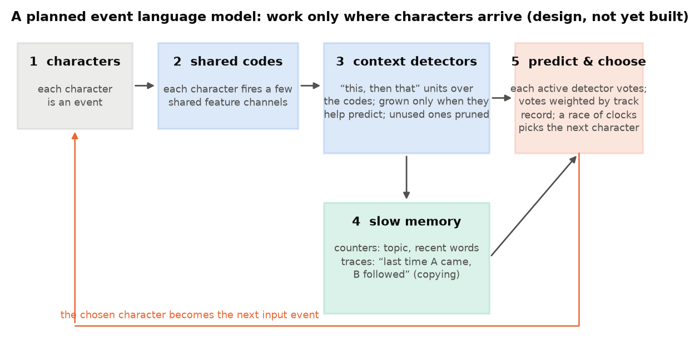

**The plan, in stages, each measured on character-level text (text8):**
1. *Counting baseline* (measured, E62–E66; above): context detectors of increasing length with counts of what follows, plus a copy
   memory. This is not the goal; it measures how memory and loss scale with data (§95) and gives a floor to build on.
2. *Attention over the stream*, by races (the E61 mechanism at scale; E68) or by content-dependent delays (§105:
   exact; retrieved-value aggregation is as cheap as attention is sharp, while total search cost needs a separate index
   (E76 measures how sharp a trained model's attention on text is).
   E77 is the first full model of this kind: spiking time-vector layers for the recurrent memory and a delay-coded
   retrieval layer (§107), with messages, spikes, retrieved keys and score candidates per character reported.
3. *Learned shared codes*, so similar characters and chunks overlap and learning transfers between them.
4. *Stacked layers* with credit along causal chains and near misses.
At each stage: the same text, a recurrent network and a Transformer trained by gradients on the same data, and three
measures: bits per character, examples needed, and work per character.

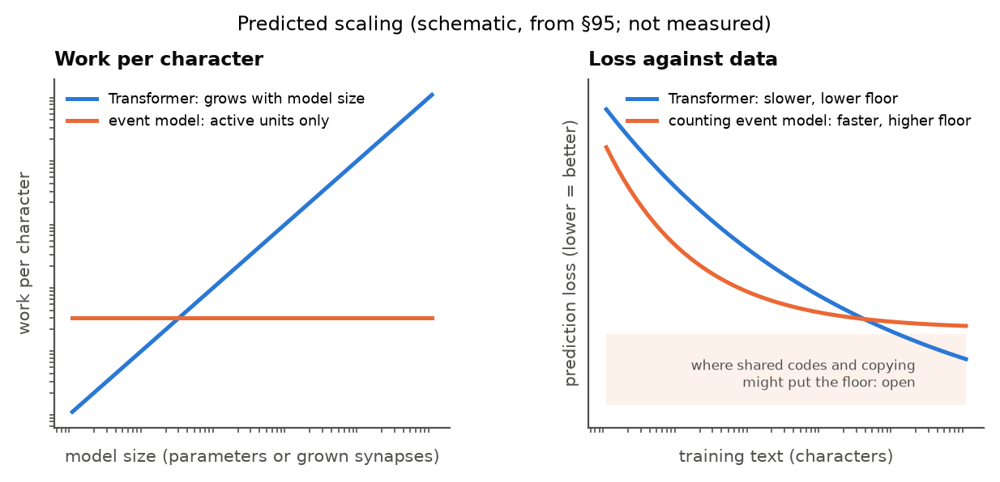

**What is established and what is not.** Established: the expressive equivalence, the locality of exact credit for
races, the optimality of the depth bound, exact delay-coded attention and its work law (theory, checked), learned
attention on a recall task from ≥ 250× less data than a Transformer, and data efficiency on deep order.
Not yet shown: that stacked race-attention layers with learned codes, trained by local credit, match or beat a Transformer
on language itself. The stages above are how that will be decided.

## Experiment index

| exp. | question | result |
|---|---|---|
| E2 | adaptive decisions | race matches MSPRT |
| E4 | teaching cancelled nodes | 0.79 at K = 128 |
| E5 | work vs capacity | ≈ 300× fewer updates |
| E6, E14 | local learning, depth (MNIST) | ≈ 0.96; counterfactual credit and conservation pay with depth |
| E16 | counterfactual routing in MoE | ties load balancing |
| E17 | market stream | no edge after costs |
| E22 | SHD with the weight race | 0.35 |
| E23 | class-incremental learning | forgets more than SGD |
| E24 | grokking with the weight race | memorizes |
| E25 | modular arithmetic with delays | restriction, not grokking |
| E26 | native delay learning | pull-only 0.97–0.98; push at chance |
| E27, E35 | timing patterns with veto | 1.000 (directional hold); nothing given 1.000 |
| E28 | depth with accumulating readouts | fails at conjunction |
| E29 | first grokking design | failed |
| E30 | Turing completeness, restoration | exact; length-independent reliability |
| E32, E36 | vs clocked conv nets and Transformers | parity or better at 10⁴–10⁵× lower cost |
| E33, E39, E39b | depth theorem checks | agree with §71 and §75 |
| E34 | depth by composition | 0.97 vs 0.39 |
| E37 | grokking by a route change | 0.93–0.97 in 2 of 3 seeds |
| E38, E40 | SHD with the timing architecture | not yet |
| E51 | SHD with class-conditional event world models | 0.647 test |
| E36 (add3) | Transformer on E41's task | 0.03–0.63 after 100k steps (chance 0.06) |
| E41 | grokking with depth (a + b + c) mod p | 0.99–1.00 (3/3 seeds, p = 17, 31) |
| E42 | trading with costs, when to transact | learns not to trade (confirmed on 21 unseen days) |
| E44, E48 | online world model (point process) | semi-Markov event network beats a GRU point process, held-out too |
| E57 | market world model with slow regime counters | within 0.08–0.19 nats of a Transformer point process |
| E59 | SHD, speaker-relative bands, selected on held-out speakers | 0.675 test |
| E61 | race attention with learned query–key match (recall) | 100% after 1–4k examples, length ×4 (5/5); Transformers need 400k–1M |
| E62, E63, E66 | event language model, stage 1 (text8) | 2.00 / 1.79 / 1.65 bpc at 1M / 10M / 90M; word keys 1.98 / 1.73 |
| E64, E64b | LSTM and Transformer LMs at equal data | test BPC: 1M LSTM 2.179, Transformer-2L 2.367; 10M LSTM 1.799, 4-layer Transformer 1.908 after validation-based checkpoint selection and 4,882 updates |
| E67 | learning from race timing (MNIST) | race-time rule ≈ exact softmax (one seed); grid queued |
| E68, E69 | race Transformer vs softmax Transformer; race-attention market model | queued |
| E70 | SHD: race attention over onsets | queued |
| E71, E72 | dense event-SSM units (SHD, market) | withdrawn: they do not compute with delays |
| E73 | scalar delay network, exact spike-time gradients | gradient check 0.06%; the vector-free limit of E74 |
| E74 | SHD: time-vector network (content delays, snapshot payloads) | 2k-train pilot: peak held-out speaker accuracy 0.146, final 0.120 after 6 epochs; chance is 0.05 |
| E75 | SHD: equivariant time-vector network (band shift × tempo) | symmetry check passed; two-epoch pilot reached 0.044 and did not learn; strict-depth and auxiliary-credit diagnostics follow in E83 |
| E76 | attention work law in trained character-level Transformers | queued after E64b |
| E77 | time-vector language model with delay-coded retrieval (text8) | causality verified; depth-4 bootstrap micro-pilot restores gradients through all four layers; matched scale runs still queued |
| E78 | lower envelope: native experts mixed (Bayes, fixed share, Hedge) | 1M: Bayes = best expert (2.218); fixed share 1.945 |
| E79 | race (product-of-experts) mixer of the native experts | 1M / 10M / 90M: 1.808 / 1.613 / 1.504 bpc frozen, 256-character copy window; K rises 5 / 6 / 7; no matched compute/energy baseline |
| E80 | market as vector events (with transaction magnitudes): world model and edge audit | not yet run; deeper, budgeted day-5 pilot is E84 |
| E81 | race gated linear network (layers of local race neurons) over the native experts | queued; with word-keyed experts |
| E83 | deep time-vector model on speaker-held-out SHD | causal prefix posterior fixed a sampler leak; pathwise and normalized-counterfactual depth-4 runs stayed at 6.25%; inverse-probability route credit destabilized (§§130–132) |
| E84 | deep time-vector market world model | paired depth 2/4/8/16 day-5 pilot queued (aux loss 0 vs 0.2); full-window work aggregation; no confirmatory test |
| E49 | offline-trained GRU point process (market) | −2.72 / −2.53 held-out: behind the event network (−2.38 / −2.10) |

## 11. Potential applications and the transformation

If deep event models learn Transformer-level representations and remain trainable as data, depth, and memory grow, this
could open a different route to frontier AI. Computation in training and inference would follow useful messages, retrieved
memories, and active parameter updates. A model could keep a large associative store and spend work on the information
each prediction actually uses. Lower cost per token would expand the number and scale of experiments a fixed research
budget can support, and would make high-capability models cheaper to serve continuously.

### Applications

- **Language and knowledge work:** deep models could combine persistent event memory, recurrent state, and key–value
  retrieval to reason across long-running projects without reprocessing every token in a large dense context. Lower
  inference cost would make capable personal and organizational assistants practical to run more often.
- **Autonomous mobile platforms:** phones, wearables, vehicles, and robots continuously receive asynchronous camera,
  audio, motion, and location streams. Event-based routing could keep perception and decision making local, responding
  immediately to salient changes while preserving longer-lived associative memory. That could reduce dependence on a
  cloud round trip, conserve battery during quiet periods, keep sensitive sensor data on the device, and let a platform
  maintain useful autonomy when disconnected.
- **Robotics and industrial systems:** machines could combine fast event reactions with selective recall of past
  situations, adapting to changing workflows without running a dense model over every sensor frame. The same design
  could support low-latency inspection, logistics, process control, and collaborative machines.
- **Scientific and environmental sensing:** instruments and distributed sensors could analyze rare events continuously,
  retain causal context, and coordinate through compact messages rather than transmitting every raw sample.

### Economic and industry shift

At frontier quality, the main benefit would be a new compute scaling curve for both training and inference. Fewer dense
operations and fewer unnecessary weight updates would reduce accelerator-hours and energy per useful token. The same
capital and power envelope could then support larger training runs, broader ablations, more continual adaptation, or
more users. Increased demand would move toward high-bandwidth memory near compute, sparse routing networks, rapid event
resolution, and associative stores. GPU data centers could evolve into heterogeneous facilities where GPUs handle
dense kernels and event-capable processors handle sparse temporal work; investments would be guided by useful learning
and retrieval throughput rather than peak dense FLOPs alone.

That would change the economics of frontier development. Research teams could explore more architectures at the same
budget, service providers could lower inference cost, and capable models could reach devices and organizations that
cannot justify today's energy and infrastructure footprint. A shift from scaling dense tensor operations to scaling
learned routes and associative memory would be an architectural transition across model software, accelerator design,
data-center layout, and the products built on top of them.

### Mobile autonomy

The most visible change could be an autonomous device that listens and watches continuously while using little power
between meaningful events. A phone or robot could build a persistent local model of people, places, and ongoing tasks;
retrieve relevant past observations when something changes; and coordinate applications or physical actions without
shipping a continuous sensor feed to a remote service. Fast local response, longer battery life, offline capability,
and user-controlled memory would make autonomy feel like a property of the platform itself rather than a remote feature
that must be explicitly invoked. As autonomy grows, dependable permission boundaries, memory controls, and clear action
records become core product capabilities.

### The evidence path to that outcome

The current signals provide a reason to pursue this path: E79's native expert mixture leads the completed 1M text8
gradient baselines on the same split and the completed 10M LSTM on the same test segment; E61 learns associative
retrieval and context extrapolation with local credit; and the theory gives exact attention and a linear-work associative
scan for fixed event schedules. The decisive next step
is to show these capabilities working together in the deeper E77 language model, then measure matched quality,
training cost, inference work, and energy on real hardware. That is the route from a promising mechanism to a new
frontier-computing paradigm.

## Reproducing

```bash
experiments/queue/run_safe.sh experiments/queue/<queue>.txt      # runs a queue file, one job at a time
python experiments/e35_free.py                                    # timing task, nothing given
python experiments/e36_transformer.py --task e27                  # Transformer baseline
python experiments/e34_compose.py                                 # depth by composition
python experiments/e37_grok.py --lam 0.05                         # grokking
python experiments/e39_depth.py                                   # checks of the depth theorem
python report/figures_time.py && python report/make_pdf.py        # figures and the PDF
```

Dependencies: `numpy`, `matplotlib`, `reportlab`; `torch` for the gradient-trained models and baselines (E36, E52, E61, E64, E67–E76).
