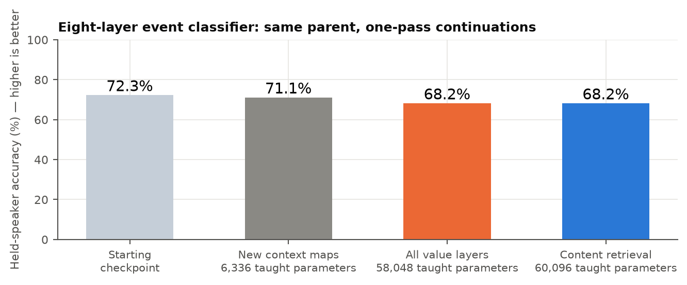

# Sleeping Machines

Computing with time: learned delays, vector messages and local memory

**Time is part of the computation.** Messages carry both a vector and an arrival time. Learned delays change arrival order, shape temporal memory and decide which competing message wins. Nodes can wait, accumulate evidence and transform a message's content and timing. A clock race can select a class; learned phase transformations can compose an arithmetic rule. Unrealized alternatives teach better choices. Dormant capacity and sparse activation reduce cost, while the organizing idea is to make timing itself a trainable computational medium.

## The strongest demonstrated results

- **Better real-language prediction.** With 10M training characters, the native predictive mixture reaches **1.613 test bits per character**, ahead of the completed LSTM (1.799) and four-layer Transformer (1.908) on the same text8 split. The matched 90M LSTM and Transformer controls are queued. Lower bits per character means better prediction.
- **Accurate retrieval with far fewer examples.** Local race retrieval learns perfect recall at four times the training context within 4,000 examples in all five runs. The consolidated model preserves 100% on its standard and longer contexts.
- **Rule learning and deep composition.** The consolidated periodic path reaches **100% across all 3,440 unseen modular triples**. Native depth-four order models reach 99.9–100%; shared-motif composition reaches about 99.65% from one pass at roughly 10,000× lower counted work than its Transformer reference.

Language scores are held-out test results from the named predictive mixture and gradient baselines, with different model sizes and schedules. That specialized mixture is not yet reproduced by a generic deep language model. Retrieval, composition and arithmetic are controlled synthetic tasks. The following pages distinguish the consolidated implementation from the original native components.

## Consolidated models: accuracy versus computation

The common implementation now retains perfect modular generalization and longer-context retrieval. New Transformer and LSTM controls use the same synthetic examples. **Higher and further left is better:** more accurate answers from less counted work. The logarithmic axis makes large cost differences visible.

| Common configuration | Held-out capability | Estimated work per query |
| --- | --- | --- |
| Periodic path; 69 learned scalars | 3,440/3,440 unseen triples | 188 logical operations |
| Two-layer carrier + hard pointer | 100% at four times context | 728,602 logical operations |

The periodic path executes directly through the shared model interface. A two-layer carrier variant is also shown: its phase state supplies the same answers while the carrier adds cost. Speech and other representation tasks use deeper carrier configurations. The architecture chooses the required primitives and depth per task; each task has separately trained weights.

**Learning work is also selective.** The periodic teacher makes 29,003 mistaken-example updates and 145,015 learned-scalar update visits. The dense arithmetic controls make 4,800 Adam steps: 92.2M parameter visits for the LSTM and 132.5M for the Transformer. These count parameter updates, excluding optimizer state and backward arithmetic; they are not training FLOPs or joules.

Arithmetic: 1,473 fitting triples, a 200-epoch budget, all 3,440 unseen triples; supplied period 17. The phase-only path stops after 47 passes, when an entire fitting pass makes no updates. Recall: 4,000 pointer-fitting examples plus 512 neural-fitting examples; the dense controls receive all 4,512 examples for eight epochs. Width 32 and two generic layers where present, seed 6, one small dense setting. Work is an analytic logical-operation estimate, including configured vector maps, routers, scans, normalization, clock candidates and pointer search. These inference counts are not measured joules or backward/optimizer counts. Full work definitions appear in the evidence appendix.

## Native components: quality, work and sample efficiency

The native components establish why selective temporal computation is promising. Timing patterns, composition and deep order reach high accuracy with much less counted work. Retrieval and rule learning also show that a reusable computation can generalize beyond the observed examples.

Work panels count event operations or dense multiply-adds per example; training budgets are labeled. Data efficiency and arithmetic use different horizontal axes. Market quality is held-out log-likelihood, with an online GRU and Transformer reference. The largest work advantages here belong to the named native components; the preceding page measures consolidated configurations directly. Operation counts do not assign equal hardware energy to different operations.

## How the model computes and learns

The architecture computes through local memory, vector payloads and timing. A learned delay changes which arrivals interact and which route wins; it participates in the function being learned. Activity sparsity controls how much computation occurs. A message can carry a learned representation, a pointer, evidence or a periodic state. Layers need not all perform the same operation. Their job is to preserve useful information and recruit the computation needed for the task.

- **Local temporal memory** accumulates observed content and elapsed time without evaluating empty time ticks.
- **Computation through delays** uses waiting times, arrival order and clock races to transform information and select outcomes.
- **Hard races** choose the emitted vector and delay. Losing alternatives provide training credit without becoming identical forward messages.
- **Reusable memories** include conditional outcome statistics, relative pointers and learned phase transformations.
- **Trainable depth** uses bounded carrier updates to preserve representations and credit through a hierarchy.
- **Appropriate supervision** teaches a completed class decision or the next event's type and waiting time, including silence.

The consolidated model is trained independently on each task. Input queries contain only observations already available at their cutoff. The label and next event remain targets. Its current query interface processes event packets; persistent scheduling across overlapping queries is an additional systems capability.

Small local vector maps and query readouts can remain dense. The intended efficiency comes from selective event/state computation and appropriate primitives; total memory access and communication must also be measured when assessing an implementation.

## A mathematical foundation for trainable computation

| Principle | What it enables |
| --- | --- |
| Stable transport through depth | Bounded residual carriers preserve payload and credit under stated schedule conditions. A separate key stream can keep actual races and clocks fixed while values learn; routing credit is a separate problem. |
| Active communication support | Inputs need causal paths through which to interact. A context channel supplies joint information when sparse packets leave local groups disconnected. |
| Credit to unrealized alternatives | A losing payload or timing choice can show how a different route would change the outcome, while forward computation remains a hard race. |
| Periodic state as an isometry | Learned rotations/reflections have unit-magnitude occurrence derivatives. Their composition supports reusable arithmetic instead of a table of observed tuples. |
| Certified composition | Target-constrained min/max composition of phase errors certifies the fitted modular rule across all 4,913 possible tuples; exhaustive checking confirms it. |
| Natural supervised credit | Categorical and event likelihoods both credit predicted sufficient statistics minus observations. Silence enters through integrated exposure. |
| Useful optionality | Reserve consists of distinct, attainable future corrections under a causal work budget. Reachability and transferable learning matter alongside immediate loss. |

### From mathematics to an engineering discipline

The theory connects representation, topology, clocks and optimization. Expressivity describes what a network can compute; transport describes whether information and credit survive; the objective describes what the teacher asks it to learn. These pieces must agree. The periodic certificate is one concrete case where the formal model explains and verifies a learned computation.

A common implementation makes these principles reusable across tasks. Efficient primitives can own a computation when its structure is known; a deep carrier can learn representations when it is not. The research objective is to combine this flexibility with affordable route discovery and increasingly capable models.

Formal derivations and their assumptions are indexed in the project's theory notes. Conditional stability and a certificate for a fitted rule do not establish global optimizer convergence or a scaling law.

## Potential: what the demonstrated capabilities put within reach

The opportunity is intelligence that learns reusable structure and spends computation in proportion to useful activity. Strong predictive mixtures, reliable retrieval, efficient temporal composition and certified periodic computation already provide working foundations. The shared implementation gives those mechanisms a common place to develop.

### Compact prediction and memory

Local predictive memories can support compression, stream forecasting and adaptation to recurring patterns. Learned pointer rules can keep their meaning as context grows. These are useful ingredients for models that retain experience without recomputing an entire dense history at each query.

### A reusable event-to-decision module

Sound, event-camera vision, touch and telemetry all arrive as evolving evidence. A capable recognizer could maintain context, identify meaningful patterns and answer as soon as confidence is sufficient. Deep speech learning and temporal composition establish parts of this capability; reliable early decisions and broader generalization are central development goals.

### Training efficiency creates capability

Cheaper updates can buy more data, depth and experimentation from the same budget. Better sample efficiency makes each experience more useful. The exact event-memory scan already reduces audited forward/backward CPU time by 1.68×, preserving the checked predictions and gradients. Local timing and routing teachers provide additional routes to efficient learning.

### Industrial and scientific applications

Machines and instruments could maintain local predictive models, recognize changes and adapt from new operating conditions. Laboratories could use event histories to select informative measurements and control experiments. These applications connect fast local responses with longer-term memory, close to the source of the observations.

## Potential: a new foundation for frontier models

If the architecture combines frontier predictive quality, reliable deep learning and lower total training and inference cost, it would change the practical recipe for building frontier models. Useful capacity, active computation and learning cost could become more independently controllable.

### Useful quality at a lower energy cost

A broad advantage can begin with comparable quality at substantially lower measured training or inference energy. A modest quality tradeoff with a large energy saving can also unlock new applications. Tenfold savings, or larger, would transform feasible deployments and research budgets; these are conditional scenarios, not current measured energy ratios.

### The economics of creating intelligence

A fixed power and capital budget could produce a more capable model, more specialized models or more research. Teams constrained by compute could enter new scales and applications. Efficient learning would expand what is feasible, including the size and sophistication of frontier training runs.

### Capacity that can remain dormant

Large stores of memories and skills could stay available while only relevant portions participate in a decision. Straightforward situations could resolve with little work; difficult ones could recruit more computation. Cheap search, communication and selective credit would make this a different scaling regime from repeatedly activating an entire dense model.

### Autonomy in mobile platforms

Robots, vehicles, phones, wearables and remote instruments could sustain perception, memory and adaptation within a mobile power budget. Local intelligence could retain context continuously, react quickly and learn from experience while reducing dependence on continuous connectivity.

### Hardware and infrastructure

If sparse communication and persistent local state determine cost, processors and data centers would increasingly optimize those operations: message delivery, delay queues, memory access, candidate lookup and selective updates. Investment would follow measured useful learning per watt and per unit of capital. The architecture could change which accelerators are most valuable and where capable models can operate.

These larger outcomes depend on demonstrating quality, scaling, retention and total resource cost together. The existing results provide concrete footholds for that research program.

## What establishes the larger advantage

The ambition is a common model family whose strongest mechanisms remain useful as tasks, data and capacity grow. Arithmetic and retrieval retain their demonstrated strengths in the consolidated implementation. The strongest language mixture is specialized; the generic backbone still needs to demonstrate competitive learned representations. Character and subword-token budgets must be distinguished.

| Objective | Decisive evidence |
| --- | --- |
| Generic language scaling | Train a learned event backbone without explicit n-gram/pointer experts. Scale through declared data budgets with matched Transformer, recurrent and state-space references; record loss, capacity, forward/backward work, memory traffic, time and joules. |
| Preserve capabilities | Repeat established generalization and sample-efficiency results within the common model family, with task-appropriate depth and explicit resource accounting. |
| Strong real-event recognition | Accurate speech and event-camera decisions on complete held-out benchmarks; calibrated confidence and time-to-answer. |
| Learn routes and representations at scale | Reliable deep credit and useful counterfactual alternatives as width, depth, memory and data increase. |
| Efficient persistent operation | Maintain local state and pending messages across queries, preserving causal predictions while reducing repeated work. |
| Lower total energy at useful quality | Measure training and inference joules, memory traffic, latency and communication under declared hardware and quality targets. |

Success on these dimensions would turn the current task-level advantages into a broader foundation for frontier models. The project's distinctive resources—timing, local memory, hard selection and credit to alternatives—remain the guide for architecture and learning.

## Appendix A. Deep event recognition

The eight-layer speech checkpoint reaches **72.3%** across 512 held-out utterances. Both readout continuations start from that checkpoint. At the matched readout comparison below, count pooling reaches **68.9%** and learned event pooling reaches **69.5%** across 512 held-out utterances. Each model has 4,096 fitting utterances and begins from the same checkpoint. Hidden messages remain winning vectors and delays; the learned pool adds 32 scalar parameters.

Two causal context channels allow distant packets to interact through accumulated state. Their zero-initialized columns preserve the starting predictions exactly. A matched full-update continuation reaches 68.6%; training only those columns reaches 71.1%. The added state has linear event work and 6,534 learned parameters.

A separate key stream computes actual input-dependent winners and clocks while new value maps learn under that schedule. Matched continuations reach 364/512 (71.1%) with separate keys and 365/512 (71.3%) with shared streams. Both improve fitting accuracy but remain below the parent. Audited finite value credit agrees with predicted loss change; all extra key computation is charged. This establishes a routing-isolation mechanism, not an accuracy or energy advantage.

The exact linear-work memory scan preserves audited predictions and gradients while reducing scan combines 5.49×. Median one-thread CPU inference improves 1.52× and forward/backward computation 1.68× at the audited checkpoint, excluding optimizer updates.

Speech scores are development evidence from training speakers 3/6; the official SHD test set is untouched. They demonstrate deep learning and limited transfer, not competitive speech representation. They are not directly comparable to published official-test scores. One seed, width 32, eight layers. The matched readout arms share checkpoint, examples, augmentation and update budget. Sparse event packets avoid a hidden time grid; calibrated early output remains a further capability.

## Appendix B. Breadth of the common implementation

The common event backbone has independently trained development screens across language, event prediction, temporal composition, images and event cameras, in addition to speech, retrieval and arithmetic. These bounded screens establish implementation breadth; the stronger native comparison results use their own complete protocols.

**How to read the comparison:** accuracy is the percentage of correct answers, so **higher is better**. Bits per character (bpc) and nats/event measure prediction error, so **lower is better**. FLOPs estimate arithmetic work: **lower means less computation**. Each work pair lists the common model first and the Transformer (TF) second.

| Task and quality direction | Common quality | Transformer quality | Forward FLOPs per query: common / TF; lower is better | Training-forward FLOPs: common / TF; lower is better |
| --- | --- | --- | --- | --- |
| Text8 Prediction error: lower is better | 2.915 bpc | 3.729 bpc | 1.26M / 1.84M | 55.70G / 30.09G |
| Market event prediction Prediction error: lower is better | 3.823 nats/event | 4.208 nats/event | 1.26M / 1.84M | 13.92G / 7.52G |
| Temporal composition Accuracy: higher is better | 97.3% | 90.2% | 0.29M / 0.38M | 6.69G / 3.23G |
| MNIST Accuracy: higher is better | 75.8% | 69.9% | 1.66M / 2.57M | 35.97G / 20.48G |
| Event-camera gestures Accuracy: higher is better | 59.1% | 15.9% | 23.99M / 124.23M | 46.12G / 90.13G |

The common screens use eight layers and the Transformer references two, both at width 32 for eight epochs. They share neural-fitting examples, held-out examples, input encoding, objective and learning-rate schedule. These are one small reference setting per task. Two-layer follow-ups retain 100% recall at both context lengths and reach 96.1% temporal composition versus 97.3% with eight layers, using four times fewer hidden carrier emissions. The model's depth is chosen to suit the computation.

Seed 6; neural fit/development counts: text 2,048/256, market 512/256, temporal 1,024/256, MNIST 1,024/256, gestures 88/44. The common text model also has a separately fitted 32,768-character evidence bank; market evidence is fitted on a prior day. The references have no such bank. MNIST uses pooled training-set images; gestures use first-second prefixes and disjoint users. No official real-data test sets are used here. The market fixed-evidence reference is 3.670 nats/event.

FLOPs count 2 per map, attention or memory-scan MAC; M = million, G = billion. Forward counts are per unpadded prefix. Training-forward sums the declared fitting budget and includes the common model's losing-value evaluations. These are contraction estimates, excluding nonlinearities, sorting, normalization arithmetic, evidence fitting/lookup, backward and optimizer updates; they are not total training FLOPs or measured energy.

## Appendix B (continued). Learned language without experts

A new bounded screen trains the common event backbone without explicit n-gram, pointer, copy or periodic prediction experts. Both configurations use width 32, the same 8,192 training characters, four passes, 32-character contexts and 1,024 validation predictions. All eight layers' value, route and memory-time parameters update. Lower bits per character means better prediction.

| Depth | Learned parameters | Validation bpc: lower is better | Total CPU wall time |
| --- | --- | --- | --- |
| 1 | 7,671 | 3.464 | 27.4 s |
| 8 | 53,430 | 3.395 | 170.5 s |

Eight layers improve validation loss from 4.752 to 3.395 bpc, versus 3.464 with one layer. Shuffling preceding characters while preserving the last character, count and timestamps increases the deeper model's loss to 3.805; replacing preceding context raises it to 3.777. These frozen input probes show context sensitivity, not a retrained baseline comparison.

The deeper model costs more: recorded training-forward map/scan contractions are 111.38G versus 14.04G FLOPs. One instrumented 16-query batch estimates 108.13M versus 13.61M backward contraction FLOPs. These partial arithmetic measures exclude unsupported operations and optimizer work. Physical memory traffic and joules are unmeasured; contexts are still replayed.

One seed; different parameter counts. This establishes a generic learned-language foothold and a small depth gain, not competitive large-scale representation, a matched tuned dense-model advantage or a scaling law. The native 10M-character mixture remains a separate result. Official test data are untouched. E133 preserves commands, source/data hashes, layer diagnostics and work coverage.

## Appendix C. Evidence and metric definitions

| Metric | Interpretation |
| --- | --- |
| Bits per character | Held-out negative log probability in base two; lower is better next-character prediction. |
| Accuracy | Fraction of correct class decisions on the declared development or test protocol. |
| Event likelihood | Scores both the next event type and waiting time, including the observed silence. |
| Logical operations | The consolidated ledger assigns 2 units per MAC and 1 per other scalar arithmetic/nonlinear operation or estimated sort comparison. |
| Resource boundary | Logical memory reads are reported separately. Transfers, allocations, kernel launch and instrumentation are outside the arithmetic ledger. Division, exponential and remainder costs have unit weights. |
| Energy | Measured total joules over an explicit boundary. Operation estimates and CPU timings support work comparisons, but are not joule measurements. |

The evidence is preserved in versioned result summaries with configurations, split identities, learning curves and source hashes. E79/E64 support the language comparison; E61 supports retrieval; E34/E53/E54 support native composition; E41 supports the original periodic computation. E121/E124 establish consolidated arithmetic and its certificate; E123 supplies the new dense controls and E124 the operation ledger. E118/E119/E122/E125/E126 support deep speech, readout and causal-context comparisons; E127–E131 audit credit geometry, hard race boundaries and separate key/value learning; E132 checks a joint race-credit formalism and E133 supplies the expert-free language screen.

The project theory index contains formal assumptions and proofs. Research findings retain detailed analyses and the full experimental record. The model documentation describes reproducible configurations and operational procedures. This report presents the project, its evidence and its potential.
