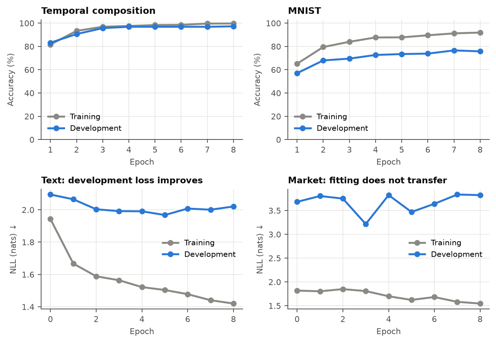
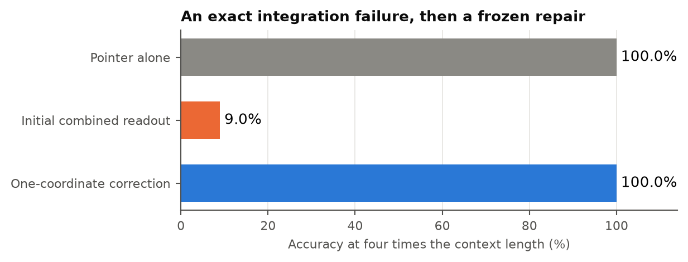
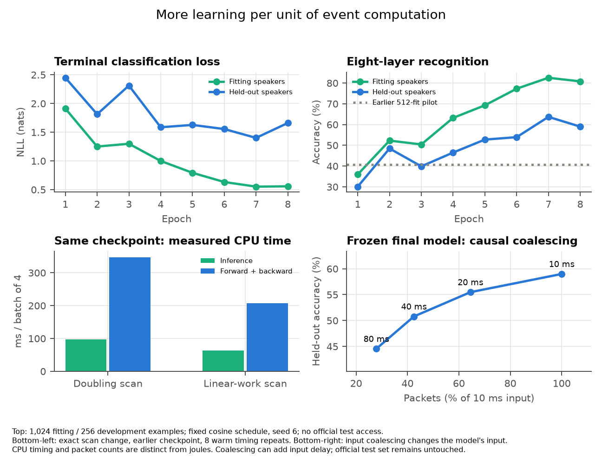

# Sleeping Machines

Learning and computing through timed messages · 29 September 2026

A Sleeping Machine is a network of nodes with local memory. Messages carry a vector and an arrival time. Nodes use that content and timing to remember, compare, wait, and send a new message. Competing messages race; the winner performs the computation, while losing alternatives can teach the network during training.

## The most significant accomplishments

- **Better prediction on real language.** At 10M training characters, the native predictive mixture reaches **1.613 test bits per character**, ahead of the completed LSTM (1.799) and four-layer Transformer (1.908) on the same text8 split. Lower means better prediction.
- **Learning to retrieve from far fewer examples.** Local race retrieval reaches **100% accuracy on contexts four times longer** after at most 4,000 examples in all five runs. The strongest of seven Transformer settings reaches 71.6% there after up to one million examples.
- **Deep composition with little data and work.** Native depth-four order models reach **99.9–100%** after 10–15k examples in five runs. A separate shared-motif task averages **99.65% from one pass**, at roughly **10,000× lower counted work** than its Transformer reference.

Language: completed held-out test scores, one seed, shared data splits but different model sizes, schedules and expert resources. Retrieval and composition: controlled synthetic tasks. Counted event operations and dense multiply-adds are different work units; these are not measured energy ratios.

**Why this matters:** the evidence supports a route to intelligence that learns useful structure from less experience and spends computation on selected events. The next challenge is to combine those strengths in one scalable architecture. That synthesis now has a working eight-layer implementation and cross-task results.

## 1. What the results make possible

The opportunity has three parts: learning from fewer examples, avoiding unnecessary arithmetic, and retaining useful computation as context and depth grow. Each has a concrete experimental foothold.

| Capability | Completed evidence | Practical significance |
| --- | --- | --- |
| Prediction | Text8: E79 1.808 / 1.613 test bpc at 1M / 10M training characters. | Local predictive memories can compete with much larger learned dense models in these comparisons. |
| Retrieval | E61: perfect 4×-context recall in 5/5 runs by 4k examples. | A learned query-to-memory rule can preserve its meaning beyond training lengths. |
| Composition | E54: 99.9–100% depth-four order recognition after 10–15k examples. | Learned parts can be reused through a hierarchy rather than relearned for every combination. |
| Periodic computation | E41: 99.4–99.9% unseen modular triples, training on 30% of tuples. | An appropriate temporal representation can discover a reusable rule instead of storing examples. |
| Event world models | E57: within 0.08–0.19 nats/event of its Transformer reference at about 1/3000 counted work. | Predictive state can be maintained cheaply on real streams; the Transformer is more accurate. |

### The common idea behind these results

Information often arrives in bursts, with long stretches when little changes. A useful pattern may depend on which signal came first, what followed it, and how long the gap was. Local state and learned delays let the network express those relationships directly. A successful route can remain reusable across many examples instead of being reconstructed through a full dense calculation each time.

### How to read the claims

- **Established comparisons:** the language, retrieval and synthetic-composition results above belong to their named prototypes and protocols.
- **New architecture evidence:** the shared model has small development runs across eight task families. Its results are described separately below.
- **Potential:** frontier-scale quality, a better scaling law, and lower total training energy are the larger objectives. They require further measurements.

The arithmetic prototype includes a provided rhythm resource. Its success does not imply that every event architecture will learn arithmetic. New AWS relative-time Transformer controls also reach near-perfect accuracy on timing/composition tasks; the large counted-work distinction remains the relevant result there.

## 2. One architecture, separately trained for each task

The tasks do not share a training objective or a set of weights. They share an implementation: local temporal memory, vector messages, delayed hard races, stable depth, and a query readout. Each task has its own encoder, outcome space, memory contents and fitted parameters.

### What has been brought together

- **Deep event representations:** eight bounded residual layers carry information and learning credit. A layer evaluates three delayed choices and emits only the winning vector and delay.
- **Conditional evidence:** sparse context tables learn local outcome counts or event counts per exposure time. A learned feature-dependent readout combines their evidence.
- **Learned retrieval:** a hard pointer chooses a source and relative destination. Losing alternatives receive local mistake credit; the forward answer uses the winning pointer.
- **Task-appropriate supervision:** categorical labels supervise a completed query; event prediction uses the likelihood of the next mark and waiting time, including the observed silence.

### Causality is part of the interface

Language and market queries receive only an explicitly observed prefix. Future tokens and future gaps are targets, never inputs. This matters because learned delays can reorder arrivals: processing a whole sequence and attaching a next-token loss to an older delayed carrier can otherwise leak future information.

This first implementation replays each prefix independently. It processes sparse event packets but does not yet retain a persistent online queue across queries. Small vector maps and query output scores remain dense. Native hold/veto detectors, periodic phase computation and learned event cancellation still need to join this shared core.

Implementation: sleeping_machines/shared_event.py, event_memory.py, event_query.py, evidence_memory.py, objectives.py and readout_calibration.py. Theory §§176–180. E118/E119 remain compatible entry points.

## 3. What the shared model does today

All new runs use the same eight-layer, width-32 core and independent task weights. The new tasks run for eight epochs. Speech uses the existing trained checkpoint after an exact implementation-extraction audit. These are development screens, not new full-scale comparisons against Transformers.

| Task | Neural fit / dev | Final development result |
| --- | --- | --- |
| SHD speech (preserved) | 1,024 / 256 | 151/256 = 59.0% final; 63.7% best epoch |
| Text8 | 2,048 / 256 | 2.915 bpc; 41.8% next-character |
| Market events | 512 / 256 | 3.823 nats/event |
| Associative recall | 512 / 256 | 100% at standard and 4× context |
| Temporal composition | 1,024 / 256 | 249/256 = 97.3% |
| MNIST | 1,024 / 256 | 194/256 = 75.8% |
| Event-camera gestures | 88 / 44 | 26/44 = 59.1% |
| Modular arithmetic | 1,473 / 256 | 6/256 = 2.3% |

### What transfers

The common core learns temporal composition, image recognition and event-camera prefix recognition. Its speech checkpoint preserves all 256 checked predictions. Learned retrieval survives the synthesis after repairing an unsupported count feature. Text prediction improves from 3.022 to 2.915 development bits per character in the small run; the full E79 language mixture remains a stronger, separate result.

### What the screen reveals

Market fitting improves while development likelihood worsens. Modular arithmetic does not generalize. Those results identify work for the common architecture: control the interaction between evidence and neural corrections, and incorporate the earlier periodic computation mechanism. Additional depth alone has not supplied every specialist's useful representation.

One seed per screen. Text memory: 32,768 characters fitted separately, then 2,048 neural queries; dev is a 256-character slice of the text8 validation region. Market: bounded trade prefixes on disjoint days. Recall: an additional 4,000 examples fit the pointer memory. MNIST: 2×2 pooled training-set images. Gestures: only the first second, 88 fit / 44 held-out-user examples. SHD holds out training speakers 3 and 6. No official real-data test set is used by E120. Exact protocols and IDs are saved in each result JSON.

## 4. Learning curves expose the remaining gaps

Temporal composition reaches 99.7% fitting accuracy and 97.3% development accuracy. MNIST reaches 91.9% and 75.8%, respectively. Useful features and credit reach the eight-layer core in both tasks. The difference between fitting and development performance still matters.

The market curve separates optimization from generalization: fitting NLL falls to 1.546 nats/event, but development NLL ends at 3.823. Its fixed evidence baseline scores 3.670. Removing the additive neural head after training improves development NLL to 3.549 while retaining the deep-feature evidence gate. On text, that same frozen deletion improves NLL from 2.020 to 1.942.

These deletions are diagnostic interventions, not retrained controls. They motivate a matched test of how much freedom the evidence gate and additive head should have. The arithmetic screen instead points toward missing structure: 11.9% fit and 2.3% unseen-tuple accuracy after eight epochs, versus 5.9% chance. The earlier rhythm model's success has not yet transferred.

Evaluation losses use the same task objective throughout each curve. A reduction in training loss alone is not evidence of better prediction on new data. These small runs do not estimate scaling laws.

## 5. A concrete failure found and repaired

A perfect retrieval component initially became unreliable when placed inside the shared model. At four times the context length, accuracy collapsed from 100% for the pointer alone to 9.0% for the combined model. The failure was in how the new readout handled a feature it had never learned to use.

### The cause, in plain terms

Every training example had the same length, so the count feature never varied. The standardizer divided by a tiny variance floor anyway. A longer input then became a 1,299-unit normalized feature, which produced random, untrained score contributions as large as 79. Those scores overwhelmed the correct answer from memory.

### The decisive check

With every learned weight frozen, removing only that unsupported count contribution restores 256/256 correct longer-context answers. Standard-context accuracy remains 100%. A fresh training run with the corrected calibration also reaches 100% on both lengths. The failed run is retained.

### What we learned about synthesis

Combining successful components requires preserving the conditions under which each generalizes. A new branch can override a correct answer through an unidentified parameter direction. The new rule uses fitting data only: static count metadata that never varies cannot acquire an arbitrary extrapolation effect. Variable-count calibration remains unchanged.

E120 frozen readout audit; theory §179. This repair preserves the demonstrated retrieval rule. It does not show that the deep core independently learned that rule.

## 6. The theory is becoming an engineering guide

| Question | Current understanding | Design consequence |
| --- | --- | --- |
| Can information survive depth? | Conditional bounds control the whole event sequence and its payload credit when routing is fixed. | Use bounded residual carriers; check route changes and readout conditioning separately. §§166–170. |
| How do losing routes learn? | Detached alternative payloads and delays can provide score credit without being emitted. | Keep hard forward computation; account for the extra alternatives evaluated in training. §169. |
| How is silence supervised? | Event likelihood includes the integrated hazard over the observed waiting time. | Credit predicted event counts minus observed counts; no label at every time tick. §178. |
| What is optionality? | Useful reserve consists of distinct, attainable future corrections under a causal work budget. | Measure reachability and transfer; entropy or noisy same-sample improvement is insufficient. §§159–163, 171–172. |
| Why did recall break? | Constant training metadata leaves a readout direction unidentifiable. | Project unsupported static count dependence; retain a longer-context contract. §179. |
| Why does arithmetic need more? | For three uniform modular operands, any two are statistically independent of the label. | Test higher-order features and restore trainable periodic state. Depth alone is no guarantee. §180. |

### What is proved, and what experiments must establish

The formal work supplies expressivity results, local credit identities, conditional stability bounds, and counterexamples that expose implementation errors. Attention-like retrieval is expressible through the event formalism under its stated assumptions. This provides a design space; it does not prove that an optimizer will discover every useful computation efficiently.

The next proofs and measurements should meet: identify a missing representation or credit direction, derive an intervention, then test its predicted effect. The exact scan audit and count-feature repair are examples of that process. The full derivations remain in experiments/THEORY.md and its thematic notes.

## 7. Potential: the capabilities now coming into reach

The ambition is a model whose useful capacity can grow without waking all of that capacity for every observation. The results already show several parts of that possibility: strong predictive mixtures, reliable selective retrieval, efficient temporal composition, and a trainable deep event core.

### Components that can become useful first

Predictive memories can support compact stream models and compression. Learned retrieval can provide an addressable store whose rules work beyond training context lengths. Temporal composition can recognize sparse patterns in sensor and industrial streams. The shared implementation creates a practical way to improve these mechanisms together while fitting a separate model for each application.

### A reusable event-to-decision module

A strong asynchronous recognizer would accumulate evidence from sound, event cameras, touch or telemetry and answer when confidence is sufficient. Such a module could become a common building block for mobile perception and monitoring. The new speech and gesture results establish learning in small deep models; the next capability is reliable, calibrated early decisions on complete benchmarks.

### Training efficiency creates capability, too

Less work per update can buy more data, more depth and more useful experiments from the same budget. The exact scan improvement already reduces audited forward/backward CPU time by 1.68× for the speech core. The larger prospect combines cheap updates with better sample efficiency: each joule and each experience would produce more learning. Training, inference, search and memory maintenance all belong in that accounting.

### The immediate research payoff

The project now has a common place to test whether a mechanism improves multiple kinds of computation. A correction to causal querying, memory, depth or credit can be exercised across domains without rebuilding each model from scratch. The value of unification is both scientific and practical: it exposes which advantages are general and which need an additional primitive.

## 8. If the full architecture succeeds

If the architecture combines frontier predictive quality, reliable deep learning and lower total training and inference cost, it would provide a new foundation for frontier models. The potential transformation is in how intelligence uses computation, memory and experience.

### Frontier models and the economics of training

A fixed power budget could train a more capable model, explore more architectures or sustain more specialized models. Large training facilities could produce more capability per unit of electricity and capital. Smaller teams could enter areas previously constrained by compute budgets. If sparse communication and persistent state determine cost, hardware and infrastructure design would increasingly optimize those operations. The best use of GPUs, other accelerators and new event hardware would follow the measured workload.

### Autonomy within a mobile power budget

Robots, vehicles, phones, wearables and remote instruments could maintain context continuously, react quickly to important changes and learn locally from experience. Large memories could remain available while only the relevant portions participate in a decision. The resulting capability is sustained perception, memory and adaptation where battery life, heat and connectivity constrain today's systems.

### Industry and science

Factories and infrastructure could host many local predictive models that detect changes, diagnose faults and update from new operating conditions. Instruments could choose informative measurements, track rare events and control experiments with short feedback loops. Rich temporal models could work close to the source of data, making intelligence a routine part of equipment and processes.

### A different scaling regime

The most consequential outcome would separate total useful capacity from the work needed for each decision. A growing repertoire of memories and skills could stay mostly dormant, with difficult situations recruiting more computation and straightforward ones resolving quickly. Establishing that regime requires jointly strong quality, affordable search, stable learning and measured resource savings. The existing accomplishments make this a concrete research program with several working foundations.

## 9. The next decisive work

| Priority | Experiment or implementation | What would count as progress |
| --- | --- | --- |
| Preserve specialist strengths | Integrate trainable phase state and native hold/veto composition; retain retrieval length contracts. | Shared model inherits the earlier arithmetic and composition generalization under matched protocols. |
| Improve evidence coupling | Train matched evidence-gate and additive-head controls for language and market; use separate selection and evaluation data. | A gain on unseen data over the fixed evidence bank, not merely a lower fitting loss. |
| Advance real event recognition | Scale SHD and gesture training with fixed speaker/user splits; calibrate confidence and time-to-answer. | Repeatable accuracy/latency gains; one final evaluation on the official test split after selection. |
| Make prefixes incremental | Maintain pending messages and local state across queries; enforce query closure without future leakage. | Equivalent predictions with less repeated prefix work, including scheduler and memory costs. |
| Establish scaling and energy | Use AWS for larger matched runs; profile both training and inference on declared hardware. | Quality versus total joules, memory, latency, data and capacity, including candidate search and credit. |

### How experiments are kept safe and independent

Local runs use one guarded job at a time, a memory watchdog, a timeout and at least 8 GiB host memory reserve. The E120 runs peaked below 0.5 GiB process RSS. The AWS sibling retains ownership of its existing larger benchmark queues; the shared-model handoff uses separate tags and outputs.

### What a strong final demonstration would contain

One architecture, trained independently on each task, should preserve the specialist wins and improve real-stream prediction and recognition. It should show how quality changes with depth, data and capacity, and how total resource cost changes with them. That would connect the current task-level advantages to the larger frontier-model claim.

## Appendix A. Deep speech recognition and execution

The eight-layer speech model reaches 151/256 (59.0%) at the final epoch and 163/256 (63.7%) at the best development checkpoint after fitting 1,024 utterances for eight epochs. Fit accuracy is 80.8%. The official SHD test set was not used. An earlier controlled-width comparison reached 40.6% with eight layers versus 25.4% with one layer; the deeper model had more parameters and used more work.

The linear-work memory scan preserves the audited predictions and gradients. At the earlier frozen checkpoint, scan combines fall 5.49×; median one-thread CPU inference improves 1.52× and forward/backward computation 1.68×, excluding optimizer updates. Sorting and small dense vector maps remain.

E119: one seed, training speakers 3/6 reserved for development. Best and final checkpoints are different endpoints. The 20 ms coalescing point saves 35.5% of input packets and loses 3.52 accuracy points on the frozen final model. Timing and counted work are not measured joules. E120 confirms exact logit/gradient/winner equivalence on an audited batch and preserves 151/256 after extraction.

## Appendix B. Evidence and reproduction

| Report claim | Primary repository evidence |
| --- | --- |
| Language comparisons | results/e79/race_mixer_D… JSON; results/e64 LSTM and Transformer test JSON. Completed AWS controls remain under results/aws_20260929. |
| Retrieval and context transfer | results/e61/event_K32_n8.json and tf_K32_n8*.json; E120 recall and frozen count audit. |
| Native depth / composition / arithmetic | results/e53, e54, e34 and e41; Transformer controls in e36 and AWS results. |
| Market world model | results/e48, e52 and e57. These full-day protocols are separate from E120's bounded development prefixes. |
| Shared model screens | results/e120/*.json: configuration, split identities, curves, component deletions, work and memory counts, hardware and source hashes. |
| Speech / exact scan | results/e118 and e119; e120/shared_contracts_20260929.json. |

### Metric definitions

- **Bits per character (bpc):** average negative log probability in base two. Lower means better next-character prediction.
- **Negative log-likelihood (NLL):** prediction loss. For event streams it scores both the next event type and waiting time, including the absence of events before arrival.
- **Counted work:** a declared count of event operations, candidates, scans or multiply-adds. Different operations can have different hardware costs.
- **Energy:** total measured joules over a stated boundary. It is not interchangeable with a work count or CPU time; E120 has no joule measurements.

### Where the detail lives

experiments/SHARED_MODEL.md describes the common model, benchmark coverage, safe commands and AWS handoff. experiments/THEORY.md indexes the derivations; experiments/FINDINGS.md retains the chronological research record. report/archive/20260929_before_shared_model.md preserves the previous long narrative.

Run report/make_pdf.py through the guarded queue to rebuild this PDF and REPORT.md from the same editorial source and completed result files. Run ./commit_done.sh from the host checkout to stage the completed source, JSON evidence, figures and report; checkpoints and logs stay excluded.

Scope: one common backbone and optional evidence/retrieval modules, independently trained per task. The synthesis is partial: it does not yet incorporate every historical primitive or rerun every historical configuration. Official full-scale cross-domain comparisons and continual-learning evaluations remain outstanding.
