# Sleeping Machines

A general-purpose architecture that computes with time

Tero Keski-Valkama and Karoliina Salminen · Research report · 3 October 2026

## Our ambition: a universal learning substrate

**One architecture for content, time and selective computation.** The ambition is a broadly capable learner that combines language, dense synchronous observations and sparse asynchronous streams, including their joint arrival into shared persistent state. Statistical memory, deep learned representations and Transformer-capable retrieval belong to the same family. Time performs computation; hard routes learn from unrealized alternatives; small messages mix incoming content with private memory; keys and values remain distinct. Useful stored capacity can exceed the work recruited for an observation.

## Already partly demonstrated

- **Statistical prediction.** Completed count/copy race language comparisons are competitive with strong counting and dense references. Counts are particularly strong where evidence supports local statistics; this is family evidence, not a result of the native deep learner.
- **Learned temporal computation.** Deep event chains, temporal rules, persistent vector representations and counterfactual route credit have completed positive tests, with their task boundaries and negative confirmations retained in this report.
- **Native language at 10M.** The depth-8/payload-32 route-credit model scores 2.326 test bpc versus the saved one-pass Transformer's 2.427, at the same T256 evaluation window. The wider depth-4 model scores 2.183 versus the one-pass LSTM's 2.171. Single seeds, differing training segment lengths; the count reference remains stronger.
- **A Transformer-capable function class.** Delay-coded aggregation reproduces deterministic softmax attention under its stated conditions (theory §105); the broader event family has an in-principle emulation path. The current native streaming candidate does not yet implement the complete Transformer-equivalent stack.

## The opportunity and the remaining bridge

**We know of no mathematical obstruction to this architectural direction.** The research question is whether native learning realizes this breadth efficiently at scale. Expressivity alone does not guarantee optimization, generalization or lower total resource use. Joint multimodal learning and comparable-quality large-data advantage remain to be demonstrated.

Race selection has the exact softmax winner probabilities, but one winning value matches attention only in expectation; subsequent nonlinear layers do not generally commute with that expectation. Exact delay-coded aggregation instead pays deliveries, normalization, latency and precision. Roughly halving attention aggregation arithmetic is a conditional inference opportunity, not a demonstrated halving of complete-model inference. The completed approximately 49.66% saving concerns replay fitting work, a separate result. The target is better prediction at a fully counted resource budget (§§280,317).

## Current language evidence — 3 October 2026

**The integrated native learner now reaches 1.955 bpc at the controls’ T256 test window.** The saved one-pass LSTM scores 2.171 and Transformer 2.427. These are completed single-seed comparisons; replication and large-data advantage remain open.

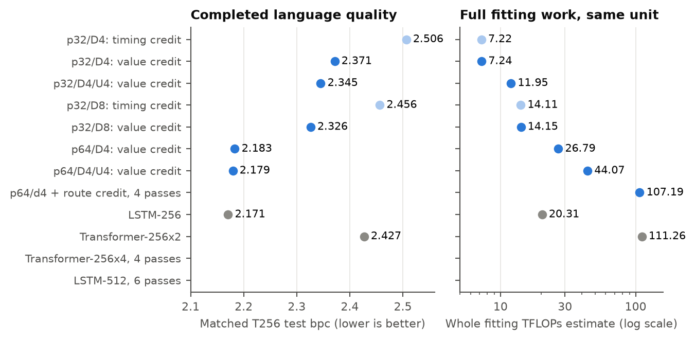

Blue: native temporal races, sparse addressed persistent writes and learned messages; light blue: timing-only route credit. Gray: saved dense controls. Same text8 test[95M:96M], T256 evaluation, nominal one-pass 10M fitting budget, 1,220 updates. Native training samples random segments; order differs from the controls. Work is traced/extrapolated for native and shape-estimated for controls. Both panels use the same denominator for every model. Full resource table is in the native appendix.

### The gains are about learned routing and useful capacity

- Value-informed categorical credit improves p32/D4 by 0.135 bpc with about 0.3% extra counted fitting work. The successful rule keeps hard forward choices and messages unchanged.
- At eight selected writes per position, doubling p32 slots improves 2.371→2.345 bpc. Fitting work rises 1.65×; unchanged selected activity is not unchanged total cost.
- The credited depth-8 model reaches 2.326 versus 2.456 without that credit. The gain survives a deeper stack; width, initialization and capacity still need controlled comparisons.

The best native model is 0.216 bpc ahead of the LSTM, using 107.19 versus 20.31 estimated fitting TFLOPs. This is substantial progress, not comparable-quality superiority in total resources.

## Learning diagnosis and the next decisive checks

### Keep the successful value credit; withdraw failed write credit

The earlier fast law taught the winner’s content and first-time clocks without an explicit alternative-value choice term. Adding that term helped both depth-4 and depth-8 language models. Stored-memory write credit diverged. Written-only credit trained stably but worse at pool2 and also diverged at pool4, so it is withdrawn. Removing lazy transport from the coefficient was insufficient; memory norms, cotangents, timestamp/seen effects and feedback remain to be measured.

### Inference arithmetic is promising; the practical boundary is wider

Winner-only inference computes selected proposals and refreshes their cached stored-memory key reads. The saved shape traces give 0.163→0.164 MFLOPs per input position when p32 capacity doubles, and 0.605 for p64/D4. All keys are scored. Every call still stacks all unit matrices; copying, extra cache state and wall time are outside these arithmetic counts. Small float64 output contracts passed; actual trained float32 winner/state/cache parity and full rescoring remain pending. The reported test scores use the compiled training evaluator, not a completed sparse-backend rescore.

### AWS depth-8 replay: supported online progress, a separate protocol

| Ongoing fitting arm | Latest interval online bpc | Cumulative online bpc |
| --- | --- | --- |
| Private full replay | 2.794892 | 2.978605 |
| Private teacher | 2.847557 | 3.013845 |
| Depth-shared teacher | 2.887824 | 3.041100 |

Saved matched checkpoints: 1,003,520 targets / 3,920 Adam updates; latest interval[753,664:1,003,520]. Full replay’s interval lead is 0.052666/0.092933 bpc. Identical fitting-data hash/exposure; single seed, changing parameters and no asserted RNG pairing. Full replay costs much more learning work. These are training predictions, not completed heldout scores or useful-depth/iso-FLOP proof.

### Prioritize discriminating evidence

- Complete current multi-pass/width and queued tied-pool/seed comparisons. AWS90M pool4 has started after 15 contracts and its throughput pilot; completed90M quality is pending.
- Prepared, unrun trained-FIT factorial checks separate message effects, private commit effects and their interaction at fixed first time/future noise.
- Calibrate optional write credit against unexplained value utility; check shared scales, feedback and actual updates before another fit.
- Datacenter serving: a prepared worker reuses one packed matrix stack. Standard-library lifecycle checks pass; trained parity, measured runtime and quality rescore remain pending. Snapshot/setup/residency costs are charged.

Theory143–146; DATACENTER_VALUE_MILESTONES.md. No proof of a mathematical barrier or general supremacy; neither follows from this evidence. Counts remain strong references in their established region. Current gains retain time as computation, hard-route credit, deep persistent state, separate keys/values and capacity beyond selected activity.

## Deep learning that computes with time

Messages carry content and an arrival time. Nodes mix incoming vectors with persistent memory, gate their updates and compete through learned delays. Arrival order and winning races determine the computation. The goal is useful intelligence with much less active work.

## The differentiators at a glance

- **Time performs computation.** Delays, races and phase transformations implement useful functions.
- **Hard routes can learn.** Winning messages execute; unrealized alternatives receive counterfactual credit.
- **Deep, persistent event representations.** Vector messages and local memory carry information and credit through layers; retrieval and temporal primitives share the model family.
- **Capacity beyond activity.** The scaling goal is more useful dormant capacity, selectively recruited and judged by prediction quality at a given total work budget.

## The strongest demonstrated results

- **Generalization.** Race retrieval reaches **100% at four times the training context** within 4,000 examples in all five runs. A learned phase rule solves **all 3,440 unseen modular triples**, using the supplied period 17.
- **Learning from fewer examples.** Depth-three event chains reach **99.73–99.93%** after 2,000 examples seen once; saved Transformer controls reach **33.25–40.80%** with the same number of distinct examples and repeated fitting. Depth-four chains reach 99.9–100%.
- **Learned representations.** Completed temporal-carrier development screens reach **2.572 bpc at 131K** and **2.210 at 1M fitting characters**, four passes. A learned speech encoder reaches **79.69%** on 512 private development utterances. Embeddings, temporal state and vector maps learn. Calibration: closed-form Kneser–Ney counts of the same fitting data score 2.349 / 2.007 bpc on the same targets and lead these small-data comparisons. They are strong references where local statistics are well supported; architecture advantage requires practical headroom (§§376,393–394).

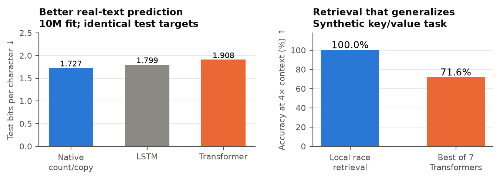

Left: means and recorded ranges, five event runs and two Transformer runs; 2,000 distinct examples, seen once / presented 400,000 times. Right: all five event runs reach 100% within 4,000 examples; the control is the best saved result across seven Transformer configurations and their learning curves. These synthetic tasks use different architectures and structural priors. Sources: E53/E36 and E61.

## New evidence: quality and complete work

**Tabular: competitive accuracy, no confirmed win.** Ours averages **91.8%** reserved-test accuracy versus **94.0%** for boosted trees across three seeds. Logistic regression reaches **94.7%** and lower log loss (**0.091** versus ours **0.235**). The native eight-block model mixes content and memory through parallel temporal receiver heads.

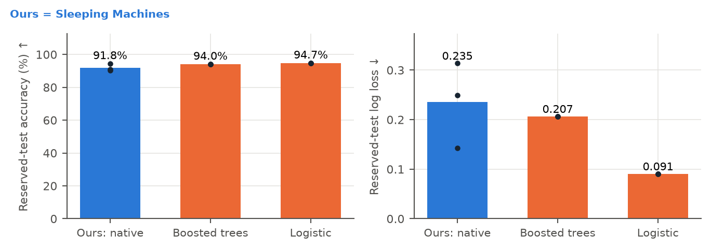

Means and individual seeds6/7/8 on281 reserved rows (270 feature groups). 128 fitting/128 development rows; four fixed selection opportunities. Accuracy uncertainty includes zero difference, but does not establish statistical equivalence. The original development lead, 95.3% versus 93.0%, is retained in Appendix B. CatBoost seed8 was stopped without a score; full confirmation is incomplete. Tree FLOPs are unavailable and CPU fits are faster; no resource advantage over trees is established.

**Statistical memory where counting is strong (10M characters).** On the same999,999 test targets, ours count/copy race mixture scores **1.727bpc** versus **1.799** for LSTM and **1.908** for Transformer; closed-form counts alone (untuned mkn, order 7) score **1.788**. Here counting statistics are near-optimal and the dense controls sit at their level; learned models overtake them only with far more data and parameters (Theory §§381, 394). Our statistical memory therefore adds a useful information path on top of near-optimal counts. It is not the learned native model. Capacity and fitting budgets differ. Appendix B charges floating mixing work and reports integer table work separately.

**Work between two learned language models.** Ours native2K uses **3.78 whole-fit GFLOPs** versus **22.75 GFLOPs** for the saved KV2K construction: **6.02× less counted work**, at 3.765 versus 3.733 development bpc (0.032 worse). Both use four passes and 8,191 scored development targets; width, capacity and memory construction differ. Complete CPU fitting traces include counterfactual learning and Adam. This compares two learned models with each other. Near-optimal count references for this small-data regime are shown in Appendix B as calibration (Theory §§393–394).

**Learned native language at 10M, one pass (THEORY §413).** Alternative-value credit (forward values unchanged) improves the integrated native core from **2.507 to 2.370** test bpc at the same size. More width reaches **1.955** (T256 1.955) versus **2.171** for LSTM-256 and **2.427** for Transformer. Winner-only trace: **0.60** versus 0.68 MFLOPs/position; fitting 2.68 versus 2.03 MFLOPs/character. Traced/estimated conventions differ; single seeds, more work than LSTM, trained sparse parity pending. The native appendix retains every arm and failed write credit.

**Native data scaling.** The same 54,907-parameter construction improves from **3.765 to 3.557 bpc** when fitting data grows from2K to8K characters, using **15.12 whole-fit GFLOPs**. Both use four passes and the same 8,191 development targets; this is one-seed completed data-scaling evidence.

This banknote comparison concerns one task. Strong synthetic order/retrieval evidence on the preceding page remains valid under its own protocols. Appendix B retains the full cross-domain comparisons and resource ledgers.

## Native strengths: useful time and private state

**Elapsed time carries useful information.** Ours reaches **95.31%** on paired short/long sequences with identical marks, addresses and event order but opposite labels. The refitted order-only control reaches exactly **50%**; paired noise makes that ceiling exact. Clearing persistent state also reduces ours to 50%.

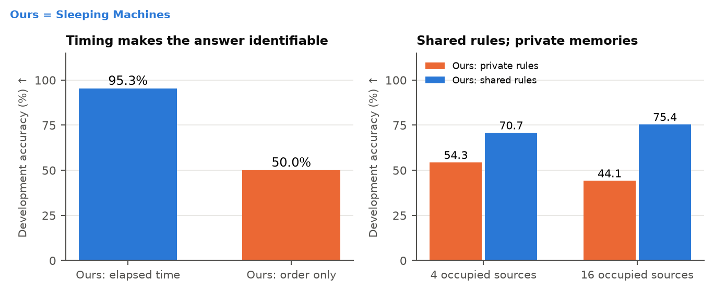

**Learning can be shared while memories stay private.** At 16 occupied sources, shared processing raises accuracy from **44.14% to 75.39%**, with **11.1× fewer parameters** and **6.6% less whole-fit work**. All 512 receiver slots remain available; each event commits 16 states and scores 32 keys in both constructions. Sharing also removes private source embeddings; these effects are tested together.

| Construction | Dev accuracy % | Parameters | Whole fit GFLOPs | Fit/query MFLOPs | Infer/query MFLOPs |
| --- | --- | --- | --- | --- | --- |
| Ours: elapsed time | 95.31 | 42,898 | 0.265 | 0.518 | 0.110 |
| Ours: order-only control | 50.00 | 42,898 | 0.265 | 0.518 | 0.110 |
| Ours: 16-source shared rules | 75.39 | 14,180 | 0.262 | 0.511 | 0.110 |
| Ours: 16-source private rules | 44.14 | 157,940 | 0.280 | 0.548 | 0.110 |

Eight blocks, two independent heads, d8, pool 2; 128 fitting queries/pass, four passes, 256 development queries, seed 6. Timing uses 32 independent population pairs; 16-source order uses 16 populations. Exploratory population-bootstrap gains are 45.31 pp [42.97, 47.66] for time and 31.25 pp [25.39, 37.11] for shared rules; 95% intervals condition on selected checkpoints, not independent seeds or confirmation. Complete counted fitting includes losing proposals, backward, clipping and Adam; special functions have unit weight. These are synthetic mechanism advantages, not superiority over time-aware dense models or measured energy.

Sources: [frozen11-pilot protocol](experiments/AWS_SPLIT_EVENT_BATTERY.md) and [validated findings](experiments/SPLIT_SCREEN_FINDINGS_20261002.md). Full variants and gap-retention diagnostics remain in Appendix B.

## A general architecture for content, time and selective activity

Language tokens, irregular observations and action requests can be expressed as content-bearing events with timestamps and source identities. Sleeping Machines aim to learn through this common interface: local state evolves between arrivals, delays perform computation, and only recruited modules act. This broader design is the central research target.

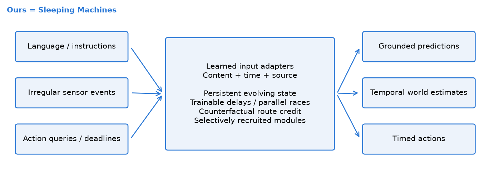

## Why this could matter across domains

- **Ordering as computation.** Earlier events change the state/routes encountered by later ones; elapsed time changes that state. The structured order-learning results support this prior for sequence-sensitive signals.
- **Asynchronous sensing.** Updates can follow observations and required deadlines rather than a periodic sweep of all modules. Silence remains informative when the objective depends on waiting time.
- **Instruction-conditioned control.** Language can guide event routing and memory; observations can ground language and update a world state that informs timed actions.
- **Useful dormant capacity.** Stored modules need not all execute for each input. The gain depends on economical discovery and credit, and is judged at a fixed total work budget.
- **Distributed hardware.** Local event-triggered state and communication can reduce global coordination. Globally clockless ASICs are a target; conventional FPGA prototypes retain clocks. Hardware joule savings remain to be measured.

## What is established, and what is next

| Ours: family evidence | Completed result / scope | Next generality test |
| --- | --- | --- |
| Temporal reasoning | 99.73–99.93% event-order accuracy; five runs, declared structured task | Unseen delays, gaps and concurrent streams |
| Deep learned context | 3.121 development bpc; sparse six-block / 32K fit; eight-block models also train | Matched-quality work and capacity scaling |
| Auditory events | 79.69% on 512 private development utterances; selected temporal encoder | Aligned official-test real-stream comparison |

Joint multimodal learning and robot reliability remain research targets. Existing results use separately trained variants; native language uses 27 character pools. Sparse routing motivates tabular prediction: paired delays can represent feature thresholds (theory §323). Preserve feature IDs and avoid invented row order. Trees and tabular Transformers remain controls. The banknote screen leads the original trees; broader superiority requires the stronger-control confirmation.

## The research upside: five routes to useful advantage

The investment thesis is a trainable substrate with a known useful workload and broader capability beyond it. Reproducing relevant Transformer quality and convergence with lower whole-system energy would already be valuable. Temporal expressivity, selective capacity and cross-modal integration offer additional, independently testable upside.

| Strength | Potential benefit | Evidence needed |
| --- | --- | --- |
| Temporal races and local state | Less digital normalization and value aggregation; a path to globally clockless hardware | Matched-quality full learning/inference, precision, throughput and measured system joules |
| Evolving state and reused matches | More useful transformations per expensive match; potentially smaller models | Width/depth/data sweeps at fixed quality and complete work |
| Capacity beyond activity | More specialized stored representations without executing all modules per observation | Improve quality as capacity grows; keep discovery, teaching and execution budgets economical |
| Common content/time interface | Language-guided sensing and event-grounded reasoning/control in a shared model | Joint held-out modality combinations, task success and causal deadline tests |
| Native learning during use | Adapt delays/routes/content locally on an event ASIC; reduce external trainer traffic | CPU online: 3.191→3.096 bpc; asynchronous on-chip credit/updates remain untested |

## Quantitative scenarios, with conditions

- **Compression.** At equal quality, half the width would give one-quarter projection arithmetic and roughly half the matching/state work. This compression is unproven.
- **Energy scenario.** Assume baseline shares of 40% compute, 40% memory, 10% clock, 10% fixed. Halving compute/memory energy, removing the clock and adding 5% control gives 45% savings (1.82×). These are assumptions, not a chip forecast.
- **Dormant units.** H2 stores 864 receivers and selects 16 updates/character (54× capacity/activity). Teaching evaluates 32 receiver alternatives and admitted historical values; shared maps execute. This is not a 54× resource saving.

## Why this is a research program worth testing

Multi-run structured learning/generalization, temporal algebra and deep trainable event representations provide starting evidence. The current language fits have not established a matched-quality resource advantage. Optimizer, width/head/data scaling and repeatability tests address that gap. Theory §320 proposes repeated Poisson arrivals that reuse matched keys without resetting all losing clocks.

Current autograd, global clipping and block-window Adam do not demonstrate fully asynchronous learning. That needs dependency/version-aware credit and tested updates. On-chip learning has precedents ([Intel Loihi 2](https://www.intel.com/content/dam/www/central-libraries/us/en/documents/neuromorphic-computing-loihi-2-brief.pdf)); the proposed contribution is the complete temporal/sparse-credit construction. Compare competent synchronous learning ASICs and charge gradient/optimizer traffic. See HARDWARE_VALUE_PROPOSITION.md and EVENT_STREAM_ADVANTAGE_PROTOCOL.md.

## The hypothesis: more capability per unit of active work

Sleeping Machines combine trainable delays, temporal races, evolving local state and counterfactual credit. The hypothesis is that these mechanisms can approximate useful attention with less selected arithmetic and value movement, then use richer temporal computation and dormant capacity to reach comparable quality with smaller models or less fitting. A common content-and-time event interface can support tokens and irregular sensor streams, with task-specific adapters and losses. Existing cross-task models train separately; the integration target is language-guided event routing and shared state: events ground language and both inform actions. Shared-weight multimodal learning remains a further milestone.

A softmax race samples exactly from its distribution. One winner does not equal its weighted average. Averaging m independent winners has mean-square error variance/m; approximate Transformer containment also requires historical coverage and stable propagation through depth. Temporal state permits additional computations beyond this attention analogue.

## Matched attention work: retain all query/key matches

Let d be total width, L depth, N historical keys, r the feed-forward expansion and B = (8 + 4r)d² the shared projection/content work per layer. S is extra evolving-state work per layer. Two FLOPs per multiply-add:

| Per token / target | Transformer | Ours: race substitution |
| --- | --- | --- |
| Inference | L(B + 4Nd) | L(B + 2Nd + S) |
| Training, approximate | 3LB + 12LNd + 19P/U | 3L(B + S) + 10LNd + 20P/U |
| Logical value reads (FP32) | 4LNd bytes | 4Ld bytes |
| Logical key + value reads | 8LNd bytes | 4L(N + 1)d bytes |

P is updated parameter count and U targets per Adam update. The race training term includes admitted losing-value credit; it is not winner-only training. Our normalization of accumulated gradients adds one operation per updated parameter. Shared embeddings/output and lower-order operations are added in the plotted scenario.

## What would make the case decisive?

- **Matched-quality efficiency.** Repeated completed comparisons of full fitting work and inference work.
- **Capacity beyond activity.** More useful stored modules with nearly fixed routing and execution budgets.
- **Temporal expressivity.** Reuse expensive matches for distinct cheap races and evolving-state responses; test whether this reduces required width or depth.
- **Common event interface.** Tokens, irregular sensors and instruction-conditioned control can use content-and-time events. Real-stream, joint-reasoning/control and hardware-energy advantages require their own benchmarks.

This is a research hypothesis and an architectural comparison, not a frontier-language or measured-energy claim. Current deep sparse learning and structured-task results establish meaningful mechanisms; compression and broad language advantage need further evidence.

## Expected architectural work and access scaling

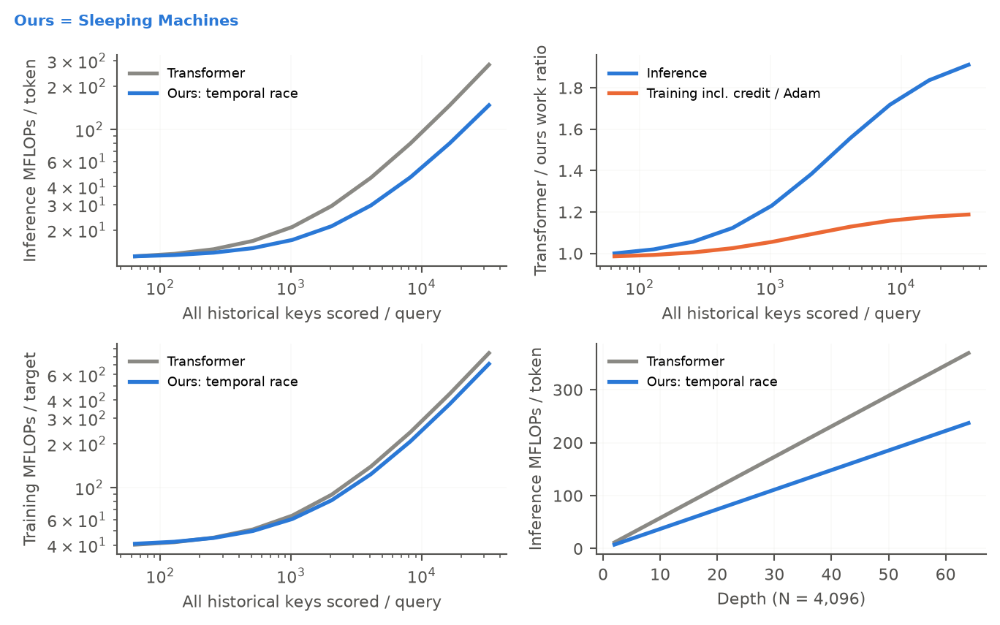

Scenario: d = 256, four heads, r = 4, U = 128 and S = 128d per layer. Context plots use L = 8; the depth plot scores N = 4,096 keys. All keys are scored in both models. Both retain linear context and depth terms, and quadratic width terms. At fixed width, the attention-only arithmetic limit is about 2× at inference and 1.2× during counterfactual training; common projection work lowers these total-work ratios. If richer temporal computation reaches the same quality at width αd and depth βL, projection work scales by βα² and context work by βα. Those additional savings require matched-quality evidence.

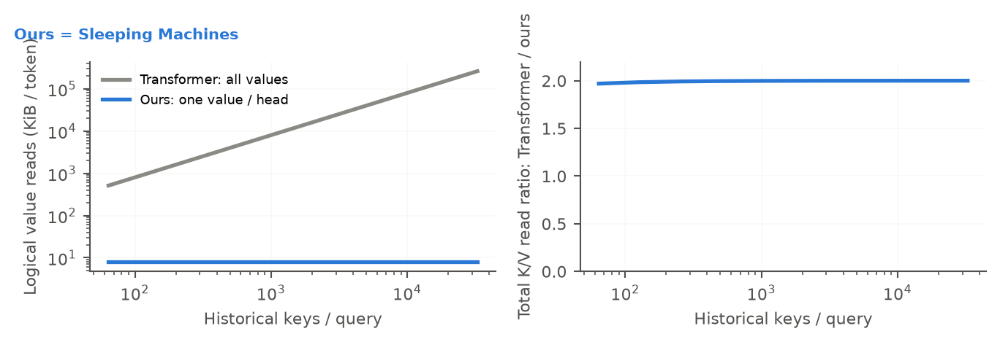

Winner-only retrieval reduces logical value reads by N in this one-sample scenario. Including the key reads, total K/V access improves by at most about 2×. These counts are logical accesses, not measured off-chip transfers, cache behavior or joules. Multiple winners increase value reads. Explicit digital probability normalization is avoided in a physical race, but clock circuitry and rate setting still have costs.

Shared content/projection structure isolates the attention substitution; this is not a quality-matched fit of our current receiver model. Additional receiver-alternative teaching, indexing and scheduling must be charged when present. Bounded candidate search is a separate coverage hypothesis. See theory note 48, §§313–323; measured quality/work curves remain in the appendix.

## Why this research matters

Sparse neural computation promises to spend work only where information changes. The hard part is teaching useful deep representations when routes can be silent, discrete or absent. A cheap forward pass is insufficient if discovering those routes consumes the savings.

| Research lineage | What it established | The question we pursue |
| --- | --- | --- |
| Neuromorphic and spiking networks | Event-driven signals and trained spike timing; EventProp differentiates at events. | How do inactive alternatives receive useful credit without exhaustive replay? |
| Temporal logic and learned delays | Race/delay algebra computes with time; delay learning already improves SNN recognition. | Can temporal computation coexist with rich vector content and deep learned state? |
| Sparse conditional models / MoE | Selected experts allow capacity to grow faster than active work; Switch trains at scale. | Can message timing, communication and correction work also become selective? |
| Asynchronous state-space models | EventSSM learns asynchronous streams with parallel scans; this is a strong precedent. | Can hard races and counterfactual alternatives add quality per unit of total work? |

### What is distinctive here

We combine computation through trainable time, content-bearing messages, persistent local state and credit to unrealized alternatives. Optionality asks whether distinct, reachable future corrections remain available under a work budget. The theory connects temporal algebra, key/value separation, credit transport and supervision that includes silence. The contribution is this construction and its tested consequences; learned delays and sparse capacity are established ideas.

The integrated language candidates now exercise learned content, temporal races, sparse persistent receivers and counterfactual credit together. An eight-block variant also races historical key/value messages. These small-data experiments explore only a small part of the design space; larger-scale quality and complete resource advantages remain under test.

Our earlier deep sparse-routing pilots often lost activity and useful credit before the final layers. Counterfactual proposals alone did not reliably fix that. The subsequent vector-state and persistent-memory work addresses those observed obstacles. Completed structured-task gains motivate the larger learned-model tests; broad quality, training efficiency and energy must still be measured together.

Primary precedents: [EventProp](https://www.nature.com/articles/s41598-021-91786-z); [Space-Time Algebra](https://arxiv.org/abs/2001.04242); [Learning Delays in SNNs](https://arxiv.org/abs/2306.17670); [Switch Transformers](https://www.jmlr.org/papers/v23/21-0998.html); [EventSSM](https://arxiv.org/abs/2404.18508). Our routing failures and revised interpretations remain in the theory index and findings.

## One architecture, several learned computations

The common idea is local computation triggered by an arrival: retain memory, combine the incoming vector with that memory, and choose an outgoing time. A delay changes which messages meet and which race finishes first. This makes timing part of the learned function. The model family implements this idea at several levels of generality.

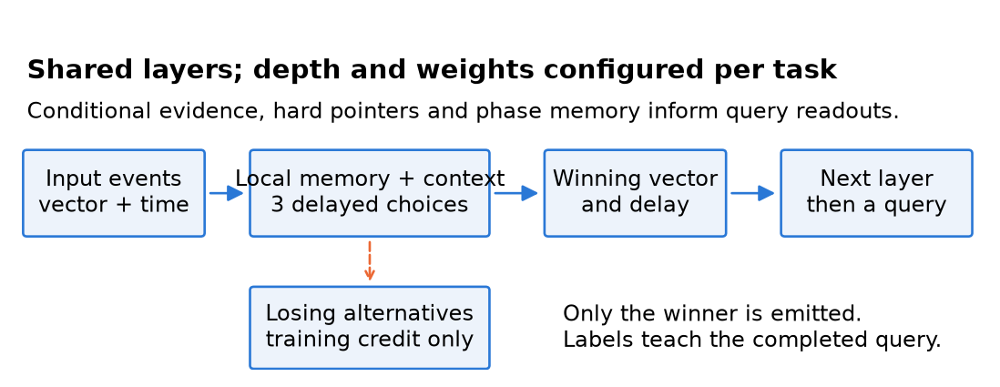

| Model | Mechanism | Evidence | What it establishes |
| --- | --- | --- | --- |
| Ours: integrated sparse temporal language | Learned content, state-dependent key races, selected receiver updates and episodic KV | Completed 32K receiver / 2K depth and KV screens | Combined mechanisms train; bounded candidate coverage and causal schedule |
| Ours: learned event-state encoders | Source embeddings, temporal modes, nonlinear vector maps and competing clocks | Language E176; speech E165 | Learned representations and persistent state |
| Ours: routed event query encoders | Candidate payloads, receiver memory and hard value/time races | Breadth E120; language E133 | Trainable event depth across tasks; text/market breadth variants add statistical evidence |
| Ours: structured event mechanisms | Temporal chains, relative pointers and phase composition | E34/E53/E54, E61, E124 | Sample efficiency and generalization with declared structural priors |
| Ours: statistical controls | Conditional counts, backoff and copy probabilities | E173; online pilot | Separate baselines; no event backbone |

**Incoming content is retained.** In the event-state encoder, an incoming vector is projected into rotating, decaying memory. A learned memory read is mixed with a direct input path, normalized and gated. The outgoing vector adds that correction to the incoming vector. The payload therefore depends on both current content and history; timing supplies an additional control.

Each task has separately fitted weights. Current learned encoders use fixed depth and locally dense vector maps; the language scheduler retains state and delayed messages across chunks. The routed query encoder instead rebuilds a supplied context per query. Clock learning uses declared surrogate credit through a hard schedule; it is not an exact derivative of every order change.

## How the model computes and learns

**Time performs computation.** An arrival time is a computational value. A delay adds to that value; a first-arrival race computes a minimum and selects a payload; coincidence detects the latest required arrival. Inhibition can veto a path. With a declared periodic reference, phase transformations compose reusable modular relations. Learned timing therefore changes the function and its causal paths, beyond deciding when a fixed dense calculation runs.

- **Local temporal memory** accumulates observed content and elapsed time without evaluating empty time ticks.
- **Computation through delays** uses waiting times, arrival order and clock races to transform information and select outcomes.
- **Hard races and counterfactual credit** choose the emitted vector and delay. Losing alternatives teach better routes while remaining distinct from the winning forward message.
- **Separate keys and values** let content-dependent keys set routes and clocks while value learning preserves the selected schedule.
- **Trainable depth** carries representations and learning credit through a hierarchy. The reversible construction preserves conditional norms under its stated assumptions; readout visibility and routing remain necessary.
- **Structured memories** include relative pointers, learned phase transformations and conditional evidence. Their task gains retain their declared priors; statistical experts are labeled separately.
- **Appropriate supervision** teaches a completed class decision or the next event's type and waiting time, including information carried by silence.

For a temporal pattern such as A followed by B, a learned delay can bring A's trace into coincidence with B. A competing path can veto the match when C intervenes. The timing-pattern and compositional experiments test these mechanisms; the language and speech encoders learn richer vector messages and temporal state.

The simulator stores arrival coordinates on a common axis; the native function uses local elapsed intervals, precedence and causal joins, not a globally ticking execution clock. A time-origin shift preserves predictions. CPU serialization and a fabricated clockless ASIC are separate implementation claims. The primitives and their symmetry limits are developed in [temporal computation theory, §56](experiments/theory/05_temporal_computation_and_scaling.md); [counterfactual learning](experiments/theory/01_foundations_and_counterfactual_credit.md), [key/value separation](experiments/theory/22_key_value_separation_and_race_boundaries.md) and [reversible depth](experiments/theory/25_reversible_event_memory_and_depth.md) give the learning contracts. Clockless delay/race networks compute relative timing relations; phase arithmetic requires its reference. Each implemented model uses a declared subset. Candidate discovery and training alternatives are charged to the work ledger.

## Useful functions from time, reception and repeated events

A dot product is a compatibility score along one direction. Projecting a message into a learned two-dimensional plane and rotating a local clock vector changes which content direction is receptive. Separate clock modes and independent heads can gate different components, then compose a new vector while retaining the incoming content. This creates content–time interactions, rather than just delaying a fixed computation.

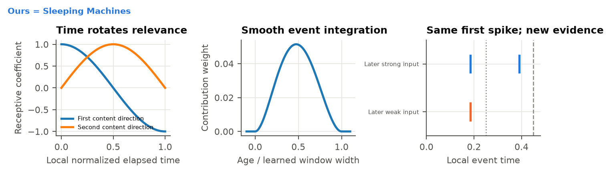

| Ours: construction | Analytical function and learning | Implementation status |
| --- | --- | --- |
| Temporal reception | Content dot a rotating learned direction; exact ordinary phase/projection gradients within a route history | Full native candidate; two/four-mode fits and same-clock waiting control |
| Learnable integration window | Compact smooth kernel; exact membership gradients; five moment vectors, no silent-time ticks | Primitive contracts passed; full-model integration remains |
| Information-bearing train | Same first spike, different later evidence, distinguishable train readout; exact fixed-count gradients | Closed-form event solver and train/window contracts passed |

Parameters are useful when their interactions preserve relevant information, reach the readout and receive adequate credit and exposure. Consecutive affine maps can fuse into one; gated products and temporal state create new interactions. The appropriate mode count or local rank is determined by marginal held-out quality per complete work, not by maximizing parameter count.

The figure is an analytical construction, not measured model performance. Hard destination changes and spike creation/deletion still require boundary or counterfactual credit. More emissions are charged; no biological rate-code or free-energy claim. Theory §§337–352 gives the proof, costs, timing-noise limits and frozen/refitted ablation protocol.

## The ambition: useful capacity without proportional activity

The proposed shift is to compute through event timing and selectively active paths. A larger network should be able to retain more useful dormant structure while spending work on the paths a query needs. Counterfactual credit must teach those hard choices, including useful alternatives that did not win. The earlier temporal-chain, pointer and phase results test parts of this case and remain central evidence.

### What temporal softmax actually provides

If candidate clocks have rates exp(score), their first-arrival winner has exactly the softmax choice probabilities. Competition supplies normalization in time. It can avoid an explicit normalizing sum/division in the winner path when those rates are physically available. Score formation, candidate discovery, value delivery and learning still cost work. This identity is not a measured near-zero-energy attention system.

| Ours: mechanism | Completed evidence or status | What remains |
| --- | --- | --- |
| Temporal chains / hard pointers / phase rules | Strong structured-task accuracy, transfer and work comparisons | Transfer the useful priors to broad learned representations |
| Temporal content carrier | Learned embeddings, state, gates and delay-dependent transport | Every layer executes; does not demonstrate dormant-unit scaling |
| Integrated sparse temporal model | Hard races, content memory, sparse state updates and counterfactual teachers pass contracts | Scaling quality and complete learning work are under test |
| Capacity beyond activity | Gains depend on useful sparsity and learning | Measure marginal useful capacity with bounded active work |

### A direct mechanism experiment

The native candidate combines the mechanisms: an addressed content/time event enters eight blocks with two independent receiver heads, selecting one persistent content-bearing unit per head at each depth. Separate state-dependent keys set rates; the winner mixes incoming content and retained memory, then emits a vector and learned arrival time. Addressed losing values receive counterfactual score credit during training. The dense carrier and carrier-plus-retrieval variants remain diagnostic controls.

Observed-source pools and fixed depth are declared priors; learned topology growth and unrestricted asynchronous schedules remain open. RNG and physical traffic are additional. The old time-normalized value sum has a shared random amplitude; its covariance and cutoff claims are corrected beside the original theory, not silently deleted. A centered, conserved teacher is now tested. Its fixed-error expected Jacobian is not an unbiased sampled-loss gradient. Theory §§294–298: experiments/theory/45_race_attention_and_resource_identity.md.

## A native path to more capability per unit of work

The next integrated experiments test what this substrate does naturally: learned time computation, sparse addressed memory and hard choices trained through counterfactual credit. A derived gated-state kernel accumulates ordered interactions without enumerating past pairs; learning useful such representations is the target. Episodic race attention remains a useful preserved comparison; the native branch does not require a per-position attention bank.

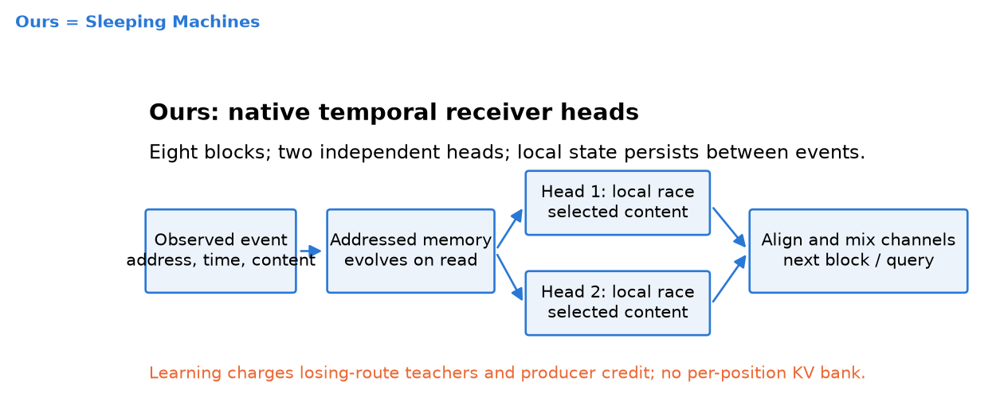

| Ours: native construction | Exact activity boundary |
| --- | --- |
| S observed sources; L blocks; H heads; P candidates | Available receivers: S × L × H × P |
| One selected receiver per head/block | Selected state commits per event: L × H |
| All addressed candidates are scored | Key scores and training proposals per event: L × H × P |

Useful capacity can grow while selected activity stays fixed, but its value must be learned. At a fixed data budget more local maps receive fewer examples. Sharing learned maps while retaining separate state is one way to improve learning exposure; the native language adapter tests this directly. It changes capacity and is a whole-construction comparison.

Analytic state evolution avoids periodic simulation during silence. Decay can still erase information, so long-gap accuracy is measured separately from operation count. A protected-content subspace alongside evolving time modes is a derived next hypothesis, to test if the current construction loses useful memory.

The current eight-block/two-head/pool2 model selects 16 commits and scores 32 keys per event. Shared maps, content transforms, losing proposals, backward, Adam and source-local causal waits remain paid. The ordered kernel is a restricted algebraic identity, not an achieved capability of the fitted model. Full-depth contracts and accounting smokes pass; quality pilots, refitted controls and independent seeds determine further scaling. Theory §§330–336; completed results and the executable priority appear in Appendix B.

## Useful old evidence: a completed joint-learning intervention

Protected outcome state and two learned key/value races reach 96.09% on new suffixes, versus 78.12% with matched local-credit training. The query suffix and its actual count inputs are identical within each opposite-label group. Predicting the distant relation therefore requires additional observed evidence.

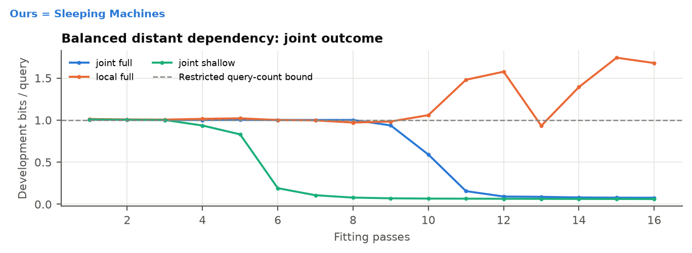

Reserved loss:0.102 versus 0.750bits/query. All1,024 fitting presentations, complete prefix and optimizer work charged: 0.2379 versus 0.2319GFLOPs estimated. Joint training teaches the loss of candidate pairs; inference delivers only two values after scoring all occupied keys. Initial models and inference mechanisms match.

Shallow joint reaches95.31% at 0.1534GFLOPs. This task supports protected evidence and terminal joint learning; useful extra core depth is not established. Earlier native/tapped fits and frozen readout failures remain in the appendix.

Unchanged seed7/8 confirmation: 0 of2 declared joint-versus-local gates pass. All four arms and delivered-value interventions are reported separately in the appendix; the new suffix set does not select settings.

One fitted seed,128 reserved synthetic queries. Observed predecessor addresses are fixed; terminal content-risk derivatives are exact conditionally, earlier native route derivatives remain scoped. The bound concerns query-count inputs, not all counting. No natural-language or iso-quality resource superiority is inferred.

## Ours: the integrated sparse temporal language experiment

This candidate has no dense language carrier. Each event mixes its embedding with the previous deep message and traverses contextual key races. Only selected receivers update their persistent rotating/decaying state and emit values. Time is part of the computation; inactive receivers are not evaluated on empty ticks.

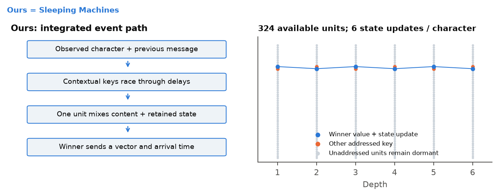

The first six-depth, 16-dimensional candidate provides 324 units but updates only six states per character. Each depth scores two addressed keys; training additionally evaluates both candidate values to teach hard choices. Unaddressed pools remain dormant. The capacity experiment doubles available units to 648 while retaining six selected state updates. Key scoring and counterfactual work still grow and are charged.

Checks establish causal predictions, identical chunked execution, precise clocks at 10M positions, equality of training forward values and winner-only inference, learned key/value/memory gradients and conserved route credit. The smoke fit learns, but is not a quality benchmark. Completed data, depth and memory interventions test progress before larger promotion.

A matched payload-32 / 2K depth screen improves 3.633 to 3.542 development bpc from six to eight receiver blocks, for 32.6% more fitting work. The current eight-block KV variant adds historical races, giving sixteen selection steps after warmup. Fixed data/passes/seed do not isolate depth from increased capacity; this is exploratory evidence, not a scaling law.

Fixed observed-character pools, bounded delays and six sequential event depths; no learned topology or complete frontier-language claim. Interior arrival-time derivatives and counterfactual score surrogates have distinct scope. FLOPs include teaching alternatives and optimizer work; representative sparse traces do not certify whole-run instruction or energy counts. Theory §§299–302; source: sleeping_machines/sparse_race_language.py.

## Ours: queries, memory and context

Race attention specifies how a candidate wins; memory organization specifies what the candidates represent. The integrated language model races between compressed persistent receivers. It does not replace a Transformer token KV cache entry for entry.

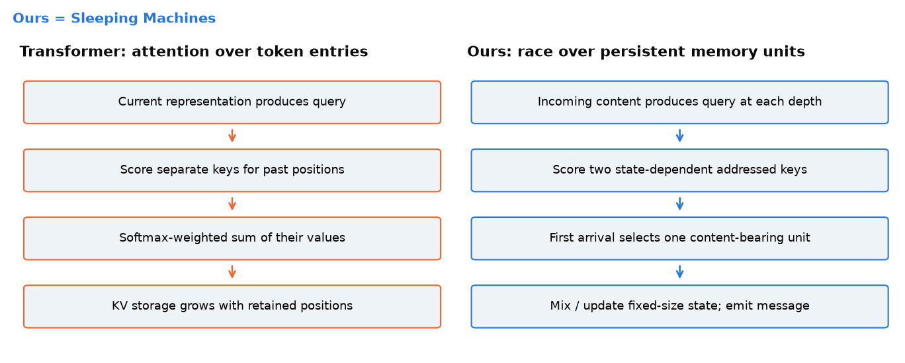

At each depth, a learned map turns the incoming message into a query. A candidate key combines its learned prototype and a read of its retained state. Query–key compatibility sets an exponential clock rate; the first arrival wins with the corresponding softmax probability. The observed character addresses two candidates per depth. Queries cannot search arbitrary past-token keys in this construction. Winner-only delivery also differs from a deterministic softmax-weighted sum, although its one-step expectation equals that sum.

| Model / storage formula | Raw state / one stream | Forward history |
| --- | --- | --- |
| Ours: width 16, 324 states + clocks + last message | 22.84 KiB | Carried until stream reset |
| Ours: width 32, 324 states + clocks + last message | 43.16 KiB | Carried until stream reset |
| Transformer: conceptual FP32 KV, 4 layers × 256 positions × width 256 | 2,048 KiB | At most 256 characters |

The raw width-32 state is about 47× smaller than this conceptual KV allocation and does not grow with history length. This is a storage-formula comparison, not matched recall capacity or measured total RAM: ours compresses history, whereas KV entries retain separate position-addressable representations. The saved Transformer actually recomputes windows without an implemented KV cache. Its 256-character window is a model setting, not an intrinsic dataset limit. Ours retains forward state beyond its 16-character training-credit horizon.

Ours raw bytes = 324 × (4d + 8) + 4d; conceptual Transformer KV bytes = 2 × 4 × 256 × 256 × 4. Excludes weights, gradients, optimizer, activations, object/index overhead and traffic. Long-range recall and comparable-quality memory advantages remain to be measured. Recurrent compression resembles the memory organization of selective state-space models (Mamba, Gu & Dao, arXiv:2312.00752); our hard temporal races and counterfactual route teacher are separate mechanisms. Compression is not required by races: a separate integrated per-position KV experiment retains historical entries and tests sparse value delivery. Theory §§308–310.

## Ours: completed integrated-language stages

| Ours: fit / payload / pool | Development bpc ↓ | Fitting GFLOPs ↓ | Capacity / selected states |
| --- | --- | --- | --- |
| 32,768 / 32 / 2 | 3.106 | 110.09 | 324 / 6 |
| 32,768 / 16 / 2 | 3.121 | 29.88 | 324 / 6 |
| 8,192 / 16 / 2 | 3.398 | 7.49 | 324 / 6 |
| 8,192 / 16 / 4 | 3.426 | 14.15 | 648 / 6 |

These are the integrated model stages, with identical cold development targets. Each character selects one unit at each depth; addressed alternatives teach the races. Capacity and selected activity are different counts. The fitting ledger includes counterfactual values, backward, clipping and Adam.

Quality, data efficiency and work must be judged together. Completed earlier carrier results remain preserved. Comparing these models also changes payload size, capacity and truncated credit, so a score difference does not isolate one mechanism. No official test or energy measurement is implied.

One seed; observed-character index; no statistical expert. Whole-stream candidate scores, selected updates and teaching visits are recorded. Arithmetic is a representative saved-parameter extrapolation; sparse optimizer activity depends on the actual input and credit history. RNG, indexing and memory traffic are separate. Source: experiments/results/parallel_language/local_full_sparse_language_*.json.

## A demonstrated advantage: generalization with less work

The retrieval and phase computations preserve useful rules when the evaluation extends beyond the fitting examples. The saved compact Transformer and LSTM controls use the same synthetic evaluation targets. **Higher and further left is better:** more accurate answers from less estimated inference work. All points use one logical operation ledger.

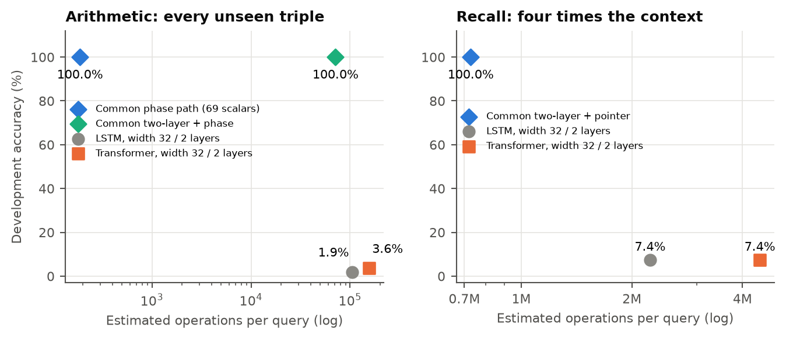

| Ours: event computation | Held-out capability | Estimated work per query |
| --- | --- | --- |
| Periodic path; 69 learned scalars | 3,440/3,440 unseen triples | 188 logical operations |
| Two-layer carrier + hard pointer | 100% at four times context | 728,602 logical operations |

The phase rule costs 188 logical operations per triple; the saved LSTM and Transformer cost 104,518 and 155,592 and score 1.95% and 3.60%. At four times the recall context, the event encoder plus learned pointer scores 100% at 728,602 operations; both compact controls score 7.42% at 2.24M and 4.46M operations. The phase model receives a periodic representation with period 17, and retrieval has a pointer mechanism. These useful priors explain the task advantage and are part of what must transfer to harder tasks.

**Learning work is also selective.** The periodic teacher makes 29,003 mistaken-example updates and 145,015 learned-scalar update visits. The dense arithmetic controls make 4,800 Adam steps: 92.2M parameter visits for the LSTM and 132.5M for the Transformer. These count parameter updates, excluding optimizer state and backward arithmetic; they are not training FLOPs or joules.

Arithmetic: 1,473 fitting triples, a 200-epoch budget, all 3,440 unseen triples; supplied period 17. The phase-only path stops after 47 passes, when an entire fitting pass makes no updates. Recall: 4,000 pointer-fitting examples plus 512 neural-fitting examples; the dense controls receive all 4,512 examples for eight epochs. Width 32 and two generic layers where present, seed 6, one small dense setting. Work is an analytic logical-operation estimate, including configured vector maps, routers, scans, normalization, clock candidates and pointer search. These inference counts are not measured joules or backward/optimizer counts. Full work definitions appear in the evidence appendix.

## A demonstrated advantage: learning temporal structure

Event chains learn timing patterns and compose recognizable parts into ordered structures. The preserved five-run results show accurate recognition and strong sample efficiency. The right panel compares distinct examples rather than incompatible activity counters.

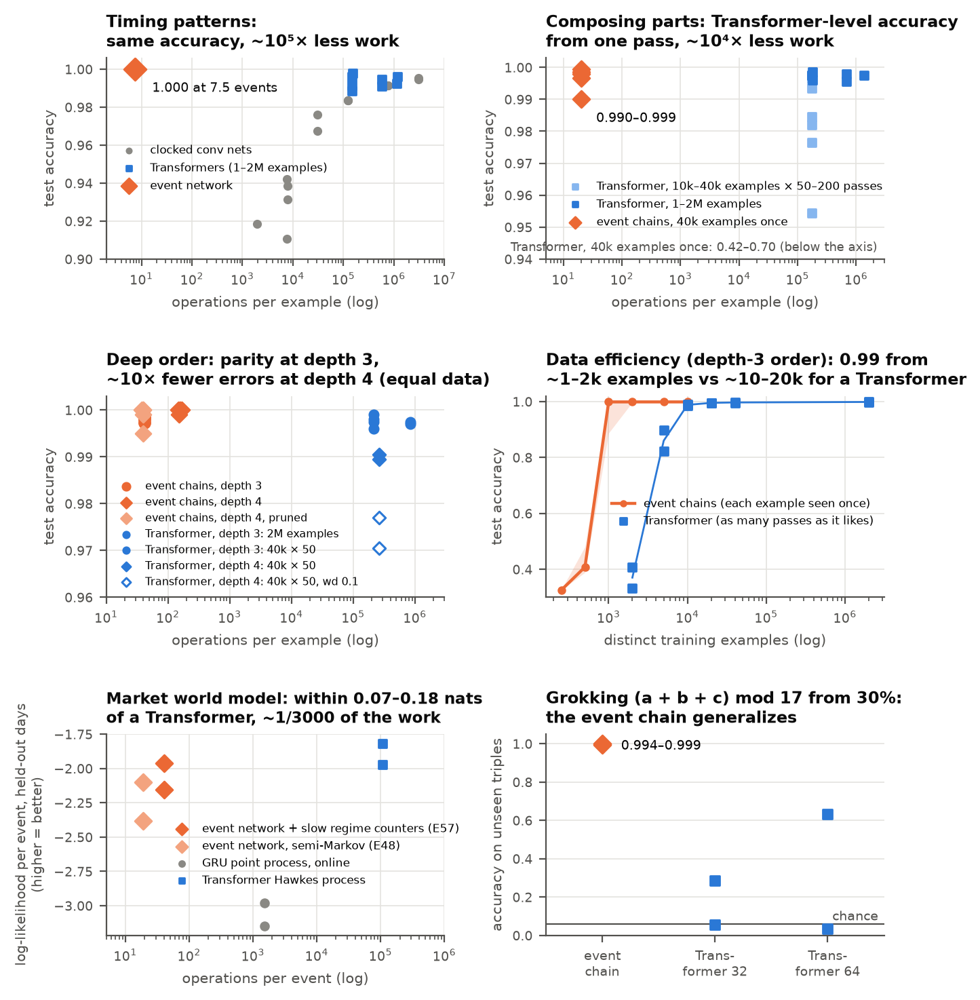

| Preserved comparison | Ours | Transformer | Fitting protocol |
| --- | --- | --- | --- |
| Timing patterns | 99.95–100%; five runs | 99.60–99.80%; two runs | 200k examples once / 1M with relative-time bias |
| Shared-motif composition | 99.00–99.93%; five runs | 99.60–99.85%; two runs | 40k examples once / 1M with relative-time bias |
| Depth-four order | 99.90–100%; five runs | 98.95–99.05%; two runs | Same 40k distinct examples; one pass / 50 passes |
| Depth-three order at 2k examples | 99.73–99.93%; five runs | 33.25–40.80%; two runs | One pass / repeated fitting on the same 2k examples |

The strongest depth-four comparison has approximately ten times fewer classification errors despite the event learner seeing each fitting example once. The sample-efficiency curve makes the next question concrete: can learned embeddings and broader event representations retain that advantage when the inputs no longer supply known temporal parts?

Completed E35, E34, E53/E54 and E36 files. Ranges describe the recorded runs, not confidence intervals. Architectures and optimization differ; synthetic evaluation sets were reused during research. Event deliveries remain activity measurements. Total arithmetic, backward and optimizer work require a declared ledger; activity divided by dense MACs is not a training-cost or power ratio.

## Why asynchronous, sparse computation matters

Persistent local state can retain experience without repeatedly reconstructing a whole history. An asynchronous node updates when useful information arrives. A hard race emits one chosen message. These mechanisms create a path to spending less computation and moving less data per useful answer. On an event-oriented processor, inactive nodes and communication links could remain idle.

### Spend the next unit of work where it helps

A larger budget can buy a longer memory, better retrieval, a deeper representation for difficult inputs or more local adaptation. The development rule is to measure the held-out improvement from each choice and allocate work to the most useful one. The phase and pointer results show why an appropriate computation can be much cheaper than a generic dense approximation. The scaling program tests how much of this flexibility survives when that computation must itself be learned.

| Architecture | Fitting known sequences | Generating or processing a stream |
| --- | --- | --- |
| LSTM | Gates depend on prior hidden state; recurrent work is sequential | Retained hidden state; dense gate updates per token |
| Transformer | Causal attention permits sequence-parallel fitting | Sequential token generation with a key/value cache; adaptation is possible |
| Ours: Sleeping Machines | Affine event memory supports parallel scans once incoming values/times are known | Retained local state and delayed-message queue; only due arrivals execute |

Parallel fitting and sequential generation are compatible. The precise-clock language scan gives a 12.30× complete-step CPU speedup against serial execution of the same width-256 model, including backward, clipping and Adam. Predictions, states, gradients, chunk boundaries and causality are checked. This follows a bounded-delay schedule; arbitrary reordering networks require their own contract.

Parallel recurrent computation also appears in [linear attention](https://proceedings.mlr.press/v119/katharopoulos20a.html) and [selective state-space models](https://arxiv.org/abs/2312.00752). EventSSM already processes asynchronous events with scans. These are important controls. The distinctive hypothesis here is the combination of learned timing, sparse communication, credit to alternatives and independent compute budgets; it must earn its advantage empirically.

Primary FLOPs describe the declared event algorithm, including required vector maps, candidate computation, scans, backward and optimizer updates. Simulator padding and dispatch are separate implementation overhead. Physical power also depends on memory, queues, communication and hardware utilization. Demonstrated work savings and projected power savings are distinguished; total device joules have not yet been measured.

## A mathematical foundation for trainable computation

| Principle | What it enables |
| --- | --- |
| Stable transport through depth | The reversible packet/memory construction preserves conditional value and credit norms under its stated operator and boundary assumptions. Readout visibility, routing and optimization remain separate requirements. |
| Active communication support | Inputs need causal paths through which to interact. A context channel supplies joint information when sparse packets leave local groups disconnected. |
| Credit to unrealized alternatives | A losing payload or timing choice can show how a different route would change the outcome, while forward computation remains a hard race. |
| Periodic state as an isometry | Learned rotations/reflections have unit-magnitude occurrence derivatives. Their composition supports reusable arithmetic instead of a table of observed tuples. |
| Certified composition | Target-constrained min/max composition of phase errors certifies the fitted modular rule across all 4,913 possible tuples; exhaustive checking confirms it. |
| Natural supervised credit | Categorical and event likelihoods both credit predicted sufficient statistics minus observations. Silence enters through integrated exposure. |
| Useful optionality | Reserve consists of distinct, attainable future corrections under a causal work budget. Reachability and transferable learning matter alongside immediate loss. |
| Statistically useful credit | Expected improvement must overcome the curvature cost of fitting noise. Cross-example teacher agreement separates reproducible correction from raw gradient magnitude. |

### From mathematics to an engineering discipline

The theory connects representation, topology, clocks and optimization. Expressivity describes what a network can compute; transport describes whether information and credit survive; the objective describes what the teacher asks it to learn. These pieces must agree. The periodic certificate is one concrete case where the formal model explains and verifies a learned computation.

A common implementation makes these principles reusable across tasks. Efficient primitives can own a computation when its structure is known; a deep carrier can learn representations when it is not. The research objective is to combine this flexibility with affordable route discovery and increasingly capable models.

Formal derivations and their assumptions are indexed in the project's theory notes. Conditional stability and a certificate for a fitted rule do not establish global optimizer convergence or a scaling law. The program builds on established deep spiking and sparse conditional computation; its focus is the combination of useful temporal operators, hard causal routing and counterfactual learning. Related survey: [Direct training of deep spiking networks](https://www.frontiersin.org/journals/neuroscience/articles/10.3389/fnins.2024.1383844/full).

## Potential grounded in the completed evidence

The objective is capable models that spend computation where it improves an answer. The saved structured-task results and learned stream pilots provide specific starting points. Moving from those mechanisms to frontier prediction requires useful representations, longer context and measured quality at a fixed total resource budget.

| Opportunity | Present foundation | What would establish the larger case |
| --- | --- | --- |
| Compact prediction and memory | Persistent learned state; pointers generalize to longer contexts. | Competitive held-out language quality, retention and complete fitting/inference cost. |
| Continuous perception | Learned temporal speech representations and composition. | Full speech/vision tests and confidence-based early decisions at measured latency. |
| More useful training per budget | Structured-task sample efficiency; exact causal parallel scans. | Quality improvements at equal total fitting work, including route discovery. |
| Dormant skills and selective depth | Hard race routing and compute-allocation theory. | Learned marginal work allocation that outperforms fixed allocation on real tasks. |
| Mobile and industrial autonomy | Local state and event-triggered updates. | Device joules, memory traffic and task quality measured on deployable implementations. |

### Why the hardware and economic implications could be large

If comparable quality needs less total training and inference energy, a fixed power and capital budget can support more capable models, more research or continuous adaptation on robots, phones and instruments. Persistent local state and selective communication would favor hardware that handles message delivery, queues and memory efficiently. These are conditional consequences of measured savings, rather than savings inferred from event counts.

The near-term experiment asks where the next unit of computation helps: longer memory, richer content transformations, retrieval, depth or local learning. Held-out gains and complete work determine promotion. A successful scaling result must show that those gains continue across independently fitted sizes and budgets.

## Ours: language learning and staged scale-up

These learned models use character embeddings, gated residual content transformations and persistent rotating/decaying state. Temporal modes encode relative token distance. No statistical count, copy or word experts provide their predictions. The goal is competitive quality from a learned backbone before claiming a language compute advantage.

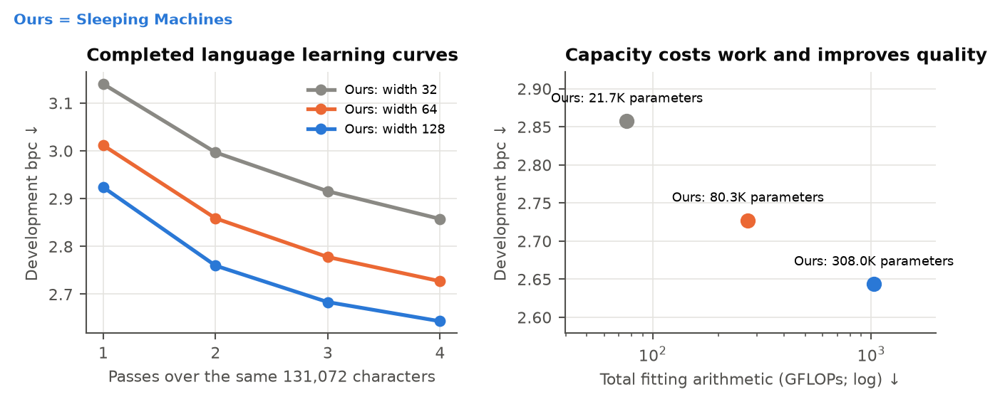

| Ours: width | Parameters | Development bpc ↓ | Total fitting GFLOPs ↓ |
| --- | --- | --- | --- |
| 32 | 21,741 | 2.858 | 76.11 |
| 64 | 80,301 | 2.727 | 272.30 |
| 128 | 308,013 | 2.643 | 1026.18 |

All curves use six layers, seed 6, 131,072 fitting characters, four passes and the same 8,191 cold-context development targets. Credit is truncated every 64 characters; memory persists. FLOPs include forward/loss, backward, clipping and Adam; special functions are reported separately in each result. These runs vary capacity at equal data/passes, rather than equal compute, and establish neither a scaling law nor official-test superiority.

### From longer memory to selective content

| Ours: memory variant | Parameters | Development bpc ↓ | Fitting GFLOPs ↓ |
| --- | --- | --- | --- |
| Constant / inherited | 308,013 | 2.643 | 1,026.18 |
| Constant / long decay | 308,013 | 2.752 | 1,026.18 |
| Constant / long spectrum | 308,013 | 2.858 | 1,026.18 |
| Input gates / inherited | 309,561 | 2.587 | 1,040.61 |
| Input gates / long decay | 309,561 | 2.627 | 1,040.61 |

Identical width, seed, data, four passes and 64-character credit horizon. Constant-memory arms vary initial timescales/frequencies. Input-gated arms add content-dependent write/forget controls (0.50% more parameters, 1.41% more fitting arithmetic). Longer decay alone worsens this fit. These are single-seed development comparisons; complete numerical contracts precede training.

## Ours: content and memory in fitted language models

An event carries information about its input. The learned vector is a transformation of incoming content and persistent state, with a residual path and an output gate. The new candidate also gates memory writing and forgetting from incoming content. These checks measure whether the fitted predictions use those paths.

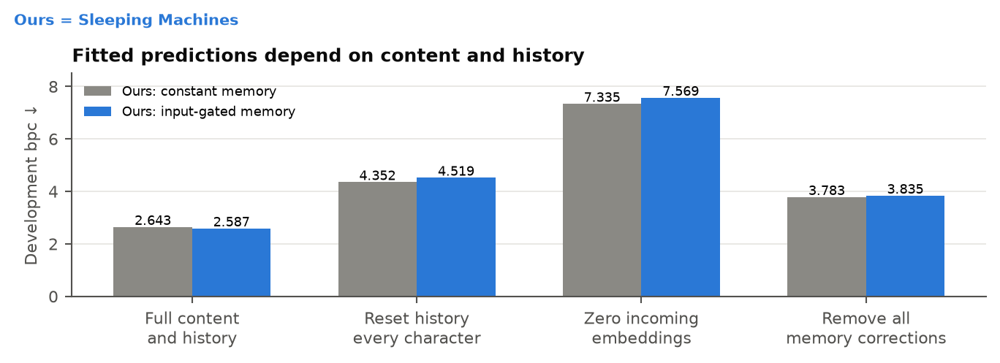

Resetting all history before each character preserves its current embedding and learned content transformations, but raises the gated model's development loss from 2.587 to 4.519 bpc. Zeroing incoming embeddings raises it to 7.569. Both present input and earlier messages contribute to prediction.

### Selective retention adds a useful control

The two input gates start at one, preserving the constant-memory model exactly at initialization. During fitting they learn different write strengths and forgetting factors for different incoming vectors. A factor below one slows decay; above one accelerates it. The controls are known from the causal previous layer, so serial execution and parallel affine scans retain their checked outputs and teachers.

In the matched small fit, gates improve 2.643 to 2.587 bpc for 0.50% more parameters and 1.41% more fitting arithmetic. This is a local quality/work improvement, with one seed. All six layers still execute for every character; dormant-unit scaling remains a separate target.

Frozen selected checkpoints, identical 8,191 cold development targets, no training or official-test reads. These interventions disrupt a trained model; they establish fitted dependence, not the quality of retrained ablated architectures or lossless storage. Source: parallel_language/local_language_representation_20260930T162337Z.json.

## Ours: larger language development stages

Each stage fits independently from initialization. Data, capacity and memory controls are declared below. Development selects weights within the fixed four-pass budget; ongoing training logs are never substituted for a completed result.

| Ours: memory / width | Fit characters | Parameters | Development bpc ↓ | Fitting TFLOPs ↓ |
| --- | --- | --- | --- | --- |
| Input gates / 256 | 131,072 | 1,208,889 | 2.572 | 4.009 |
| Input gates / 128 | 1,048,576 | 309,561 | 2.210 | 8.325 |

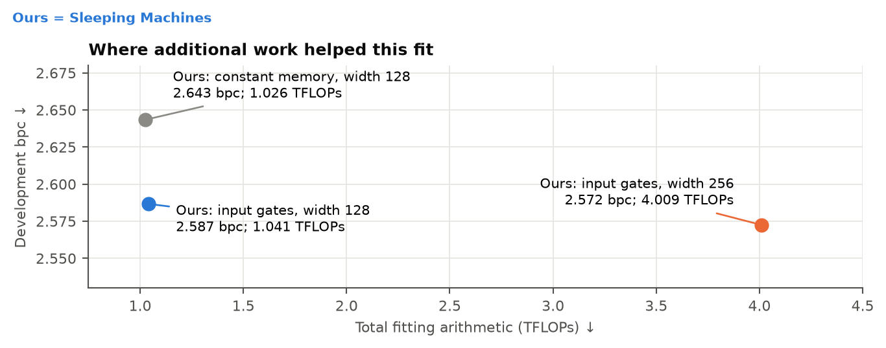

On the identical 131K-character/four-pass screen, widening the gated model buys 0.014 bpc for 3.85× the total fitting arithmetic. Adding input gates at width 128 instead improves 0.057 bpc for 1.41% more arithmetic. This makes the allocation question quantitative: measure useful correction before spending broadly on width. These are finite, single-seed interventions, rather than a scaling law.

The fixed-capacity data comparison and fixed-data capacity comparison answer different questions. Equal passes and data do not imply equal compute. The pipeline checks finite learning, trained value blocks, complete work and source provenance before promotion. A development gain is not an official-test or frontier claim.

Count reference (Theory §§376–380): on the same 8,191 development targets, interpolated Kneser–Ney counts of the same fitting characters score 2.349 bpc at 131K and 2.007 at 1M, with one counting pass and no gradient work. Every completed earlier fit without count-carrying receivers from 2K to 1M characters is above this bar. The fixed-step estimator analyzed in Theory §377 has a variance floor; this is not an impossibility theorem for learned recurrent gates or short credit. It motivates testing count-carrying receivers with escape races and a learned base measure. Counts are reference predictors, not neural controls or a large-data comparison.

Precise clocks; float32 payloads; causal persistent state; 64-character credit horizon. Special functions, evaluation passes and physical traffic are separate from the arithmetic ledger. One seed, no statistical experts. Source: experiments/results/parallel_language.

## What establishes the larger advantage

The ambition is a common model family whose strongest mechanisms remain useful as tasks, data and capacity grow. Arithmetic and retrieval retain their demonstrated strengths in the consolidated implementation. The strongest language mixture is specialized; the generic backbone still needs to demonstrate competitive learned representations. Character and subword-token budgets must be distinguished.

| Objective | Decisive evidence |
| --- | --- |
| Generic language scaling | Train a learned event backbone that owns the prediction. Scale through declared data budgets with matched Transformer, recurrent and state-space references; record loss, capacity, complete training work, memory traffic, time and joules. |
| Preserve capabilities | Repeat established generalization and sample-efficiency results within the common model family, with task-appropriate depth and explicit resource accounting. |
| Strong real-event recognition | Accurate speech and event-camera decisions on complete held-out benchmarks; calibrated confidence and time-to-answer. |
| Learn routes and representations at scale | Reliable deep credit and useful counterfactual alternatives as width, depth, memory and data increase. |
| Efficient persistent operation | Maintain local state and pending messages across queries, preserving causal predictions while reducing repeated work. |
| Lower total energy at useful quality | Measure training and inference joules, memory traffic, latency and communication under declared hardware and quality targets. |

Success on these dimensions would turn the current task-level advantages into a broader foundation for frontier models. The project's distinctive resources—timing, local memory, hard selection and credit to alternatives—remain the guide for architecture and learning.

## Appendix A. Deep event recognition

The strongest completed speech result in the model family is **79.69%** on 512 private held-speaker utterances (selected single six-block prefix; trained with twelve blocks). Published official-test results below use a different partition; they are reference targets.

| Ours: private development configuration | Correct | Accuracy ↑ |
| --- | --- | --- |
| Original eight-layer parent | 370/512 | 72.27% |
| Parent + six-block residual; pass 3 | 408/512 | 79.69% |
| Single six-block temporal encoder; pass 0 | 406/512 | 79.30% |
| Calibrated six-block continuation | 400/512 | 78.12% |
| Bounded twelve-block encoder | 400/512 | 78.12% |
| Directional twelve-block encoder | 401/512 | 78.32% |
| Selected single six-block prefix; trained with twelve blocks | 408/512 | 79.69% |

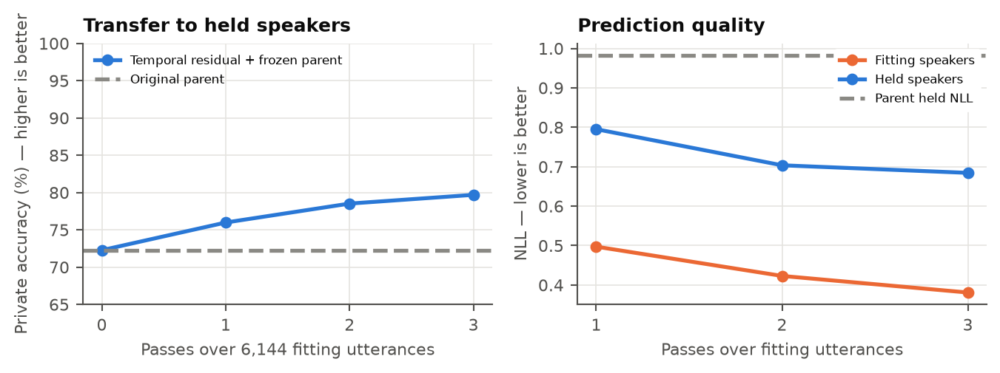

A six-block width-128 temporal encoder learns corrections while the inherited eight-layer parent stays frozen. It adds 395,814 parameters to the parent's 53,296. Signed modal states, nonlinear gates and residual vectors learn from all source identities and original event times before causal pooling. This is a larger parallel model, not fourteen sequential layers; completed-utterance supervision does not yet teach calibrated early answers. On 657 disjoint utterances from the same held speakers, accuracy improves from 70.47% to 77.63%.

| Published reference; official-test protocol | Reported accuracy ↑ |
| --- | --- |
| Ours: full official SHD comparison | Pending |
| EventSSM: asynchronous learned state-space layers | 95.9% |
| S7: input-dependent temporal state | 96.3% |

Our private sample uses training-file speakers 3/6; official test accuracy is unmeasured. The temporal residual uses three passes and a fresh optimizer; its larger capacity and budget are not a matched single-factor comparison. Its listed score selects the best private-development epoch; the curve shows all three. The original parent was fitted on 4,096 examples. Continuation timers exclude loading; the residual timer includes it. Both include evaluation and are not energy measurements. One seed. References: [EventSSM](https://arxiv.org/html/2404.18508v2), [S7](https://arxiv.org/html/2410.03464v1). These published scores were checked against the original papers; they are targets for a full official-test comparison, not scores on our private split.

## Appendix A (continued). Learned timing and transfer

**Learned delays contribute to the answer.** Restoring the hidden clocks to their initial values, with source vectors, state/value maps and the trained classifier retained, loses 13 correct answers. Timing changes the temporal interactions used by the representation; it performs computation.

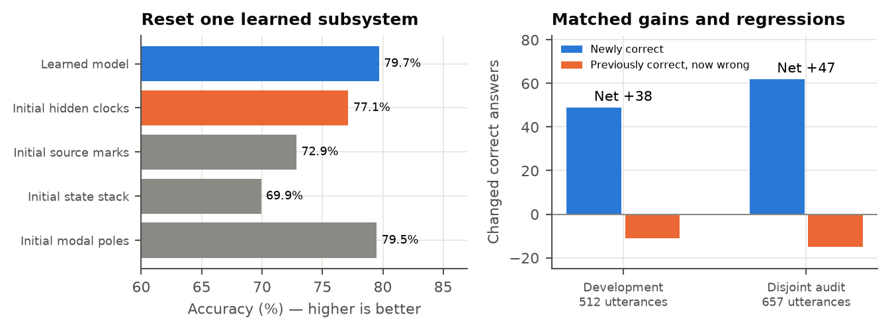

| Ours: same trained readout; subsystem reset | Correct | Accuracy ↑ |
| --- | --- | --- |
| All learned parameters retained | 408/512 | 79.69% |
| Only hidden clocks reset | 395/512 | 77.15% |
| Only source vectors reset | 373/512 | 72.85% |
| Only state stack reset | 358/512 | 69.92% |
| Only decay/frequency parameters reset | 407/512 | 79.49% |

The temporal stack and source vectors also learn useful coordinated representations. Resetting the stack loses 50 correct answers; resetting sources loses 35. Decay/frequency resets change one decision. These changes depend on the fitted solution's coordination; their effects cannot be added or treated as a matched comparison of retrained architectures.

The 657-utterance audit is disjoint from fitting and the development sample and uses the selected checkpoint unchanged. It gains 62 correct answers and loses 15, for a net improvement of 47. Both samples use the same two held training speakers. Official-test and additional-speaker generalization are the next evaluation targets.

### A stronger mathematical account of routing

An affine packet summary can preserve both the final state and the average of raw temporal states, including their teachers. This permits richer pooling before expensive nonlinear maps. A second derivation shows why many almost-equal delays may offer little usable choice: their effects point in nearly the same direction. Diverse payloads and temporal modes, sufficient delay spread and downstream visibility determine useful route reserve.

One exploratory run: 449,110 total parameters, inherited parent plus a trained six-block encoder. Three passes use about 33 minutes including preparation/evaluation and 1.79 GiB peak RSS; the guarded host retains at least 10,361 MiB sampled available memory. Complete physical work and joules remain unmeasured. Formal statements and numerical contracts are in THEORY §§226–236.

## Appendix A (continued). One temporal encoder

A six-block temporal encoder retains nearly all the combined model's development accuracy through one ordinary query head. Deployment removes the frozen parent: 395,814 parameters replace 449,110. Modal states, gated vector messages and winning delays remain. Its weights inherit earlier encoder training; combined teacher predictions are used only to initialize the head.

| Ours: private development configuration | Correct | Accuracy ↑ | NLL ↓ |
| --- | --- | --- | --- |
| Combined model: parent + temporal correction | 408/512 | 79.69% | 0.684 |
| Single encoder: clean head, before continuation | 374/512 | 73.05% | 0.818 |
| Single encoder: paired head, selected pass zero | 406/512 | 79.30% | 0.631 |
| Single encoder: selected trained prefix | 408/512 | 79.69% | 0.625 |

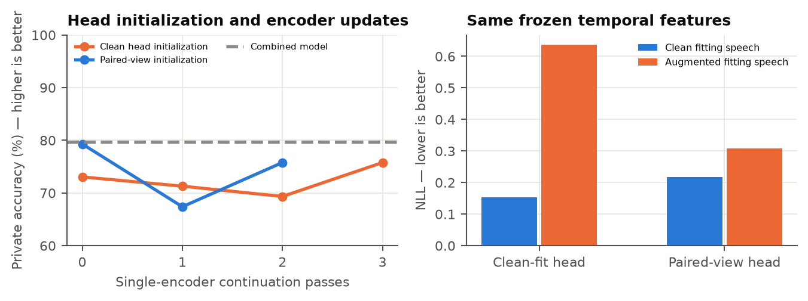

Fitting the head on clean and transformed speech improves held accuracy by 32 answers with the temporal features frozen. Its covariance penalty suppresses class-visible nuisance variation. The right panel compares the heads on the same features; the left shows all subsequent unrestricted encoder passes. The selected trained prefix reaches 518/657 (78.84%) versus 510/657 (77.63%) for the combined model on the reused disjoint audit. Audit labels do not choose the checkpoint.

Training the directional twelve-block extension, then selecting its six-block prefix on development, retains the combined model's 408 correct answers with lower NLL and 395,814 deployed parameters. The extra training blocks are removed after their learned contributions reduce held accuracy. This improves deployment quality/work; it does not establish a positive deep-block accuracy gain.

Seed 6, private train-file speakers 3/6; official-test parity remains unmeasured. Head fitting uses 6,144 unique fitting utterances: one clean view for the first arm, clean plus one transformed view for the paired arm. The arms also change regularization and use three/two encoder passes respectively, so total budgets are not matched. All continuation epochs are plotted; selection uses development accuracy, then NLL. Extra teacher/cache/head work and inherited fitting must be charged. Modal/vector maps are locally dense; no empty ticks or event-pair attention are added. The selected prefix additionally inherits the full twelve-block fitting pass; pruning does not erase that training cost. Prefix/full choice is post-hoc private-development selection. Formulae and numerical checks: THEORY §§237–264. One CPU forward evaluation takes 11.90 s for the selected prefix versus 23.71 s for the combined model. Packing/query included, loading excluded; one timing observation, not joules.

## Appendix A (continued). Making depth useful

Identity growth preserves the classifier and old teachers while added output maps receive label credit. They must also change useful features. A tightly bounded twelve-block extension learns weights but changes no audit decisions when its six appended blocks are removed.

| Ours: one matched fitting pass | Parameters | Fit accuracy ↑ | Private accuracy ↑ | NLL ↓ |
| --- | --- | --- | --- | --- |
| Six-block control | 395,814 | 90.72% | 78.12% | 0.639 |
| Twelve blocks: bounded outputs | 696,888 | 90.72% | 78.12% | 0.639 |
| Twelve blocks: directional units | 696,120 | 90.77% | 78.32% | 0.644 |

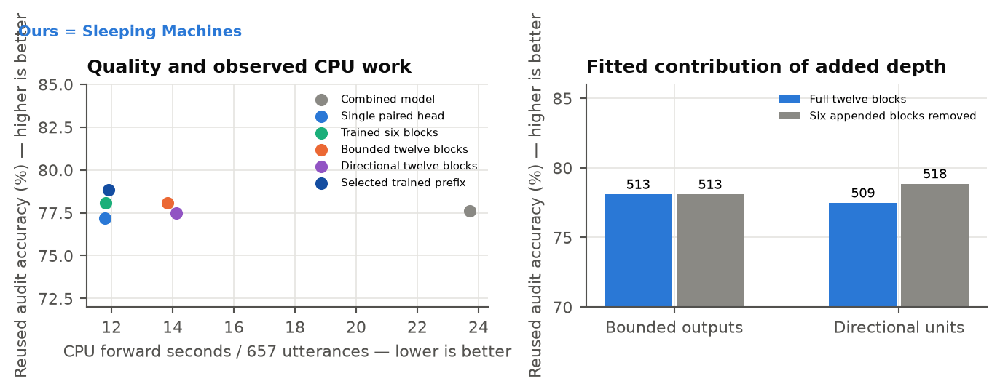

Directional conditioning normalizes temporal-state features before their output map. An invertible coordinate change rescales classifier-sensitive directions and preserves hidden null directions for later computation. The fixed transform folds into an ordinary map at deployment. Initial outputs and old teachers remain exact; fitting replays verify the actual proposed update.

The directional model reaches 509/657 on the reused audit. Removing its six appended blocks changes 11 predictions: 0 are correct only with the blocks and 9 only without them. This measures fitted contribution with the trained prefix/head retained; it is not a retrained architecture comparison.

All arms inherit the paired-head checkpoint and use 6,144 fitting utterances, the same order, channel/time transformations and one encoder pass. Old-group LR is 0.0000203125; directional new groups use 0.0001953125 from fitting-only replay. Changed normalization and update coordinates form one intervention. New blocks initially add 36 ms latency; labels supervise completed untimed utterances. Audit reuse is explicit; official-test parity remains unmeasured. CPU points are one warmed observation per model, packing/query included and loading excluded; energy is unmeasured. Weight-coordinate folding, all source work and added depth must be charged during training. Local maps remain dense, with no empty ticks or event-pair attention. Theory §§249–264.

## Appendix B. Breadth of the common implementation

These small development screens test one implementation across tasks. Text and market variants include separately fitted statistical evidence. Ours denotes Sleeping Machines; TF is the saved Transformer. Accuracy improves upward; prediction loss and FLOPs improve downward.

| Task / quality direction | Ours: quality | TF: quality | Ours: inference MFLOPs ↓ | TF: inference MFLOPs ↓ |
| --- | --- | --- | --- | --- |
| Text8 bpc ↓ | 2.915 bpc | 3.729 bpc | 1.26 | 1.84 |
| Market event prediction nats/event ↓ | 3.823 nats/event | 4.208 nats/event | 1.26 | 1.84 |
| Temporal composition accuracy ↑ | 97.3% | 90.2% | 0.29 | 0.38 |
| MNIST accuracy ↑ | 75.8% | 69.9% | 1.66 | 2.57 |
| Event-camera gestures accuracy ↑ | 59.1% | 15.9% | 23.99 | 124.23 |

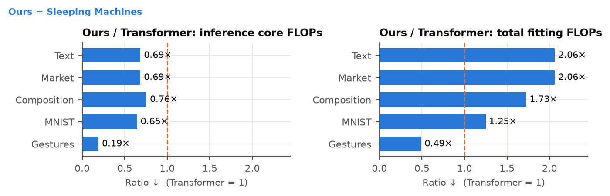

Ours uses eight layers and TF two, both width 32, with the same neural-fitting examples, encoding, objective and eight epochs. Inference counts maps/scans (ours) and maps/attention (TF): two FLOPs per multiply-add, excluding padding, scalar nonlinearities and expert preparation. Training includes backward, clipping, Adam and our evidence/calibration; its ledger follows.

**Lower core inference work in every screen.** Gestures use **5.18× less** with 59.1% versus 15.9% accuracy. That 44-query screen has an underfitting TF control; a general vision claim requires complete benchmarks and stronger references.

**Why training can cost more:** the race core evaluates all three candidate vector payloads during training, versus only the winner during inference. Its eight layers also exceed the reference's two. With short contexts, that work outweighs the saved attention cost; these rows do not show a training efficiency advantage. On the longer event-camera prefixes, the common model's estimated total uses 49.0% of the reference training arithmetic, including calibration.

Seed 6; neural fit/development counts: text 2,048/256, market 512/256, temporal 1,024/256, MNIST 1,024/256, gestures 88/44. The common text model also has a separately fitted 32,768-character evidence bank; market evidence is fitted on a prior day. The references have no such bank. MNIST uses pooled training-set images; gestures use first-second prefixes and disjoint users. Batch 16, or four for gestures. No official real-data test. Market fixed evidence: 3.670 nats/event.

## Appendix B (continued). Total training cost

The ledger estimates the entire completed fitting budget for each reported model. It includes prediction and loss, backpropagation, gradient clipping and Adam across all eight epochs. The common model also pays for its evidence bank and initial readout calibration. These models were trained from initialization; there is no inherited neural fitting to omit.

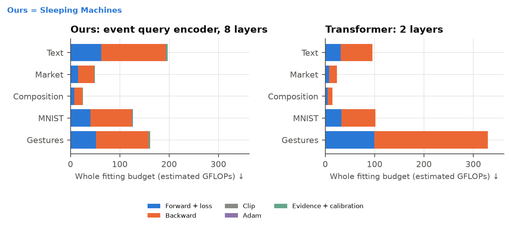

| Model/task | Forward + loss | Backward | Clip | Adam | Evidence + calibration | Total |
| --- | --- | --- | --- | --- | --- | --- |
| Language: Ours | 62.633 | 130.873 | 0.165 | 0.658 | 2.930 | 197.26 |
| Language: TF | 31.246 | 63.990 | 0.083 | 0.334 | 0 | 95.65 |
| Market: Ours | 15.657 | 32.716 | 0.041 | 0.164 | 0.733 | 49.31 |
| Market: TF | 7.811 | 15.996 | 0.020 | 0.081 | 0 | 23.91 |
| Temporal: Ours | 7.725 | 16.546 | 0.081 | 0.324 | 0.364 | 25.04 |
| Temporal: TF | 4.773 | 9.540 | 0.041 | 0.162 | 0 | 14.52 |
| Mnist: Ours | 40.394 | 84.376 | 0.083 | 0.333 | 1.886 | 127.07 |
| Mnist: TF | 33.026 | 68.489 | 0.049 | 0.197 | 0 | 101.76 |
| Dvs: Ours | 51.580 | 107.386 | 0.028 | 0.112 | 2.404 | 161.51 |
| Dvs: TF | 99.023 | 230.261 | 0.014 | 0.057 | 0 | 329.35 |

All table values are estimated GFLOPs for the whole fitting run, not per query. A multiply-add counts as two operations. Forward/loss and backward use the saved E172 four-query operator trace scaled by recorded map/scan work. Ours uses its logged candidate-map/scan counts. Reference padding is reconstructed from all fitting prefix lengths, the original shuffle seed and batch sizes, including fused attention products. Clipping and Adam are charged once per original step. Other arithmetic and the small calibration eigensolver are estimates.

Event-target arithmetic excludes padding and simulator dispatch/allocation; required candidate maps, losing-value teaching, scans and learning remain charged. References use the same FLOP convention. Evaluation, search, encoding, special functions, integer/index work, comparisons and memory traffic are outside these totals. These single-seed screens have different depths/quality and do not measure event hardware, matched-quality cost or energy. Ledger: [estimate_training_work.py](experiments/estimate_training_work.py).

## Appendix B (continued). Completed language references

The Transformer and LSTM benchmarks have already been run. Their completed result files remain in the repository and are reused as reference targets for the full learned-event benchmark. Lower bits per character (bpc) means better prediction.

| Model | Fitting characters / passes | Test bpc ↓ | Full training FLOPs ↓ |
| --- | --- | --- | --- |
| Ours: learned event-state model (planned) | 10M / four passes | Pending | Pending |
| LSTM; width 512, one recurrent layer | 10M / six passes | 1.799 | 432.59T |
| Transformer; width 256, four layers | 10M / four passes | 1.908 | 888.78T |
| LSTM; width 512, one recurrent layer | 90M / 6 passes | 1.661 | 3.89P |
| Transformer; width 256, four layers | 90M / 4 passes | 1.604 | 8.00P |

The 10M references score exactly the same 999,999 text8 targets in [95M,96M), with frozen validation-selected weights and cold initial context. The 90M LSTM uses the same test interval and its saved recurrent scoring protocol. All use the historical 27-character alphabet and 200,000-character validation selection; data budgets, capacities and fitting passes differ.

Training estimates include every fitting step, forward/loss, backpropagation, gradient clipping and Adam. Backward is approximated as twice forward; multiply-add counts as two FLOPs. G/T/P mean billion/trillion/quadrillion. Validation/test evaluation, memory traffic and runtime are outside these arithmetic totals.

### Ours: learned-language benchmark status

The planned comparison uses 10M fitting characters, four passes, 200,000 validation characters and the same 1M test interval. Priority is the integrated sparse/timed architecture documented in the next appendix. Completed dense-carrier fits remain diagnostic controls; their quality does not establish sparse-model performance. Numerical contracts and progressively larger integrated development fits precede promotion. The aligned full-test result and its fitting work remain pending. The preserved 28,403-parameter pilot's 3.351 development bpc uses a smaller fitting budget and different split; it is not a comparable test result.

Earlier 1M-character references also remain saved: LSTM **2.179** and Transformer **2.367 test bpc**, each with twenty fitting passes. The separate count/copy baseline and the cross-task Transformer/retrieval LSTM comparisons remain in their labeled sections and Appendix B.

Saved evidence: [10M LSTM aligned result](experiments/results/e174/aligned_lstm_10m_20260930.json); [10M Transformer aligned result](experiments/results/e174/aligned_tf_10m_20260930.json); [90M LSTM saved result](experiments/results/aws_20260929/aws_e64_lstm_D90M_baseline_20260929/lstm_D90000000_s512_p6_dr0.1_v.json); [90M TF saved result](experiments/results/aws_20260929/aws_e64_tf_D90M_baseline_rss6g_20260930/tf_D90000000_s256_L4_p4_dr0.1_v.json). An earlier 90M Transformer attempt was interrupted by its RSS watchdog before producing a completed test result; its provenance is preserved.

## Appendix B. New completed AWS language evidence

The six-block sparse receiver model reaches 3.106 development bpc on 32K fitting characters. It learns meaningful prediction, but this is the older single-head, observed-character-pool variant, not the newer eight-block native/content-gated reception model. The large dense controls are completed reference targets with much better held-out quality and much larger fitting budgets.

| Model | Fit chars / passes | Dev bpc ↓ | Test bpc ↓ | Whole fit GFLOPs ↓ | Fit MFLOPs / target ↓ |
| --- | --- | --- | --- | --- | --- |
| Ours sparse d32/L6 | 32,768/4 | 3.106 | Not scored | 114.25 | 0.872 |
| LSTM512 | 90M/6 | 1.616 | 1.661 | 3,893,396.04 | 7.210 |
| Transformer256/L4 | 90M/4 | 1.580 | 1.604 | 8,000,253.35 | 22.223 |

| Model | Parameters | Guarded wall h | Peak RSS MiB | Infer MFLOPs / char ↓ |
| --- | --- | --- | --- | --- |
| Ours sparse | 1,388,871 | 0.39 | 558.4 | 0.0885 |
| LSTM512 | 1,199,323 | 10.64 | 2246.9 | 2.4024 |
| Transformer256/L4 | 3,238,427 | 31.18 | 3822.5 | 14.8104 |

All rows use the same units and whole-fit/per-target denominators within each column. Sparse work is a representative full-step arithmetic estimate with unit-weight special functions; dense work uses shapes and backward = twice forward, including clipping/Adam. Both exclude evaluation and traffic. Dense inference uses the saved shape convention, including Transformer window overlap; sparse inference is a winner-only trace. Guarded wall and RSS include different simulator/runtime overheads and are not energy measurements.

The sparse development set has 8,191 targets; dense selection uses 200,000 validation characters and the saved 1M test interval. Neither their development scores nor their fitting budgets are matched. Raw resource gaps cannot establish comparable-quality or iso-FLOP supremacy. The interrupted Transformer attempt remains preserved; only its completed retry appears as a quality point. All completed points, including the 90M Transformer, are retained in the common quality/work and inference figures.

## Appendix B. AWS hierarchy depth: a useful constraint

These are older race-network diagnostics on the fixed depth-three Random Hierarchy Model. They test composition and depth, not the newer integrated language/event construction. Every shown model uses width 200, 64K fitting examples, ten passes, architecture seed 0 and rule seed 0.

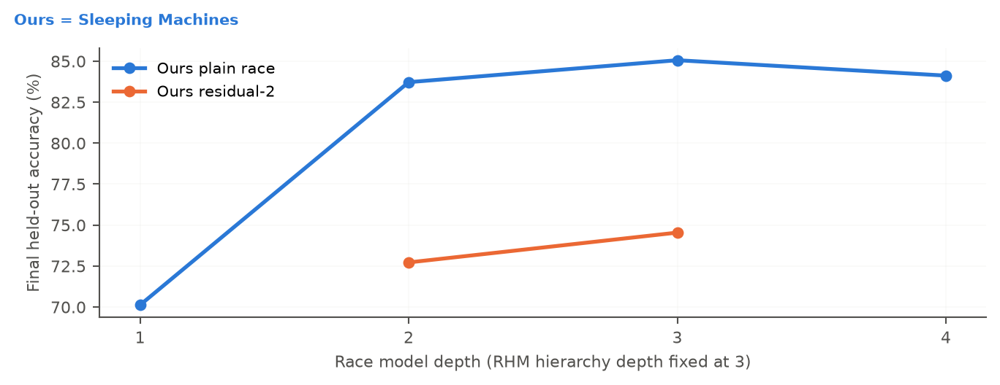

| Model | Depth | Final held-out accuracy | Guarded wall s | Peak RSS MiB |
| --- | --- | --- | --- | --- |
| Ours plain race | 1 | 70.12% | 70.4 | 129.3 |
| Ours plain race | 2 | 83.72% | 227.4 | 202.4 |
| Ours plain race | 3 | 85.06% | 382.2 | 249.7 |
| Ours plain race | 4 | 84.12% | 536.5 | 252.1 |
| Ours residual-2 | 2 | 72.72% | 266.1 | 217.4 |
| Ours residual-2 | 3 | 74.54% | 610.4 | 369.3 |
| Ours residual-2 | 4 | 72.56% | 1094.7 | 574.0 |

Plain depth 1/2/3/4 gives 70.12/83.72/85.06/84.12%: depth helps to three blocks, then regresses slightly. The completed residual-2 depth 2/3/4 variants give 72.72/74.54/72.56%, below their plain counterparts. Depth-four residual accuracy rises throughout its ten passes; its longer-budget convergence is untested. This constrains the tested implementation and budget, not all residual paths.

Only completed provenance files produce rows. Plain and residual depth-four runs are distinct. Final epoch is reported; evaluation curves are visible throughout fitting, so this is exploratory held-out evidence, not independent confirmation. Single rule/model seed; no 64K matched dense-control or complete FLOP/energy supremacy is inferred.

## Appendix B. AWS early temporal mechanism screen

Small completed integrated pilots from the committed fast matrix. These answer mechanism questions before larger scaling; their development budgets differ from the saved main language and native512-target results. Contracts and accounting smokes are excluded.

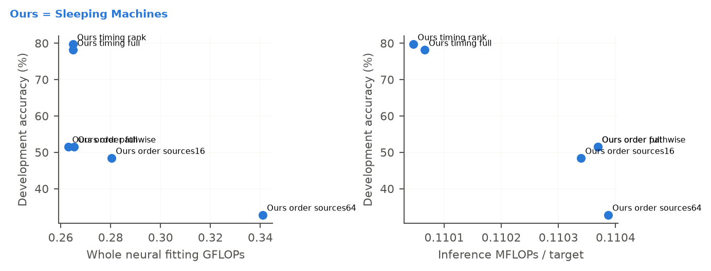

| Model | Fit / passes / dev | Dev quality | Whole fit GFLOPs | Fit MFLOPs / target | Infer MFLOPs / target |
| --- | --- | --- | --- | --- | --- |
| Ours timing full | 128/4/64 | 78.12% | 0.265 | 0.518 | 0.1101 |
| Ours timing rank | 128/4/64 | 79.69% | 0.265 | 0.518 | 0.1100 |
| Ours order full | 128/4/64 | 51.56% | 0.265 | 0.518 | 0.1104 |
| Ours order pathwise | 128/4/64 | 51.56% | 0.263 | 0.514 | 0.1104 |

| Model | Parameters | Receivers/commits/matches per event | Wall s | Seed |
| --- | --- | --- | --- | --- |
| Ours timing full | 42,898 | 128/16/32 | 791.8 | 6 |
| Ours timing rank | 42,898 | 128/16/32 | 799.8 | 6 |
| Ours order full | 42,932 | 128/16/32 | 789.3 | 6 |
| Ours order pathwise | 42,932 | 128/16/32 | 768.4 | 6 |

FLOPs count MAC as two and special functions once; all losing-value credit and Adam are charged. Temporal inference per query includes intervening input events; language per target is per character. Capacity/activity counts are per event, not per query. CPU simulation/audit overhead, RNG, traffic and physical energy are separate; AWS wall observations may include authorized CPU concurrency. Temporal tasks and altered source counts are explicitly named; different tasks do not form a single accuracy scaling curve. Single-seed development evidence, not supremacy. Paired independent seeds and frozen held-out confirmation precede benchmark promotion.

Interpretation: observed-time accuracy 78.12% versus refitted rank-time 79.69% does not yet demonstrate an elapsed-time advantage. State-clearing and stretched-gap probes are diagnostic interventions, not refitted controls.

Next experimental questions: state clearing and stretched silent gaps damage order predictions; private source rules lose training exposure as capacity grows. The next integrated battery tests protected memory, shared rules with private state, and paired timing whose labels cannot be inferred from rank alone.

## Appendix B. AWS early temporal mechanism screen

Small completed integrated pilots from the committed fast matrix. These answer mechanism questions before larger scaling; their development budgets differ from the saved main language and native512-target results. Contracts and accounting smokes are excluded.

| Model | Fit / passes / dev | Dev quality | Whole fit GFLOPs | Fit MFLOPs / target | Infer MFLOPs / target |
| --- | --- | --- | --- | --- | --- |
| Ours order sources16 | 128/4/64 | 48.44% | 0.280 | 0.548 | 0.1103 |
| Ours order sources64 | 128/4/64 | 32.81% | 0.341 | 0.666 | 0.1104 |
| Ours order shallow control | 128/4/64 | 51.56% | 0.134 | 0.262 | 0.0569 |

| Model | Parameters | Receivers/commits/matches per event | Wall s | Seed |
| --- | --- | --- | --- | --- |
| Ours order sources16 | 157,940 | 512/16/32 | 829.1 | 6 |
| Ours order sources64 | 617,972 | 2048/16/32 | 980.5 | 6 |
| Ours order shallow control | 21,684 | 64/8/16 | 403.3 | 6 |

FLOPs count MAC as two and special functions once; all losing-value credit and Adam are charged. Temporal inference per query includes intervening input events; language per target is per character. Capacity/activity counts are per event, not per query. CPU simulation/audit overhead, RNG, traffic and physical energy are separate; AWS wall observations may include authorized CPU concurrency. Temporal tasks and altered source counts are explicitly named; different tasks do not form a single accuracy scaling curve. Single-seed development evidence, not supremacy. Paired independent seeds and frozen held-out confirmation precede benchmark promotion.

Capacity interpretation: commits and matches remain fixed while available state grows, but fixed queries reduce per-source training exposure. The 64-source development set has one population; its collapsed bootstrap interval is not useful uncertainty.

## Appendix B. AWS early language mechanism screen

Small completed integrated pilots from the committed fast matrix. These answer mechanism questions before larger scaling; their development budgets differ from the saved main language and native512-target results. Contracts and accounting smokes are excluded.

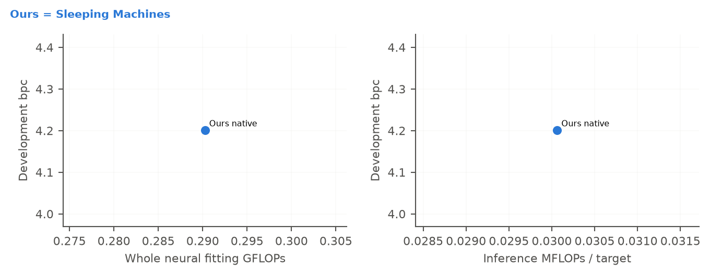

| Model | Fit / passes / dev | Dev quality | Whole fit GFLOPs | Fit MFLOPs / target | Infer MFLOPs / target |
| --- | --- | --- | --- | --- | --- |
| Ours native | 512/4/1023 | 4.2003 | 0.290 | 0.142 | 0.0301 |
| Ours reception | 512/4/1023 | 4.1949 | 0.325 | 0.159 | 0.0348 |
| Ours late | 512/4/1023 | 4.1962 | 0.319 | 0.156 | 0.0341 |
| Ours waiting | 512/4/1023 | 4.1955 | 0.304 | 0.149 | 0.0318 |

| Model | Parameters | Receivers/commits/matches per event | Wall s | Seed |
| --- | --- | --- | --- | --- |
| Ours native | 14,971 | 32/16/32 | 166.1 | 6 |
| Ours reception | 16,123 | 32/16/32 | 239.2 | 6 |
| Ours late | 16,123 | 32/16/32 | 205.1 | 6 |
| Ours waiting | 16,123 | 32/16/32 | 207.6 | 6 |

FLOPs count MAC as two and special functions once; all losing-value credit and Adam are charged. Temporal inference per query includes intervening input events; language per target is per character. Capacity/activity counts are per event, not per query. CPU simulation/audit overhead, RNG, traffic and physical energy are separate; AWS wall observations may include authorized CPU concurrency. Temporal tasks and altered source counts are explicitly named; different tasks do not form a single accuracy scaling curve. Single-seed development evidence, not supremacy. Paired independent seeds and frozen held-out confirmation precede benchmark promotion.

## Appendix B. Protected state/shared rules: order

Completed integrated pilots only. Protected modes retain information during silence; temporal modes still evolve. Shared learned rules retain private addressed state and remove private source embeddings. Paired timing keeps marks/order identical while labels differ; rank-only prediction has an exact 50% paired ceiling under coupled noise.

| Construction | Dev accuracy% | Dev NLL | Whole fit GFLOPs | Fit MFLOPs/query | Infer MFLOPs/query |
| --- | --- | --- | --- | --- | --- |
| Ours S64 private/P0/observed/s6 | 95.02 | 0.1889 | 1.364 | 0.666 | 0.110 |
| Ours S64 private/P0/observed/s7 | 98.34 | 0.0558 | 1.364 | 0.666 | 0.110 |
| Ours S64 private/P0/observed/s8 | 98.83 | 0.0430 | 1.364 | 0.666 | 0.110 |
| Ours S64 shared/P0/observed/s6 | 99.90 | 0.0279 | 1.054 | 0.515 | 0.110 |
| Ours S64 shared/P0/observed/s7 | 99.90 | 0.0869 | 1.054 | 0.515 | 0.110 |

| Construction | Fit/dev/passes | Parameters | State slots | Updates/scores per event |
| --- | --- | --- | --- | --- |
| Ours S64 private/P0/observed/s6 | 512/1024/4 | 616,964 | 2048 | 16/32 |
| Ours S64 private/P0/observed/s7 | 512/1024/4 | 616,964 | 2048 | 16/32 |
| Ours S64 private/P0/observed/s8 | 512/1024/4 | 616,964 | 2048 | 16/32 |
| Ours S64 shared/P0/observed/s6 | 512/1024/4 | 14,180 | 2048 | 16/32 |
| Ours S64 shared/P0/observed/s7 | 512/1024/4 | 14,180 | 2048 | 16/32 |

Exact full fitting includes producer graphs, losing proposals, backward, clipping and Adam; specials have unit weight. Independent population/pair uncertainty is distinct from seed uncertainty. Protected-prefix initialization also removes faster initial temporal modes; any timing change is not isolated spectral evidence. Scope remains synthetic pilot quality, not physical energy.

## Appendix B. Protected state/shared rules: order

Completed integrated pilots only. Protected modes retain information during silence; temporal modes still evolve. Shared learned rules retain private addressed state and remove private source embeddings. Paired timing keeps marks/order identical while labels differ; rank-only prediction has an exact 50% paired ceiling under coupled noise.

| Construction | Dev accuracy% | Dev NLL | Whole fit GFLOPs | Fit MFLOPs/query | Infer MFLOPs/query |
| --- | --- | --- | --- | --- | --- |
| Ours S64 shared/P0/observed/s8 | 97.95 | 0.0723 | 1.054 | 0.515 | 0.110 |
| Ours S16 shared/P0/observed/s7 | 44.53 | 1.3721 | 0.262 | 0.511 | 0.110 |
| Ours S16 shared/P0/observed/s8 | 70.31 | 0.8630 | 0.262 | 0.512 | 0.110 |
| Ours S16 shared/P2/observed/s7 | 26.17 | 1.3999 | 0.253 | 0.494 | 0.107 |
| Ours S16 shared/P2/observed/s8 | 51.56 | 1.0933 | 0.253 | 0.494 | 0.107 |

| Construction | Fit/dev/passes | Parameters | State slots | Updates/scores per event |
| --- | --- | --- | --- | --- |
| Ours S64 shared/P0/observed/s8 | 512/1024/4 | 14,180 | 2048 | 16/32 |
| Ours S16 shared/P0/observed/s7 | 128/256/4 | 14,180 | 512 | 16/32 |
| Ours S16 shared/P0/observed/s8 | 128/256/4 | 14,180 | 512 | 16/32 |
| Ours S16 shared/P2/observed/s7 | 128/256/4 | 13,988 | 512 | 16/32 |
| Ours S16 shared/P2/observed/s8 | 128/256/4 | 13,988 | 512 | 16/32 |

Exact full fitting includes producer graphs, losing proposals, backward, clipping and Adam; specials have unit weight. Independent population/pair uncertainty is distinct from seed uncertainty. Protected-prefix initialization also removes faster initial temporal modes; any timing change is not isolated spectral evidence. Scope remains synthetic pilot quality, not physical energy.

## Appendix B. Protected state/shared rules: order

Completed integrated pilots only. Protected modes retain information during silence; temporal modes still evolve. Shared learned rules retain private addressed state and remove private source embeddings. Paired timing keeps marks/order identical while labels differ; rank-only prediction has an exact 50% paired ceiling under coupled noise.

| Construction | Dev accuracy% | Dev NLL | Whole fit GFLOPs | Fit MFLOPs/query | Infer MFLOPs/query |
| --- | --- | --- | --- | --- | --- |
| Ours S16 private/P0/observed/s7 | 25.78 | 1.4432 | 0.280 | 0.548 | 0.110 |
| Ours S16 private/P0/observed/s8 | 42.97 | 1.3150 | 0.281 | 0.548 | 0.110 |
| Ours S16 private/P0/observed/s6 | 75.39 | 0.7592 | 0.280 | 0.548 | 0.110 |
| Ours S16 private/P0/observed/s7 | 51.17 | 1.0313 | 0.280 | 0.548 | 0.110 |
| Ours S16 private/P0/observed/s8 | 69.14 | 0.8689 | 0.280 | 0.548 | 0.110 |

| Construction | Fit/dev/passes | Parameters | State slots | Updates/scores per event |
| --- | --- | --- | --- | --- |
| Ours S16 private/P0/observed/s7 | 128/256/4 | 157,940 | 512 | 16/32 |
| Ours S16 private/P0/observed/s8 | 128/256/4 | 157,940 | 512 | 16/32 |
| Ours S16 private/P0/observed/s6 | 128/256/4 | 157,700 | 512 | 16/32 |
| Ours S16 private/P0/observed/s7 | 128/256/4 | 157,700 | 512 | 16/32 |
| Ours S16 private/P0/observed/s8 | 128/256/4 | 157,700 | 512 | 16/32 |

Exact full fitting includes producer graphs, losing proposals, backward, clipping and Adam; specials have unit weight. Independent population/pair uncertainty is distinct from seed uncertainty. Protected-prefix initialization also removes faster initial temporal modes; any timing change is not isolated spectral evidence. Scope remains synthetic pilot quality, not physical energy.

## Appendix B. Protected state/shared rules: order

Completed integrated pilots only. Protected modes retain information during silence; temporal modes still evolve. Shared learned rules retain private addressed state and remove private source embeddings. Paired timing keeps marks/order identical while labels differ; rank-only prediction has an exact 50% paired ceiling under coupled noise.

| Construction | Dev accuracy% | Dev NLL | Whole fit GFLOPs | Fit MFLOPs/query | Infer MFLOPs/query |
| --- | --- | --- | --- | --- | --- |
| Ours S16 shared/P0/observed/s6 | 40.23 | 1.2576 | 0.262 | 0.512 | 0.110 |
| Ours S16 shared/P0/observed/s7 | 32.03 | 1.4567 | 0.262 | 0.512 | 0.110 |
| Ours S16 shared/P0/observed/s8 | 25.00 | 1.5001 | 0.262 | 0.512 | 0.110 |
| Ours S16 private/P0/observed/s6 | 44.14 | 1.1194 | 0.280 | 0.548 | 0.110 |
| Ours S16 private/P2/observed/s6 | 44.92 | 1.2147 | 0.271 | 0.529 | 0.107 |

| Construction | Fit/dev/passes | Parameters | State slots | Updates/scores per event |
| --- | --- | --- | --- | --- |
| Ours S16 shared/P0/observed/s6 | 128/256/4 | 14,420 | 512 | 16/32 |
| Ours S16 shared/P0/observed/s7 | 128/256/4 | 14,420 | 512 | 16/32 |
| Ours S16 shared/P0/observed/s8 | 128/256/4 | 14,420 | 512 | 16/32 |
| Ours S16 private/P0/observed/s6 | 128/256/4 | 157,940 | 512 | 16/32 |
| Ours S16 private/P2/observed/s6 | 128/256/4 | 155,828 | 512 | 16/32 |

Exact full fitting includes producer graphs, losing proposals, backward, clipping and Adam; specials have unit weight. Independent population/pair uncertainty is distinct from seed uncertainty. Protected-prefix initialization also removes faster initial temporal modes; any timing change is not isolated spectral evidence. Scope remains synthetic pilot quality, not physical energy.

## Appendix B. Protected state/shared rules: order

Completed integrated pilots only. Protected modes retain information during silence; temporal modes still evolve. Shared learned rules retain private addressed state and remove private source embeddings. Paired timing keeps marks/order identical while labels differ; rank-only prediction has an exact 50% paired ceiling under coupled noise.

| Construction | Dev accuracy% | Dev NLL | Whole fit GFLOPs | Fit MFLOPs/query | Infer MFLOPs/query |
| --- | --- | --- | --- | --- | --- |
| Ours S16 shared/P0/observed/s6 | 75.39 | 0.8327 | 0.262 | 0.511 | 0.110 |
| Ours S16 shared/P2/observed/s6 | 56.25 | 1.0359 | 0.253 | 0.494 | 0.107 |
| Ours S4 private/P0/observed/s6 | 54.30 | 0.9787 | 0.265 | 0.518 | 0.110 |
| Ours S4 private/P2/observed/s6 | 47.27 | 1.1060 | 0.256 | 0.500 | 0.107 |
| Ours S4 shared/P0/observed/s6 | 70.70 | 0.8556 | 0.261 | 0.511 | 0.110 |

| Construction | Fit/dev/passes | Parameters | State slots | Updates/scores per event |
| --- | --- | --- | --- | --- |
| Ours S16 shared/P0/observed/s6 | 128/256/4 | 14,180 | 512 | 16/32 |
| Ours S16 shared/P2/observed/s6 | 128/256/4 | 13,988 | 512 | 16/32 |
| Ours S4 private/P0/observed/s6 | 128/256/4 | 42,932 | 128 | 16/32 |
| Ours S4 private/P2/observed/s6 | 128/256/4 | 42,356 | 128 | 16/32 |
| Ours S4 shared/P0/observed/s6 | 128/256/4 | 14,180 | 128 | 16/32 |

Exact full fitting includes producer graphs, losing proposals, backward, clipping and Adam; specials have unit weight. Independent population/pair uncertainty is distinct from seed uncertainty. Protected-prefix initialization also removes faster initial temporal modes; any timing change is not isolated spectral evidence. Scope remains synthetic pilot quality, not physical energy.

## Appendix B. Protected state/shared rules: order

Completed integrated pilots only. Protected modes retain information during silence; temporal modes still evolve. Shared learned rules retain private addressed state and remove private source embeddings. Paired timing keeps marks/order identical while labels differ; rank-only prediction has an exact 50% paired ceiling under coupled noise.

| Construction | Dev accuracy% | Dev NLL | Whole fit GFLOPs | Fit MFLOPs/query | Infer MFLOPs/query |
| --- | --- | --- | --- | --- | --- |
| Ours S4 shared/P2/observed/s6 | 56.64 | 1.0367 | 0.252 | 0.493 | 0.107 |

| Construction | Fit/dev/passes | Parameters | State slots | Updates/scores per event |
| --- | --- | --- | --- | --- |
| Ours S4 shared/P2/observed/s6 | 128/256/4 | 13,988 | 128 | 16/32 |

Exact full fitting includes producer graphs, losing proposals, backward, clipping and Adam; specials have unit weight. Independent population/pair uncertainty is distinct from seed uncertainty. Protected-prefix initialization also removes faster initial temporal modes; any timing change is not isolated spectral evidence. Scope remains synthetic pilot quality, not physical energy.

## Appendix B. Protected state/shared rules: paired_timing

Completed integrated pilots only. Protected modes retain information during silence; temporal modes still evolve. Shared learned rules retain private addressed state and remove private source embeddings. Paired timing keeps marks/order identical while labels differ; rank-only prediction has an exact 50% paired ceiling under coupled noise.

| Construction | Dev accuracy% | Dev NLL | Whole fit GFLOPs | Fit MFLOPs/query | Infer MFLOPs/query |
| --- | --- | --- | --- | --- | --- |
| Ours S4 private/P0/observed/s7 | 90.23 | 0.3483 | 0.265 | 0.518 | 0.110 |
| Ours S4 private/P0/observed/s8 | 91.80 | 0.1989 | 0.265 | 0.518 | 0.110 |
| Ours S4 private/P0/rank/s7 | 50.00 | 0.7153 | 0.265 | 0.518 | 0.110 |
| Ours S4 private/P0/rank/s8 | 50.00 | 0.7151 | 0.265 | 0.518 | 0.110 |
| Ours S4 private/P0/observed/s6 | 95.31 | 0.1850 | 0.265 | 0.518 | 0.110 |

| Construction | Fit/dev/passes | Parameters | State slots | Updates/scores per event |
| --- | --- | --- | --- | --- |
| Ours S4 private/P0/observed/s7 | 128/256/4 | 42,898 | 128 | 16/32 |
| Ours S4 private/P0/observed/s8 | 128/256/4 | 42,898 | 128 | 16/32 |
| Ours S4 private/P0/rank/s7 | 128/256/4 | 42,898 | 128 | 16/32 |
| Ours S4 private/P0/rank/s8 | 128/256/4 | 42,898 | 128 | 16/32 |
| Ours S4 private/P0/observed/s6 | 128/256/4 | 42,898 | 128 | 16/32 |

Exact full fitting includes producer graphs, losing proposals, backward, clipping and Adam; specials have unit weight. Independent population/pair uncertainty is distinct from seed uncertainty. Protected-prefix initialization also removes faster initial temporal modes; any timing change is not isolated spectral evidence. Scope remains synthetic pilot quality, not physical energy.

## Appendix B. Protected state/shared rules: paired_timing

Completed integrated pilots only. Protected modes retain information during silence; temporal modes still evolve. Shared learned rules retain private addressed state and remove private source embeddings. Paired timing keeps marks/order identical while labels differ; rank-only prediction has an exact 50% paired ceiling under coupled noise.

| Construction | Dev accuracy% | Dev NLL | Whole fit GFLOPs | Fit MFLOPs/query | Infer MFLOPs/query |
| --- | --- | --- | --- | --- | --- |
| Ours S4 private/P0/rank/s6 | 50.00 | 0.7035 | 0.265 | 0.518 | 0.110 |
| Ours S4 private/P2/observed/s6 | 82.42 | 0.5131 | 0.256 | 0.500 | 0.106 |

| Construction | Fit/dev/passes | Parameters | State slots | Updates/scores per event |
| --- | --- | --- | --- | --- |
| Ours S4 private/P0/rank/s6 | 128/256/4 | 42,898 | 128 | 16/32 |
| Ours S4 private/P2/observed/s6 | 128/256/4 | 42,322 | 128 | 16/32 |

Exact full fitting includes producer graphs, losing proposals, backward, clipping and Adam; specials have unit weight. Independent population/pair uncertainty is distinct from seed uncertainty. Protected-prefix initialization also removes faster initial temporal modes; any timing change is not isolated spectral evidence. Scope remains synthetic pilot quality, not physical energy.

## Appendix B. Native replication scope

Shared S16/P0 order replications: seed7: 44.53%, seed8: 70.31%. The original seed6 screen was75.39%; training-seed variation remains material. Private S16 replication controls and fresh-population confirmation are required for the paired sharing claim; a completed shared-only score cannot pass that gate.

Observed-time paired replications: seed7: 90.23%, seed8: 91.80%. Original seed6 was95.31%, with the exact rank-only paired ceiling50%. These reuse the development distribution and were chosen after seed6; they are training-seed evidence, not independent confirmation.

8 of8 reserved replication pilots are complete in this checkout. Every completed seed is listed in the preceding common-unit tables; pending cells carry no score. The frozen AWS replication/confirmation chain owns the remaining work; no local duplicates.

## Appendix B. Native frozen confirmation

Completed 1,024-query synthetic holdout evaluations only. All fitted seeds and matched controls remain visible; selected checkpoints use development NLL before confirmation. Existing seed6 and AWS-replication weights are reused with their original whole fitting work charged.

| Construction | Dev accuracy % | Holdout accuracy % | Holdout NLL | Whole fit GFLOPs | Fitting lineage |
| --- | --- | --- | --- | --- | --- |
| Ours: paired timing observed/seed 6 | 95.31 | 93.07 | 0.2230 | 0.265 | Reused; charged |
| Ours: paired timing observed/seed 7 | 90.23 | 86.52 | 0.3979 | 0.265 | Reused; charged |
| Ours: paired timing observed/seed 8 | 91.80 | 86.04 | 0.3296 | 0.265 | Reused; charged |
| Ours: paired timing rank/seed 6 | 50.00 | 50.00 | 0.7039 | 0.265 | Reused; charged |
| Ours: paired timing rank/seed 7 | 50.00 | 50.00 | 0.7162 | 0.265 | Reused; charged |
| Ours: paired timing rank/seed 8 | 50.00 | 50.00 | 0.7140 | 0.265 | Reused; charged |

Primary gains require the complete three-seed crossed population/pair analysis with correction across two contrasts. Partial scores cannot pass a gate. Synthetic mechanism confirmation is distinct from time-aware dense controls, real-data supremacy and physical energy.

## Appendix B. Native frozen confirmation

Completed 1,024-query synthetic holdout evaluations only. All fitted seeds and matched controls remain visible; selected checkpoints use development NLL before confirmation. Existing seed6 and AWS-replication weights are reused with their original whole fitting work charged.

| Construction | Dev accuracy % | Holdout accuracy % | Holdout NLL | Whole fit GFLOPs | Fitting lineage |
| --- | --- | --- | --- | --- | --- |
| Ours: order S16 shared/seed 6 | 75.39 | 79.59 | 0.8253 | 0.262 | Reused; charged |
| Ours: order S16 shared/seed 7 | 44.53 | 41.80 | 1.3791 | 0.262 | Reused; charged |
| Ours: order S16 shared/seed 8 | 70.31 | 70.80 | 0.8565 | 0.262 | Reused; charged |
| Ours: order S16 private/seed 6 | 44.14 | 47.75 | 1.1264 | 0.280 | Reused; charged |
| Ours: order S16 private/seed 7 | 25.78 | 31.15 | 1.4322 | 0.280 | New fit |
| Ours: order S16 private/seed 8 | 42.97 | 35.84 | 1.3393 | 0.281 | New fit |

Primary gains require the complete three-seed crossed population/pair analysis with correction across two contrasts. Partial scores cannot pass a gate. Synthetic mechanism confirmation is distinct from time-aware dense controls, real-data supremacy and physical energy.

## Appendix B. Persistent-write credit diagnosis

A frozen selected native checkpoint is replayed with alternative delivered content, alternative persistent write, and both. The exact four-corner decomposition separates those effects from their interaction and the current message-linearization residual. The forward architecture and fitted weights remain unchanged.

| Ours: frozen audit component | Mean absolute loss effect |
| --- | --- |
| Full alternative branch | 0.020980 |
| Persistent-write effect | 0.012694 |
| Delivered-value linearization residual | 0.000288 |
| Delivery/write interaction | 0.000066 |

The two opposed directions in the earlier audit are explained by persistent writes: at event0/block4 the value-only change is +0.001504 but the write-only change is −0.016749; at event7/block7 they are −0.001280 and +0.033918. The route chooses a memory address as well as a message. Training must teach that future state effect.

Twelve fixed probes, one population/address/noise seed, fixed selected-node time. Mean absolute write effect 0.012694 versus value residual 0.000288; these absolute summaries are not additive percentages. Hybrids are diagnostic interventions, not legal proposed routes. Value residual includes nonlinear response and downstream route switches. This is conditional fidelity evidence, not an expected-gradient failure rate.

Charged replay counts:48 forwards,12 backwards,12,288 races; 7.107s wall, 390.3MiB peak RSS. Arithmetic is uninstrumented. Checkpoint weights and outer RNG are preserved. Any new state-aware teacher needs integrated contracts, full accounting and a matched small fit.

Source: [completed factorial audit](experiments/results/diagnostics/aws_route_write_decomposition_20261001T235000Z.json); [joint state/time theory](experiments/theory/57_full_state_and_joint_clock_credit.md).

## Appendix B. Ours and boosted trees: banknote

Independent feature-ID rows, state reset between rows, train-only scaling and duplicate-feature group isolation. Ours uses eight native event blocks with parallel heads and content/state mixing; R2 adds temporal reception. Static processing coordinates are not physical asynchronous samples.

| Model | Fit/dev rows | Dev NLL / RMSE ↓ | Dev accuracy / MAE | Whole fit GFLOPs | Fit MFLOPs/row | Infer MFLOPs/row |
| --- | --- | --- | --- | --- | --- | --- |
| Ours R0 | 128/128 | 0.1553 | 0.9531 | 0.335 | 0.655 | 0.139 |
| Ours R2 | 128/128 | 0.2700 | 0.8906 | 0.379 | 0.740 | 0.163 |
| Boosted trees | 128/128 | 0.2319 | 0.9297 | Not counted | Not counted | Not counted |

| Model | All fit wall s | Peak RSS MiB | Tree nodes / bytes |
| --- | --- | --- | --- |
| Ours R0 | 981.79 | 445.8 | Not applicable |
| Ours R2 | 1452.02 | 453.7 | Not applicable |
| Boosted trees | 0.09 | 404.0 | 890/49,840 |

Four development checkpoints or four separately fitted tree candidates; all candidate tree fitting wall time is charged. Neural fit arithmetic is an actual forward/loss/backward/clipping/Adam trace, with specials counted once; preprocessing, evaluation and RNG are separate. Tree FLOPs are unavailable and are not manufactured. Neural wall time includes CPU simulation/audit instrumentation. These are small exploratory development results; reserved test labels are not scored. Strong tabular/frontier superiority requires larger frozen protocols and independent seeds.

Reception ablation: ours R2 reaches89.06% accuracy /0.270 NLL versus native R0 95.31% /0.155. Whole fitting work increases from0.335 to0.379 GFLOPs. The added reception capacity has not earned its cost in this single-seed static-data screen.

Confirmation protocol: native checkpoint reuse plus seeds7/8, original trees, CatBoost and logistic regression; four development selection opportunities per family, then frozen reserved-test scoring. See experiments/AWS_BANKNOTE_CONFIRMATION.md. No pending test score is reported.

## Appendix B. Ours and boosted trees: wine_red

Independent feature-ID rows, state reset between rows, train-only scaling and duplicate-feature group isolation. Ours uses eight native event blocks with parallel heads and content/state mixing; R2 adds temporal reception. Static processing coordinates are not physical asynchronous samples.

| Model | Fit/dev rows | Dev NLL / RMSE ↓ | Dev accuracy / MAE | Whole fit GFLOPs | Fit MFLOPs/row | Infer MFLOPs/row |
| --- | --- | --- | --- | --- | --- | --- |
| Ours R0 | 128/128 | 0.8238 | 0.6422 | 0.816 | 1.594 | 0.341 |
| Ours R2 | 128/128 | 0.7579 | 0.6205 | 0.919 | 1.795 | 0.398 |
| Boosted trees | 128/128 | 0.6489 | 0.4890 | Not counted | Not counted | Not counted |

| Model | All fit wall s | Peak RSS MiB | Tree nodes / bytes |
| --- | --- | --- | --- |
| Ours R0 | 2553.48 | 468.1 | Not applicable |
| Ours R2 | 3547.22 | 485.4 | Not applicable |
| Boosted trees | 0.11 | 404.3 | 464/25,984 |

Four development checkpoints or four separately fitted tree candidates; all candidate tree fitting wall time is charged. Neural fit arithmetic is an actual forward/loss/backward/clipping/Adam trace, with specials counted once; preprocessing, evaluation and RNG are separate. Tree FLOPs are unavailable and are not manufactured. Neural wall time includes CPU simulation/audit instrumentation. These are small exploratory development results; reserved test labels are not scored. Strong tabular/frontier superiority requires larger frozen protocols and independent seeds.

Reception helps this regression pilot: ours R2 RMSE0.758 versus R0 0.824 (8.0% lower), for0.919 versus0.816 whole-fit GFLOPs (12.6% more). Trees retain lower RMSE0.649. This positive within-model effect contrasts with banknote/language reception failures; it is not a cross-family win.

## Appendix B. Addressed-state write credit

Completed integrated pilots only: private S4/P0, eight blocks, two independent heads, d8/pool2, 128 fitting queries per pass/four passes,256 development queries, seed6. Both retain hard temporal races and winner-only inference. The zero-credit model exactly nests the parent; added memory/time credit is a local surrogate, not an arbitrary unbiased sequence-gradient estimator.

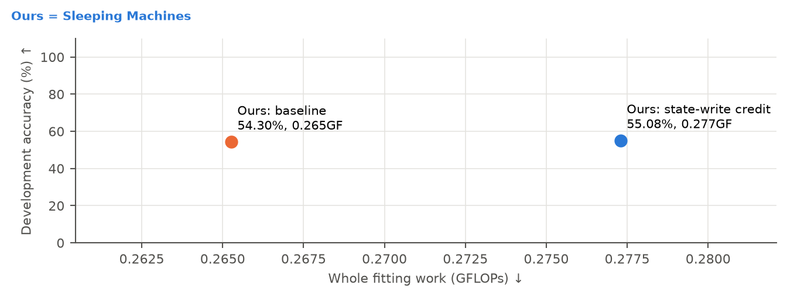

| Model | Accuracy % | NLL | Whole fit GFLOPs | Fit MFLOPs/query | Infer MFLOPs/query |
| --- | --- | --- | --- | --- | --- |
| Ours: write credit | 55.08 | 0.9778 | 0.277 | 0.542 | 0.110 |
| Ours: baseline | 54.30 | 0.9787 | 0.265 | 0.518 | 0.110 |

| Model | Fit/dev/passes | Parameters | State slots | Updates/scores per event |
| --- | --- | --- | --- | --- |
| Ours: write credit | 128/256/4 | 42,932 | 128 | 16/32 |
| Ours: baseline | 128/256/4 | 42,932 | 128 | 16/32 |

All fitting forward/loss/backward/normalization/clipping/Adam and losing proposals are charged. Special functions have unit weight beside arithmetic; integer discovery/traffic/energy remain separate. Training-only auxiliary state views and whole-process RSS are recorded in each result. Numerical/optimizer prerequisites and accounting smokes are excluded from benchmark plots. Matched gains: 0.78 percentage points / 0.00091 NLL, at 1.045× fitting work. The predeclared larger-fit gate (5 points/.02 NLL/at most2× work) fails. This reuses exploratory development populations; independent seeds and fresh confirmation remain required.

## Appendix B. Learned history and credit reach

Frozen checkpoint audit on32 fixed development positions. Both learned models depend on history; the native predictions change even when identical16-character suffixes receive the same race noise. The native model is therefore not strictly a bigram predictor. Equal average loss to a count model calibrates predictive quality; it does not identify learned features or context dependence.

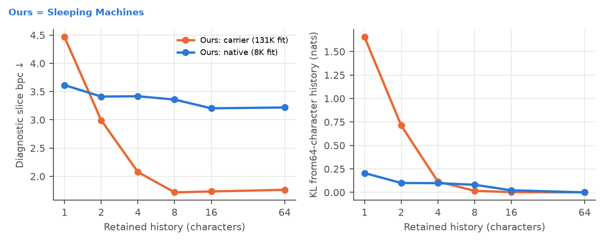

| Saved model | Layers with gradients | Layer norm range | Replay tokens | Backwards |
| --- | --- | --- | --- | --- |
| Ours: carrier,131K | 6 | 0.419–0.692 | 3120 | 1 |
| Ours: native,8K | 8 | 1.027–3.487 | 3120 | 1 |

The actual current count-composition logit gradient matches responsibility-weighted cross entropy to1.9e-09; all six carrier layers receive gradients. Mean responsibility is3.43% on this64-target initialization probe. This supports investigating attenuated task signal and conditioning, rather than assuming a general gradient disconnect.

No optimizer steps, weight changes or official-test access. History controls reset state and replay the retained suffix at its absolute positions; per-position native noise is coupled. This32-position slice is not the full saved development quality or a matched-data model comparison. Gradient norms aggregate different parameter groups; they show reach, not superior conditioning or unbiased hard-route credit. The64-character history is not uniformly better than16 on this slice; useful long-range/semantic features remain open. All replays/backwards are counted; arithmetic is uninstrumented. Wall33.21s, peakRSS325.5MiB. See experiments/LANGUAGE_LEARNING_DIAGNOSIS_20261002.md.

## Appendix B. Credit horizon with fixed context

Completed frozen native8K/H2/d16/depth8 diagnostic. All three arms retain the same128-token development context, score the same last16 targets and receive identical per-position race noise. Only graph reach changes:16,32 or64 tokens. Predictions match exactly; the gradient changes, separating retained information from the credit used to learn how to retain it.

| Graph horizon | Slice bpc | Gradient norm | Graph tokens | Replay tokens |
| --- | --- | --- | --- | --- |
| 16 | 4.016190 | 7.0827 | 16 | 128 |
| 32 | 4.016190 | 6.3785 | 32 | 128 |
| 64 | 4.016190 | 6.6635 | 64 | 128 |

| Short/long credit | Difference norm | Relative difference % | Gradient cosine |
| --- | --- | --- | --- |
| 16 versus 32 | 1.7577 | 27.56 | 0.9713 |
| 16 versus 64 | 2.0581 | 30.89 | 0.9570 |
| 32 versus 64 | 1.0092 | 15.15 | 0.9890 |

The16-versus64 gradient difference has norm30.89% of the64-token gradient, with cosine0.9570. The32-versus64 difference is15.15%. Every layer receives credit, and short-credit norms can be larger because omitted contributions can cancel retained ones. This is evidence of material truncation effects on this probe; it does not establish that increasing the horizon improves fitting quality.

Frozen weights; zero optimizer steps and no official-test access. One16-target slice,384 replay tokens,112 graph tokens,3 backwards. Wall11.08s, peakRSS518.0MiB. Arithmetic is uninstrumented. Native hard-route credit is a surrogate;64 tokens is a comparison, not an all-history unbiased reference. Relative difference divides the norm of the gradient difference by the longer-credit gradient norm, not a percentage of predictive quality or retained features.

## Appendix B. Banknote: no confirmed advantage

Competitive accuracy, no confirmed advantage: the three-seed reserved test does not sustain the development lead. Ours averages 91.8% versus 94.0% for the original trees. Logistic regression has lower test log loss. The full four-family confirmation remains incomplete. The reserved-test accuracy point estimates are close, but no equivalence margin was specified. Parity is therefore a descriptive reading, not a proven equivalence claim.

| Model | Completed seeds | Mean test accuracy % | Mean test NLL |
| --- | --- | --- | --- |
| Ours native | 3 | 91.81 | 0.2353 |
| Boosted trees | 3 | 93.95 | 0.2065 |
| CatBoost | 2/3 | Pending | Pending |
| Logistic | 3 | 94.66 | 0.0906 |

For the completed ours/tree comparison, the paired accuracy difference is −2.14 percentage points (descriptive95% crossed seed/feature-group interval −6.90 to +2.43). The control-minus-ours NLL difference is −0.0287 (98.33% interval −0.1738 to +0.1277). Logistic regression improves NLL by0.1447 (98.33% interval0.0338 to0.2660). These three-seed intervals are approximate and share one test split.

Partial analysis: local_banknote_partial_confirmation_20261002T013000Z.json;11/12 final cells, 4000 bootstrap draws,270 feature groups, three seeds. NLL intervals allow for three control comparisons; accuracy intervals are descriptive. This does not replace the incomplete full four-family gate. The original95.3% versus93.0% development screen and all per-seed work remain below.

## Appendix B. Frozen banknote confirmation

Completed test scores only. Checkpoints/candidates were selected on128 development rows after fitting 128 rows. Reserved feature groups were scored after choices were frozen; all rows start with cold state. The per-seed ledger preserves completed scores; the summary identifies families with all three seeds.

| Model/seed | Dev NLL | Test NLL | Test accuracy% | Whole fit GFLOPs | Fit MFLOPs/row | Infer MFLOPs/row |
| --- | --- | --- | --- | --- | --- | --- |
| Ours native/s6 | 0.1553 | 0.1426 | 94.31 | 0.335 | 0.655 | 0.139 |
| Ours native/s7 | 0.2594 | 0.2494 | 90.75 | 0.335 | 0.655 | 0.139 |
| Ours native/s8 | 0.3270 | 0.3138 | 90.39 | 0.335 | 0.655 | 0.139 |
| Boosted trees/s6 | 0.2319 | 0.2065 | 93.95 | Not counted | Not counted | Not counted |
| Boosted trees/s7 | 0.2319 | 0.2065 | 93.95 | Not counted | Not counted | Not counted |
| Boosted trees/s8 | 0.2319 | 0.2065 | 93.95 | Not counted | Not counted | Not counted |

| Model/seed | Charged fit wall s | Test wall s | Peak RSS MiB | Fit provenance |
| --- | --- | --- | --- | --- |
| Ours native/s6 | 981.79 | 4.54 | 334.3 | Historical fit reused |
| Ours native/s7 | 976.56 | 4.65 | 447.0 | New fit |
| Ours native/s8 | 989.25 | 4.61 | 447.0 | New fit |
| Boosted trees/s6 | 0.09 | 0.00 | 434.3 | New fit |
| Boosted trees/s7 | 0.09 | 0.00 | 434.9 | New fit |
| Boosted trees/s8 | 0.09 | 0.00 | 434.9 | New fit |

Native forward/loss/backward/clipping/Adam are traced. Seed6 reuse retains its original full fitting charge; it adds no optimizer steps. Control fitting includes all four independent candidates. Their FLOPs are unavailable. Audit instrumentation, preprocessing and physical energy are separate. Repeated seeds share test rows and must not be pooled as independent observations. Paired seed/feature-group analysis and all three prespecified seeds are required for the confirmation claim.

## Appendix B. Frozen banknote confirmation

Completed test scores only. Checkpoints/candidates were selected on128 development rows after fitting 128 rows. Reserved feature groups were scored after choices were frozen; all rows start with cold state. The per-seed ledger preserves completed scores; the summary identifies families with all three seeds.

| Model/seed | Dev NLL | Test NLL | Test accuracy% | Whole fit GFLOPs | Fit MFLOPs/row | Infer MFLOPs/row |
| --- | --- | --- | --- | --- | --- | --- |
| CatBoost/s6 | 0.1023 | 0.1207 | 93.95 | Not counted | Not counted | Not counted |
| CatBoost/s7 | 0.1042 | 0.1078 | 95.37 | Not counted | Not counted | Not counted |
| Logistic/s6 | 0.0832 | 0.0906 | 94.66 | Not counted | Not counted | Not counted |
| Logistic/s7 | 0.0832 | 0.0906 | 94.66 | Not counted | Not counted | Not counted |
| Logistic/s8 | 0.0832 | 0.0906 | 94.66 | Not counted | Not counted | Not counted |

| Model/seed | Charged fit wall s | Test wall s | Peak RSS MiB | Fit provenance |
| --- | --- | --- | --- | --- |
| CatBoost/s6 | 0.35 | 0.00 | 461.6 | New fit |
| CatBoost/s7 | 0.35 | 0.00 | 460.8 | New fit |
| Logistic/s6 | 0.01 | 0.00 | 429.6 | New fit |
| Logistic/s7 | 0.01 | 0.00 | 429.7 | New fit |
| Logistic/s8 | 0.01 | 0.00 | 429.9 | New fit |

Native forward/loss/backward/clipping/Adam are traced. Seed6 reuse retains its original full fitting charge; it adds no optimizer steps. Control fitting includes all four independent candidates. Their FLOPs are unavailable. Audit instrumentation, preprocessing and physical energy are separate. Repeated seeds share test rows and must not be pooled as independent observations. Paired seed/feature-group analysis and all three prespecified seeds are required for the confirmation claim.

## Appendix B (continued). Ours: language work as scaling develops

This ledger updates from completed integrated-model stages. It shows the emerging work advantage alongside its quality and data budget. Per-target fitting work removes the difference in the number of presentations; it does not establish equal-quality superiority.

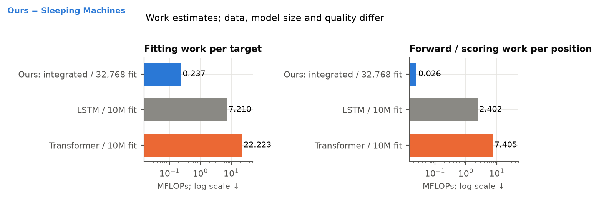

| Model | Fit / passes | bpc / split ↓ | Whole fit GFLOPs ↓ | Fitting MFLOPs / target ↓ | Forward MFLOPs / position ↓ |
| --- | --- | --- | --- | --- | --- |
| Ours / d32 / p2 | 32,768 / 4 | 3.106 / dev | 114.247 | 0.872 | 0.089 |
| Ours / d16 / p2 | 32,768 / 4 | 3.121 / dev | 31.053 | 0.237 | 0.026 |
| Ours / d16 / p2 | 8,192 / 4 | 3.398 / dev | 7.788 | 0.238 | 0.025 |
| Ours / d16 / p4 | 8,192 / 4 | 3.426 / dev | 14.721 | 0.449 | 0.032 |
| LSTM / width 512 | 10M / six | 1.799 / test | 432,592.997 | 7.210 | 2.402 |
| Transformer / width 256 | 10M / four | 1.908 / test | 888,775.443 | 22.223 | 7.405 |

Compare within a column: whole-fit totals use GFLOPs for every model; per-target and forward work use MFLOPs for every model. One GFLOP is 1,000 MFLOPs. Whole-fit totals also depend on the number of training presentations; the per-target column divides that out.

All table values, figures and ratios use arithmetic plus one operation per special function, matching the historical neural estimate convention. This is not a physical energy cost. Ours arithmetic-only whole-fit totals (GFLOPs): 32,768 / pool 2: 110.088; 32,768 / pool 2: 29.883; 8,192 / pool 2: 7.492; 8,192 / pool 4: 14.152. Separate special-function counts are preserved in each result.

**The raw work gap is substantial.** The completed 32,768-character integrated stage's representative forward estimate is **84× smaller** than the larger saved Transformer estimate; fitting work per target is **25× smaller**. These are configuration-level work ratios. Our development score and the reference official test score use different targets and data budgets. The gap is not a matched-quality supremacy claim.

Ours: d denotes payload width and p pool size; fixed character pools and event depths. Each result records its validation interval and credit horizon. References: width-512 LSTM or four width-256 Transformer layers, 256-position fitting chunks and 999,999 aligned official test targets. Ours uses representative operator traces including counterfactual credit, backward, clipping and Adam; neural references use shape formulas and backward ≈ twice forward. RNG, indexing, memory traffic and evaluation passes are additional. Same-quality and iso-FLOP conclusions await comparable completed runs.

## Appendix B (continued). Ours and neural controls: accuracy versus FLOPs

Each point is a completed model, not a projected scaling law. Left: ours on cold development characters, with integrated models and earlier carrier controls labelled separately. The new 2K screens score 2,047 development targets; the earlier ladders score 8,191. Right: saved neural test results INCLUDING the later segment-batched native width, depth, pool and credit models (purple diamonds, NB labels). Lower bpc means better prediction; lower fitting work means fewer estimated operations. No curve is drawn between different model families or scoring splits.

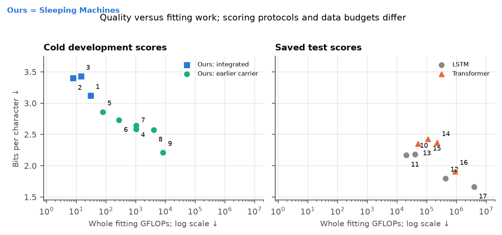

| Model type | Fitting budget | bpc / split ↓ | Whole fit GFLOPs ↓ | Fitting MFLOPs / target ↓ |
| --- | --- | --- | --- | --- |
| Ours: integrated d32/p2 | 32,768 / 4 passes | 3.106 / dev | 114.247 | 0.872 |
| Ours: batched native p64/d4 + route credit, 4 passes | 10,000,000 / 4 passes | 1.955 / test | 107,193.761 | 2.680 |
| Ours: carrier w128g | 1,048,576 / 4 passes | 2.210 / dev | 8,373.302 | 1.996 |
| LSTM: 512 | 90,000,000 / 6 passes | 1.661 / test | 3,893,396.042 | 7.210 |
| Transformer: 256x4 | 90,000,000 / 4 passes | 1.604 / test | 8,000,253.349 | 22.223 |

The table selects the largest fitting budget currently completed for each family; the best score breaks ties. Point numbers refer to the following variant ledger, which lists all plotted variants. Variant labels: I = ours integrated payload/pool/data; IKV adds per-position race memory (S uses the content index); NB = later batched native, T128/T256 evaluation shown; C = ours carrier width/data (g means content gates); L = LSTM width/data; T = Transformer width x layers/data; s denotes seed. K is 1,024 characters in ours labels; M is decimal million in neural labels.

Estimates include learning, clipping and Adam, with unit-weight special functions. Ours uses representative operator traces; neural controls use shape formulas and backward approximately twice forward. Scoring splits, data, passes, capacity and credit differ; these panels are evidence inventories, not an iso-FLOP or equal-quality benchmark.

## Appendix B (continued). Later native language: quality versus fitting work

Focused view of the later credited width/depth/capacity models. Same completed T256 scores as the common inventory; nominal10M fitting characters, one pass and saved one-pass controls. Blue is alternative-value route credit; light blue is timing-only credit; gray is a dense control.

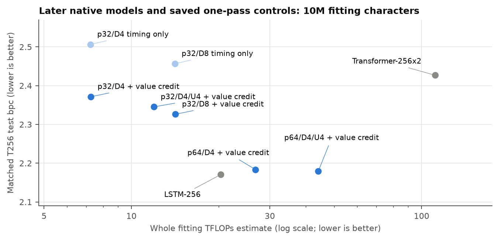

| Model | T256 test bpc | Whole fit TFLOPs est. | Fit MFLOPs / input position est. |
| --- | --- | --- | --- |
| p32/d4 + route credit | 2.3715 | 7.24 | 0.72 |
| p32/d4/pool4 + route credit | 2.3452 | 11.95 | 1.20 |
| p64/d4 + route credit | 2.1833 | 26.79 | 2.68 |
| p64/d4/pool4 + route credit | 2.1795 | 44.07 | 4.41 |
| p96/d4 + route credit | 2.1625 | 58.65 | 5.87 |
| LSTM-256 | 2.1706 | 20.31 | 2.03 |
| Transformer-256x2 | 2.4269 | 111.26 | 11.13 |
| Transformer-256x4, 4 passes | 1.9083 | 888.78 | 22.22 |
| LSTM-512, 6 passes | 1.7993 | 432.59 | 7.21 |

Native quality comes from the compiled training evaluator, fitting work from representative full-step traces; controls use shape estimates. Every column has the same units and denominator for ours and controls. Native random-segment fitting and evaluation tail coverage differ from controls. Single seeds; trained sparse-backend rescore and modern replications remain open. p96 now slightly exceeds LSTM quality with more fitting work. All13 later native fits, including timing-only/pool1/write-credit history, remain in the common graph and following ledger.

## Appendix B (continued). Accuracy versus inference FLOPs

Inference predicts with frozen weights: no backward pass, clipping or optimizer update. These are the same completed checkpoints, quality scores and point IDs as the fitting graph. Ours uses saved forward operator traces; the integrated models read only winning values. Later native NB points use emulator traces, charged for evaluated warm positions per scored target; winner-only estimates remain in the native appendix pending trained parity/rescore. LSTM and Transformer costs use shape estimates. Development and test evidence remain separate.

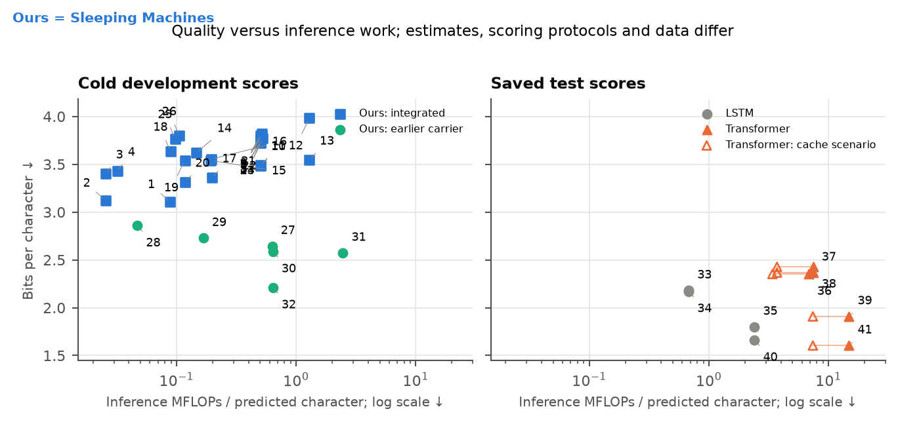

| Model type | bpc / split ↓ | Inference MFLOPs / character ↓ | Cost boundary |
| --- | --- | --- | --- |
| Ours: integrated d32/p2 | 3.106 / dev | 0.0885 | Winner-only inference trace |
| Ours: batched native p64/d4 + route credit, 4 passes | 1.955 / test | 1.7765 | Emulator trace × evaluated positions/scored targets |
| Ours: carrier w128g | 2.210 / dev | 0.6389 | Saved forward operator trace |
| LSTM: 512 | 1.661 / test | 2.4024 | Recurrent shape estimate |
| Transformer: 256x4 | 1.604 / test | 14.8104 | Overlapping-window shape estimate |

Solid Transformer points estimate its saved 256-position scorer: full windows advanced by 128 positions, approximately two forward positions per scored character (boundary/tail overhead omitted). Hollow points show a hypothetical one-step decode with cached keys/values and 256 available positions, using L(24d² + 4Td + 30d + 20T) + 54d + 135 unit-weight operations, T = 256. No cached decoder was run. Its plotted bpc belongs to the saved window scorer; learned positions reset between windows, so cache reuse has not been shown to preserve those scores.

Two FLOPs per multiply-add; special functions count as one operation. Ours traces include numerical clocks and loss scoring; neural elementwise overhead is approximate. Traces are representative warm-state costs, not full-stream measurements; growing KV candidate occupancy can change work. The separate KV pages also show projected event-architecture costs that remove numerical clock simulation. RNG, indexing, memory traffic and physical race energy are additional. These are work estimates, not latency or joules, and differing data, quality and evaluation protocols prevent a supremacy conclusion.

## Appendix B (continued). Completed language variants and work

| Variant | Params K | Fit / passes | bpc / split ↓ | Whole fit GFLOPs ↓ | Fit MFLOPs / target ↓ | Inference MFLOPs / char ↓ |
| --- | --- | --- | --- | --- | --- | --- |
| 1. Ours: AWS I32/p2/32K/s6 | 1,388.9 | 32,768 / 4 | 3.106 / dev | 114.247 | 0.872 | 0.0885 |
| 2. Ours: I16/p2/32K/s6 | 361.4 | 32,768 / 4 | 3.121 / dev | 31.053 | 0.237 | 0.0255 |
| 3. Ours: I16/p2/8K/s6 | 361.4 | 8,192 / 4 | 3.398 / dev | 7.788 | 0.238 | 0.0255 |
| 4. Ours: I16/p4/8K/s6 | 720.0 | 8,192 / 4 | 3.426 / dev | 14.721 | 0.449 | 0.0321 |
| 5. Ours: IHR2x32/b64/u64@0.002D8/2K/s6 | 3,819.5 | 2,048 / 4 | 3.740 / dev | 23.019 | 2.811 | 0.5060 |
| 6. Ours: IHR2x32D8/2K/s6 | 3,819.5 | 2,048 / 4 | 3.786 / dev | 27.731 | 3.387 | 0.5059 |
| 7. Ours: IHR2x32/u128@0.004D8/2K/s6 | 3,819.5 | 2,048 / 4 | 3.779 / dev | 19.999 | 2.442 | 0.5058 |
| 8. Ours: IHR2x32/u64@0.002D8/2K/s6 | 3,819.5 | 2,048 / 4 | 3.733 / dev | 22.753 | 2.779 | 0.5059 |
| 9. Ours: IHR2x32/u64@0.004D8/2K/s6 | 3,819.5 | 2,048 / 4 | 3.800 / dev | 22.750 | 2.779 | 0.5060 |
| 10. Ours: IHR2x32/u128@0.004D8/8K/s6 | 3,819.5 | 8,192 / 4 | 3.485 / dev | 79.953 | 2.440 | 0.5059 |
| 11. Ours: IHR2x32/u64@0.002D8/8K/s6 | 3,819.5 | 8,192 / 4 | 3.490 / dev | 89.999 | 2.747 | 0.5058 |
| 12. Ours: IHR4x32/u128@0.004D8/2K/s6 | 7,778.3 | 2,048 / 4 | 3.981 / dev | 48.431 | 5.915 | 1.2898 |

Each row retains its original architecture, fitting budget and score. The selected 10M LSTM/Transformer rows use the aligned 999,999-target scores; other neural rows retain their original E64 test scorers. The 90M LSTM uses its saved recurrent scoring protocol. Carrier and integrated development scores use frozen evaluation; integrated official scores appear only after their full test completes. Validation/test work, RNG and physical traffic are outside fitting totals. Sources: E64/E174, saved AWS E64 results and the completed parallel_language, episodic_language and language_batched JSON records. Later NB rows use T256 when completed (first v1 stays T128), actual fitting presentations and native window overlap charged per scored target; different tail coverage is retained. The global ledger uses emulator floating arithmetic consistently; fitting work per target divides by actual training target presentations. The separate KV page reports architectural projections. No new dense model was trained.

## Appendix B (continued). Completed language variants and work

| Variant | Params K | Fit / passes | bpc / split ↓ | Whole fit GFLOPs ↓ | Fit MFLOPs / target ↓ | Inference MFLOPs / char ↓ |
| --- | --- | --- | --- | --- | --- | --- |
| 13. Ours: IHR4x32/u128@0.004D8/8K/s6 | 7,778.3 | 8,192 / 4 | 3.543 / dev | 193.751 | 5.914 | 1.2882 |
| 14. Ours: IKV32D6/2K/s6 | 1,413.6 | 2,048 / 4 | 3.620 / dev | 9.035 | 1.103 | 0.1466 |
| 15. Ours: IKV32D8/2K/s6 | 1,883.9 | 2,048 / 4 | 3.539 / dev | 11.992 | 1.465 | 0.1941 |
| 16. Ours: IKVS32D8/2K/s6 | 1,883.9 | 2,048 / 4 | 3.554 / dev | 11.999 | 1.465 | 0.1968 |
| 17. Ours: IKVS32D8/8K/s6 | 1,883.9 | 8,192 / 4 | 3.357 / dev | 50.006 | 1.526 | 0.1969 |
| 18. Ours: I32D6/2K/s6 | 1,388.9 | 2,048 / 4 | 3.633 / dev | 7.207 | 0.880 | 0.0890 |
| 19. Ours: I32D8/2K/s6 | 1,850.9 | 2,048 / 4 | 3.542 / dev | 9.557 | 1.167 | 0.1173 |
| 20. Ours: I32D8/8K/s6 | 1,850.9 | 8,192 / 4 | 3.311 / dev | 40.243 | 1.228 | 0.1173 |
| 21. Ours: IHR2x32/m2/u128@0.004D8/2K/s6 | 3,819.5 | 2,048 / 4 | 3.820 / dev | 20.495 | 2.503 | 0.5165 |
| 22. Ours: IHR2x32/m4/u128@0.004D8/2K/s6 | 3,819.5 | 2,048 / 4 | 3.771 / dev | 20.914 | 2.554 | 0.5268 |
| 23. Ours: IHR2x32/wc0.25/u64@0.002D8/2K/s6 | 3,819.5 | 2,048 / 4 | 3.722 / dev | 23.469 | 2.866 | 0.5059 |
| 24. Ours: IHR2x32/wc1/u64@0.002D8/2K/s6 | 3,819.5 | 2,048 / 4 | 3.724 / dev | 23.464 | 2.866 | 0.5058 |

Each row retains its original architecture, fitting budget and score. The selected 10M LSTM/Transformer rows use the aligned 999,999-target scores; other neural rows retain their original E64 test scorers. The 90M LSTM uses its saved recurrent scoring protocol. Carrier and integrated development scores use frozen evaluation; integrated official scores appear only after their full test completes. Validation/test work, RNG and physical traffic are outside fitting totals. Sources: E64/E174, saved AWS E64 results and the completed parallel_language, episodic_language and language_batched JSON records. Later NB rows use T256 when completed (first v1 stays T128), actual fitting presentations and native window overlap charged per scored target; different tail coverage is retained. The global ledger uses emulator floating arithmetic consistently; fitting work per target divides by actual training target presentations. The separate KV page reports architectural projections. No new dense model was trained.

## Appendix B (continued). Completed language variants and work

| Variant | Params K | Fit / passes | bpc / split ↓ | Whole fit GFLOPs ↓ | Fit MFLOPs / target ↓ | Inference MFLOPs / char ↓ |
| --- | --- | --- | --- | --- | --- | --- |
| 25. Ours: Native H2d16/p2/2K/s6 | 54.9 | 2,048 / 4 | 3.765 / dev | 3.778 | 0.461 | 0.0974 |
| 26. Ours: Native H2d16/p2/8K/s6 | 54.9 | 8,192 / 4 | 3.557 / dev | 15.116 | 0.461 | 0.0974 |
| 27. Ours: R2/uniform/reception/2K/s6 | 57.1 | 2,048 / 4 | 3.796 / dev | 4.032 | 0.492 | 0.1056 |
| 28. Ours: R4/uniform/reception/2K/s6 | 59.3 | 2,048 / 4 | 3.795 / dev | 4.183 | 0.511 | 0.1109 |
| 29. Ours: R4/late/reception/2K/s6 | 57.1 | 2,048 / 4 | 3.795 / dev | 3.979 | 0.486 | 0.1041 |
| 30. Ours: R4/uniform/waiting/2K/s6 | 59.3 | 2,048 / 4 | 3.764 / dev | 3.897 | 0.476 | 0.1007 |
| 31. Ours: C128/128K | 308.0 | 131,072 / 4 | 2.643 / dev | 1,032.197 | 1.969 | 0.6296 |
| 32. Ours: C32/128K | 21.7 | 131,072 / 4 | 2.858 / dev | 77.197 | 0.147 | 0.0470 |
| 33. Ours: C64/128K | 80.3 | 131,072 / 4 | 2.727 / dev | 274.735 | 0.524 | 0.1675 |
| 34. Ours: C128g/128K | 309.6 | 131,072 / 4 | 2.587 / dev | 1,046.656 | 1.996 | 0.6389 |
| 35. Ours: C256g/128K | 1,208.9 | 131,072 / 4 | 2.572 / dev | 4,025.494 | 7.678 | 2.4571 |
| 36. Ours: C128g/1024K | 309.6 | 1,048,576 / 4 | 2.210 / dev | 8,373.302 | 1.996 | 0.6389 |

Each row retains its original architecture, fitting budget and score. The selected 10M LSTM/Transformer rows use the aligned 999,999-target scores; other neural rows retain their original E64 test scorers. The 90M LSTM uses its saved recurrent scoring protocol. Carrier and integrated development scores use frozen evaluation; integrated official scores appear only after their full test completes. Validation/test work, RNG and physical traffic are outside fitting totals. Sources: E64/E174, saved AWS E64 results and the completed parallel_language, episodic_language and language_batched JSON records. Later NB rows use T256 when completed (first v1 stays T128), actual fitting presentations and native window overlap charged per scored target; different tail coverage is retained. The global ledger uses emulator floating arithmetic consistently; fitting work per target divides by actual training target presentations. The separate KV page reports architectural projections. No new dense model was trained.

## Appendix B (continued). Completed language variants and work

| Variant | Params K | Fit / passes | bpc / split ↓ | Whole fit GFLOPs ↓ | Fit MFLOPs / target ↓ | Inference MFLOPs / char ↓ |
| --- | --- | --- | --- | --- | --- | --- |
| 37. L256/1M | 338.4 | 1,000,000 / 20 | 2.179 / test | 40,628.875 | 2.032 | 0.6770 |
| 38. L256/10M | 338.4 | 10,000,000 / 1 | 2.171 / test | 20,306.115 | 2.032 | 0.6770 |
| 39. L512/10M | 1,199.3 | 10,000,000 / 6 | 1.799 / test | 432,592.997 | 7.210 | 2.4024 |
| 40. T112x8/1M | 1,250.6 | 1,000,000 / 5 | 2.352 / test | 51,107.144 | 10.223 | 6.7999 |
| 41. T256x2/1M | 1,658.9 | 1,000,000 / 20 | 2.367 / test | 222,614.402 | 11.133 | 7.4192 |
| 42. T256x2/10M | 1,658.9 | 10,000,000 / 1 | 2.427 / test | 111,261.602 | 11.133 | 7.4192 |
| 43. T256x4/10M | 3,238.4 | 10,000,000 / 4 | 1.908 / test | 888,775.443 | 22.223 | 14.8104 |
| 44. L512/90M | 1,199.3 | 90,000,000 / 6 | 1.661 / test | 3,893,396.042 | 7.210 | 2.4024 |
| 45. T256x4/90M | 3,238.4 | 90,000,000 / 4 | 1.604 / test | 8,000,253.349 | 22.223 | 14.8104 |
| 46. Ours: NB p16/d8, v1 (610 updates)/T128 | 54.9 | 10,000,000 / 1 | 2.899 / test | 4,042.822 | 0.405 | 0.2629 |
| 47. Ours: NB p16/d8, skip2/T256 | 54.9 | 10,000,000 / 1 | 2.719 / test | 4,047.897 | 0.405 | 0.2629 |
| 48. Ours: NB p32/d4/T256 | 108.9 | 10,000,000 / 1 | 2.506 / test | 7,220.754 | 0.722 | 0.4792 |

Each row retains its original architecture, fitting budget and score. The selected 10M LSTM/Transformer rows use the aligned 999,999-target scores; other neural rows retain their original E64 test scorers. The 90M LSTM uses its saved recurrent scoring protocol. Carrier and integrated development scores use frozen evaluation; integrated official scores appear only after their full test completes. Validation/test work, RNG and physical traffic are outside fitting totals. Sources: E64/E174, saved AWS E64 results and the completed parallel_language, episodic_language and language_batched JSON records. Later NB rows use T256 when completed (first v1 stays T128), actual fitting presentations and native window overlap charged per scored target; different tail coverage is retained. The global ledger uses emulator floating arithmetic consistently; fitting work per target divides by actual training target presentations. The separate KV page reports architectural projections. No new dense model was trained.

## Appendix B (continued). Completed language variants and work

| Variant | Params K | Fit / passes | bpc / split ↓ | Whole fit GFLOPs ↓ | Fit MFLOPs / target ↓ | Inference MFLOPs / char ↓ |
| --- | --- | --- | --- | --- | --- | --- |
| 49. Ours: NB p32/d8, skip2/T256 | 210.0 | 10,000,000 / 1 | 2.456 / test | 14,107.373 | 1.412 | 0.9253 |
| 50. Ours: NB p32/d8/pool4, skip2/T256 | 346.3 | 10,000,000 / 1 | 2.498 / test | 23,603.624 | 2.362 | 1.5409 |
| 51. Ours: NB p32/d4/pool1 (control: no selection)/T256 | 74.8 | 10,000,000 / 1 | 2.439 / test | 4,878.223 | 0.488 | 0.3253 |
| 52. Ours: NB p32/d4 + route credit/T256 | 108.9 | 10,000,000 / 1 | 2.371 / test | 7,242.661 | 0.725 | 0.4792 |
| 53. Ours: NB p32/d4/pool4 + route credit/T256 | 177.0 | 10,000,000 / 1 | 2.345 / test | 11,949.789 | 1.196 | 0.7870 |
| 54. Ours: NB p32/d4 + read and write credit/T256 | 108.9 | 10,000,000 / 1 | 2.384 / test | 7,279.888 | 0.728 | 0.4792 |
| 55. Ours: NB p64/d4 + route credit/T256 | 422.5 | 10,000,000 / 1 | 2.183 / test | 26,787.462 | 2.680 | 1.7765 |
| 56. Ours: NB p32/d8, skip2 + route credit/T256 | 210.0 | 10,000,000 / 1 | 2.326 / test | 14,151.188 | 1.416 | 0.9253 |
| 57. Ours: NB p64/d4/pool4 + route credit/T256 | 689.8 | 10,000,000 / 1 | 2.179 / test | 44,073.829 | 4.410 | 2.9157 |
| 58. Ours: NB p96/d4 + route credit/T256 | 940.9 | 10,000,000 / 1 | 2.162 / test | 58,647.635 | 5.868 | 3.8929 |
| 59. Ours: NB p64/d4 + route credit, 4 passes/T256 | 422.5 | 10,000,000 / 4 | 1.955 / test | 107,193.761 | 2.680 | 1.7765 |

Each row retains its original architecture, fitting budget and score. The selected 10M LSTM/Transformer rows use the aligned 999,999-target scores; other neural rows retain their original E64 test scorers. The 90M LSTM uses its saved recurrent scoring protocol. Carrier and integrated development scores use frozen evaluation; integrated official scores appear only after their full test completes. Validation/test work, RNG and physical traffic are outside fitting totals. Sources: E64/E174, saved AWS E64 results and the completed parallel_language, episodic_language and language_batched JSON records. Later NB rows use T256 when completed (first v1 stays T128), actual fitting presentations and native window overlap charged per scored target; different tail coverage is retained. The global ledger uses emulator floating arithmetic consistently; fitting work per target divides by actual training target presentations. The separate KV page reports architectural projections. No new dense model was trained.

## Appendix B (continued). Ours: per-position race KV memory

Both integrated models fit 2,048 characters for 4 passes, with payload 32, 6 sparse receiver depths, seed 6 and 2,047 identical cold development targets. The KV arm retains separate historical keys and values at every depth; learned queries select one value through time. Incoming content is retained and gated with the retrieved message. No dense carrier is added.

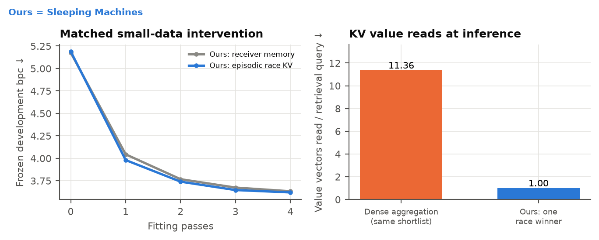

| Ours: memory | Dev bpc ↓ | Projected fit GFLOPs ↓ | CPU fit GFLOPs ↓ | Projected forward MFLOPs/char ↓ |
| --- | --- | --- | --- | --- |
| receiver | 3.633 | 7.206 | 7.207 | 0.0890 |
| kv | 3.620 | 9.034 | 9.035 | 0.1464 |

Completed KV improvement over receiver memory: +0.013 bpc (positive is better). The index admits up to 8 recent matching-character entries plus 4 recent positions. Older entries outside these tails cannot be addressed by this index. Duplicates are removed. Development averages 11.36 keys scored and one value delivered per retrieval query. All 12,282 entries remain stored (3.00 MiB raw keys/values); the oldest selected entry is 1,829 characters old. This bounds reads, not stored history.

Physical clock competition replaces explicit numerical rate exponentiation and noise/rate division plus the bounded-delay simulation in the projected ledger. Query/key/value maps, scored candidates, gated content, backward, counterfactual teaching, clipping and actual Adam remain charged. Counts are representative first/mature/partial traces; special functions have unit weight here and are separate in JSON. Physical rate setting, clock circuits, index/address operations, RNG and traffic need their own implementation costs; FLOPs do not certify energy.

Temporal races avoid the explicit normalizing reduction/division and deliver one value at inference; training reads all admitted values for route credit. The orange bar is an analytical same-shortlist aggregation comparison, not another trained model. Candidate coverage is approximate and does not guarantee full-bank attention equivalence. Random-hyperplane indexing is an established primitive (Charikar, STOC 2002); novelty is not claimed for this index. Historical activations are detached at the credit boundary and are not recomputed after parameter updates. One seed and a small data budget; no equal-quality Transformer or frontier claim.

## Appendix B (continued). Ours: per-position race KV memory

Both integrated models fit 2,048 characters for 4 passes, with payload 32, 8 sparse receiver depths, seed 6 and 2,047 identical cold development targets. The KV arm retains separate historical keys and values at every depth; learned queries select one value through time. Incoming content is retained and gated with the retrieved message. No dense carrier is added.

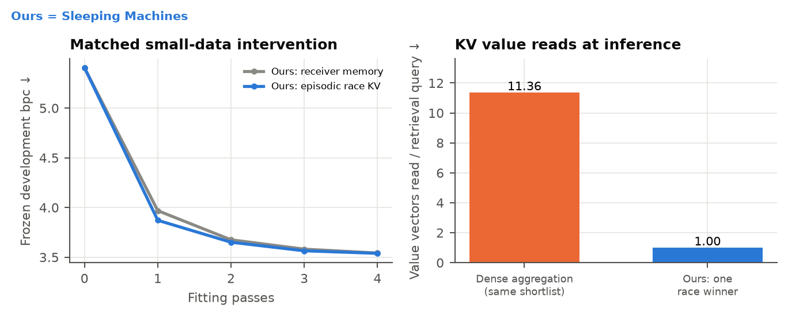

| Ours: memory | Dev bpc ↓ | Projected fit GFLOPs ↓ | CPU fit GFLOPs ↓ | Projected forward MFLOPs/char ↓ |
| --- | --- | --- | --- | --- |
| receiver | 3.542 | 9.556 | 9.557 | 0.1172 |
| kv | 3.539 | 11.990 | 11.992 | 0.1939 |

Completed KV improvement over receiver memory: +0.003 bpc (positive is better). The index admits up to 8 recent matching-character entries plus 4 recent positions. Older entries outside these tails cannot be addressed by this index. Duplicates are removed. Development averages 11.36 keys scored and one value delivered per retrieval query. All 16,376 entries remain stored (4.00 MiB raw keys/values); the oldest selected entry is 1,829 characters old. This bounds reads, not stored history.

Physical clock competition replaces explicit numerical rate exponentiation and noise/rate division plus the bounded-delay simulation in the projected ledger. Query/key/value maps, scored candidates, gated content, backward, counterfactual teaching, clipping and actual Adam remain charged. Counts are representative first/mature/partial traces; special functions have unit weight here and are separate in JSON. Physical rate setting, clock circuits, index/address operations, RNG and traffic need their own implementation costs; FLOPs do not certify energy.

Temporal races avoid the explicit normalizing reduction/division and deliver one value at inference; training reads all admitted values for route credit. The orange bar is an analytical same-shortlist aggregation comparison, not another trained model. Candidate coverage is approximate and does not guarantee full-bank attention equivalence. Random-hyperplane indexing is an established primitive (Charikar, STOC 2002); novelty is not claimed for this index. Historical activations are detached at the credit boundary and are not recomputed after parameter updates. One seed and a small data budget; no equal-quality Transformer or frontier claim.

## Appendix B (continued). Ours: per-position race KV memory

Both integrated models fit 2,048 characters for 4 passes, with payload 32, 8 sparse receiver depths, seed 6 and 2,047 identical cold development targets. The KV arm retains separate historical keys and values at every depth; learned queries select one value through time. Incoming content is retained and gated with the retrieved message. No dense carrier is added.

| Ours: memory | Dev bpc ↓ | Projected fit GFLOPs ↓ | CPU fit GFLOPs ↓ | Projected forward MFLOPs/char ↓ |
| --- | --- | --- | --- | --- |
| receiver | 3.542 | 9.556 | 9.557 | 0.1172 |
| kv | 3.554 | 11.997 | 11.999 | 0.1965 |

Completed KV improvement over receiver memory: -0.012 bpc (positive is better). The content index uses three random-hyperplane bits of learned keys/queries, with up to 8 recent/full-history samples in the query bucket and its one-bit neighbors, plus 4 recent positions. Duplicates are removed. Development averages 10.07 keys scored and one value delivered per retrieval query. All 16,376 entries remain stored (4.00 MiB raw keys/values); the oldest selected entry is 2,026 characters old. This bounds reads, not stored history.

Physical clock competition replaces explicit numerical rate exponentiation and noise/rate division plus the bounded-delay simulation in the projected ledger. Query/key/value maps, scored candidates, gated content, backward, counterfactual teaching, clipping and actual Adam remain charged. Counts are representative first/mature/partial traces; special functions have unit weight here and are separate in JSON. Physical rate setting, clock circuits, index/address operations, RNG and traffic need their own implementation costs; FLOPs do not certify energy.

Temporal races avoid the explicit normalizing reduction/division and deliver one value at inference; training reads all admitted values for route credit. The orange bar is an analytical same-shortlist aggregation comparison, not another trained model. Candidate coverage is approximate and does not guarantee full-bank attention equivalence. Random-hyperplane indexing is an established primitive (Charikar, STOC 2002); novelty is not claimed for this index. Historical activations are detached at the credit boundary and are not recomputed after parameter updates. One seed and a small data budget; no equal-quality Transformer or frontier claim.

## Appendix B (continued). Ours: per-position race KV memory

Both integrated models fit 8,192 characters for 4 passes, with payload 32, 8 sparse receiver depths, seed 6 and 8,191 identical cold development targets. The KV arm retains separate historical keys and values at every depth; learned queries select one value through time. Incoming content is retained and gated with the retrieved message. No dense carrier is added.

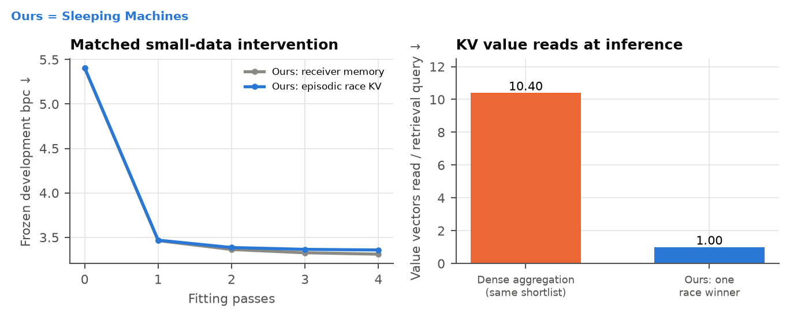

| Ours: memory | Dev bpc ↓ | Projected fit GFLOPs ↓ | CPU fit GFLOPs ↓ | Projected forward MFLOPs/char ↓ |
| --- | --- | --- | --- | --- |
| receiver | 3.311 | 40.241 | 40.243 | 0.1173 |
| kv | 3.357 | 49.998 | 50.006 | 0.1967 |

Completed KV improvement over receiver memory: -0.047 bpc (positive is better). The content index uses three random-hyperplane bits of learned keys/queries, with up to 8 recent/full-history samples in the query bucket and its one-bit neighbors, plus 4 recent positions. Duplicates are removed. Development averages 10.40 keys scored and one value delivered per retrieval query. All 65,528 entries remain stored (16.00 MiB raw keys/values); the oldest selected entry is 8,135 characters old. This bounds reads, not stored history.

Physical clock competition replaces explicit numerical rate exponentiation and noise/rate division plus the bounded-delay simulation in the projected ledger. Query/key/value maps, scored candidates, gated content, backward, counterfactual teaching, clipping and actual Adam remain charged. Counts are representative first/mature/partial traces; special functions have unit weight here and are separate in JSON. Physical rate setting, clock circuits, index/address operations, RNG and traffic need their own implementation costs; FLOPs do not certify energy.

Temporal races avoid the explicit normalizing reduction/division and deliver one value at inference; training reads all admitted values for route credit. The orange bar is an analytical same-shortlist aggregation comparison, not another trained model. Candidate coverage is approximate and does not guarantee full-bank attention equivalence. Random-hyperplane indexing is an established primitive (Charikar, STOC 2002); novelty is not claimed for this index. Historical activations are detached at the credit boundary and are not recomputed after parameter updates. One seed and a small data budget; no equal-quality Transformer or frontier claim.

## Appendix B (continued). Ours: cheaper learning updates

Credit still propagates over 16-character segments. Gradients are summed over U targets, normalized by their actual count, clipped once and used for one Adam update. All models here use two independent heads, payload 32/head, eight blocks, seed 6, four passes over 2,048 fitting characters and 8,191 frozen development targets.

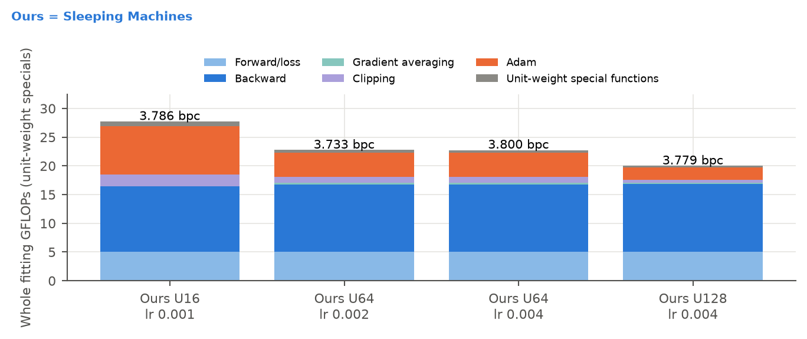

| Ours: U / learning rate | Dev bpc ↓ | Whole fit GFLOPs ↓ | Fit MFLOPs / target ↓ | Adam + clip GFLOPs ↓ |
| --- | --- | --- | --- | --- |
| U16 / 0.001 | 3.786 | 27.731 | 3.387 | 10.521 |
| U64 / 0.002 | 3.733 | 22.753 | 2.779 | 5.225 |
| U64 / 0.004 | 3.800 | 22.750 | 2.779 | 5.225 |
| U128 / 0.004 | 3.779 | 19.999 | 2.442 | 2.645 |

The cheapest schedule within the declared 0.05 bpc tolerance of the best pilot uses U128, lr 0.004: 3.779 bpc and 27.9% less whole fitting work than reference. The best quality is 3.733 bpc. These completed results support optimizer amortization in this configuration, not language-model supremacy.

Learning rates and warmup differ across configurations, so this is not an isolated optimizer-interval ablation. Selected checkpoints minimize frozen development loss over the fixed four passes; all fitting work remains charged. Each result is one seed. Candidate scoring, losing-value credit, backward and gradient accumulation/normalization remain in the operator ledger. Larger-data and repeat-seed comparisons must establish transfer of the selected schedule.

## Appendix B (continued). Ours: shared-match temporal arrivals

2 independent spatial heads, payload 32/head, 8 blocks. All rows fit 2,048 characters for 4 passes and score 8,191 cold development targets. Each query forms its candidate matches once. Multiple temporal marks reuse those rates; only the winning emitter renews its clock. The receiver and each selected message evolve until the last local read, then the messages are averaged and gated.

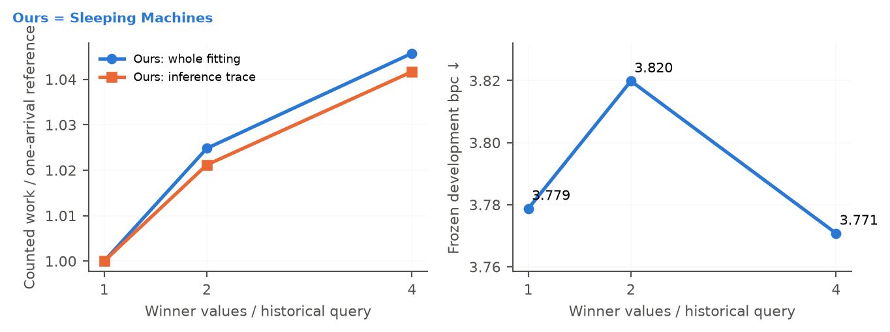

Ours delivers 4 times as many historical winner messages for 4.57% additional whole fitting arithmetic in this completed screen. Quality changes from 3.779 to 3.771 bpc. This supports cheap arrival multiplicity under shared matches; it does not establish language-model superiority.

| Ours: arrivals / head | Dev bpc ↓ | Whole fit GFLOPs ↓ | Fit MFLOPs / target ↓ | Inference MFLOPs / char ↓ |
| --- | --- | --- | --- | --- |
| m=1 | 3.779 | 19.999 | 2.442 | 0.5058 |
| m=2 | 3.820 | 20.495 | 2.503 | 0.5165 |
| m=4 | 3.771 | 20.914 | 2.554 | 0.5268 |

Candidate discovery and independent Q/K/V projections are retained. Multiple marks reuse one rate setting within each query; trained scores and candidate trajectories can differ across runs. More marks can retrieve the same value; they do not create extra learned spatial heads or discover absent candidates. Training reads all admitted values once and aggregates the conserved per-arrival teacher in O(Cd + md). All delivered messages, temporal transports, backward, clipping and Adam remain charged.

Completed single-seed development screens; m=1 reuses the saved reference under exact nesting contracts. Unit-weight special functions are included; CPU minimum comparisons/RNG and memory traffic are separate counters. The bounded numerical time encoding is not a demonstrated homogeneous physical Poisson clock. This local counterfactual teacher is a declared surrogate, not an exact gradient through nonlinear route changes. No matched-quality dense-model, physical-energy or frontier superiority is inferred.

## Appendix B (continued). Ours: independent temporal heads

Each head has its own receiver pool, historical bank and query/key/value/gate matrices. A winning content vector evolves through learned rotation and decay until its channel is read. The next block reads at the latest parallel arrival, preserves each channel and learns their mix. Heads need not arrive simultaneously. This is implemented in the CPU emulator; execution there is serial.

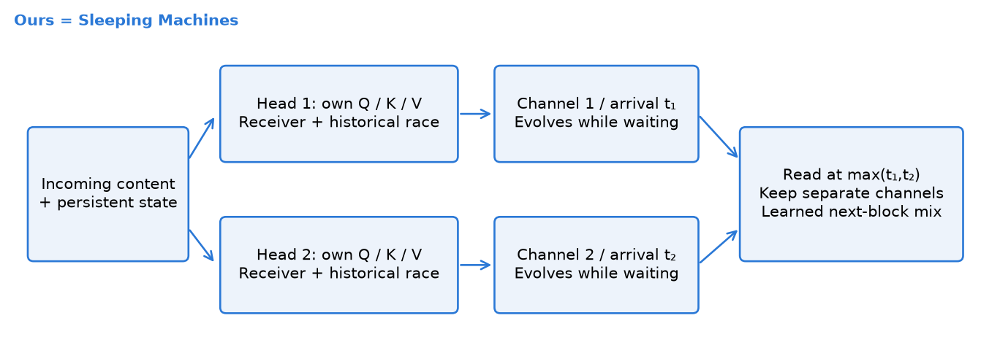

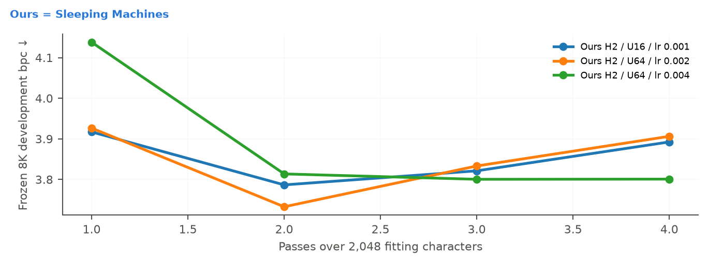

| Ours: heads / update | Fit / passes | Dev bpc ↓ | Whole fit GFLOPs ↓ |
| --- | --- | --- | --- |
| H2 / U128 / lr 0.004 | 8,192 / 4 | 3.485 | 79.953 |
| H2 / U64 / lr 0.002 | 8,192 / 4 | 3.490 | 89.999 |
| H4 / U128 / lr 0.004 | 2,048 / 4 | 3.981 | 48.431 |
| H4 / U128 / lr 0.004 | 8,192 / 4 | 3.543 | 193.751 |

Payload 32 per head: H2 total width 64, H4 total width 128; eight blocks. More heads also increase capacity, and source/channel dynamics differ from the old single-head model. The baseline H2 pilot selects epoch 2 and overfits later; no head-count quality benefit is established. Adam interval U is separate from 16-character credit. Training reads admitted losing values and charges gradients, clipping and optimizer work. Contracts pass for causality, independent projections, evolving channels, all-head gradients and exact next-update recovery. All completed variants remain in the ledger; this table shows the latest four records.

## Appendix B (continued). Ours: completed head/data scaling

Fixed d32 per head, eight blocks, pool2, credit16, U128/lr.004, four fitting passes, seed6. Every point scores the same 8,191 frozen development targets. More data improves these configurations, while four heads increase both width/capacity and fitting cost.

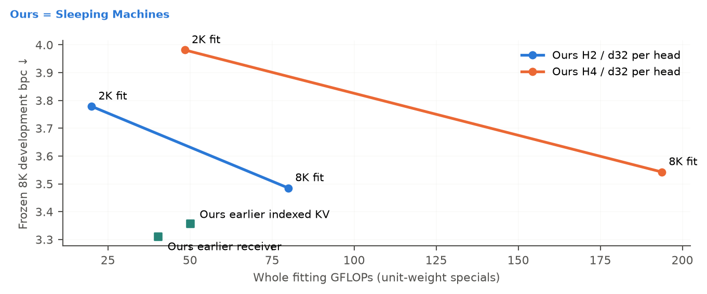

| Ours: heads / fit | Dev bpc ↓ | Whole fit GFLOPs ↓ | Fit MFLOPs / target ↓ |
| --- | --- | --- | --- |
| H2 / 2,048 | 3.779 | 19.999 | 2.442 |
| H2 / 8,192 | 3.485 | 79.953 | 2.440 |
| H4 / 2,048 | 3.981 | 48.431 | 5.915 |
| H4 / 8,192 | 3.543 | 193.751 | 5.914 |

The earlier 8K single-head controls reach receiver 3.311 and indexed KV 3.357 bpc. The multihead construction also changes source/channel dynamics and total width, so this is not a pure head-count ablation. The completed parallel-head 8K results missed the declared 0.10 bpc tolerance of the indexed control; the campaign stopped before 32K/131K promotion. Route-credit fidelity, recurrent/channel conditioning, candidate coverage and optimization are diagnosis targets. These results constrain this implementation rather than the whole substrate.

One seed and small fitting budgets. Whole fitting includes all four passes, backward, admitted losing-value credit and optimizer work. Development selection uses the lowest full development loss over those passes. Logical FLOPs and unit-weight special functions do not measure wall time, physical traffic or energy; no language supremacy follows from these points.

## Appendix B (continued). Ours: longer temporal credit

Independent H2 heads, d32/head, 8 event blocks, pool2. 2,048 fitting characters / 4 passes; 8,191 frozen development targets, seed6. Adam uses U64 / lr0.002. Graphs remain live for 64 targets before detachment. Forward stored history and the inference architecture are retained.

| Ours: credit | Dev bpc ↓ | Whole fit GFLOPs ↓ | Fit MFLOPs / target ↓ | Inference MFLOPs / char ↓ |
| --- | --- | --- | --- | --- |
| 16 | 3.733 | 22.753 | 2.779 | 0.5059 |
| 64 | 3.740 | 23.019 | 2.811 | 0.5060 |

Sealed historical keys and values still affect predictions, but detachment removes later loss paths to their old producers. Longer credit restores those paths for more writes inside each optimizer window; it does not backpropagate through unlimited history. Temporal races, sparse receiver commits, separate Q/K/V and losing-route credit remain active.

Matched 16-credit records are shown when completed under identical settings. Additional backward/normalization/clip/Adam work is counted and peak memory is guarded. Inference traces average different representative spans; the operation definitions and inference architecture are the same. One seed, development selection, no frontier claim. Forward-partition equality and full 64-credit gradient/update contracts precede fitting.

## Appendix B (continued). What most reduces research uncertainty

The main direction now tests native content-and-time computation directly. Episodic race attention remains a preserved comparison. Its small language improvements do not yet establish that an attention scaffold is the best use of this substrate.

| Priority | Experiment | Doubt resolved |
| --- | --- | --- |
| 1 | Integrated order/time learning; refitted credit/time controls; three seeds | Can deep sparse temporal state learn useful representations? |
| 2 | Native-core text8 adapter and small-to-larger data ladder | Does the native construction learn economically without a KV attention bank? |
| 3 | Occupy 4, 16, 64 stream states at fixed event/query budgets | Does useful state grow without proportional per-event activity? |
| 4 | Chronological real streams and predict-before-update adaptation | Does the advantage survive real data and online change? |
| 5 | Timestamp-aware AWS controls, equal-budget/quality curves | Is the quality/resource advantage reproducible? |
| 6 | Whole-system FPGA/ASIC timing, traffic and energy measurement | Does the physical substrate deliver the projected savings? |

The first native branch uses eight event blocks, two independent receiver heads, observed source addresses, persistent content/state, analytic temporal evolution and counterfactual learning. It has no per-position KV attention. Other sources keep independent progress; source-local causal dependencies and internal joins remain charged.

The same native core receives token content for the language test. Sharing receiver maps across tokens changes capacity and parameter exposure; it is a whole-construction comparison, not an isolated attention-removal ablation. Persistent state is not a full-cache equivalence claim.

Contracts/smokes precede fixed-budget pilots, conditional capacity/data scaling and independent replication. Whole fitting, per-target work, inference, occupancy, memory and confidence intervals are published from completed files. Synthetic learning, real-data Pareto advantage and physical joules are separate milestones. The executable protocol, gates and current host limitations are documented in experiments/RESEARCH_VALUE_PLAN.md.

## Appendix B (continued). Ours: content-gated temporal reception

Native eight-block independent-head models reuse key/query matches for two/four additional scalar clock policies. Local rotating/decaying clock vectors gate content-dependent projections and compose the next message. The waiting control retains the same clocks and joins but removes temporal reception/readout. The native parent has no extra clock branch.

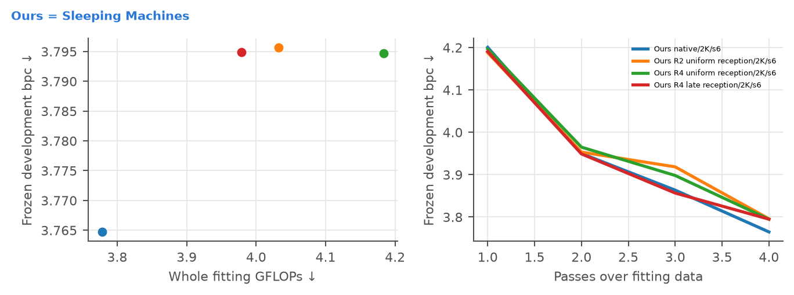

| Ours | Fit chars / passes | Dev bpc ↓ | CPU fit GFLOPs ↓ | Fit MFLOPs / target ↓ | Infer MFLOPs / char ↓ |
| --- | --- | --- | --- | --- | --- |
| Native | 2,048/4 | 3.765 | 3.778 | 0.461 | 0.0974 |
| R2 uniform | 2,048/4 | 3.796 | 4.032 | 0.492 | 0.1056 |
| R4 uniform | 2,048/4 | 3.795 | 4.183 | 0.511 | 0.1109 |
| R4 late | 2,048/4 | 3.795 | 3.979 | 0.486 | 0.1041 |
| R4 uniform wait | 2,048/4 | 3.764 | 3.897 | 0.476 | 0.1007 |

| Ours | Projected whole fit GFLOPs | Receivers / commits per token | Matches / clocks per token | Parameters |
| --- | --- | --- | --- | --- |
| Native | 3.777 | 32/16 | 32/16 | 54,907 |
| R2/uniform/on | 4.029 | 32/16 | 32/48 | 57,083 |
| R4/uniform/on | 4.178 | 32/16 | 32/80 | 59,259 |
| R4/late/on | 3.976 | 32/16 | 32/48 | 57,083 |
| R4/uniform/waiting | 3.891 | 32/16 | 32/80 | 59,259 |

Completed fits only; identical frozen 8,191-target development protocol, four passes, U64/lr.002/warm512, ordinary credit16. Different fitting sizes are explicitly marked. All scalar policies, projections, temporal bases, gates, counterfactual content teachers and actual Adam remain charged. Projected arithmetic removes only numeric clock simulation. Physical rate setting, clock circuits, traffic, precision and measured joules remain separate. Exploratory development results; these do not alone establish comparable-quality Transformer superiority.

Current matched-fit interpretation: best completed added-clock row is 0.0010 bpc better than native, with 3.13% more fitting work. Pending allocations and waiting controls cannot establish a benefit yet.

## Appendix B (continued). Ours: count-carrying native receivers

The unchanged native eight-block core supplies the base predictive; addressed context-suffix receivers of orders 1..K carry sufficient statistics and deliver by an escape-race cascade with learned discount and concentration (Theory §§376–380, 387). The escape-gate variant makes discount and concentration per-position functions of the native predictive and count evidence; the count-message variant adds the counts to the base logits (Theory §389). Fitting counts are leave-one-out; development counts are prequential persistent state with frozen weights. Count tables are capacity; each target touches K addresses.

| Model | Fit chars / passes | Dev bpc ↓ | Whole fit GFLOPs ↓ | Fit MFLOPs / target ↓ | Infer MFLOPs / char ↓ |
| --- | --- | --- | --- | --- | --- |
| Native alone 2,048 | 2,048/4 | 3.765 | 3.778 | 0.461 | 0.0974 |
| Count-carrying native K4 2,048 | 2,048/4 | 2.734 | 3.806 | 0.465 | 0.0982 |
| Same, untrained base 2,048 | 2,048/0 | 2.741 | Not trained | Not trained | 0.0982 |
| Count-carrying native K4 + count message 2,048 | 2,048/4 | 2.744 | 4.032 | 0.492 | 0.1102 |
| Count-carrying native K4 + escape gate 2,048 | 2,048/4 | 2.695 | 3.824 | 0.467 | 0.0993 |
| Count-carrying native K4 + escape gate [credit64] 2,048 | 2,048/4 | 2.694 | 3.843 | 0.469 | 0.0993 |
| Count-carrying native K4 + escape gate [minimal core p2/d1] 2,048 | 2,048/4 | 2.694 | 0.072 | 0.009 | 0.0031 |
| Count-carrying native K4 + escape gate [minimal core p2/d1] [credit64] 2,048 | 2,048/4 | 2.694 | 0.072 | 0.009 | 0.0031 |
| Count-carrying native K4 + gate + message 2,048 | 2,048/4 | 2.703 | 4.053 | 0.495 | 0.1113 |
| KN counts, frozen o4 | 2,048/1 | 3.615 | Not FLOPs | Not FLOPs | Not FLOPs |
| Calibration ceiling: adaptive interpolated KN o6 | 2,048/1 | 2.521 | Not FLOPs | Not FLOPs | Not FLOPs |
| Native alone 8,192 | 8,192/4 | 3.557 | 15.116 | 0.461 | 0.0974 |
| Count-carrying native K4 8,192 | 8,192/4 | 2.671 | 15.227 | 0.465 | 0.0982 |
| Same, untrained base 8,192 | 8,192/0 | 2.682 | Not trained | Not trained | 0.0982 |
| Count-carrying native K4 + escape gate 8,192 | 8,192/4 | 2.595 | 16.853 | 0.514 | 0.1155 |
| Count-carrying native K4 + escape gate 8,192 | 8,192/4 | 3.474 | 16.789 | 0.512 | 0.1155 |
| Count-carrying native K4 + escape gate 8,192 | 8,192/4 | 2.601 | 15.314 | 0.467 | 0.0993 |
| Count-carrying native K4 + escape gate [minimal core p16/d1] 8,192 | 8,192/4 | 2.592 | 4.181 | 0.128 | 0.0358 |
| Count-carrying native K4 + escape gate [minimal core p16/d1] 8,192 | 8,192/4 | 3.492 | 4.161 | 0.127 | 0.0358 |
| Count-carrying native K4 + escape gate [minimal core p2/d1] 8,192 | 8,192/4 | 2.588 | 0.288 | 0.009 | 0.0031 |
| Count-carrying native K4 + escape gate [minimal core p2/d1] 8,192 | 8,192/4 | 2.588 | 5.995 | 0.183 | 0.0632 |
| Count-carrying native K4 + escape gate [minimal core p2/d1] 8,192 | 8,192/4 | 2.593 | 1.744 | 0.053 | 0.0184 |
| Count-carrying native K4 + escape gate [minimal core p2/d1] 8,192 | 8,192/4 | 3.471 | 1.744 | 0.053 | 0.0184 |
| KN counts, frozen o4 | 8,192/1 | 3.081 | Not FLOPs | Not FLOPs | Not FLOPs |
| Calibration ceiling: adaptive interpolated KN o6 | 8,192/1 | 2.414 | Not FLOPs | Not FLOPs | Not FLOPs |
| Count-carrying native K4 32,768 | 32,768/4 | 2.560 | 60.790 | 0.464 | 0.0982 |
| Same, untrained base 32,768 | 32,768/0 | 2.593 | Not trained | Not trained | 0.0982 |
| Count-carrying native K4 + escape gate 32,768 | 32,768/4 | 2.447 | 60.790 | 0.464 | 0.0993 |
| Count-carrying native K4 + escape gate [minimal core p2/d1] 32,768 | 32,768/4 | 2.401 | 1.151 | 0.009 | 0.0031 |
| KN counts, frozen o5 | 32,768/1 | 2.704 | Not FLOPs | Not FLOPs | Not FLOPs |
| Calibration ceiling: adaptive interpolated KN o8 | 32,768/1 | 2.271 | Not FLOPs | Not FLOPs | Not FLOPs |

Same 8,191 development targets for every row; one seed. Count increments/lookups are integer table work reported in the result files, not FLOPs. The initialized-base/escape row measures whole-model fitting benefit; it does not isolate the native base. Count rows are dev-selected-order references, not neural controls. How to read these rows (Theory §§393–394): at a few thousand to tens of thousands of characters, smoothed counting is a near-optimal estimator, and no learner (Transformers included) is expected to exceed it. At 10M characters the repository's dense Transformer control is still .12 bpc worse than frozen counts (§381). The strongest such reference, stream-adaptive interpolated Kneser–Ney, scores 2.521 / 2.414 / 2.271 bpc at 2K / 8K / 32K and 2.101 at 131K (results/count_reference/curie_adaptive_kn_language_reference_20261002T131500Z.json). It is a calibration ceiling, not a competitor. Distances to it measure remaining smoothing, and the rows here are mechanism diagnostics, not a verdict on the architecture, whose claims are tested on tasks where learning matters (§394). Exploratory development evidence.

At 2,048 fitting characters, fitting the native base and escape parameters improves 0.0071 bpc over their untrained initialization. The complete composed predictor improves over native-alone, while this smaller learning contribution is the relevant comparison for the cost of fitting the base. The integer count path remains charged separately.

At 2,048 fitting characters, fitting the native base and escape parameters improves 0.0542 bpc over their untrained initialization. The complete composed predictor improves over native-alone, while this smaller learning contribution is the relevant comparison for the cost of fitting the base. The integer count path remains charged separately.

At 2,048 fitting characters, fitting the native base and escape parameters improves 0.0455 bpc over their untrained initialization. The complete composed predictor improves over native-alone, while this smaller learning contribution is the relevant comparison for the cost of fitting the base. The integer count path remains charged separately.

At 2,048 fitting characters, fitting the native base and escape parameters improves 0.0381 bpc over their untrained initialization. The complete composed predictor improves over native-alone, while this smaller learning contribution is the relevant comparison for the cost of fitting the base. The integer count path remains charged separately.

At 2,048 fitting characters, fitting the native base and escape parameters improves -0.0032 bpc over their untrained initialization. The complete composed predictor improves over native-alone, while this smaller learning contribution is the relevant comparison for the cost of fitting the base. The integer count path remains charged separately.

At 32,768 fitting characters, fitting the native base and escape parameters improves 0.0329 bpc over their untrained initialization. The complete composed predictor improves over native-alone, while this smaller learning contribution is the relevant comparison for the cost of fitting the base. The integer count path remains charged separately.

At 32,768 fitting characters, fitting the native base and escape parameters improves 0.1930 bpc over their untrained initialization. The complete composed predictor improves over native-alone, while this smaller learning contribution is the relevant comparison for the cost of fitting the base. The integer count path remains charged separately.

At 32,768 fitting characters, fitting the native base and escape parameters improves 0.1454 bpc over their untrained initialization. The complete composed predictor improves over native-alone, while this smaller learning contribution is the relevant comparison for the cost of fitting the base. The integer count path remains charged separately.

At 8,192 fitting characters, fitting the native base and escape parameters improves 0.0108 bpc over their untrained initialization. The complete composed predictor improves over native-alone, while this smaller learning contribution is the relevant comparison for the cost of fitting the base. The integer count path remains charged separately.

At 8,192 fitting characters, fitting the native base and escape parameters improves 0.0988 bpc over their untrained initialization. The complete composed predictor improves over native-alone, while this smaller learning contribution is the relevant comparison for the cost of fitting the base. The integer count path remains charged separately.

At 8,192 fitting characters, fitting the native base and escape parameters improves 0.0988 bpc over their untrained initialization. The complete composed predictor improves over native-alone, while this smaller learning contribution is the relevant comparison for the cost of fitting the base. The integer count path remains charged separately.

At 8,192 fitting characters, fitting the native base and escape parameters improves 0.0922 bpc over their untrained initialization. The complete composed predictor improves over native-alone, while this smaller learning contribution is the relevant comparison for the cost of fitting the base. The integer count path remains charged separately.

At 8,192 fitting characters, fitting the native base and escape parameters improves 0.0890 bpc over their untrained initialization. The complete composed predictor improves over native-alone, while this smaller learning contribution is the relevant comparison for the cost of fitting the base. The integer count path remains charged separately.

At 8,192 fitting characters, fitting the native base and escape parameters improves 0.0915 bpc over their untrained initialization. The complete composed predictor improves over native-alone, while this smaller learning contribution is the relevant comparison for the cost of fitting the base. The integer count path remains charged separately.

At 8,192 fitting characters, fitting the native base and escape parameters improves -0.2996 bpc over their untrained initialization. The complete composed predictor improves over native-alone, while this smaller learning contribution is the relevant comparison for the cost of fitting the base. The integer count path remains charged separately.

At 8,192 fitting characters, fitting the native base and escape parameters improves -0.2977 bpc over their untrained initialization. The complete composed predictor improves over native-alone, while this smaller learning contribution is the relevant comparison for the cost of fitting the base. The integer count path remains charged separately.

At 8,192 fitting characters, fitting the native base and escape parameters improves -0.3213 bpc over their untrained initialization. The complete composed predictor improves over native-alone, while this smaller learning contribution is the relevant comparison for the cost of fitting the base. The integer count path remains charged separately.

At 8,192 fitting characters, fitting the native base and escape parameters improves 0.0809 bpc over their untrained initialization. The complete composed predictor improves over native-alone, while this smaller learning contribution is the relevant comparison for the cost of fitting the base. The integer count path remains charged separately.

At 2,048 fitting characters, fitting the native base and escape parameters improves 0.0464 bpc over their untrained initialization. The complete composed predictor improves over native-alone, while this smaller learning contribution is the relevant comparison for the cost of fitting the base. The integer count path remains charged separately.

At 2,048 fitting characters, fitting the native base and escape parameters improves 0.0543 bpc over their untrained initialization. The complete composed predictor improves over native-alone, while this smaller learning contribution is the relevant comparison for the cost of fitting the base. The integer count path remains charged separately.

## Appendix B. Longer credit versus learned count smoothing

Completed four-arm integrated comparison, seed6: same2K fitting characters/four passes, 8,191 development targets, K4 escape gate, U64/lr.002/warmup512. Each fit processes8,188 targets and128 optimizer updates. Full H2/d16/depth8 and minimal H2/d2/depth1 each compare16 versus64 tokens of graph reach; persistent state and forward mechanisms remain unchanged within each core.

| Model/credit | Dev bpc | Whole fit GFLOPs | Fit MFLOPs/target | Infer MFLOPs/char |
| --- | --- | --- | --- | --- |
| Ours: full core /credit16 | 2.6951 | 3.824 | 0.467 | 0.0993 |
| Minimal core control /credit16 | 2.6938 | 0.072 | 0.009 | 0.0031 |
| Ours: full core /credit64 | 2.6943 | 3.843 | 0.469 | 0.0993 |
| Minimal core control /credit64 | 2.6937 | 0.072 | 0.009 | 0.0031 |

| Model/credit | Parameters | Core state slots | Updates/scores/teacher values per target |
| --- | --- | --- | --- |
| Ours: full core /credit16 | 54,955 | 32 | 16/32/32 |
| Minimal core control /credit16 | 467 | 4 | 2/4/4 |
| Ours: full core /credit64 | 54,955 | 32 | 16/32/32 |
| Minimal core control /credit64 | 467 | 4 | 2/4/4 |

Full-core longer-credit gain0.0008bpc; minimal-core gain0.0001bpc. Full versus minimal advantage at64:-0.0006bpc, with1.005× full-core fitting work versus16. The predeclared follow-up gate fails.

All neural fitting forward/loss/backward/normalization/clipping/Adam and admitted losing-value credit are charged in CPU emulator units; projected clockless work is a separate result ledger. Each target also looks up4 count addresses; integer counts, discovery, traffic and energy stay separate. This reuses development data and is a single-seed screen, not confirmation, semantic-feature proof or supremacy. Passing requires at least.02bpc full-core credit gain AND at least.02bpc advantage over the matched minimal64 core at no more than2× full-core fitting work. No automatic larger fit.

## Appendix B. Does the trained deep state contribute?

Frozen saved full/minimal64-credit models from the matched2K fits above. Same32 development targets at positions128–159, same race noise and causal count vectors. Erase stored content once at the slice start, retaining arrival times and absolute count cursor; state may rebuild. The learned escape gate responds to the changed neural base.

| Model/intervention | Composed bpc | Raw base bpc | Change in composed bpc |
| --- | --- | --- | --- |
| Full core/intact | 3.4541 | 4.9093 | +0.0000 |
| Full core/Erase source context | 3.4916 | 5.0308 | +0.0375 |
| Full core/Erase receiver content | 3.4495 | 4.9933 | -0.0046 |
| Full core/Erase all content | 3.5022 | 5.1477 | +0.0481 |
| Minimal control/intact | 3.4904 | 4.9638 | +0.0000 |
| Minimal control/Erase source context | 3.4885 | 4.9424 | -0.0018 |
| Minimal control/Erase receiver content | 3.4901 | 4.9649 | -0.0002 |
| Minimal control/Erase all content | 3.4882 | 4.9401 | -0.0022 |

Full-core stored content helps this slice by.0481bpc, mainly through the carried source context; erasing receiver content alone does not hurt. Useful recurrence is present, but this does not establish hierarchical semantics, generalization across slices, or a full-development lead. Per-layer receiver erasures are preserved in the diagnostic JSON.

| Model | Mean base responsibility | Median base responsibility | Dynamic/base-only gradient norm |
| --- | --- | --- | --- |
| Full core | 0.0717 | 0.0045 | 0.207 |
| Minimal control | 0.0571 | 0.0031 | 0.195 |

Credit diagnostic uses64 fitting targets at positions64–127. With gate values fixed, the exact base-logit derivative is responsibility × (q−onehot); numerical errors are below5e−9. Actual dynamic-gate gradients reach every layer. Responsibility suppression is correct mixture credit, not a demonstrated autograd bug; Adam can compensate for uniform scaling. The distribution and usefulness of the residual signal, information retention and retrieval remain hypotheses.

No optimizer steps or weight changes. Raw base is trained as a conditional residual, so its standalone bpc is diagnostic. Audit12.85s/522,736KiB; no FLOP or superiority claim. Source: local_deep_core_attribution_20261002T075000Z.json. The synthetic long-range queue was retired before launch after unsupported chance claims and credit/update confounding were found; repaired-driver contracts require matched optimizer windows and separately measured local controls.

## Appendix B. Integrated memory repair: accounting prerequisite

Completed short accounting smokes, not quality pilots. Unchanged full native core versus context-addressed outcome slots: H2/d16/depth8, same192 fitting characters/one pass,191 targets, three U64 Adam updates (partial63), c16/lr.002/no warmup, seed6, same core initialization and training race RNG. Frozen cold-state development has128 targets. Both zero-repair initial scores match exactly; every actual fitting operation is traced.

| Model | Smoke dev bpc | Whole fit GFLOPs | Fit MFLOPs/target | Infer MFLOPs/target |
| --- | --- | --- | --- | --- |
| native | 4.5432 | 0.08838 | 0.4627 | 0.0974 |
| addressed | 4.5384 | 0.08983 | 0.4703 | 0.1016 |

| Model | Core slots | Updates/keys/teacher values per target | Extra slots occupied/capacity | State tensor bytes |
| --- | --- | --- | --- | --- |
| native | 32 | 16/32/32 | 0/0 | 2,448 |
| addressed | 32 | 16/32/32 | 150/4096 | 21,648 |

Addressed whole-fitting work ratio1.0164×; observed smoke gain0.0047bpc. Three updates are insufficient to assess useful deeper features. Fixed hashed addresses test memory capacity and evidence paths; they do not implement learned context pooling or KV race attention. Native temporal races, evolving messages, receiver key/value separation and unrealized-route surrogate credit remain.

Full-shape addressed/tapped contracts pass exact zero forward/parent gradients, trained causality/chunk invariance, target-weighted normalization and serialized next-Adam predictions, parameters and moments. Context-slot and tap-buffer tensors are now counted and detached. Whole-driver recovery/selection and consistent warm-state comparisons remain admission gaps before long fits; no automatic scale-up.

CPU emulator, 2FLOPs/MAC plus unit-weight specials, all fitting forward/loss/backward/normalization/clipping/Adam; excludes development, RNG, hash/integer operations and traffic. Inference is one accounted target after127 warm tokens, not throughput. Activity columns are derived from fixed code/dimensions. Empty text filler-group NaN in original JSONs is undefined, not a score; preserved beside correction to null in the driver. Cold neural memory differs from fit-prefilled count references. Source: local_deep_feature_preflight_20261002T081500Z.json.

## Appendix B. Restoring addressed value credit: completed fits

Five matched integrated arms:1,024 fitting characters/four passes,4,092 targets/64 Adam updates,2,047 dev targets, H2/pool2/c16/U64/warm512/lr.002/seed6. Full native temporal core versus original projected-value slots, late-projected raw-feature slots and two shallow controls. Core initialization and race RNG are matched. Minimum cold dev bpc over fixed passes selects each checkpoint; frozen fit replay is secondary and never selects weights.

| Model | Cold dev bpc | Fit-replay dev bpc | Selected pass |
| --- | --- | --- | --- |
| Native full p16/L8 | 3.9681 | 3.9674 | 4 |
| Stored projection p16/L8 | 3.9030 | 3.8967 | 4 |
| Late projection p16/L8 | 3.9421 | 3.9809 | 4 |
| Late p16/L1 | 4.0862 | 4.0801 | 4 |
| Late p2/L1 | 4.5396 | 4.5274 | 4 |

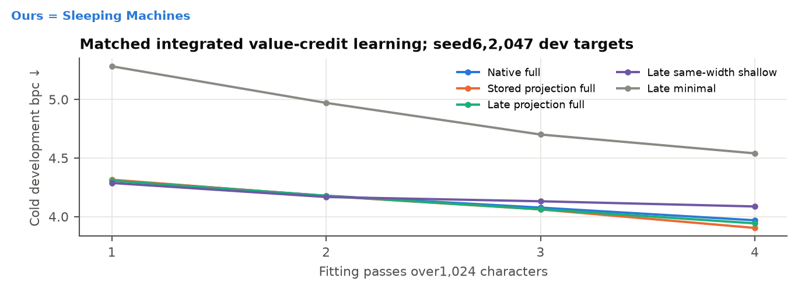

Late-full gain over native:+0.0260bpc; over stored projection:-0.0391; over minimal:+0.5975; over same-width shallow:+0.1441. The predeclared nomination gate fails.

Late projection preserves fixed-weight computation by linearity and restores fixed-feature projection credit from old detached slots. It does not restore historical core-producer credit or add linear-reader expressivity. Fixed hash addresses are not learned pooling/KV race attention. The same-width shallow arm isolates depth better than the width-changing minimal control. Reused dev and one seed: exploratory quality/learning evidence, not semantic proof or supremacy.

## Appendix B. Value-credit resources and protocol boundaries

| Model | Whole fit GFLOPs est. | Fit MFLOPs/target est. | Cold infer MFLOPs/target | Replay GFLOPs est. | Warm infer MFLOPs/target |
| --- | --- | --- | --- | --- | --- |
| Native full p16/L8 | 1.893 | 0.463 | 0.0974 | 0.100 | 0.0974 |
| Stored projection p16/L8 | 1.924 | 0.470 | 0.1016 | 0.104 | 0.1016 |
| Late projection p16/L8 | 1.933 | 0.472 | 0.0999 | 0.104 | 0.1006 |
| Late p16/L1 | 0.348 | 0.085 | 0.0203 | 0.022 | 0.0210 |
| Late p2/L1 | 0.018 | 0.004 | 0.0012 | 0.001 | 0.0012 |

| Model | Core slots | Extra occupied/capacity | Updates/keys/teacher values per fit target | Context reads/writes per fit target |
| --- | --- | --- | --- | --- |
| Native full p16/L8 | 32 | 0/0 | 16/32/32 | 0.000/0.000 |
| Stored projection p16/L8 | 32 | 757/4096 | 16/32/32 | 1.000/0.999 |
| Late projection p16/L8 | 32 | 757/4096 | 16/32/32 | 1.000/0.999 |
| Late p16/L1 | 4 | 757/4096 | 2/4/4 | 1.000/0.999 |
| Late p2/L1 | 4 | 757/4096 | 2/4/4 | 1.000/0.999 |

Every column uses the same unit/denominator for all five models. Whole fitting costs are representative first/mature/partial-window estimates from actual forward/loss/backward/normalization/clipping/Adam audits, with admitted losing-value work charged.2FLOPs/MAC plus unit-weight specials; CPU emulator here. Projected clockless costs are separate in the completed JSON ledger. Variable retrieval occupancy and graph reach are not fully enumerated.

Warm evaluation replays all1,024 fit tokens with frozen selected weights, then carries predictive state/time into dev. Hash history and previous-address are cleared at the boundary to forbid an invented cross-split outcome. Dev race noise is coupled to cold scoring. Replay cost is extra work, estimated from first/last replay chunks; it is neither fitting FLOPs nor free access to historical data. Neural slots update causally during dev with frozen parameters.

Late/original full fitting work ratio:1.004×. All direct/core and additional memory work must earn predictive value. No automatic scale-up. The nomination gate requires at least.02bpc cold gains against all four controls and no more than2× original-full fitting work under this common estimate convention.

Hash/integer bookkeeping, RNG, traffic, Python metadata and physical energy remain separate. Cold/replay scores here use2,047 dev targets and cannot be directly juxtaposed with saved8,191-target count/dense references. Original-minimal projection contrast remains open; AWS integrated capacity/exposure work remains independent. Complete work/activity/storage and exact-source checkpoint provenance are retained in local_value_credit_analysis_20261002T090800Z.json.

## Appendix B. Fixed-feature credit and compiled inference

Frozen-reader compilation folds A=R_vW once and removes the unused W matrix. Coupled predictions and raw-slot state preserve the unfused construction within numerical tolerance. Under2FLOPs/MAC, fold2d³ replaces2d² per occupied read, breaking even after d occupied reads. This changes deployment work, not the fitting optimizer; compiled models refuse training.

| Late model | Unfused infer KFLOPs/target | Fused infer KFLOPs/target | Removed weights | Fold KFLOPs | Break-even occupied reads |
| --- | --- | --- | --- | --- | --- |
| late_full | 100.180 | 99.540 | 1024 | 65.536 | 32 |
| late_shallow | 20.562 | 19.922 | 1024 | 65.536 | 32 |
| late_minimal | 1.224 | 1.214 | 16 | 0.128 | 4 |

Inference samples include16 actual targets after128 warm tokens; the saved projection work equals2d² times observed occupied reads. Matrix-fold work is charged above; constructor initialization/copy/RNG are separate. This is arithmetic/weight reduction with frozen quality, not measured latency, energy or competitive superiority.

| Text-trained model | Prefix-pair KL, gap8 | Prefix-pair KL, gap32 | Prefix-pair KL, gap64 |
| --- | --- | --- | --- |
| native_full | 2.14e-04 | 1.84e-03 | 3.46e-04 |
| addressed_full | 1.94e-03 | 5.28e-04 | 1.10e-03 |
| late_full | 1.87e-03 | 4.80e-04 | 5.50e-04 |
| late_shallow | 1.88e-06 | 3.18e-07 | 2.90e-07 |
| late_minimal | 8.10e-14 | 0.00e+00 | 0.00e+00 |

Each parity diagnostic balances all four input bit pairs with identical noise/query suffix. Actual causal query count vectors are identical for orders1–8, but targets are opposite across paired prefixes. A predictor restricted to those suffix/count inputs has at least1bit target logloss; the full prefix determines parity exactly. Cue-free prefixes make the count contract explicit, replacing the retired synthetic all-orders independence assertion.

These frozen text checkpoints were never trained on parity. KL and top-context differences diagnose prefix dependence/retention, not parity learning or semantic abstraction. Zero optimizer steps, parameter fingerprints unchanged. A later task fit needs matched full/shallow controls, new-prefix generalization and complete prefix computation/credit accounting. Historical feature-producer credit, learned address pooling and KV races remain open. Source: local_value_credit_frozen_20261002T090800Z.json; theory63 records exact scope.

## Appendix B. Frozen feature geometry and matched count calibration

| Model | Frozen fit bpc | Cold dev bpc | Fit head gradient norm | Dev feature participation rank |
| --- | --- | --- | --- | --- |
| native_full | 3.6920 | 3.9681 | 0.597 | 2.31 |
| addressed_full | 3.6595 | 3.9030 | 0.536 | 1.95 |
| late_full | 3.7272 | 3.9421 | 0.637 | 1.60 |
| late_shallow | 3.8785 | 4.0862 | 0.249 | 4.53 |
| late_minimal | 4.5775 | 4.5396 | 0.323 | 1.21 |

At the selected weights, replay1,023 fitting and2,047 development targets from cold state with the primary evaluation RNG. Capture actual head inputs, then compute fixed-feature linear-head loss derivatives and covariance in float64. No head fitting, optimizer step or parameter changes. Frozen dev scores reproduce the primary results within1e−5bpc.

The participation rank is (trace C)²/trace(C²), a measure of feature geometry. Finite joint training need not make the final head stationary; its gradient norm and covariance rank alone do not identify a bug or semantic abstraction. Frozen fitting loss helps separate training fit from development generalization without using online training scores.

| Count order | Frozen KN bpc | Frozen WB bpc | Frozen AD bpc | Adaptive WB bpc | Adaptive AD bpc |
| --- | --- | --- | --- | --- | --- |
| 1 | 3.8263 | 3.8008 | 3.8692 | 3.4806 | 3.5024 |
| 2 | 3.7986 | 3.9596 | 3.9576 | 3.1259 | 3.1566 |
| 3 | 3.7530 | 4.1254 | 4.0371 | 3.0285 | 3.0271 |
| 4 | 3.7515 | 4.2123 | 4.0771 | 3.0873 | 3.0308 |

Same1,024 fit characters and2,047 dev targets, reused count-reference implementation, fixed discount.75, all orders/methods shown separately. Count construction uses one pass; learned models use four gradient passes. Counts are fit-prefilled; adaptive variants also update from observed dev outcomes after prediction. These state/history policies differ from cold neural scoring; frozen neural fit replay is reported separately above.

KN: interpolated Kneser–Ney; WB: Witten–Bell; AD: absolute discount. Integer represented count increments/lookups and measured construction/scoring wall time are in the completed audit, without conversion to neural FLOPs. Equal scalar loss calibrates prediction quality; it does not establish identical features or a same-quality compute advantage. No per-target order selection or official-test access. Full spectra, data/checkpoint hashes and diagnostic boundaries are retained in local_value_credit_frozen_20261002T090800Z.json.

## Appendix B. Beyond query counts: balanced joint learning

Each episode observes a bit followed by its complement, then another such pair, eight shared noise symbols and a unique query cue. The target is the relation between the earlier bits. All four bit combinations occur for each noise suffix. Observed symbol totals and actual order-0..8 query count vectors match; all 36 declared WB/AD controls score one bit.

| Integrated model | Dev bits/query | Dev accuracy | Selected pass |
| --- | --- | --- | --- |
| native_full | 0.9995 | 50.00% | 8 |
| tapped_full | 1.0002 | 48.44% | 14 |
| tapped_shallow | 1.0002 | 50.00% | 16 |

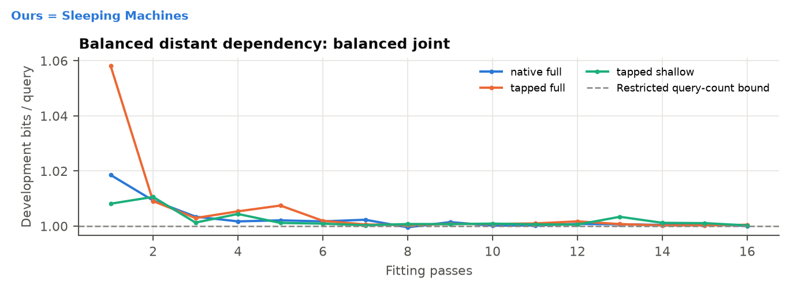

The native and learned-delay variants fail the predeclared 75%/.8-bit dependency gate. Eight fitting suffix groups give 32 targets/pass; 16 passes,512 target presentations,64 Adam updates,64 held-out dev targets. All arms have query-only binary supervision and full 15-event credit; the target is never an input. Noise couples the quartet and variants.

The one-bit bound restricts the predictor to query suffix/count inputs, including root marginals. It excludes arbitrary inspection of the full prefix or other count addresses. Counts should lead in their supported local regime; this test asks for useful nonlocal prediction. One selected seed/development set, not semantic language or supremacy.

## Appendix B. Balanced-core fitting and inference work

| Model | Whole fit GFLOPs est. | Fit MFLOPs/target est. | Inference MFLOPs/query | State tensor bytes |
| --- | --- | --- | --- | --- |
| native_full | 0.5603 | 1.0943 | 0.2424 | 720 |
| tapped_full | 0.6186 | 1.2081 | 0.2750 | 4560 |
| tapped_shallow | 0.1998 | 0.3903 | 0.0978 | 496 |

All rows use 512 query-target presentations as the fitting denominator. Inference includes all 15 episode inputs and query loss. Full prefix forward/backward, losing receiver values, normalization/clipping and Adam are charged. First/last complete optimizer windows supply the whole-fit estimates; routing occupancy is not exhaustively traced.2FLOPs/MAC plus unit specials, including declared delay-index rounding. Actual keys/commits/input events and wall/RSS are saved separately.

Delay taps add bounded per-layer input buffers, trainable delays and projections while retaining native temporal races and private persistent receivers. Zero taps exactly nest native prediction and parent gradients. Seven contracts include actual interrupted-driver and full-shape Adam recovery. The same-width shallow control retains these mechanisms but has fewer layers; initialization also changes, so this is an architecture comparison.

Memory traffic, integer/index bookkeeping, RNG, checkpoint I/O and hardware energy remain outside floating arithmetic. More retention capacity or a valid derivative is not a completed quality advantage. All unsuccessful arms and previous language evidence remain preserved; full source/data/result hashes are in the completed analysis JSON.

## Appendix B. Frozen retention versus interaction decoding

| Encoder / degree | Fit bits/query | Fresh bits/query | Fresh accuracy |
| --- | --- | --- | --- |
| native full selected / 1 | 0.994 | 1.063 | 50.78% |
| native full selected / 2 | 0.920 | 12.138 | 50.78% |
| native full initial / 1 | 0.999 | 1.026 | 50.00% |
| native full initial / 2 | 0.876 | 25.333 | 50.78% |
| tapped full selected / 1 | 0.999 | 1.011 | 49.22% |
| tapped full selected / 2 | 0.943 | 21.694 | 50.00% |
| tapped shallow selected / 1 | 1.000 | 1.011 | 50.00% |
| tapped shallow selected / 2 | 0.980 | 7.876 | 50.00% |

| Frozen encoder | First-bit probe accuracy | Second-bit probe accuracy |
| --- | --- | --- |
| native_full_selected | 50.78% | 51.56% |
| native_full_initial | 50.78% | 48.44% |
| tapped_full_selected | 50.78% | 53.12% |
| tapped_shallow_selected | 50.78% | 51.56% |

Freeze the selected encoders, plus native initial weights as a reservoir control. Fit zero-initialized affine or standard degree-2 polynomial residuals on actual query features. Fitting standardization only; four race-noise views of the same32 fitting episodes. Regularized full-batch L-BFGS, fixed lambda1e-5/100 iterations; reported derivatives do not establish convergence. New seed73001 has32 paired suffix groups/128 targets and never selects readout settings or weights.

Neither readout generalizes; polynomial heads become badly overconfident. Separate one-bit probes also remain near chance. They use extra bit supervision only for diagnosis; their outputs never enter the relation predictor. These failures motivate evidence-access tests rather than assuming a larger decoder solves the current model.

Zero core optimizer steps and encoder fingerprints preserved. Eight predeclared readout arms on one fresh synthetic distribution, not general confirmation or a semantic claim. Failed probes do not prove all information was erased or a universal learning ceiling.

## Appendix B. Complete frozen-readout pipeline resource boundary

| Encoder / degree | Total fitting GFLOPs est. | MFLOPs/distinct fit query | Inference MFLOPs/query est. |
| --- | --- | --- | --- |
| native full selected / 1 | 0.5918 | 18.495 | 0.2424 |
| native full selected / 2 | 0.6061 | 18.942 | 0.2428 |
| native full initial / 1 | 0.0315 | 0.985 | 0.2424 |
| native full initial / 2 | 0.0456 | 1.426 | 0.2428 |
| tapped full selected / 1 | 0.6543 | 20.447 | 0.2751 |
| tapped full selected / 2 | 0.6686 | 20.894 | 0.2755 |
| tapped shallow selected / 1 | 0.2129 | 6.654 | 0.0979 |
| tapped shallow selected / 2 | 0.2270 | 7.095 | 0.0983 |

Every total includes the entire earlier encoder fit, four-view feature-prefix replay and actual residual-head optimization/feature construction. Initial weights pay zero encoder fitting. The common denominator here is32 DISTINCT fitting queries for every row, rather than differing L-BFGS closure counts. This denominator differs explicitly from the presentation-based table above. Closure target evaluations and exact head work are saved separately. The same feature replay is charged once to each hypothetical standalone arm.

Every inference estimate includes processing the complete prefix plus the chosen query head. Encoder replay/inference estimates use coupled first-quartet operation audits; head construction, loss, backward and optimizer operations are traced directly. Separate retention-probe supervision/work is diagnostic overhead, not free parity training. Raw candidate/traffic/metadata/RNG costs and measured energy remain separate.

Local vector products are supporting primitives, not substitutes for the native temporal core or evidence of learned KV routing. Numerical contracts verify polynomial adjoints, regularized fixed-feature gradients, zero nesting, causal integrated prediction and restored head outputs. Preserve these negative results beside the subsequent protected-memory hypothesis; no favorable cell is inferred from unfinished training.

## Appendix B. Protected outcomes and joint terminal races

Each observed token writes its observed successor at its predecessor address, never a target-derived or hand-selected bit address. All occupied addresses are candidates. Two learned query/key exponential races deliver small interpreted symbol values to a generic bilinear query decoder. Native temporal computation, sparse vector receivers and earlier counterfactual learning remain. No XOR extraction enters prediction.

| Integrated arm | Selected dev bits | Reserved bits | Reserved accuracy | Selected pass |
| --- | --- | --- | --- | --- |
| joint_full | 0.077 | 0.102 | 96.09% | 16 |
| local_full | 0.933 | 0.750 | 78.12% | 13 |
| joint_shallow | 0.062 | 0.119 | 95.31% | 16 |

Reserved seed74001/32 groups/128 queries scores fixed selected weights after all fits; no retuning. Joint-minus-local loss improvement:+0.648 bits; full-minus-shallow improvement:+0.017 bits. The joint-credit gate passes; all arms remain visible.

One fitted seed and structured generator. Sixteen fit groups/64 queries,16 passes, U4/lr.01/p4/H2/pool2,fullL2/shallowL1. The one-bit bound applies to identical query suffix/count inputs including root marginals, not arbitrary inspection of other count addresses. No natural-language, dense-control or resource-supremacy claim.

## Appendix B. Joint-credit work, capacity and activity

| Arm | Whole fit GFLOPs est. | Fit MFLOPs/query est. | Inference MFLOPs/query |
| --- | --- | --- | --- |
| joint_full | 0.2379 | 0.2323 | 0.0534 |
| local_full | 0.2319 | 0.2265 | 0.0534 |
| joint_shallow | 0.1534 | 0.1498 | 0.0361 |

| Arm | Core / raw address capacity | Mean raw occupied | Core commits / raw writes per query | Terminal keys / values per query | Training loss pairs per query |
| --- | --- | --- | --- | --- | --- |
| joint_full | 8 / 27 | 10.56 | 60 / 14 | 21.12 / 2 | 112.06 |
| local_full | 8 / 27 | 10.56 | 60 / 14 | 21.12 / 2 | 0.00 |
| joint_shallow | 4 / 27 | 10.56 | 30 / 14 | 21.12 / 2 | 112.06 |

All fitting columns use1,024 query presentations,256 Adam updates and all15 observed prefix events per query. Whole-fit first/last-window estimates include native candidates, losing proposals, protected-state discovery, terminal decoder/loss, backward, clipping and Adam. Inference scores every occupied key and delivers only two values. Available addresses, occupied state, scored keys, commits, raw writes and value deliveries are distinct; sparse activity does not imply zero key or learning cost.

Joint training enumerates C² terminal losses and differentiates their categorical expected risk, giving exact conditional terminal content-choice credit. Local training uses a sampled pair and the existing value-linearized race surrogate. Their initial forward predictions and inference policy match; learning estimators differ. Earlier native route surrogates, raw fixed-address writes and downstream timing credit remain separate limitations. No exact whole-sequence gradient is claimed.

Joint/local whole-fitting work ratio:1.026. 2FLOPs/MAC plus unit specials; traffic, raw integer state, Python objects, RNG and energy separate. Five contracts and three accounting smokes precede fits. The same-width shallow comparison changes initialization too. A successful protected-state read does not prove learned context pooling, arbitrary-distance KV retrieval or useful deep producer credit.

## Appendix B. Fixed joint-credit confirmation

| Fit seed / credit | Selected dev bits | New suffix bits | New suffix accuracy | Pass | Zero-value accuracy |
| --- | --- | --- | --- | --- | --- |
| s7 / joint | 0.055 | 0.050 | 99.22% | 16 | 98.83% |
| s7 / local | 0.009 | 0.003 | 100.00% | 15 | 100.00% |
| s8 / joint | 0.000 | 0.000 | 100.00% | 16 | 75.00% |
| s8 / local | 0.001 | 0.004 | 100.00% | 16 | 99.22% |

| Fit seed | Joint improvement bits/query | Paired suffix interval | Joint/local fitting work |
| --- | --- | --- | --- |
| 7 | -0.046 | [-0.093, -0.016] | 1.025 |
| 8 | +0.003 | [+0.000, +0.008] | 1.026 |

Two additional fitted seeds7/8 use the unchanged full p4/L2 configuration and16 passes. All four declared fits are shown. Development seed72001 selects the minimum across fixed passes; seed75001/64 suffix groups/256 targets is reserved for fixed selected models. No parameter, learning rate, stopping rule or evaluation setting is retuned on this set.

0 of2 declared joint-versus-local gates pass. A seed must reach at least75%/.8bits and improve local credit by.05bits. Paired suffix bootstrap intervals are conditional on the fitted seed and synthetic generator; they are not a broad confidence interval over learning algorithms or tasks.

Initial predictions, race choices and probabilities match within each joint/local pair. Inference mechanisms are identical. The differing training risk/credit objectives therefore test this terminal learning intervention, while protecting all earlier negative evidence.

Zero-value evaluation removes delivered content while keeping native context, query/key races and contextual decoder. No fitting or model selection; every parameter is restored and verified afterwards. Three arms retain98.8–100% accuracy: native context has learned useful nonlocal prediction. Joint seed8 drops to75%. Value delivery is therefore not necessary in every selected fit; neither its training benefit nor a depth premium is isolated.

Query-suffix/count bound only. The protected bank has fixed observed predecessor addresses and no learned writes; the standard bilinear decoder and exact terminal content credit do not establish deep core learning, clock-gradient accuracy or natural-text gains.

## Appendix B. Confirmation fitting and inference resources

| Seed / credit | Whole fit GFLOPs est. | Fit MFLOPs/query est. | Inference MFLOPs/query | Fit wall seconds |
| --- | --- | --- | --- | --- |
| s7 / joint | 0.2373 | 0.2318 | 0.0534 | 302.3 |
| s7 / local | 0.2314 | 0.2260 | 0.0534 | 315.3 |
| s8 / joint | 0.2380 | 0.2324 | 0.0534 | 307.6 |
| s8 / local | 0.2320 | 0.2266 | 0.0534 | 309.0 |

Every row fits64 distinct queries for16 passes:1,024 target presentations and256 Adam updates, all15 prefix events per query. Whole-fit and per-target columns share that denominator. First/last complete optimizer-window estimates include prefix/native races, all terminal candidate values, joint pair losses where applicable, backward, normalization/clipping and Adam. Measured wall and RSS are separate from FLOPs.

All models have8 native receivers plus27 raw outcome addresses. Each query causes 60 native state commits and14 raw outcome writes. Terminal inference scores2C keys and delivers2 values. Joint training enumerates C² losses; both training arms inspect C candidate values. C depends on observed occupancy and is recorded in activity traces.

Additional counterfactual arithmetic buys prediction improvement only where completed results support it. A quality advantage at this budget is not an iso-quality compute advantage; shorter or better-controlled local fits have not been optimized. No measured energy, candidate-discovery latency or hardware throughput claim is inferred.

One guarded one-thread CPU job at a time, watchdog active,8GiB available-memory floor. Unique queues, checkpoints, source/data hashes and failed results preserved. This confirmation adds seed evidence for a small structured nonlocal relation, not architectural supremacy or superiority to an unrestricted count-memory algorithm.

## Appendix B. A terminal symmetry, not a learning impossibility

| Numerical contract | Completed result |
| --- | --- |
| Actual outcome bank | Uniform two-value law identical across second-bit alternatives |
| Fixed zero-context risk | 1.000000bits |
| Maximum decoder gradient | 6.939e-18 |
| Maximum policy gradient | 0.000e+00 |
| Analytic marker-policy witness | 6.921e-09expected bits |

At query time the four distinguished outcome addresses contain b1,b2,1−b2,n0. Their multiset is b1,0,1,n0. Remaining entries depend only on the shared noise suffix. Uniform independent value reads therefore have the same full joint distribution for both second-bit alternatives. If additional context also lacks that bit, no decoder of those values can predict the balanced relation better than one bit.

At zero residual, every candidate pair has the parent logit. Exact terminal key credit is initially zero. With fixed zero-logit uninformative context, uniform policies and balanced examples, decoder gradients are zero too. The actual bank and decoder contracts verify this conditional stationary point in float64 on four suffix groups. This is not a stationary-point proof for the whole trainable native core.

An explicit target-independent existence witness selects marker addresses24/25 and interprets symbols0/1 as signed values. A bilinear interaction can predict their relation with very small expected loss. The witness is analytic and never enters the fitted model or benchmark score. Finite score clamps leave a nonzero routing error floor, so unlimited decoder confidence need not reduce unconditional expected loss.

The useful solution and terminal symmetry coexist. Random key contrast may break the alias, which is compatible with late fitted transitions but does not prove their cause. A new controlled conditioning study must retain all seeds and mechanisms; these fixed confirmation fits are neither extended nor tuned after observation.

Theory70 states the information conditions and proof. Numerical result records source hashes, targets, wall and RSS. The obstruction concerns addressed value pooling and terminal initialization; it does not imply that all counting, temporal computation or architectural adaptation faces a mathematical ceiling.

## Appendix B. Practical headroom: a stronger joint-event table

| Fixed table evaluation | Queries | Accuracy | NLL | Maximum accuracy headroom |
| --- | --- | --- | --- | --- |
| development | 256 | 99.609% | 0.051632 | 0.391pp |
| confirmation | 1024 | 99.512% | 0.055258 | 0.488pp |

This control consumes observed timestamps as well as text. It retains the complete question string and the latest observed time for each of four marks. A generic fit learns one mark-age split per question: which mark, threshold, split direction and both leaf probabilities. The generator word/mark mapping and recency threshold are not supplied.

Same512 distinct fitting episodes/seed1301,one fitting pass,20 question strings; fit wall0.027026s,maxRSS67,940KiB. Fixed learner; dev2301/256 and confirmation3301/1,024 episodes do not tune it. Contracts verify label mutation, appended future observations and common clock shifts cannot change causal prediction features.

Less than half a percentage point of accuracy headroom remains. The proposed20-point learned-control advantage gate is impossible against this reference on these episodes, even for a perfect learner. A gain over the time-blind table would therefore measure extra supplied information rather than demonstrate the requested practical advantage.

The joint recency task remains a capability and mechanism diagnostic. Likelihood may still improve; neither saturated accuracy nor tiny fitting cost supports general supremacy. Strong real-stream calibration with causal common inputs takes priority. Old successful mechanism evidence and negative results are preserved.

Logical content inspections, timestamp writes, age subtraction, sorting comparisons, threshold candidates, count/probability work and wall are saved. They are not converted to neural FLOPs. Full question lookup is a task-specific conventional control, not a general language model or the integrated research architecture. Theory72 records scope.

## Appendix B. Real gesture practical calibration

A meaningful practical region:984 first-second fitting gestures from users1–19 and192 development gestures from users20–23. The common causal representation has4×4 spatial cells, two polarities and20 observed50ms count closures. No official test was opened.

| Control | Dev accuracy % | Dev NLL | Fit seconds | Dev inference seconds |
| --- | --- | --- | --- | --- |
| Calibrated counts | 58.85 | 1.3734 | 0.042 | 0.000 |
| linear_C0.1 | 61.46 | 1.2036 | 0.742 | 0.001 |
| linear_C1 | 59.38 | 1.5903 | 0.439 | 0.001 |
| linear_C10 | 57.81 | 2.4610 | 0.191 | 0.001 |
| rbf_C1_g0.25 | 67.19 | 0.8804 | 0.860 | 0.068 |
| rbf_C1_g1 | 74.48 | 0.7358 | 1.142 | 0.078 |
| rbf_C1_g4 | 73.44 | 0.8643 | 1.816 | 0.077 |
| rbf_C10_g0.25 | 68.23 | 0.8122 | 0.799 | 0.073 |
| rbf_C10_g1 | 73.44 | 0.7065 | 1.259 | 0.072 |
| rbf_C10_g4 | 72.40 | 0.8338 | 1.808 | 0.086 |

The lowest development-NLL control is rbf_C10_g1; its accuracy exceeds calibrated counts by14.58points. Maximum grid accuracy is74.48%, so this observation protocol has headroom rather than the99.5% saturation of the cheap recency table. This admits an integrated learning test, not a native advantage claim. The older weak dense gesture screens are not the practical ceiling.

All nine fixed learned cells are preserved. Linear/RBF controls use fitting-only log-count centering/scaling. Counts use all640 time bins and3-fold fitting-only alpha/temperature calibration; this avoids treating correlated camera events as independent label evidence. SVM probability calibration is included in measured fitting.

Common raw preprocessing costs123.976s. The complete control campaign takes15.926s with411.1MiB peak process RSS. Table inference uses the complete192-example batch. Third-party solver FLOPs are unmeasured, not zero; CPU wall, arithmetic, storage and energy are distinct. Development selection and one fitted seed are exploratory evidence, not independent confirmation.

## Appendix B. Integrated real-packet quality and work

| Model | Dev accuracy % | Dev NLL | Whole fit GFLOPs est. | Fit MFLOPs / target est. | Infer MFLOPs / prefix est. |
| --- | --- | --- | --- | --- | --- |
| Calibrated counts | 58.85 | 1.3734 | Unmeasured | Unmeasured | Unmeasured |
| linear_C0.1 | 61.46 | 1.2036 | Unmeasured | Unmeasured | Unmeasured |
| linear_C1 | 59.38 | 1.5903 | Unmeasured | Unmeasured | Unmeasured |
| linear_C10 | 57.81 | 2.4610 | Unmeasured | Unmeasured | Unmeasured |
| rbf_C1_g0.25 | 67.19 | 0.8804 | Unmeasured | Unmeasured | Unmeasured |
| rbf_C1_g1 | 74.48 | 0.7358 | Unmeasured | Unmeasured | Unmeasured |
| rbf_C1_g4 | 73.44 | 0.8643 | Unmeasured | Unmeasured | Unmeasured |
| rbf_C10_g0.25 | 68.23 | 0.8122 | Unmeasured | Unmeasured | Unmeasured |
| rbf_C10_g1 | 73.44 | 0.7065 | Unmeasured | Unmeasured | Unmeasured |
| rbf_C10_g4 | 72.40 | 0.8338 | Unmeasured | Unmeasured | Unmeasured |
| Ours p16/L2/H2 | 65.10 | 0.9632 | 20.075 | 2.550 | 0.592 |

Same984 distinct fitting gestures and192 subject-disjoint development targets. Ours fits eight fixed passes:7,872 target presentations and496 Adam updates,U16, lr.003, seed6. Conventional solvers have their own convergence/calibration policies; equal pass or fitting-work protocols are not claimed. Every learned baseline is retained.

Selected native pass8: accuracy difference versus minimum-NLL control-8.33points, NLL improvement -0.2567. Development quality dominance flag: False. Independent practical advantage remains unproved; no pending, best-seed or official-test prediction fills this table.

Native estimates include complete prefix/query forward/backward, all scored keys, candidate values, counterfactual value credit, normalization/clipping and Adam. First/last windows are sampled by actual16/8 target size;2FLOPs/MAC and unit-weight special functions. Solver arithmetic is unmeasured. Preprocessing, validation, traffic and measured CPU latency must be charged separately; isolated inference estimates cannot establish total resource or energy advantage.

## Appendix B. Real-packet learning, capacity and total workflow

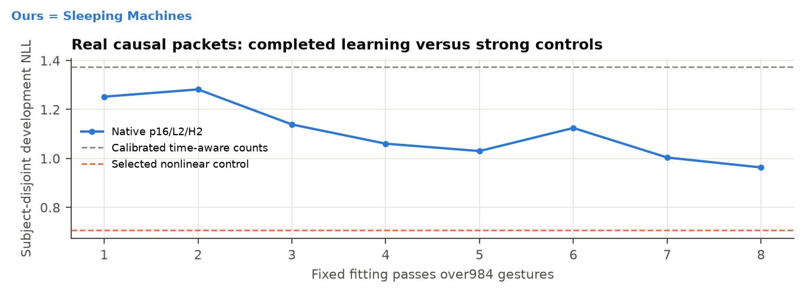

| Completed native quantity | Value |
| --- | --- |
| Parameters / available receivers | 15,523 / 8 |
| Persistent state tensor bytes | 720 |
| Keys / selected updates / counterfactual values per fitting prefix | 168.0 / 84.0 / 168.0 |
| Fit plus nonfitting forward GFLOPs estimate | 21.256 |
| Native workflow / whole control grid seconds | 1557.590 / 15.926 |
| Common raw preprocessing seconds | 123.976 |
| Native / grid workflow plus preprocessing seconds | 1681.566 / 139.902 |
| Native peak process RSS MiB | 347.8 |

The unchanged native core computes through temporal races, separate keys/values, sparse persistent receiver updates and local mixing. Nonempty observed packets arrive at their physical closure and an observed query at1s; state resets per gesture. Race noise depends on pass/fitting seed, never clip identity, index or label. Counts are observed camera content rather than fitted statistical prediction experts.

Workflow wall includes fitting, validation, checkpoints and operation profiling; the complete control-grid wall includes all fixed solvers, calibration, scoring and serialization. Nonfitting neural forward work is estimated using completed prefix samples; raw preprocessing is common and added once to each pipeline. Small tensor state does not mean small process RSS, zero scoring cost, useful extra depth or zero optimizer work. Earlier numerical admission/research costs remain separately saved.

## Appendix B. Frozen practical inference and storage

| Model | Dev accuracy % | Dev NLL | Sequential ms / prefix | Saved model KiB |
| --- | --- | --- | --- | --- |
| Calibrated counts | 58.85 | 1.3734 | 0.013 | 55.4 |
| linear_C0.1 | 61.46 | 1.2036 | 0.163 | 66.1 |
| linear_C1 | 59.38 | 1.5903 | 0.161 | 66.1 |
| linear_C10 | 57.81 | 2.4610 | 0.167 | 66.1 |
| rbf_C1_g0.25 | 67.19 | 0.8804 | 0.717 | 4632.4 |
| rbf_C1_g1 | 74.48 | 0.7358 | 0.670 | 4730.5 |
| rbf_C1_g4 | 73.44 | 0.8643 | 0.711 | 5081.4 |
| rbf_C10_g0.25 | 68.23 | 0.8122 | 0.608 | 4451.8 |
| rbf_C10_g1 | 73.44 | 0.7065 | 0.671 | 4766.6 |
| rbf_C10_g4 | 72.40 | 0.8338 | 0.680 | 5081.4 |
| native | 65.10 | 0.9632 | 55.076 | 103.9 |

All models consume the same saved observed first-second packet counts, one prefix at a time on one CPU thread. Fit-only feature transformation and native race simulation are timed. Three deterministic repeats measure execution variation; they are not independent fits. Warmup, loading and common raw event coalescing are reported separately.

Every frozen probability matches the completed development result and every repeated prediction is identical. Native weights are the fixed minimum-NLL selected checkpoint; no model is refitted, temperature-adjusted or selected during this audit. All conventional cells remain visible, including faster or better alternatives.

Storage is uncompressed joblib serialization of each fitted model plus its necessary fitting-only transform. It is not resident process memory or memory traffic. Native parameter tensor bytes and persistent state bytes are separate quantities. CPU emulator latency cannot be relabelled as event-hardware latency or measured energy.

Subject-disjoint development evidence only. A quality/resource tradeoff here requires frozen independent confirmation before promotion. No test leakage, broad supremacy, useful-depth premium or dormant-capacity advantage is inferred from this audit.

## Appendix B. Real learned features versus the initial reservoir

| Frozen encoder | Original accuracy % | Fresh-head accuracy % | Fresh-head NLL | Head | Replay seconds | Head grid seconds |
| --- | --- | --- | --- | --- | --- | --- |
| initial | 12.50 | 57.81 | 1.1311 | rbf | 66.606 | 2.949 |
| selected | 65.10 | 67.19 | 0.9999 | linear | 66.168 | 1.915 |

Both encoders expose the same32-dimensional query feature and use the same984 fitting/192 development gestures and race draws. Every original prediction is reconstructed exactly by its saved head; replay and new head fitting preserve every encoder parameter. The initial encoder is the exact pre-fitting reservoir, not a separate tuned control.

Three linear C values and six RBF C/gamma cells are evaluated by3-fold fitting-only decoder NLL. The selected head is then fitted once on all fitting features. No head hyperparameter is selected on development. Scaling is fitting-fold only. Conditional decoder CV is not unbiased end-to-end validation because the selected encoder already saw all fitting labels during its original fit.

The fitted representation gives a better selected readout than the initial reservoir: 67.19% versus57.81%. This supports useful feature learning under this probe protocol. Replacing the fitted head increases accuracy only2.08points and worsens NLL relative to the original65.10%/.963161. The final decoder alone does not close the strong raw-input control gap; failed finite heads also do not prove information is absent.

This is a frozen diagnostic, not an architectural substitution or practical advantage. The selected encoder still pays its original20.075GFLOPs/1557.590s workflow, plus full replay and every readout fit shown here. Solver arithmetic remains unmeasured. Useful extra depth, semantic language features, whole-route gradient accuracy and independent confirmation are separate questions. No official test was opened.

Theory75 states admission and scope. Selected initial/fitted readout artifacts, all fitting-CV cells, native/checkpoint hashes, probability arrays, wall and RSS are saved.

## Appendix B. Shared fitting noise: covariance hypothesis fails its gate

| Saved seed | All variance ratio | Route ratio | Time ratio | Message ratio | Gate |
| --- | --- | --- | --- | --- | --- |
| 6 | 0.99787 | 1.00166 | 1.04860 | 0.99099 | FAIL |
| 7 | 1.00178 | 0.99119 | 0.97407 | 0.99542 | FAIL |

Four fixed fitting prefixes per saved native seed6/7, 32 independent whole-history draws and zero optimizer updates. Each clip gradient is recorded under the same stream. Shared-batch trace covariance is measured; independent-coupling covariance is estimated from those same marginal samples. Their difference equals the cross-clip covariance sum.

Both route-map ratios miss the declared 1.20 admission gate. Proposed fresh_shared/ fresh_independent fits are stopped. Neither model shows a large cross-clip covariance penalty on these prefixes. This is not a corpus-wide result or a test of repeated-noise adaptation across optimizer updates. Small-group variance ratios retain their finite-sample scope.

Theory93 derives the effective-batch covariance law and separates per-window freshness from cross-row decorrelation. Independent noise need not help when cross-covariance is negative. Flipout is a primary-paper analogy about shared perturbation correlation, not an implementation or transferred quality guarantee for these event races.

Two algebra contracts pass. Audit 56.443s/396.2MiB; 0.637545 known diagnostic GFLOPs est. Complete first-draw per-clip forward/backward traces times draws; reporting reductions separate. Frozen weights preserved. No training, official test or superiority claim.

## Appendix B. Causal persistent-state access: positive probe, qualified cause

| Frozen encoder | Feature access | Dimensions | Dev accuracy % | Dev NLL |
| --- | --- | --- | --- | --- |
| initial | Query | 32 | 57.81 | 1.1311 |
| initial | Query+state | 176 | 63.54 | 0.8862 |
| selected | Query | 32 | 67.19 | 0.9999 |
| selected | Query+state | 176 | 71.35 | 0.8591 |

| Encoder | Original fit GF est. | Fit MF / presentation | Core replay GF est. | Replay MF / prefix | Decoder/grid GF |
| --- | --- | --- | --- | --- | --- |
| initial | 0.000000 | 0.000000 | 1.735341 | 1.475630 | Unknown |
| selected | 20.075193 | 2.550202 | 1.735341 | 1.475630 | Unknown |

Same 984 fitting/192 development gestures. Augmentation adds all eight pre-query receiver memories, their ages at source query admission and occupancy flags to the actual 32-dimensional query feature. No future or target-dependent feature. Three contracts reproduce serial state, original probabilities and saved query-probe probabilities while keeping every encoder parameter bitwise fixed. Nine-cell three-fold fitting-only head selection.

Initial augmentation improves NLL by .244819; trained augmentation by .140774. Both pass the declared diagnostic access signal. The trained augmented probe reaches 71.35%/ .859084, versus original native 65.10%/.963161, compact prototype 66.67%/.902951 and strong full RBF 73.44%/.706478. Decoder/grid costs are unknown, so these are quality comparisons and diagnostic signals, not practical advantage.

Important qualification from the completed partition controls: stronger query-only regularization alone reaches .889842; adding full state at that same C contributes only .030759 further NLL improvement. At the weaker C, full-state NLL worsens to 1.278955. Most apparent trained-state gain is therefore compatible with regularization rather than uniquely missing information. Early/later state partitions retain smaller gains.

Theory94/95. Dense all-state probing is a diagnostic, not sparse inference or a new main architecture. Selected encoder saw all fitting labels and was dev-selected; decoder CV is not unbiased end-to-end validation. Known original fit uses 7,872 presentations; current two-pass core replay uses 1,176 prefixes. Solver/materialization/ traffic/energy and total probe fit/inference remain unmeasured rather than zero.

## Appendix B. Retained payloads, clocks, layers and regularization

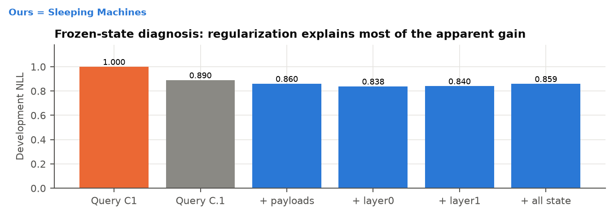

| Encoder | Added state/control | Dims | Accuracy % | NLL | Kind/C |
| --- | --- | --- | --- | --- | --- |
| initial | Payloads | 160 | 63.54 | 0.8862 | rbf/10.0 |
| initial | Clocks | 48 | 55.21 | 1.1245 | rbf/10.0 |
| initial | Layer0 | 104 | 66.15 | 0.9048 | rbf/10.0 |
| initial | Layer1 | 104 | 64.58 | 0.9545 | rbf/10.0 |
| initial | Query@state setting | 32 | 57.81 | 1.1311 | rbf/10.0 |
| initial | State@query setting | 176 | 63.54 | 0.8862 | rbf/10.0 |
| selected | Payloads | 160 | 71.35 | 0.8603 | linear/0.1 |
| selected | Clocks | 48 | 67.71 | 1.0178 | linear/1.0 |
| selected | Layer0 | 104 | 70.83 | 0.8383 | linear/0.1 |
| selected | Layer1 | 104 | 69.79 | 0.8403 | linear/0.1 |
| selected | Query@state setting | 32 | 67.19 | 0.8898 | linear/0.1 |
| selected | State@query setting | 176 | 68.23 | 1.2790 | linear/1.0 |

Four partitions retain the query: both payload layers, ages/occupancy only, layer0 state or layer1 state. Same nine-cell fitting-only decoder selection per partition, both initial and trained encoders. Two fixed configuration swaps per encoder test regularization without another grid or development selection.

Trained payload .860321, layer0 .838315 and layer1 .840329; clocks-only 1.017809. The query C.1 control .889842 explains most full-state gain. These finite probe differences do not isolate a causal depth failure or population conditional information. All outcomes remain visible; core producers/routes were never retrained.

Theory95. Cached features add zero CORE replay, not zero fitting work. Prior encoder fit/core replay retained; additional solver arithmetic unknown. Conditional folds share the label-trained encoder. Producer-held fitting examples are the next decoder-selection check. No official test or supremacy claim.

## Appendix B. Completed packet-scale clock comparison

| Model | Dev accuracy % | Dev NLL | Whole fit GFLOPs est. | Fit MFLOPs / target est. | Infer MFLOPs / prefix est. |
| --- | --- | --- | --- | --- | --- |
| Calibrated counts | 58.85 | 1.3734 | Unmeasured | Unmeasured | Unmeasured |
| linear_C0.1 | 61.46 | 1.2036 | Unmeasured | Unmeasured | Unmeasured |
| linear_C1 | 59.38 | 1.5903 | Unmeasured | Unmeasured | Unmeasured |
| linear_C10 | 57.81 | 2.4610 | Unmeasured | Unmeasured | Unmeasured |
| rbf_C1_g0.25 | 67.19 | 0.8804 | Unmeasured | Unmeasured | Unmeasured |
| rbf_C1_g1 | 74.48 | 0.7358 | Unmeasured | Unmeasured | Unmeasured |
| rbf_C1_g4 | 73.44 | 0.8643 | Unmeasured | Unmeasured | Unmeasured |
| rbf_C10_g0.25 | 68.23 | 0.8122 | Unmeasured | Unmeasured | Unmeasured |
| rbf_C10_g1 | 73.44 | 0.7065 | Unmeasured | Unmeasured | Unmeasured |
| rbf_C10_g4 | 72.40 | 0.8338 | Unmeasured | Unmeasured | Unmeasured |
| Ours original | 65.10 | 0.9632 | 20.075 | 2.550 | 0.592 |
| Ours packet-scale clock | 66.15 | 1.0420 | 20.075 | 2.550 | 0.592 |
| Compact prototype33 | 66.67 | 0.9030 | Unmeasured | Unmeasured | Unmeasured |

Both native fits use984 gestures/eight fixed passes,7,872 presentations and496 updates; 192 subject-disjoint dev targets select pass8 by minimum NLL. Only initial decay rates and rotation frequencies are scaled to the observed50ms packets. Temporal races, key/value separation, sparse updates and counterfactual learning remain. Parameters15,523; available receivers8; per-prefix168 key scores,84 selected updates,168 candidate values.

Clock fit wall1565.128s; peak RSS347.2MiB. Accuracy rises1.04points versus original while NLL worsens. Both trail the selected full kernel and compact prototype in both quality measures. This initialization change does not establish advantage; the original lower-NLL result and all control cells are retained.

Same units and native target denominators in every work column. Solver FLOPs remain unmeasured; unequal solver policies and development tuning preclude iso-FLOP superiority. Raw preprocessing, validation, checkpoints, traffic and energy remain separate. One seed; no official-test access. Source: local_dvs_clock_full_20261002T153000Z.json; theory76.

## Appendix B. Full and partial-window batched learning admission

| Credit | Initial fit NLL | Selected fit NLL | Whole fit GFLOPs est. | Fit MFLOPs / target est. | Infer MFLOPs / prefix est. |
| --- | --- | --- | --- | --- | --- |
| local | 2.6409 | 2.1145 | 0.107699 | 2.2437 | 0.5917 |
| pairs | 2.6409 | 2.1133 | 0.108205 | 2.2543 | 0.5917 |

| Credit | Workflow seconds | Peak RSS MiB | U16 updates | U8 updates |
| --- | --- | --- | --- | --- |
| local | 20.821 | 334.8 | 2 | 2 |
| pairs | 20.524 | 334.9 | 2 | 2 |

Each arm uses24 fitting gestures/two fixed passes and8 development targets:48 target presentations/four Adam updates. Both select pass2 and score25% dev accuracy; dev NLL 2.3115 local and2.3070 pairs. These tiny fixed smokes verify learning and resource readiness, not prediction advantage. All optimizer stages have complete operator coverage. Accounting includes candidate values, backward, normalization/clipping and Adam.

Same p16/L2/H2/pool2 integrated architecture:15,523 parameters,8 available receivers, 21 events per prefix,168 scored keys/84 selected state updates/168 candidate values, 720 persistent-state tensor bytes. Independent-clip batching passes forward/state and every-parameter gradient equality plus actual interrupted model/Adam/cursor recovery.

Optional pair credit enumerates the actual final-query two-head outcome losses. Its conditional risk and all derivatives match explicit enumeration; earlier routes retain local surrogate credit. Inference still delivers two hard winners per layer. No exact whole-core gradient or useful-depth claim follows. The bounded matched pilot is next; stronger full-data controls are reported above and are not comparable tiny-fit controls.

One guarded one-thread job at a time; RSS watchdog and8GiB available-memory floor. Theory77; completed admission record local_dvs_batched_smoke_admission_20261002T163600Z.json. All negative full-fit results remain visible; no pending score fills an evidence table.

## Appendix B. Completed matched credit pilot: terminal pairs / seed6

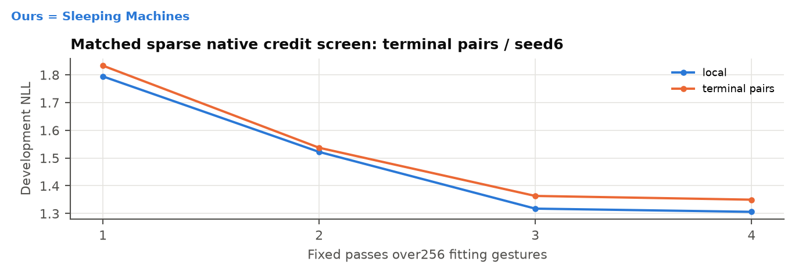

| Credit | Dev accuracy % | Dev NLL | Whole fit GFLOPs est. | Fit MFLOPs / target est. | Infer MFLOPs / prefix est. |
| --- | --- | --- | --- | --- | --- |
| local | 54.17 | 1.3059 | 2.285696 | 2.2321 | 0.5917 |
| terminal pairs | 56.77 | 1.3498 | 2.296461 | 2.2426 | 0.5918 |

| Credit | Workflow seconds | Peak RSS MiB | Keys / fit target | Commits / fit target | Values / fit target |
| --- | --- | --- | --- | --- | --- |
| local | 94.464 | 338.9 | 168 | 84 | 168 |
| terminal pairs | 90.585 | 339.4 | 168 | 84 | 168 |

Fixed256 fit/192 development gestures, four passes/1,024 target presentations/64 Adam updates; same initialization, causal packets, draws and minimum-devNLL selection. Unchanged p16/L2/H2/pool2 architecture:15,523 parameters/eight available receivers; inference168 scored keys/84 commits/168 candidate values per21-event prefix. Fitting activity includes shadow replay where present.

Promotion gate FAILS: NLL improvement -0.043869, accuracy decline-2.604pp, whole-fit work ratio1.0047. Required gain>=.02, decline<=1pp, work ratio<=1.10, peak RSS<900,000KiB. A failed gate stops unchanged confirmation/scale-up; all passes and negative findings retained.

All forward/replay, backward, normalization/clipping and Adam paid;2FLOPs/MAC plus unit specials. Strong984-fit RBF73.44%/.7065 and compact66.67%/.9030 references have unequal fitting data; their solver FLOPs remain unmeasured. See common-unit full-fit tables above. One seed, no official test or superiority claim. local_dvs_credit_comparison_pairs_20261002T174000Z.json; theory77/80–84.

## Appendix B. Completed matched credit pilot: state choice / seed6

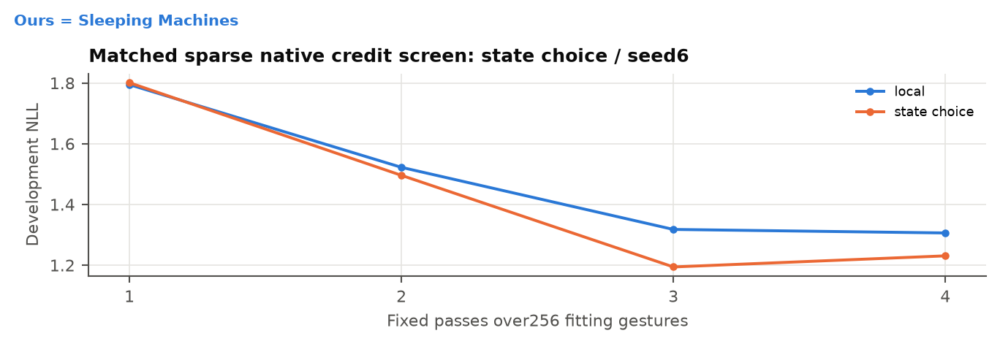

| Credit | Dev accuracy % | Dev NLL | Whole fit GFLOPs est. | Fit MFLOPs / target est. | Infer MFLOPs / prefix est. |
| --- | --- | --- | --- | --- | --- |
| local | 54.17 | 1.3059 | 2.285696 | 2.2321 | 0.5917 |
| state choice | 58.85 | 1.1940 | 3.059796 | 2.9881 | 0.5917 |

| Credit | Workflow seconds | Peak RSS MiB | Keys / fit target | Commits / fit target | Values / fit target |
| --- | --- | --- | --- | --- | --- |
| local | 94.464 | 338.9 | 168 | 84 | 168 |
| state choice | 103.948 | 339.8 | 336 | 168 | 336 |

Fixed256 fit/192 development gestures, four passes/1,024 target presentations/64 Adam updates; same initialization, causal packets, draws and minimum-devNLL selection. Unchanged p16/L2/H2/pool2 architecture:15,523 parameters/eight available receivers; inference168 scored keys/84 commits/168 candidate values per21-event prefix. Fitting activity includes shadow replay where present.

Promotion gate PASSES: NLL improvement 0.111931, accuracy decline-4.688pp, whole-fit work ratio1.3387. Required gain>=.02, decline<=1pp, work ratio<=1.50, peak RSS<900,000KiB. A failed gate stops unchanged confirmation/scale-up; all passes and negative findings retained.

All forward/replay, backward, normalization/clipping and Adam paid;2FLOPs/MAC plus unit specials. Strong984-fit RBF73.44%/.7065 and compact66.67%/.9030 references have unequal fitting data; their solver FLOPs remain unmeasured. See common-unit full-fit tables above. One seed, no official test or superiority claim. local_dvs_credit_comparison_state_choice_s6_20261002T192100Z.json; theory77/80–84.

## Appendix B. Completed matched credit pilot: state choice / seed7

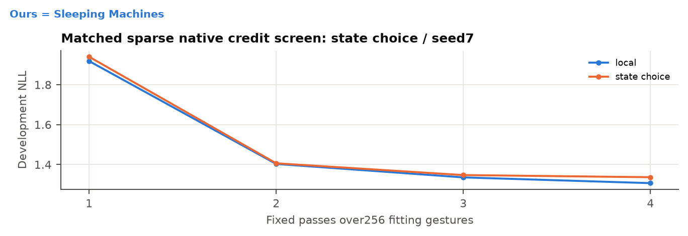

| Credit | Dev accuracy % | Dev NLL | Whole fit GFLOPs est. | Fit MFLOPs / target est. | Infer MFLOPs / prefix est. |
| --- | --- | --- | --- | --- | --- |
| local | 55.21 | 1.3065 | 2.285696 | 2.2321 | 0.5919 |
| state choice | 55.21 | 1.3362 | 3.059796 | 2.9881 | 0.5918 |

| Credit | Workflow seconds | Peak RSS MiB | Keys / fit target | Commits / fit target | Values / fit target |
| --- | --- | --- | --- | --- | --- |
| local | 96.754 | 338.9 | 168 | 84 | 168 |
| state choice | 101.906 | 339.5 | 336 | 168 | 336 |

Fixed256 fit/192 development gestures, four passes/1,024 target presentations/64 Adam updates; same initialization, causal packets, draws and minimum-devNLL selection. Unchanged p16/L2/H2/pool2 architecture:15,523 parameters/eight available receivers; inference168 scored keys/84 commits/168 candidate values per21-event prefix. Fitting activity includes shadow replay where present.

Promotion gate FAILS: NLL improvement -0.029693, accuracy decline0.000pp, whole-fit work ratio1.3387. Required gain>=.02, decline<=1pp, work ratio<=1.50, peak RSS<900,000KiB. A failed gate stops unchanged confirmation/scale-up; all passes and negative findings retained.

All forward/replay, backward, normalization/clipping and Adam paid;2FLOPs/MAC plus unit specials. Strong984-fit RBF73.44%/.7065 and compact66.67%/.9030 references have unequal fitting data; their solver FLOPs remain unmeasured. See common-unit full-fit tables above. One seed, no official test or superiority claim. local_dvs_credit_comparison_state_choice_s7_20261002T193500Z.json; theory77/80–84.

## Appendix B. Completed matched credit pilot: state clock / seed6

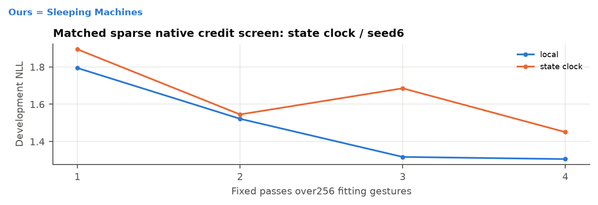

| Credit | Dev accuracy % | Dev NLL | Whole fit GFLOPs est. | Fit MFLOPs / target est. | Infer MFLOPs / prefix est. |
| --- | --- | --- | --- | --- | --- |
| local | 54.17 | 1.3059 | 2.285696 | 2.2321 | 0.5917 |
| state clock | 47.40 | 1.4507 | 3.060638 | 2.9889 | 0.5918 |

| Credit | Workflow seconds | Peak RSS MiB | Keys / fit target | Commits / fit target | Values / fit target |
| --- | --- | --- | --- | --- | --- |
| local | 94.464 | 338.9 | 168 | 84 | 168 |
| state clock | 99.314 | 339.5 | 336 | 168 | 336 |

Fixed256 fit/192 development gestures, four passes/1,024 target presentations/64 Adam updates; same initialization, causal packets, draws and minimum-devNLL selection. Unchanged p16/L2/H2/pool2 architecture:15,523 parameters/eight available receivers; inference168 scored keys/84 commits/168 candidate values per21-event prefix. Fitting activity includes shadow replay where present.

Promotion gate FAILS: NLL improvement -0.144750, accuracy decline6.771pp, whole-fit work ratio1.3390. Required gain>=.02, decline<=1pp, work ratio<=1.50, peak RSS<900,000KiB. A failed gate stops unchanged confirmation/scale-up; all passes and negative findings retained.

All forward/replay, backward, normalization/clipping and Adam paid;2FLOPs/MAC plus unit specials. Strong984-fit RBF73.44%/.7065 and compact66.67%/.9030 references have unequal fitting data; their solver FLOPs remain unmeasured. See common-unit full-fit tables above. One seed, no official test or superiority claim. local_dvs_credit_comparison_state_clock_20261002T174600Z.json; theory77/80–84.

## Appendix B. Actual-write choice: independent-seed gate fails

| Seed | NLL improvement | Accuracy gain pp | Fit work ratio | Declared gate |
| --- | --- | --- | --- | --- |
| 6 | +0.111931 | +4.6875 | 1.33867 | Pass |
| 7 | -0.029693 | -0.0000 | 1.33867 | FAIL |

Same256 fitting/192 development gestures, four fixed passes and1,024 presentations per arm/seed. Seed6 improves54.17%/1.305937 to58.85%/1.194006. Seed7 gives55.21%/1.306508 local versus 55.21%/1.336201 corrected credit. Every pass and both completed comparisons are retained.

The unchanged method fails its independent confirmation gate. No full984-fit campaign, extra pass extension or best-seed promotion is admitted. Numerical credit correctness remains established for the isolated categorical component; repeatable predictive benefit is not. Averaging seeds does not override the predeclared gate.

Next distinguish information access, branch/content credit exposure, common-clock noise and private-map dilution on fitting-only frozen probes. Alternative no-grad forwards teach choices without directly teaching losing content on that realization. Winner-sampled branch derivatives can nevertheless be correct in expectation; rare exposure and other approximate teachers require separate tests. A larger pool is not an automatic repair.

Theory87/88 prioritize one diagnosed repair, numerical contracts, a tiny integrated fit and a prespecified matched-work comparison before independent confirmation. Joint versus alternating route/message updates is a conditional schedule experiment, not a change to the coupled temporal forward computation or a currently demonstrated advantage.

## Appendix B. Why actual write and joint-clock credit need a test

| Frozen model | Opposed directions | Mean |value effect| | Mean |write effect| | Mean |interaction| |
| --- | --- | --- | --- | --- |
| native_full_20261002T145300Z | 4/15 | 0.01699 | 0.00602 | 0.00681 |
| batched_local_pilot_s6_20261002T164700Z | 5/24 | 0.00693 | 0.00130 | 0.00004 |
| batched_pairs_pilot_s6_20261002T164700Z | 5/24 | 0.01225 | 0.00165 | 0.00003 |

Replay32 fixed event/head sites on the first four previously used development clips/model. Both legal winner choices change delivered content and actual persistent writes, with full suffix replay at unchanged current first time and future random draws. Two additional value/write hybrids are diagnostic, not legal routes. Nonzero-comparable direction counts exclude tiny/zero gradients. Absolute effects are not additive attribution percentages.

In the original full model, one alternative improves value-only loss by.01016 but worsens write-only loss by.10514; its legal complete-route effect is+.09193 NLL. The averaged local value teacher favors that harmful alternative. These four original-model clips are correctly classified: this is a conditional credit defect, not attribution of the overall error rate.

Theory78 independently proves a convex affine cross-entropy example where the two-route local teacher reverses exact expected-loss descent. Actual reference/backward contracts pass. The full-state correction replaces one earlier score derivative by pi_i(F_i-b) minus lambda_i*T times the probability-weighted centered loss. It retains sampled content derivatives and includes common-clock credit through later timing jumps. The isolated-node joint likelihood component is exact in expectation; other route teachers remain local, and variance is unresolved.

Routes, messages and time parameters do learn: frozen original/256-fit local/pair models change35.8%/26.2%/25.2% of16,128 audited choices versus initialization, with nonzero updates in every parameter group. Removing routing score-gradient paths leaves the factual forward unchanged but removes incoming-content/message gradients. This does not prove their fitted utility or diagnose the full quality gap.

Learned-window gradients were tested as smooth primitives; fixed-count repeated-arrival fits are a separate mechanism. New silence-burst/popcorn contracts cover scheduled deadlines, causal EOF, fixed-partition gradients and exact finite timeout-bank risk. No integrated learned window or popcorn fit is established. Hard merge/split credit and an irregular adapter remain prerequisites; fixed50ms packet schedules do not test natural silence.

Sources: completed frozen route-content audit171500Z, suffix audit172000Z, curvature contracts165900Z, silence-burst contracts170500Z and joint-clock contracts173000Z; theory78–81. Numerical diagnostics are not held-out superiority evidence.

## Appendix B. Frozen variance audit after the failed clock pilot

| Selected checkpoint | Choice RMS | Common-clock RMS | Clock / choice RMS | Summed variance |
| --- | --- | --- | --- | --- |
| Local | 0.000290 | 0.385649 | 1332 | 2.385095 |
| Joint-clock treatment | 0.000469 | 0.423377 | 904 | 3.252833 |

First four previously used fitting prefixes/model, event9/both layers/heads. Replay both legal delivered values and actual persistent writes through the complete suffix at8/16 exponential-time quadrature nodes, with fixed future draws. Each model pays192 complete legal shadow forwards. No optimizer or new quality score. Magnitudes and summed variances are in score space with the same per-clip/probe convention for both rows.

Decompose the conditional-winner joint score into choice credit pi_i(F_i-R) and common-clock credit pi_i(1-Lambda*T)(R-b). If branch losses are independent of T, the common-clock mean is zero and baseline mismatch alone produces variance ||pi||^2(R-b)^2. Choosing b=R removes it exactly; the constant-outcome numerical contract passes. Time-dependent later route jumps can make the common-clock mean useful, so deleting it universally is not justified.

The current intermediate decoder baseline differs substantially from actual suffix risk. Across these limited probes the common-clock RMS is900–1,300 times the choice RMS; an oracle baseline computed with all quadrature replays removes more than99.9999% of estimated variance. That oracle is a diagnostic ceiling with all replay cost paid, not a deployable cheap baseline, optimizer-noise measurement or fitted improvement.

Eight-versus16-node mean-gradient L2 differences range4.3e-8 to7.3e-7. This agrees numerically on these probes but does not establish convergence across discontinuous histories. Per-pass shared draws also prevent assuming ordinary minibatch variance reduction; actual batch covariance was not measured. Neither audit proves the cause of the held-out regression or the primary bottleneck on other benchmarks.

Decision: stop the failed joint-clock campaign. Next isolate exact conditional actual-write choice credit while retaining the native pathwise clock derivative and all temporal/sparse mechanisms. This retains a known approximation for downstream timing jumps; numerical contracts and one small smoke precede any matched fit. A later independent-noise/control-variate comparison needs fresh matched local controls and full recovery/work accounting. No automatic wider capacity or pass extension.

Completed diagnosticlocal_dvs_joint_credit_variance_20261002T175100Z.json;23.205s/307.3MiB peak RSS, one guarded CPU job. Theory82/83 and COUNTERFACTUAL_CREDIT_PLAN.md preserve proof, negative fit and limited diagnostic scope.

## Appendix B. Actual-write choice credit: integrated admission

| Credit | Dev accuracy % | Dev NLL | Whole fit GFLOPs est. | Fit MFLOPs / target est. | Infer MFLOPs / prefix est. |
| --- | --- | --- | --- | --- | --- |
| Write-choice + native timing | 25.00 | 2.3113 | 0.143986 | 2.999703 | 0.591695 |

Fixed24 fit/eight dev/two passes,48 presentations/four Adam updates: two U16 and two partial U8 windows. Fitting NLL2.6409 to2.1106; workflow23.041s, peak RSS335.5MiB. This is readiness, not benchmark advantage.

Unchanged native p16/L2/H2/pool2:15,523 parameters/eight available receivers. Fitting pays336 key scores/168 state commits/336 candidate values per target including the complete shadow. Inference retains168 keys/84 commits/168 values over21 events;720 persistent-state tensor bytes.

At one event9 race head/window, substitute the exact conditional expected-loss derivative for both legal delivered values and actual persistent writes. Retain the separate native winner-delay derivative, winning content/state credit and all other local teachers. The obsolete intermediate decoder baseline is unnecessary for categorical enumeration.

Contracts independently enumerate the choice risk, differentiate smooth raw clocks, preserve winning payload and other-head credit, reproduce factual state/logits and actual alternative commits, and verify every parameter-gradient change equals the upstream VJP of the replaced score residual. Interrupted Adam/cursor/RNG recovery and complete operator accounting pass. Downstream timing jumps and other local teachers remain approximate.

Theory84; contracts191100Z and smoke191400Z. All losses summed before gradient normalization, global clipping and Adam; all shadow work charged. No official test or exact whole-model gradient claim. Fixed matched pilot and second-seed gate follow.

## Appendix B. Calibration: noisy routing changes global gradient balance

| Frozen weights / credit | Total norm | Clip scale | Cosine to local | Replacement norm |
| --- | --- | --- | --- | --- |
| Pilot256 / local | 3.5519 | 0.2815 | 1.0000 | 0.0000 |
| Pilot256 / choice | 3.5519 | 0.2815 | 1.0000 | 0.0052 |
| Pilot256 / clock | 3.8068 | 0.2627 | 0.8413 | 2.0875 |
| Full984 / local | 3.3901 | 0.2950 | 1.0000 | 0.0000 |
| Full984 / choice | 3.3915 | 0.2949 | 1.0000 | 0.0215 |
| Full984 / clock | 6.4002 | 0.1562 | 0.3940 | 5.9463 |

| Frozen weights / credit | Context norm | Message norm | Route norm | Time norm | Decoder norm |
| --- | --- | --- | --- | --- | --- |
| Pilot256 / local | 3.1646 | 0.6550 | 0.0929 | 0.0239 | 1.4707 |
| Pilot256 / choice | 3.1646 | 0.6551 | 0.0928 | 0.0238 | 1.4707 |
| Pilot256 / clock | 3.1557 | 1.0448 | 1.1304 | 0.0284 | 1.4707 |
| Full984 / local | 2.9646 | 0.4905 | 0.1972 | 0.0238 | 1.5568 |
| Full984 / choice | 2.9656 | 0.4922 | 0.2016 | 0.0239 | 1.5568 |
| Full984 / clock | 5.4179 | 1.8514 | 2.3982 | 0.0729 | 1.5568 |

Same selected weights/first16 fitting prefixes/draw314159/event9 layer0 head0 for each local, actual-write choice+native timing and joint-clock intervention. Factual logits and losses are identical. All gradients summed then divided by16 before computing the native norm1 clip multiplier. No optimizer, fitting selection or new quality score.

For Full984, the noisy joint-clock correction raises total gradient norm3.3901 to 6.4002, rotates its direction to cosine.3940 and reduces the global clip multiplier .2950 to.1562. The decoder gradient is unchanged before clipping, so the global multiplier also attenuates its useful supervised update. This directly measures cross-path balance on one draw; it is not attribution of the held-out regression.

Write-choice credit keeps total norm3.3915, cosine.99998 and clip multiplier.2949 while correcting actual legal memory utility. Positive scaling alone cannot repair a wrong direction or manufacture useful information. Per-sample norm equalization can bias a zero-mean signal; a prefix-only clock baseline or independent calibration requires a separate matched protocol. Shared weights retain both message and timing credit.

Completed auditlocal_dvs_credit_gradient_balance_20261002T191600Z.json;31.254s/356.6MiB. Every intervention's forward/replay, backward and normalization operator coverage passes. No measured expected variance, batch covariance, Adam trajectory or fitted benefit from gradient normalization follows.

## Appendix B. Credit calibration: coordinates and limits

Completed calibration contracts: 5 passed. Common log-rate c and relative logits u define rates exp(c)*softmax(u). The joint winner/time score pulls back to common-clock credit(1-Lambda*T)*(R-b), and categorical credit pi_i*(F_i-R). The choice component is independent of common baseline error; the clock component remains useful and noisy.

Recomposing c=logsumexp(old scores) and u=old scores preserves BOTH the old forward and the old gradient. A coordinate identity does not remove clock noise. Separately learned output maps require an architectural comparison; shared incoming content can still receive both derivatives. Eligible-key normalization and discovery remain paid.

A positive score-space rescaling can oppose parameter descent through coupled Jacobians. The contract gives true parameter gradient[-1,-1] versus rescaled[8,-1], dot product-7. Per-sample unit normalization also biases an explicitly zero-mean scalar estimator. RMS equalization is therefore not a universal calibration rule.

Primary-paper analogues suggest variance-trained legal control variates(RELAX), conditional averaging, phasic updates with constrained route drift(PPG), exposure accounting(MoE) and event derivative jumps(EventProp). These are distinct repairs. MoE common-logit z-loss would regularize this race clock itself; higher-order optionality needs correct stochastic derivatives(DiCE), not repeated differentiation of detached first-order teachers.

Theory85 mathematical contracts and theory88 linked primary papers; no fitted benefit from these normalization/alternation proposals. Parameter-space covariance and branch exposure on independent-noise fitting probes determine the next single repair. Keep coupled forward messages/races/timing, sparse addressed writes and all existing negative evidence.

## Appendix B. Larger alternative pools: paired-credit readiness

| Credit / pool | Dev accuracy % | Dev NLL | Whole fit GFLOPs est. | Fit MFLOPs / target est. | Infer MFLOPs / prefix est. |
| --- | --- | --- | --- | --- | --- |
| Enumerated2 / readiness | 25.00 | 2.3113 | 0.143986 | 2.999703 | 0.591695 |
| Paired8 / readiness | 12.50 | 2.2989 | 0.414378 | 8.632876 | 0.872348 |

Both24 fit/eight dev/two passes/48 presentations/four Adam updates,U16+partial U8. Paired8 fitting NLL2.5170 to2.1739; 27.533s/349.6MiB peak RSS. These tiny fits establish readiness, not quality rankings, larger-pool headroom or practical superiority.

Paired8 has42,091 parameters/32 available receivers versus15,523/eight for pool2. Per21-event inference prefix:672 scored keys/84 selected commits/672 candidate values; persistent state2,376 bytes. Fitting includes the full shadow: 1344 keys/168 commits/1344 values per target. More state does not mean free key discovery or training.

One full alternative write/suffix forward per fitting window supplies loss-difference credit with recorded proposal propensity. Epsilon.1 gives importance multiplier at most 1/.9; eight auxiliary proposal exponentials/target are recorded separately from arithmetic. Finite2/3/8/64-candidate contracts match independent expected-risk derivatives; pool2 nests enumerated credit exactly. Pool8 legal writes, every-parameter pool2 nesting and actual Adam/cursor/RNG recovery with full/partial windows pass; all operators are covered.

Contracts195800Z, smoke201100Z; theory86/87. Inference and native timing remain unchanged at each shape. No-grad alternatives do not directly teach losing payload maps. Other local teachers and future timing jumps remain approximate. The failed initial195200Z operator-accounting attempt is preserved; covered equivalent subtraction passes a fresh run.

## Appendix B. Fitting-only branch exposure and parameter interference

| Saved seed | Opposed selected choice | Opposed global difference | Mean message cosine | Min sampled/averaged cosine |
| --- | --- | --- | --- | --- |
| 6 | 0/16 | 16/16 | -0.0481 | 0.999995 |
| 7 | 3/16 | 16/16 | -0.0739 | 0.999970 |

First two fitting prefixes of each saved native local seed6/7 model; four independent whole-history draws, events9/19, both layers, head0. Actual branch writes and full suffixes preserve current first time. Native gradients are compared with an explicit diagnostic blocking ALL race-score paths, including raw-clock score sensitivities. No optimizer or development-label selection; these prefixes do not represent all gestures.

Route/clock-path differences mildly oppose message gradients in both saved models. Averaging both legal message branches leaves the full parameter-gradient direction almost unchanged on these prefixes. Negative inner product alone does not prove harmful interference or justify deleting a chain-rule term. Finite whole-history covariance estimates include changing entering states and clocks; they are not current-node conditional variance.

Independent ordinary-autograd gather contracts reproduce all parameters and full state for six score-blocked factual/legal branches. Detached-probability weighting separates branch derivatives from categorical derivatives. All captured native/branch forwards, backwards and residual VJPs have complete operation coverage; reporting reductions are outside that ledger.

Completed audit203600Z: 273.721s/371.5MiB. Contracts203400Z. No causal explanation of seed7 failure, global exact-gradient claim or benchmark advantage. User-proposed phase offsets have a separate coupled-time hypothesis.

## Appendix B. Exact probabilities do not remove winner-dependent credit bias

| Conditional gradient | Candidate0 score | Candidate1 score |
| --- | --- | --- |
| True hard-outcome risk | +.018750 | -.018750 |
| Original teacher expectation | +.018750 | -.018750 |
| Exact-pi teacher expectation | -.028125 | +.028125 |

Four completed contracts use actual backward implementations and independent autograd. A convex quadratic loss.5*(value-.6)^2 with values0/1 and race rates1/3 gives probabilities .25/.75 and legal losses.18/.08. The original local teacher happens to equal the true categorical derivative here; the exact-probability replacement reverses its direction.

Replacing a random rate coefficient by known pi preserves the old expectation when downstream error is fixed. In a nonlinear model that error depends on the winner, its write and subsequent routes. The full gradient is therefore not generally unchanged-expectation or zero variance. In the quadratic witness, replacement optimizes loss at the MEAN value; hard-delivery expected loss also contains a value-variance derivative.

Protocol correction beside theory59 section400: the earlier curie192000Z fidelity audit forces each candidate with its individual arrival time, changing identity AND timing. Conditional first time has mean.25 for both winners; unconditioned individual times have means1/.333333. Its original sign/magnitude numbers remain combined-intervention evidence, not an exact fixed-time route-credit diagnosis. Existing models/results are preserved.

Theory89; contracts204000Z. Exact-pi remains an empirical candidate separately owned by the other host. Neither this counterexample nor the earlier diagnostic establishes general superiority of either local teacher. Correct counterfactuals match actual sparse delivery, legal writes, time law and downstream utility.

## Appendix B. Evolution offset preserves signal-time coupling

| Schedule | Dev accuracy % | Dev NLL | Whole fit GFLOPs est. | Fit MFLOPs / target est. | Infer MFLOPs / prefix est. |
| --- | --- | --- | --- | --- | --- |
| alternating | 25.00 | 2.3294 | 0.107416 | 2.237827 | 0.596655 |
| joint | 25.00 | 2.3032 | 0.107803 | 2.245888 | 0.596655 |

Phase=frequency*physical_age+beta, beta=pi*tanh(raw_offset). Physical-age damping, emission delays, receiver readiness and stored timestamps remain. The32 offsets calibrate reception phase; they do not create a separate signal clock. Time still drives representation evolution and receives timing derivatives. Initial zero reproduces the original model.

Both24fit/eightdev/two passes/48 presentations/four updates,U16+partialU8; p16/L2/H2/pool2 has15,555 parameters/eight receivers,168 inference keys/84 commits/168 candidate values over21 events,720 persistent-state bytes. Joint fitting NLL2.64095 to2.09915;alternating to2.14262. Both smokes take21.0 seconds. Tiny development scores establish readiness, not quality ranking or advantage against strong controls.

Alternating message/route windows train the offset only with message parameters. Inactive parameters and Adam momentum/steps remain fixed. Shared content/context maps receive the full derivative every window; their updates can still change routes. No content detach or changed credit estimator. Private blocks receive fewer updates and active-gradient clipping differs at the same total presentation count.

Four contracts205000Z: zero-offset state/logit/original-gradient identity; nonzero serial/batched identity; physical-age/offset finite differences and independent directions with damping; phase ownership and actual interrupted recovery/accounting. Theory90. Pure rotation can make offset/time locally redundant; constant phase is a known calibration operator, not a universal capacity or convergence theorem.

## Appendix B. Completed coupled-time offset pilot: seed6

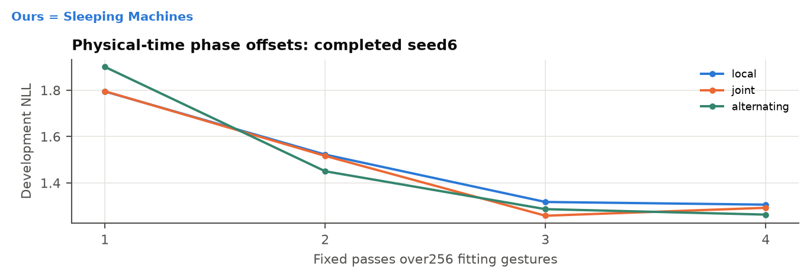

| Schedule | Dev accuracy % | Dev NLL | Whole fit GFLOPs est. | Fit MFLOPs / target est. | Infer MFLOPs / prefix est. |
| --- | --- | --- | --- | --- | --- |
| local | 54.17 | 1.3059 | 2.285696 | 2.232125 | 0.591737 |
| joint | 57.29 | 1.2582 | 2.287775 | 2.234155 | 0.596711 |
| alternating | 53.65 | 1.2630 | 2.281584 | 2.228110 | 0.596655 |

| Offset schedule | NLL improvement | Accuracy gain pp | Fit work ratio | Gate |
| --- | --- | --- | --- | --- |
| joint | +0.047767 | +3.1250 | 1.000910 | Pass |
| alternating | +0.042929 | -0.5208 | 0.998201 | Pass |

Fixed256 fit/192 dev/four passes/1,024 presentations/64 Adam updates. Same native initial predictions, data, draws and minimum-devNLL selection. Native15,523 parameters versus15,555 with offsets; eight available receivers and identical selected activity. All offset operators, backward, clipping and active Adam work are charged.

Candidate gate requires>=.02NLL improvement,<=1pp accuracy decline,<=1.50 fitting work ratio and<900,000KiB RSS. Selected schedule: joint. Seed7 joint confirmation fails:1.327347 versus native1.306508NLL and2.0833pp accuracy decline. No unchanged full-data stage or extra epochs is admitted. Two seed6 schedules were declared before either result; all failures remain.

Preserved strong984-fit RBF73.44%/.7065 and compact66.67%/.9030 controls have unequal fitting data; solver FLOPs unmeasured. Alternation also changes private-block update counts/clipping, so this is an algorithm comparison, not isolated interference attribution. Physical time still drives content; no official test or supremacy claim.

## Appendix B. Completed coupled-time offset pilot: seed7

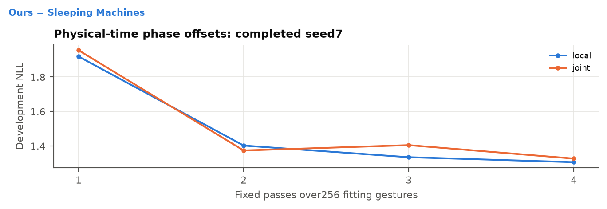

| Schedule | Dev accuracy % | Dev NLL | Whole fit GFLOPs est. | Fit MFLOPs / target est. | Infer MFLOPs / prefix est. |
| --- | --- | --- | --- | --- | --- |
| local | 55.21 | 1.3065 | 2.285696 | 2.232125 | 0.591863 |
| joint | 53.12 | 1.3273 | 2.287775 | 2.234155 | 0.596823 |

| Offset schedule | NLL improvement | Accuracy gain pp | Fit work ratio | Gate |
| --- | --- | --- | --- | --- |
| joint | -0.020839 | -2.0833 | 1.000910 | FAIL |

Fixed256 fit/192 dev/four passes/1,024 presentations/64 Adam updates. Same native initial predictions, data, draws and minimum-devNLL selection. Native15,523 parameters versus15,555 with offsets; eight available receivers and identical selected activity. All offset operators, backward, clipping and active Adam work are charged.

Candidate gate requires>=.02NLL improvement,<=1pp accuracy decline,<=1.50 fitting work ratio and<900,000KiB RSS. Selected schedule: none. Seed7 joint confirmation fails:1.327347 versus native1.306508NLL and2.0833pp accuracy decline. No unchanged full-data stage or extra epochs is admitted. Two seed6 schedules were declared before either result; all failures remain.

Preserved strong984-fit RBF73.44%/.7065 and compact66.67%/.9030 controls have unequal fitting data; solver FLOPs unmeasured. Alternation also changes private-block update counts/clipping, so this is an algorithm comparison, not isolated interference attribution. Physical time still drives content; no official test or supremacy claim.

## Appendix B. When added representation freedom can help

Theory91 derives a local, weighted score/content fitting criterion. With existing Jacobian A, added offset Jacobian B and desired change b, first fit existing coordinates; let r be the remaining residual. Eliminating those coordinates gives offset sensitivity h=B-transpose*r and positive definite Schur matrix S. The exact best local improvement is one half h-transpose*S-inverse*h. It is strict precisely when h is nonzero.

Additional coordinates can address a missing useful direction, or lower a movement penalty along an already available direction. The second case improves conditioning without proving increased representational rank. Shared offsets act at many receptions, whose demands may cancel. A local post-race offset preserves that already selected race while changing future state and routes; the full sequence remains coupled.

For a damped rotating carrier z, the age/phase Jacobian determinant is minus damping rate times squared message norm. The raw bounded offset adds pi*sech(raw-offset)^2. Nonzero damping gives independent local age and phase directions; weak damping, decayed messages or saturated offsets can still make them poorly conditioned. Physical-time derivatives and actual timestamps remain intact.

Four completed independent matrix contracts check 16 direct-versus-eliminated solves, zero-projection/no-benefit, redundant coordinates with lower penalized movement cost, and the rotor determinant. These are mathematical identities, not a demonstrated learning cure. Exact gradients of one loss can have opposed route/content terms and still yield descent when added; opposition alone does not justify deleting credit.

Contracts211000Z; theory91. Joint offset seed6 gains .047767 NLL at 1.000910 fitting-work ratio; unchanged seed7 loses .020839 and 2.0833 accuracy points. No full-data stage is admitted. The local criterion does not guarantee validation generalization, convergence of surrogate race credit or practical superiority.

## Appendix B. Counterfactual replay must match the first-time law

| Time-only loss, rates 1/3 | First score gradient | Second score gradient |
| --- | --- | --- |
| True expected loss gradient | -.062500 | -.187500 |
| Incorrect replay choice addition | +.125000 | -.125000 |
| Factual pathwise + wrong replay | +.062500 | -.312500 |
| Correct joint-score expectation | -.062500 | -.187500 |

The first arrival conditioned on either winner has Exp(sum rates) law. Forcing a losing alternative at its individual Exp(its rate) arrival changes both identity and clock. Detached softmax weighting does not turn those combined interventions into exact conditional choice credit. The table uses loss equal to raw arrival time; the first score direction reverses under the incorrect combined estimator.

Four completed contracts include independent analytic expectations and the actual external local-expectation replay wrapper with one time-recording event at four seeds. Forcing the factual winner reproduces the factual delay, while every losing alternative uses its later individual arrival. Existing softmax-algebra and factual-winner tests cannot establish the expected-risk claim. External model, queue and empirical results are preserved; this is a credit-protocol correction, not a fitted quality result.

Correct conditional choice replays retain the factual first time and actual selected memory write. Clock credit needs its own consistent estimator. Factorized winner/first time sampling or the joint likelihood can supply coherent derivations, with all future discrete credit and deterministic branch derivatives included. Do not double-count one sampled time through both likelihood and reparameterized derivatives.

A critic residual correction is unbiased for a declared replay sum when the critic is fixed before its correction subset is drawn. Training on that same subset first can introduce bias: a two-site counterexample gives -1 for a true zero target. Even a sampling-correct critic preserves the base target; it cannot cure wrong replay time laws. Independent conditioning and critic work require separate contracts.

Theory92; contracts212000Z; qualifications beside theory59 sections402/403. Four contracts pass; audited external source versions are recorded. No integrated repair fit, whole-model exactness, guaranteed variance reduction or superiority claim.

## Appendix B. Exact prefix reuse reduces integrated fitting work

| Replay | Dev accuracy % | Dev NLL | Whole fit GFLOPs est. | Fit MFLOPs / target est. | Infer MFLOPs / prefix est. |
| --- | --- | --- | --- | --- | --- |
| full | 25.00 | 2.3113 | 0.143986 | 2.999703 | 0.591695 |
| reuse | 25.00 | 2.3113 | 0.128525 | 2.677607 | 0.591695 |

Detached causal-prefix reuse saves10.738% counted fitting work with identical entire learning curves, predictions, model weights, Adam, cursor and RNG recovery. Same24-fit/eight-dev/two-pass/48-target native p16/L2/H2/pool2 protocol. Both rows use the same full-fit and presentation denominators.

Reuse skips repeated alternative-prefix computation while preserving the exact actual-write estimator. This is completed implementation advantage against its full-replay reference, not quality advantage against the strong gesture controls. Snapshot/copy memory traffic and energy remain unmeasured; all retained suffix and optimizer work is charged.

Other-host evidence retained from AWS_PREFIX_REPLAY_FINDINGS_20261002.md and aws_prefix_replay_smokes_20261002T201100Z_analysis.json, with verified parent hashes. Observed13.609 versus12.653 seconds is one concurrent-host observation, not a general latency claim. Exact reuse may support future credit comparisons after matching contracts.

## Appendix B. Other-host completed native capacity comparisons

| Model | Dev accuracy % | Dev NLL | Whole fit GFLOPs est. | Fit MFLOPs / target est. | Infer MFLOPs / prefix est. |
| --- | --- | --- | --- | --- | --- |
| Calibrated counts | 58.85 | 1.3734 | Unmeasured | Unmeasured | Unmeasured |
| rbf_C10_g1 | 73.44 | 0.7065 | Unmeasured | Unmeasured | Unmeasured |
| Ours original | 65.10 | 0.9632 | 20.075 | 2.550 | 0.592 |
| Compact prototype33 | 66.67 | 0.9030 | Unmeasured | Unmeasured | Unmeasured |
| Native p16/L2/pool2 | 66.15 | 1.0420 | 20.075 | 2.550 | 0.592 |
| Native p16/L2/pool8 | 62.50 | 1.0880 | 57.298 | 7.279 | 0.874 |
| Native p16/L4/pool2 | 57.29 | 1.2216 | 37.869 | 4.811 | 1.068 |

| Native capacity | Parameters | Available receivers | Keys / prefix | Commits / prefix | State bytes |
| --- | --- | --- | --- | --- | --- |
| Native p16/L2/pool2 | 15523 | 8 | 168 | 84 | 720 |
| Native p16/L2/pool8 | 42091 | 32 | 672 | 84 | 2376 |
| Native p16/L4/pool2 | 28539 | 16 | 336 | 168 | 1296 |

These completed stages use the same984-fit/192-dev, eight fixed passes/7,872 presentations/496 updates and seed6 as the packet-clock reference. Wider eligible pool and extra depth retain native timing/races/persistent addressed state/key-value separation/counterfactual credit. All scored keys and losing values remain charged.

Pool8 scores62.50%/1.0880NLL versus pool2 reference66.15%/1.0420, at57.2985 versus20.0747 whole fitting GFLOPs. Depth4 scores57.29%/1.2216 at37.8686GFLOPs. Neither completed variant improves the baseline. Extra private capacity also adds untied trainable maps; this is not isolated counterfactual-support or useful-capacity evidence. Other-host tied-map/replication work remains pending and separate.

Completed curie_dvs_clock_p16d2pool8 and p16d4pool2 results172500Z; theory59§§396/398. Conventional solver work is unmeasured, not zero. Raw controls retained in the full comparison above; selected references here use the same column units. No official-test or supremacy claim.

## Appendix B. Strong compact controls rule out an easy storage claim

| Lowest-NLL cell / family size | Dev accuracy % | Dev NLL | Model KiB | In budget | CPU ms / prefix |
| --- | --- | --- | --- | --- | --- |
| class_prototype_m11_g1_C10 | 59.38 | 1.0926 | 39.2 | True | 0.210 |
| class_prototype_m22_g1_C10 | 66.67 | 0.9549 | 67.2 | True | 0.228 |
| class_prototype_m33_g1_C10 | 66.67 | 0.9030 | 95.2 | True | 0.230 |
| class_prototype_m44_g1_C10 | 67.19 | 0.8865 | 123.2 | False | 0.230 |
| nystroem_m8_g0.25_C10 | 55.21 | 1.3055 | 32.3 | True | 0.836 |
| nystroem_m16_g0.25_C10 | 62.50 | 1.1175 | 53.4 | True | 0.859 |
| nystroem_m24_g0.25_C10 | 62.50 | 1.0640 | 75.1 | True | 0.852 |
| nystroem_m32_g1_C10 | 66.15 | 0.9954 | 97.2 | True | 0.854 |

Native uncompressed saved-model budget103.9KiB. The fixed72-cell grid uses random8/16/24/32 Nyström landmarks or1/2/3/4 learned prototypes per class, three gamma scales and three logistic C values. Prototypes, landmarks and normalization use fitting data only; each model includes its transform in the same uncompressed joblib serialization. Every cell remains in the completed JSON.

Selected in-budget control class_prototype_m33_g1_C10: 66.67%/0.9030NLL, 95.2KiB, 0.230ms/prefix. This exceeds the original native 65.10%/.963161 while using less storage and far less CPU time. Thus the original native result does not establish advantage even in this bounded-storage region.

The whole compact grid costs10.043s/183.9MiB peak RSS; common raw preprocessing still costs123.976s. Shared prototype construction, kernel features, all fitting/tuning and scoring are paid in workflow wall. Solver FLOPs are unknown, not zero. The table summarizes each family/size by its minimum development NLL, with all gamma/C settings and probabilities retained.

Exploratory development calibration, not independent model confirmation. Single timing passes are not repeated latency claims. Class prototypes are supervised fitting controls, not target-derived inference inputs. Neither the full kernel nor these compact alternatives is omitted when evaluating the next native initialization.

## Appendix B (continued). Diagnostic: count receivers over the temporal carrier

Labelled diagnostic, not the integrated native architecture. The input-gated temporal carrier supplies the base predictive to the same escape-race count cascade (Theory §§386–388). It tests whether sufficient-statistic receivers remove the memorization tax: if counts hold the exact local statistics, a small learned base should lose far less than the carrier alone does.

| Model | Fit chars / passes | Dev bpc ↓ | Whole fit GFLOPs ↓ | Fit MFLOPs / target ↓ | Infer MFLOPs / char ↓ |
| --- | --- | --- | --- | --- | --- |
| Minimal base w2/d1 + counts K5 + escape gate | 131,072/4 | 2.178 | 3.6 | 0.007 | 0.0028 |
| Minimal base w2/d1 + counts K5 + gate + message | 131,072/4 | 2.124 | 20.5 | 0.039 | 0.0177 |
| Carrier alone w32 | 131,072/4 | 2.848 | 80.9 | 0.154 | 0.0494 |
| Carrier w32 + counts K5 | 131,072/4 | 2.313 | 82.3 | 0.157 | 0.0504 |
| Same, untrained base w32 | 131,072/0 | 2.371 | Not trained | Not trained | 0.0504 |
| Carrier w32 + counts K5 + escape gate | 131,072/4 | 2.136 | 83.8 | 0.160 | 0.0518 |
| Carrier w32 + counts K5 + gate + message | 131,072/4 | 2.127 | 100.8 | 0.192 | 0.0667 |
| Carrier alone w128 | 131,072/4 | 2.587 | 1046.7 | 1.996 | 0.6389 |
| Carrier w128 + counts K5 | 131,072/4 | 2.313 | 1048.1 | 1.999 | 0.6399 |
| Same, untrained base w128 | 131,072/0 | 2.370 | Not trained | Not trained | 0.6399 |
| Carrier w128 + counts K5 + escape gate | 131,072/4 | 2.130 | 1049.6 | 2.002 | 0.6412 |
| Carrier w128 + counts K5 + gate + message | 131,072/4 | 2.129 | 1066.6 | 2.034 | 0.6562 |
| Carrier alone w256 | 131,072/4 | 2.572 | 4025.5 | 7.678 | 2.4571 |
| Carrier w256 + counts K5 | 131,072/4 | 2.316 | 4026.9 | 7.681 | 2.4580 |
| Same, untrained base w256 | 131,072/0 | 2.370 | Not trained | Not trained | 2.4580 |
| KN counts, frozen o5 | 131,072/1 | 2.349 | Not FLOPs | Not FLOPs | Not FLOPs |
| Calibration ceiling: adaptive interpolated KN o8 | 131,072/1 | 2.101 | Not FLOPs | Not FLOPs | Not FLOPs |

Same 8,191 development targets; seed 6, one seed per row; same depth, chunk, learning rate and passes per width. Predeclared: P1 composed w128 < 2.326; P2 composed w32−w256 gap < half the carrier gap; both hold formally for the scalar cascade, but the trained bases alone score 8.17 (w32) / 11.34 (w128) bpc, worse than uniform: the standalone base is trained as a conditional residual, so this alone cannot establish an inert base (Theory §389.1). With the escape gate (+ count message) every width reaches 2.12–2.14, and a minimal 2-wide, one-layer base matches w128 (2.124 vs 2.129) at 1/50 of the work: the gain is learned count smoothing, not the temporal carrier. Count references are near-optimal estimators at this size. The rows above exceed the frozen-KN and Witten–Bell references, and the stronger stream-adaptive interpolated Kneser–Ney is the calibration ceiling here (§393). This is a mechanism diagnostic in a regime where counting is expected to be near-optimal for any learner, not an architecture verdict (§394). Count increments/lookups (5 per target) are integer table work outside FLOPs. Exploratory development evidence; no comparable-quality Transformer claim.

## Appendix B (continued). Ours: native temporal-core language

27-character text8 content enters one conversation address in the native event core. Independent receiver heads, persistent state, learned delays, evolving channels and losing-route credit remain; no historical KV attention or dense carrier is added. The receiver maps now learn across all token marks.

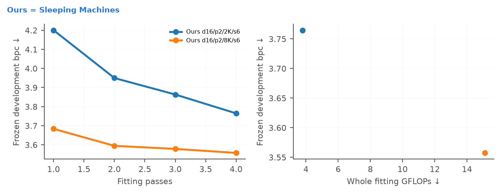

| Ours | Fit chars / passes | Dev bpc ↓ | Whole fit GFLOPs ↓ | Fit MFLOPs / target ↓ | Infer MFLOPs / char ↓ |
| --- | --- | --- | --- | --- | --- |
| d16/p2/s6 | 2,048/4 | 3.765 | 3.778 | 0.461 | 0.0974 |
| d16/p2/s6 | 8,192/4 | 3.557 | 15.116 | 0.461 | 0.0974 |

Fixed passes and frozen 8,191-target development selection; official test untouched. Existing stronger receiver and dense-reference evidence is preserved in the common ledger. Architecture, capacity and weight sharing differ from the KV variants. Work uses audited representative optimizer windows including backward, teachers and Adam; special functions have unit weight here, with separate JSON counts. These are exploratory scaling points, not a frontier score or a measured energy advantage. With H2/depth8/pool2, available receivers are 32, selected commits 16/token, scored keys and training proposals 32/token. Parameter counts and occupied state are retained in completed records.

## Appendix B (continued). Ours: native event/state capability

Each source writes three signed marks then receives an explicit causal query. Fits use 512 queries / 2,048 input events per pass, eight passes; development has 256 queries. All source populations are occupied. The order task predicts the last two signs; the timing task predicts a two-mode temporal trace. All events, timestamps and query flags are observed; target labels never address a module.

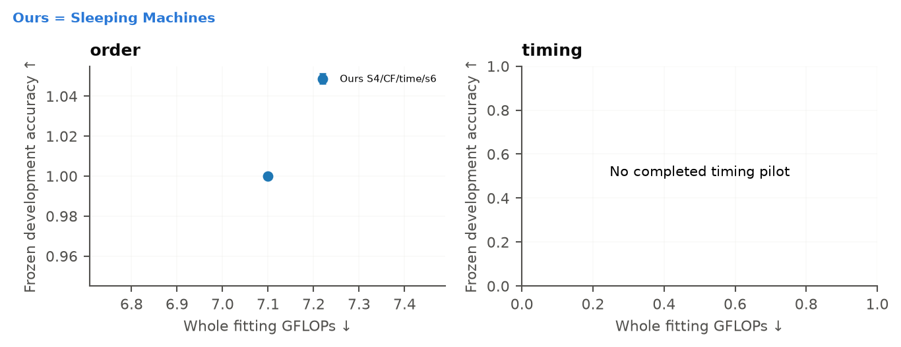

| Ours: task / sources / seed | Credit / time | Dev accuracy ↑ | Whole fit GFLOPs ↓ | Fit MFLOPs / query ↓ | Infer MFLOPs / event ↓ |
| --- | --- | --- | --- | --- | --- |
| order/S4/s6 | CF/observed | 100.0% | 7.099 | 1.733 | 0.0923 |

Equal declared query/event budgets; available receivers scale with source population while per-event key scores and selected commits are logged explicitly. All fitting arithmetic is summed from executed operators, including complete producer graphs, losing proposals, clipping and Adam; CPU numerical clocks and unit-weight specials are included. Bootstrap intervals by population and raw state-clearing/time/long-gap probes remain in the completed JSON. More addresses change training exposure. Synthetic capability and bounded activity do not establish superiority over timestamp-aware recurrent/attention controls, real-stream generalization or clockless energy savings.

## Appendix B (continued). Ours: occupied state and activity

Every source stores three content events and receives a query. These are useful-state tests rather than padded unused capacity. Event budgets, active depth, head count and candidate pool are fixed. More addresses reduce observations per local parameter; addressing is input information that strong controls must also receive.

| Ours: task / sources / seed | Available / occupied receivers | Commits / scores per event | Persistent state KiB | Parameters |
| --- | --- | --- | --- | --- |
| order/S4/s6 CF/observed | 128/122 | 16/32 | 9.14 | 159,716 |

| Ours: task / sources / seed | Whole fit GFLOPs | Fit MFLOPs / input event | Infer MFLOPs / query |
| --- | --- | --- | --- |
| order/S4/s6 CF/observed | 7.099 | 0.433 | 0.369 |

| Ours: task / sources / seed | Selected dev accuracy | Clear-history accuracy | Independent confirmation |
| --- | --- | --- | --- |
| order/S4/s6 CF/observed | 100.0% | 27.7% | Not read |

Occupied receivers and stored float bytes come from the audited inference population, not parameter storage, Python metadata, graphs or host RSS. Inference/query includes all four producer/query events. Full fitting includes every event and optimizer operation. Arithmetic plus unit-weight specials; traffic/RNG/energy separate. Development selects checkpoints; independent confirmation is read once only on fixed promoted seed protocols. Population bootstrap intervals in the quality plot condition on the selected model and do not correct development selection or substitute for independent seed uncertainty.

## Appendix B (continued). Ours: compact delayed learning

Available historical content is not automatically learned historical content. After graph detachment, a retrieved old key/value can affect the prediction while its write map receives no later loss credit. Increasing the ordinary credit span from 16 to 64 did not improve the completed matched 2K pilot.

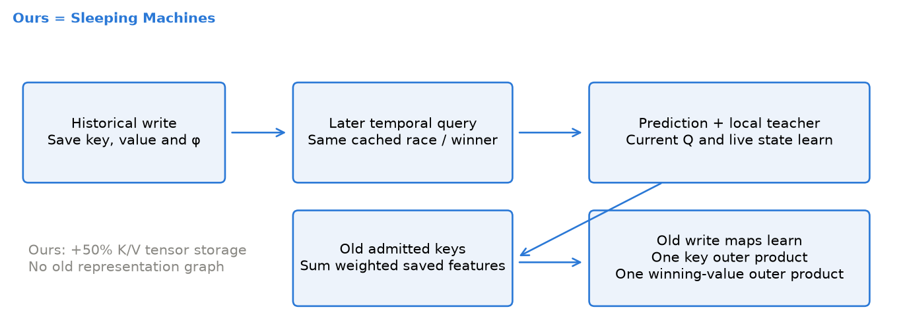

The tested integrated construction saves the normalized feature φ of each historical write. Later queries send a compact producer teacher to sealed key/value maps while preserving independent heads, temporal races, incoming content and persistent addressed state.

| Ours: added teacher | Factorization | Extra work / query |
| --- | --- | --- |
| Old keys | α q (Σ eᵢ φᵢ)ᵀ | O(C_old d + d²) |
| Old winning value | α a φ_wᵀ | O(d²) |
| Saved eligibility | One detached d-vector / write | 50% extra K/V float storage |

A shared offset of all race scores leaves winner probabilities unchanged but rescales arrival time. Content contrasts can teach which value wins; a separate clock signal can teach when it arrives and how persistent state evolves. The new write teacher retains both signals.

The shared query factors all admitted old key teachers into one matrix update. Live writes keep ordinary gradients without duplicate credit. Six read-only numerical checks and guarded full eight-block update/recovery contracts passed; disabling the new teacher exactly reproduces parent outputs, RNG, gradients and two Adam windows.

This is exact for a hypothetical common perturbation of historical write maps with saved features fixed. Transport to current maps is a delayed local surrogate: old weight versions and omitted representation paths remain limitations. Additional learning arithmetic and eligibility traffic are real costs. Existing counterfactual score credit is retained. Fitting work uses representative audited windows, with exact credit-coverage counters logged separately. Matched quality/work results require completed fits; improved language accuracy and native clockless learning are not established by these contracts.

## Appendix B (continued). Ours: historical write credit

H2, d32/head, 8 event blocks, pool2; 2,048 fitting characters / 4 passes; 8,191 frozen development targets, seed6. Credit16, Adam U64, lr0.002, warmup512. Forward races/history are preserved; sealed writes gain a compact local producer teacher.

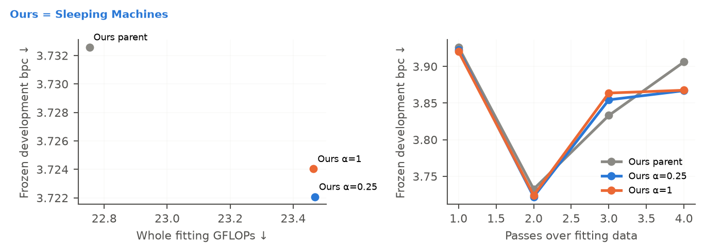

| Ours: credit | Dev bpc ↓ | Whole fit GFLOPs ↓ | Fit MFLOPs / target ↓ | Inference MFLOPs / char ↓ |
| --- | --- | --- | --- | --- |
| parent | 3.733 | 22.753 | 2.779 | 0.5059 |
| α=0.25 | 3.722 | 23.469 | 2.866 | 0.5059 |
| α=1 | 3.724 | 23.464 | 2.866 | 0.5058 |

A historical normalized write feature φ is retained alongside each cached key/value. The old key-map teacher factors as α q (Σ eᵢ φᵢ)ᵀ: one weighted feature sum and one matrix outer product per query. The old winning value map receives α a φᵀ. Live writes keep ordinary credit without duplication; no full-history graph is reopened.

One extra feature vector raises K/V float storage by 50%. The update is exact for a common hypothetical perturbation of historical maps at fixed saved features; transporting it to current maps is a delayed local surrogate with stale weight versions and omitted representation paths. Additional teacher/optimizer arithmetic is counted; feature traffic and physical energy are separate. Parent reuse requires exact forward/RNG/gradient/Adam nesting at α=0. One-seed exploratory development selection, not comparable-quality supremacy.

## Appendix B (continued). Ours: frozen information-flow diagnosis

Saved selected H2/H4 eight-block 8K checkpoints; 256 targets from the development prefix. Weights remain fixed. Each intervention removes one path only during this short evaluation; these are diagnostic probes rather than refitted architecture comparisons.

| Ours | Frozen intervention | Window bpc ↓ | Context RMS mean |
| --- | --- | --- | --- |
| H2 | unaltered | 3.316 | 1.770 |
| H2 | source off | 4.013 | 1.676 |
| H2 | kv off | 3.312 | 1.750 |
| H2 | channel identity | 3.773 | 1.488 |
| H4 | unaltered | 3.331 | 2.144 |
| H4 | source off | 4.001 | 2.066 |
| H4 | kv off | 3.375 | 2.073 |
| H4 | channel identity | 3.786 | 1.477 |

Removing source-message carry and learned channel mixing worsens both saved checkpoints in this window. These content/state paths are useful here; short-window removal probes do not warrant discarding them or demonstrate a refitted architecture advantage.

A route-credit audit replays each admitted historical value at three depths/head0 for the two-head model. It holds one realized race time and continuation seed fixed, then compares the centered local content teacher with the conditional categorical loss gradient.

| Ours: local audit | Probes | Mean cosine | Opposed directions | Mean oracle gap (nats) |
| --- | --- | --- | --- | --- |
| H2 / head0 | 24 | 0.717 | 1 / 24 | 0.071 |

Higher cosine means better alignment in this narrow replay. The oracle gap is realized loss minus the best candidate replay, not achieved improvement. Different routing can change subsequent candidate/RNG paths. The audit conditions away time derivatives and does not estimate the full expected gradient, long-history utility or discovery coverage. Interventions have no refitting and no confidence intervals; do not use these window scores as promotion metrics or dense-model superiority evidence.

## Appendix B (continued). Ours: separate online neural learning

Both arms start from the same selected integrated-model checkpoint and maintain persistent event memory on the same new development stream. The frozen arm retains its parameters. The online arm updates the complete neural backbone after making the causal predictions in each 16-character block, with no replay.

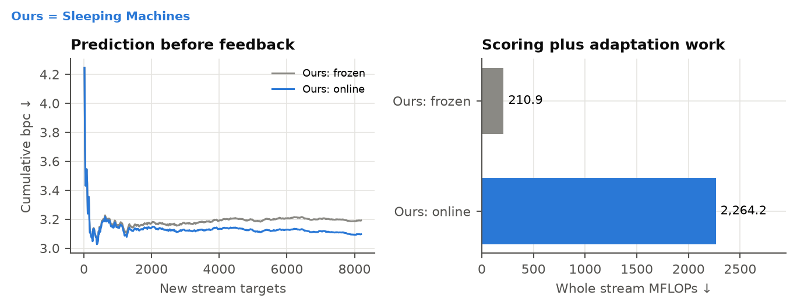

| Ours: mode | Stream bpc ↓ | Whole stream MFLOPs ↓ | Parameter change L2 | Updates |
| --- | --- | --- | --- | --- |
| Ours: frozen | 3.191 | 210.903 | 0.000 | 0 |
| Ours: online | 3.096 | 2,264.163 | 1.551 | 512 |

The 8,191 targets come from [90,065,536, 90,073,728). Learning rate 0.0001 was fixed before this stream; Adam starts with fresh moments. Both arms use paired block race noise. Parameter updates precede only future blocks; the current target cannot change its own prediction. Their contexts can diverge after learning.

This measures block-delayed online adaptation, not instant per-character updates or a frozen official-test score. One inherited model/window/rate. All neural parameters may learn, including content, keys, clocks and retention; this differs from the earlier statistical expert-mixing-only ablation. Inherited fitting is additional and identical in both arms. Work estimates observe the actual first/middle/last blocks and include counterfactual learning, backward, clipping and Adam; RNG, indexing and physical traffic remain additional. Lower online loss, if observed, is evidence only for this protocol.

## Appendix B (continued). Separate statistical language baseline

This count/copy predictor does not use the learned Sleeping Machines event backbone. It is a separate statistical system: order-0 through order-6 counts, backoff probabilities and a bounded causal copy cache, combined by learned mixing weights. Its quality/work results must not be attributed to the event architecture.

The statistical predictor and saved neural references score the same 999,999 character targets, starting from a cold context. Parameters are frozen during testing. Earlier observed test characters can supply causal context, including the mixture's bounded 256-character copy cache. Lower bits per character means better prediction.

| Predictor | Test bpc ↓ | Fitting and selection budget | Estimated training FLOPs ↓ |
| --- | --- | --- | --- |
| Ours: separate statistical count/copy baseline | 1.727 | 10M count fitting + three 1M mixing-rate trials | 4.47G + integer count construction |
| Ours: count/copy plus causal word context | 1.719 | 10M count fitting + three 1M mixing-rate trials | 4.80G + integer count construction |

The neural totals charge all original optimizer steps that produced the inherited E174 checkpoints: forward, estimated 2×-forward backward, clipping and Adam. Alignment evaluation is excluded. The statistical floating estimate charges expert probability preparation and all three mixing-rate trials, including local gradients and weight updates. Exp/log/root evaluations count as one operation in these language estimates. Count construction additionally uses about 80M integer count presentations, plus sorting, lookup and hashing; that work is not quantified as FLOPs. The floating totals alone cannot establish total compute, runtime or energy savings.

The count/copy mixture improves on LSTM by 0.072 bpc and Transformer by 0.181 bpc. These results establish useful specialized prediction; generic learned representations are assessed in the separate language screen.

The statistical baseline's count arrays occupy 66.55 MB. Vocabulary, capacities, optimization and fitting budgets differ from the neural references. The comparison does not measure total training energy or a matched-capacity advantage.

All three use the same historical 27-character alphabet. Modern shared subword tokenization is a separate comparison gate for the learned event architecture, described later in this appendix.

One exploratory seed. Text8 offsets: count fitting [0,10M), mixing-weight validation [90M,91M), test [95M,96M); test index zero is excluded for all three predictors. The mixture selects its update rate on validation. Saved neural weights are unchanged. Results: E173/E174; stream contract: E175. At 90M training characters, reference test scores are 1.661 for the LSTM, 1.604 for the four-layer Transformer. Estimated training work (forward, backward, Adam and gradient clipping): LSTM: 3.89 PFLOP, TF: 8.00 PFLOP. Shape-based estimates count multiply-add as two operations; backward is approximated as twice forward. Validation/test inference is excluded. These are single-seed comparisons; capacities and fitting budgets are not matched. Calibration (Theory §381): untuned modified Kneser–Ney counts of the same 90M characters score 1.652 on the same test targets, so these controls sit near count level and are not frontier bars. Target-leaked historical mixtures have been quarantined; a corrected 90M mixture comparison remains open.

## Appendix B (continued). Learned language and depth

A bounded screen trains the common event backbone to predict the next character. Both configurations use width 32, the same 8,192 training characters, four passes, 32-character contexts and 1,024 validation predictions. All eight layers' value, route and memory-time parameters update. Lower bits per character means better prediction.

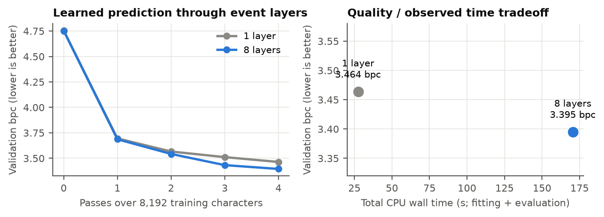

| Ours: depth | Learned parameters | Validation bpc: lower is better | Total CPU wall time |
| --- | --- | --- | --- |
| 1 | 7,671 | 3.464 | 27.4 s |
| 8 | 53,430 | 3.395 | 170.5 s |

Eight layers improve validation loss from 4.752 to 3.395 bpc, versus 3.464 with one layer. Shuffling preceding characters while preserving the last character, count and timestamps increases the deeper model's loss to 3.805; replacing preceding context raises it to 3.777. These frozen input probes show context sensitivity, not a retrained baseline comparison.

The deeper model has more parameters and takes more CPU time. The quality/time panel includes fitting and evaluation, with backpropagation and optimizer updates executed during fitting. These bounded-query models replay preceding context. The following persistent implementation consumes each character once. Physical memory traffic and joules remain unmeasured.

One seed; different parameter counts. This establishes a generic learned-language foothold and a small depth gain, not competitive large-scale representation, a matched tuned dense-model advantage or a scaling law. The statistical 10M-character mixture remains a separate result. Official test data are untouched. E133 preserves commands, source/data hashes, layer diagnostics and work coverage.

## Appendix B (continued). Persistent learned language

The event-state language model consumes each character once and retains local modal memories and its delayed-message queue. Chunk boundaries truncate learning credit without discarding the observed history. Only actual event arrivals evaluate layers; text time is measured in token intervals.

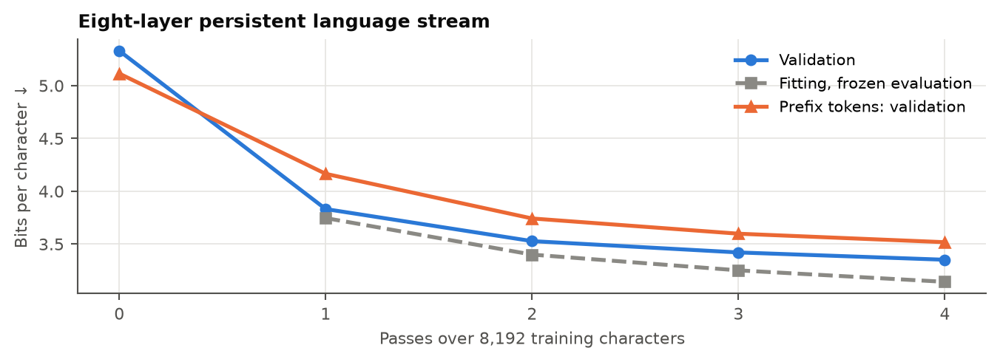

| Ours: representation | Parameters | Fitting bpc ↓ | Validation bpc ↓ | Deliveries/pass |
| --- | --- | --- | --- | --- |
| Characters | 28,403 | 3.142 | 3.351 | 65,784 |
| Causal prefix tokens | 35,163 | 3.085 | 3.517 | 45,816 |

Validation loss falls from 5.329 to 3.351 bpc. All eight layer teachers are nonzero in every fitting pass. Each pass consumes 8,223 characters including warmup and makes 65,784 block deliveries. The result establishes learning with persistent causal state and no prefix replay.

A train-only 131-token prefix dictionary reduces layer deliveries by 30.4% and observed CPU time by 26.2%, while validation bpc is 3.517. Exact partial-token marginalization scores identical raw targets. Its larger vocabulary fits better but generalizes less well in this small screen: compression alone does not explain or resolve the quality gap.

One seed; 28,403 parameters, width 32, sixteen temporal modes per block. Four passes, 128 Adam steps/pass, credit truncated every 64 characters, 31 warm characters and 1,024 validation targets. Target offsets match the bounded E133 screen; topology, capacity, history and update counts differ, so this is not a matched intervention. Total CPU wall time 364.9 s including fitting/evaluation; peak RSS 364.8 MiB. These are event counts and observed resources, not total arithmetic, physical memory traffic or energy. No official test or large-corpus claim. E176.

## Appendix B (continued). Learned event language: training and inference work

These counts belong to the learned eight-layer persistent Sleeping Machines event model that reaches 3.351 validation bpc. It has no count/copy/word experts. Primary counts describe the logical event algorithm; simulator dispatch/allocation is excluded.

| Ours: fitting stage | Estimated arithmetic FLOPs |
| --- | --- |
| Forward and loss | 1.96G |
| Backward | 4.77G |
| Gradient clipping | 43.52M |
| Optimizer | 173.95M |
| Warmup | 7.42M |
| Total | 6.96G |

The entire completed budget includes 32,768 fitting targets, 512 Adam/clipping steps and four stream warmups. Special functions add 85.431M evaluations, reported separately from arithmetic FLOPs.

| Ours: inference boundary | Per character |
| --- | --- |
| Prediction plus NLL-scoring arithmetic | 59,741 FLOPs |
| Additional special functions | 1,212 evaluations |

A 64-character saved-checkpoint trace measures forward/loss, backward, clipping and warm Adam; the fitting ledger scales those stages by the original 512 steps and separately charges warmup. This is a representative arithmetic estimate, not a whole-run trace. The traced chunk has complete floating-operator formula coverage. Index/queue work, comparisons, memory traffic and evaluation passes are outside the fitting arithmetic boundary.

The 10M-character LSTM/Transformer checkpoints have different data, capacity and achieved quality. Dividing their full fitting budgets by this small run would not establish a fair training advantage. Full learned-event runs must complete before a larger aligned quality/work comparison.

Evidence: event_language_work/local_event_language_work_20260930T124646Z.json; quality: E176. Two arithmetic FLOPs per multiply-add. Additional unit-weight special functions would give a different logical-operation total; no event-device runtime or energy has been measured.

## Appendix B (continued). Statistical online-learning pilot

The official language comparison freezes parameters during evaluation. A new development-only pilot asks whether causal local learning improves prediction: score each character first, reveal it, then update only the expert mixing weights. Count experts stay frozen and both arms use identical causal copy-cache behavior.

| Ours: statistical expert set | Frozen bpc ↓ | Online bpc ↓ | Extra update FLOPs |
| --- | --- | --- | --- |
| Without word | 2.605 | 2.564 | 2.75M |
| With causal word | 2.537 | 2.487 | 3.21M |

This pilot reuses a 100,000-character count checkpoint and its learning rate selected on an earlier 2,048-character validation window. It scores 8,191 targets in a fresh 8,192-character development window [90,032,768,90,040,960), excluding the first target. Each adaptive arm performs 8,192 updates, including first-position warmup. Official test data are untouched.

One checkpoint and one window; a specialized adaptive readout, not deep learned TTT or a frontier result. The extra arithmetic column counts only local gradient/weight updates, on top of shared prediction and inherited fitting costs. Total pilot CPU wall time is 0.587 s. Evidence: online_language/local_online_language_20260930T121741Z.json.

### Compute allocation is the next architectural hypothesis

Independent budgets for active width/depth, dormant capacity, temporal memory, retrieval, credit and adaptation may let extra work buy more prediction quality. The new theory derives conditional marginal-value allocation and retrieval-error bounds, and identifies exposure, routing overhead and hardware utilization as possible limits. A small-scale win does not prove a better scaling exponent or a widening frontier advantage.

Next learned-language comparisons need shared modern subword tokenization, Unicode/byte coverage, suitable rotary/relative position, packed optimized Transformer kernels, sparse MoE and modern recurrent/attention-hybrid controls. Existing event memory already uses relative-time rotations. Token coordinates must remain distinct from learned scheduling delays.

Known sequences can be fitted with input-known affine scans and then generated sequentially with persistent state. Sequence-parallel fitting also permits Transformer adaptation between tokens/chunks. Compare frozen and online arms at identical observations and adaptation budgets; charge cache consistency and update work.

[Theory §§280–286](experiments/theory/43_compute_allocation_and_frontier_scaling.md) and the [frontier compute protocol](experiments/FRONTIER_COMPUTE_PROTOCOL.md) specify these tests. Modern architecture and larger-scale comparison arms remain proposed, not completed.

## Appendix C. Preserved historical results and revisions

Earlier result files remain part of the research record. The following numbers explain older report headlines and why their interpretation changed. They are preserved here with the identified protocol errors; they are not current valid benchmark comparisons.

### Earlier statistical language results

The target-dependent partial-word mixtures have been removed from the active results tree and all numerical comparisons. Raw records are quarantined for audit only. The corrected E17310M results are1.727 without word context and1.719 with causal word context; a corrected90M mixture comparison remains open.

### Earlier event world-model results

| Historical predictor | Day 6 log-likelihood ↑ | Day 7 log-likelihood ↑ |
| --- | --- | --- |
| Ours: event hazard + rate/flow state | -2.184 | -1.999 |
| Ours: event hazard + per-type state | -2.159 | -1.973 |
| Ours: event hazard + per-type state; finer gap bank | -1.912 | -1.734 |
| Saved Transformer Hawkes reference | -1.971 | -1.816 |

The event hazard models use sparse conditional memories and local rate/flow state. Their frozen test parameters and causal state updates are useful mechanisms. However, the event-size threshold was fitted across all seven pilot days, including the evaluation days, for both the event and neural references. Day resets and warmup exclusions also differ. The recorded gap needs fitting-only preprocessing and aligned rescoring before it supports a held-day advantage.

[Source and numerical review](experiments/EXPERIMENTAL_REVIEW.md); [E57 world-model records](experiments/results/e57/). Preserved timing, composition, retrieval and modular results remain in the main report. New learned-model benchmarks add evidence; they do not erase these earlier runs.

## Appendix D. Evidence and metric definitions

| Metric | Interpretation |
| --- | --- |
| Bits per character | Held-out negative log probability in base two; lower is better next-character prediction. |
| Accuracy | Fraction of correct class decisions on the declared development or test protocol. |
| Event likelihood | Scores both the next event type and waiting time, including the observed silence. |
| Arithmetic FLOPs | Multiply-add counts as two operations. Tables state whether special functions are separate or assigned unit cost; these conventions must be aligned before forming ratios. |
| Logical operations | The structured-task ledger assigns 2 units per MAC and 1 per other scalar arithmetic/nonlinear operation or estimated sort comparison. |
| Resource boundary | Event-target arithmetic includes required active algorithm work. Memory traffic, queues, indexing and simulator overhead are reported separately where measured. Activity counts alone do not determine total FLOPs. |
| Energy | Measured total joules over an explicit boundary. Operation estimates and CPU timings support work comparisons, but are not joule measurements. |

The evidence is preserved in versioned result summaries with configurations, split identities, learning curves and source hashes. E173/E174 support the language comparison; E61 supports retrieval; E34/E53/E54 support native composition; E41 supports the original periodic computation. E121/E124 establish consolidated arithmetic and its certificate; E123 supplies the new dense controls and E124 the operation ledger. E118/E119/E122/E125/E126 support deep speech, readout and causal-context comparisons; E127–E131 audit credit geometry, hard race boundaries and separate key/value learning; E132 checks a joint race-credit formalism, E133 supplies the language/depth screen, and E134–E135 test whole-value credit and content-selective temporal memory. E136 audits reversible augmented transport and its supervised memory boundary, including twelve-layer query/learning interventions. E137 tests compact memory queries and class-visible credit geometry. E138–E141 examine richer source messages and trainable signed temporal memory, with exact local teacher and initial-nesting contracts. E142 establishes signed-state and first-coalescing identities; E143 tests a larger nonlinear temporal residual learner, and E144 audits simultaneous state/query pooling. E171 reproduces the consolidated screens and selected speech answers, and checks causal input boundaries. E172 records complete training-step arithmetic; E175 checks the generic persistent language stream.

The project theory index contains formal assumptions and proofs. Research findings retain detailed analyses and the full experimental record. The model documentation describes reproducible configurations and operational procedures. This report presents the project, its evidence and its potential.

## Appendix. Native language at 10M: the integrated core, segment-batched

| Model (10M) | Params | Steps | Test bpc T128/T256 | Whole fit TF est. | Fit MF/char | Infer MF/pos. emulator | Infer MF/pos. winner-only |
| --- | --- | --- | --- | --- | --- | --- | --- |
| Ours p16/d8, v1 (610 updates) | 54,907 | 610 | 2.899 / — | 4.04 | 0.40 | 0.13 | 0.09 |
| Ours p16/d8, skip2 | 54,907 | 1,220 | 2.719 / 2.719 | 4.05 | 0.41 | 0.13 | 0.09 |
| Ours p32/d4 | 108,875 | 1,220 | 2.507 / 2.506 | 7.22 | 0.72 | 0.24 | 0.16 |
| Ours p32/d8, skip2 | 210,043 | 1,220 | 2.456 / 2.456 | 14.11 | 1.41 | 0.46 | 0.31 |
| Ours p32/d8/pool4, skip2 | 346,331 | 1,220 | 2.498 / 2.498 | 23.60 | 2.36 | 0.77 | 0.31 |
| Ours p32/d4/pool1 (control: no selection) | 74,803 | 1,220 | 2.439 / 2.439 | 4.88 | 0.49 | 0.16 | 0.16 |
| Ours p32/d4 + route credit | 108,875 | 1,220 | 2.370 / 2.371 | 7.24 | 0.72 | 0.24 | 0.16 |
| Ours p32/d4/pool4 + route credit | 177,019 | 1,220 | 2.343 / 2.345 | 11.95 | 1.20 | 0.39 | 0.16 |
| Ours p32/d4 + read and write credit | 108,875 | 1,220 | 2.384 / 2.384 | 7.28 | 0.73 | 0.24 | 0.16 |
| Ours p64/d4 + route credit | 422,475 | 1,220 | 2.184 / 2.183 | 26.79 | 2.68 | 0.89 | 0.60 |
| Ours p32/d8, skip2 + route credit | 210,043 | 1,220 | 2.326 / 2.326 | 14.15 | 1.42 | 0.46 | 0.31 |
| Ours p64/d4/pool4 + route credit | 689,787 | 1,220 | 2.180 / 2.179 | 44.07 | 4.41 | 1.46 | 0.61 |
| Ours p96/d4 + route credit | 940,875 | 1,220 | 2.163 / 2.162 | 58.65 | 5.87 | 1.95 | 1.32 |
| Ours p64/d4 + route credit, 4 passes | 422,475 | 4,882 | 1.955 / 1.955 | 107.19 | 2.68 | 0.89 | 0.60 |
| E64 LSTM-256 | 338,395 | 1,220 | — / 2.171 | 20.3 | 2.03 | 0.68 | 0.68 |
| E64 Transformer-256x2 | 1,658,907 | 1,220 | — / 2.427 | 111.3 | 11.13 | 3.71 | 3.71 |
| E64 Transformer-256x4, 4 passes | 3,238,427 | 4,882 | — / 1.908 | 888.8 | 22.22 | 7.41 | 7.41 |
| E64 LSTM-512, 6 passes | 1,199,323 | 7,324 | — / 1.799 | 432.6 | 7.21 | 2.40 | 2.40 |

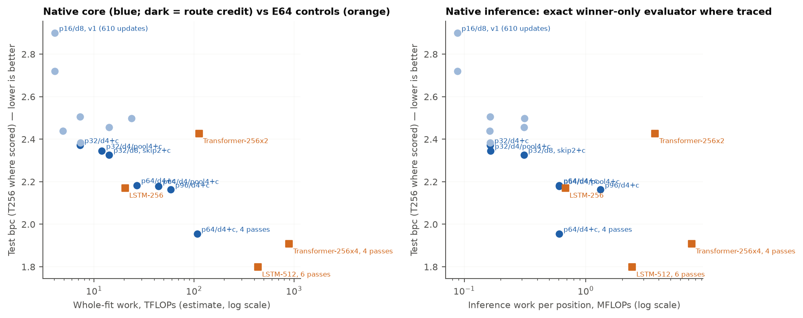

| Model (90M) | Params | Updates | Test bpc T128/T256 | Whole fit TF est. | Fit MF/char |
| --- | --- | --- | --- | --- | --- |
| Ours p32/d4/pool4 + route credit (AWS, one pass) | 177,019 | 10,986 | 1.997 / 1.998 | 107.6 | 1.20 |
| E64 LSTM-512, 6 passes (AWS) | 1,199,323 | 65,917 | — / 1.661 | 3893 | 7.21 |
| E64 Transformer-256x4, 4 passes (AWS) | 3,238,427 | 43,945 | — / 1.604 | 8000 | 22.22 |

90M rows: text8[0:90M], same test interval and E64 windows. The native rows are one pass of the segment-batched protocol on AWS (compiled, 64 x 128 windows, lr .004 cosine); the references are multi-pass with larger models and are listed for scale, not as matched comparisons.

| Native model | Slots | Memory scalars | Writes | Keys | Emulator values | Winner values |
| --- | --- | --- | --- | --- | --- | --- |
| p16/d8, v1 (610 updates) | 32 | 512 | 16 | 32 | 32 | 16 |
| p16/d8, skip2 | 32 | 512 | 16 | 32 | 32 | 16 |
| p32/d4 | 16 | 512 | 8 | 16 | 16 | 8 |
| p32/d8, skip2 | 32 | 1024 | 16 | 32 | 32 | 16 |
| p32/d8/pool4, skip2 | 64 | 2048 | 16 | 64 | 64 | 16 |
| p32/d4/pool1 (control: no selection) | 8 | 256 | 8 | 8 | 8 | 8 |
| p32/d4 + route credit | 16 | 512 | 8 | 16 | 16 | 8 |
| p32/d4/pool4 + route credit | 32 | 1024 | 8 | 32 | 32 | 8 |
| p32/d4 + read and write credit | 16 | 512 | 8 | 16 | 16 | 8 |
| p64/d4 + route credit | 16 | 1024 | 8 | 16 | 16 | 8 |
| p32/d8, skip2 + route credit | 32 | 1024 | 16 | 32 | 32 | 16 |
| p64/d4/pool4 + route credit | 32 | 2048 | 8 | 32 | 32 | 8 |
| p96/d4 + route credit | 16 | 1536 | 8 | 16 | 16 | 8 |
| p64/d4 + route credit, 4 passes | 16 | 1024 | 8 | 16 | 16 | 8 |

Native mechanism counts per input position. Memory scalars are available unit-value storage per lane; timestamps, readiness bits and source context are additional. One value is delivered per selected head/layer write. Every candidate key and proposal value is computed before selection in the emulator; the winner-only evaluator computes only selected proposals and also caches one key-read vector per slot. Every key is still scored. These are shape counts, not traffic or energy measurements.

Integrated native core only: temporal races (factorized law), sparse addressed writes into persistent rotating memories, transport between layers; no dense carrier and no count statistics. One pass over text8[0:10M] in 64 lanes x 128 characters (state reset per segment, exact credit within it), lr .004 with cosine annealing, compiled layer steps (contract-tested against the batched path). The v1 row used 128 lanes, about 610 updates and a constant lr; it is kept as measured. Test text8[95M:96M] on E64 windows, scored at the training length and at the controls' 256 with the same weights. Single seed per row; exploratory, not a benchmark claim.

The E64 rows are the matched one-pass controls (1,220 steps of 32 x 256, cosine). Work: ours traced unit/special operations (fitting extrapolated from traced windows). Inference is traced twice: the batched emulator, which computes every proposal, and the exact winner-only evaluator (THEORY §414), whose small random float64 fixtures match emulator logits within 1e-10. Direct winner/state/cache contracts on the actual trained float32 weights are prepared and pending (note 143); the saved test scores use the compiled training evaluator. For fixed weights, cached stored-memory key reads need refreshing only on a slot's write: arithmetic scales as U.P plus winner maps per race. The present implementation also stacks every unit's matrices at each call, an O(U.P²) parameter-copy/allocation cost outside these FLOP counts. Cache storage, traffic and wall time must be measured before claiming total-resource scaling. Every key is scored and counted. Control columns repeat their single shape estimate. The conventions differ, so work comparisons are estimates.

Reading: update calibration took p16/d8 from 2.899 to 2.719. Width beat depth (p32/d4 2.507), and depth then helped at width 64 (p32/d8 2.456). Without route credit the fast path trains the race address only through first-time clock credit (THEORY §413), and more units then cost quality: pool 4 is worse than pool 2 (2.498 vs 2.456), and the no-selection pool-1 control beats pool 2 at depth 4 (2.439 vs 2.507). With the linearized local-expectation route credit (forward values unchanged, about 0.3% more counted fitting work) the same p32/d4 pool-2 model scores 2.370: .137 better than without it, .069 better than the control, and .057 better than the one-pass Transformer; at the matched T256 window it scores 2.371 versus 2.427, a .0554 bpc advantage, with about 1/15 of its parameters and estimated fitting work. It remains .199 behind the one-pass LSTM. With credit, pool 4 at the same 8 selected writes per character scores 2.343 (T256 2.345): more stored units now improve quality instead of costing it. Width is the strongest lever: p64/d4 with credit scores 2.184 (T256 2.183), .012 behind the one-pass LSTM, with exact winner-only inference of 0.60 MFLOPs per position against the LSTM estimate of 0.68 and more estimated fitting work (2.68 vs 2.03 MFLOPs per character). A write-address credit on stored coordinates diverged; the corrected variant trained stably at pool 2 without improving on value credit (2.384 vs 2.370) and diverged at pool 4, so write-address credit is withdrawn. Single seeds; pending arms are not filled.

## Appendix B. AWS coarse temporal screens: two seeds pass

| Native packet/clock | Accuracy % | Dev NLL | Whole fit GF est. | Fit MF / target | Infer MF / prefix |
| --- | --- | --- | --- | --- | --- |
| s6 20 bins/.05 | 48.96 | 1.4242 | 2.285696 | 2.232125 | 0.591709 |
| s6 4 bins/.05 | 57.81 | 1.2221 | 0.548517 | 0.535661 | 0.138119 |
| s6 4 bins/.25 | 55.73 | 1.2749 | 0.548517 | 0.535661 | 0.138133 |
| s7 20 bins/.05 | 49.48 | 1.4347 | 2.285696 | 2.232125 | 0.591695 |
| s7 4 bins/.05 | 53.12 | 1.3233 | 0.548517 | 0.535661 | 0.137993 |
| s7 4 bins/.25 | 55.21 | 1.2208 | 0.548517 | 0.535661 | 0.137965 |

Same integrated p16/L2/H2/pool2 core, 256 fitting gestures, 192 subject-disjoint development gestures, four passes, 1,024 fitting presentations and U16. Coalescing five 50ms count packets into each 250ms packet preserves total causal counts and the 1s query but removes timing within each quarter second. Learned temporal computation, races, separate keys/values, sparse addressed writes and counterfactual credit remain. The two coarse arms differ only in clock initialization.

Both coarse arms pass the prespecified screen in seeds6 and7: at least .02 NLL improvement, at most 1 percentage point accuracy decline and at most .50 fitting work ratio. Work ratio .239978 means 76.002% less counted fitting work. Events 21,504 to 5,120; key scores 172,032 to 40,960; writes 86,016 to 20,480. Eight available receivers and four selected writes per event in every arm.

Seed6 one-thread AWS job walls are 42.846/14.031/14.046s, under the authorized three-slot scheduler. These are observations, not universal hardware speedups. The subsequent full-data matrix is complete on the next page; the earlier pending replication and full-data statuses are superseded by completed evidence.

Exploratory reused development set; no independent confirmation or control advantage. All passes, candidate values, backward/Adam/clip are charged in consistent arithmetic plus unit-special estimates. Whole-job wall includes preprocessing/evaluation; NumPy preprocessing FLOPs, traffic and energy remain unknown. Both completed analysis files and the verbatim pre-integration AWS appendix are retained in version control.

## Appendix B. Full coarse matrix: positive means, failed all-seed gates

| Native packet/clock | Accuracy % | Dev NLL | Whole fit GF est. | Fit MF / target | Infer MF / prefix |
| --- | --- | --- | --- | --- | --- |
| s6 20 bins/.05 | 57.81 | 1.1798 | 17.573520 | 2.232409 | 0.591779 |
| s6 4 bins/.05 | 61.46 | 1.0718 | 4.218015 | 0.535825 | 0.138035 |
| s6 4 bins/.25 | 66.67 | 0.8910 | 4.218015 | 0.535825 | 0.138119 |
| s7 20 bins/.05 | 55.73 | 1.1726 | 17.573520 | 2.232409 | 0.591737 |
| s7 4 bins/.05 | 70.31 | 0.9333 | 4.218015 | 0.535825 | 0.137923 |
| s7 4 bins/.25 | 61.98 | 1.0569 | 4.218015 | 0.535825 | 0.138007 |
| s8 20 bins/.05 | 68.75 | 0.8986 | 17.573520 | 2.232409 | 0.591751 |
| s8 4 bins/.05 | 60.42 | 1.0286 | 4.218015 | 0.535825 | 0.138007 |
| s8 4 bins/.25 | 69.27 | 0.9207 | 4.218015 | 0.535825 | 0.138035 |

Nine completed fits: same984 fitting/192 development gestures, eight passes, 7,872 fitting presentations per run. Mean fine accuracy/NLL 60.764%/1.083660; 4-bin/.05 64.062%/1.011241; 4-bin/.25 65.972%/.956220. Coarse fitting work is 4.218015 versus 17.573520 GFLOPs per fit: ratio .240021. Every per-target column uses the same denominator across models; no whole-fit/per-target unit mixing.

Both frozen all-seed gates FAIL. Seed8 fine 68.75%/.898591 has lower NLL than 4-bin/.05 60.417%/1.028562 and 4-bin/.25 69.271%/.920744. Diagnostic crossed seed/development-user intervals include zero. Preserve positive mean quality and work savings alongside this failure; no unchanged extension follows.

Original stronger local references remain valid: native65.10%/.963161 and clock66.15%/1.041987. They have different fitting implementations and work totals and are not replaced by the weaker matched fine arm. Same8 receivers, four writes per event, 21 versus5 events per query. Saved full-coarse analysis retains every curve, activity ledger, result digest, wall/RSS and uncertainty scope. No official test.

## Appendix B. Strong coarse controls and frozen readout evidence

| Native packet/clock | Accuracy % | Dev NLL | Whole fit GF est. | Fit MF / target | Infer MF / prefix |
| --- | --- | --- | --- | --- | --- |
| Raw RBF 1 bins | 68.75 | 0.8068 | Unknown | Unknown | Unknown |
| Raw RBF 4 bins | 77.60 | 0.6867 | Unknown | Unknown | Unknown |
| Raw RBF 20 bins | 74.48 | 0.7080 | Unknown | Unknown | Unknown |

| Frozen encoder/access | Mean accuracy % | Mean dev NLL | Nomination gate |
| --- | --- | --- | --- |
| Initial/query32 | 61.632 | 1.036019 | Diagnostic |
| Initial/all resident state | 68.750 | .886478 | Diagnostic |
| Trained/query32 | 69.097 | .856456 | Pass |
| Trained/all resident state | 72.743 | .829107 | FAIL |

Raw controls use984 fitting/192 development examples and fitting-user GroupKFold selection. The4-bin RBF result77.604%/.686661 is a strong completed reference under that protocol; the earlier local RBF73.44%/.706478 uses different selection and remains visible. Solver FLOPs and total fit/inference work are unknown, not zero.

All three matched-clock native encoders and their initial reservoirs are frozen. Query RBF probes improve native mean65.972%/.956220 by3.125 points/.099764 NLL; individual NLL gains .056455/.163228/.079610 pass the context nomination gate. All resident reads add128 memory values, eight ages and eight occupancy flags. Their extra mean .027349 NLL gain misses the .05 resident gate.

These are information/readout diagnostics. Dense resident access does not demonstrate sparse dormant-value retrieval. Conditional fitting-only decoder selection shares label-trained encoders; it is not producer-cross-fitted validation. The next integrated quadratic head fails, as recorded on the next page.

Original native fits4.218015GF each, six1,176-prefix replays, 72 fold fits and12 refits retained. Probe53.605s/516,444KiB; state/winner/probability contracts pass. Replay solver/materialization/traffic/energy totals remain unknown. Full per-seed readout outcomes and costs are preserved in AWS_COARSE_READOUT_FINDINGS_20261002.md.

## Appendix B. Integrated quadratic head: contracts pass, quality fails

| Native packet/clock | Accuracy % | Dev NLL | Whole fit GF est. | Fit MF / target | Infer MF / prefix |
| --- | --- | --- | --- | --- | --- |
| affine | 55.73 | 1.2749 | 0.548517 | 0.535661 | 0.138133 |
| quadratic | 55.21 | 1.4415 | 0.594382 | 0.580452 | 0.201506 |

Same4-bin/.25-clock native p16/L2/H2/pool2, 256 fitting/192 development gestures, seed6, four passes and1,024 fitting presentations. A standard local degree2 query residual starts at zero: initial logits/RNG and every old gradient nest the affine model exactly. Six numerical/deep-gradient/recovery/accounting contracts and24fit/8dev/two-pass learning smoke pass before this screen.

The quality gate FAILS: NLL worsens .166618 and accuracy declines .521 percentage point. Fitting ratio1.083617 and inference ratio1.458782 satisfy resource admission but do not rescue prediction quality. There is no unchanged seed7/full-data/epoch extension and no replacement of the leading result.

The5808 added head weights bring parameters from15,523 to21,331. Eight available receivers, candidate keys/values and four selected writes per event are unchanged. Every one of the five sequential readout calls is charged. Physical time, hard races, persistent addressed state, separate keys/values and counterfactual learning remain; positive frozen RBF information alone does not prove this coupled encoder/head optimizer can exploit it.

Full-coarse seed8 failure and initial-reservoir/readout controls remain beside this negative result. The AWS team owns the separately frozen affine versus polynomial convex-fit diagnostic. No pending cell is reported as evidence; solver work, preprocessing FLOPs, traffic and energy remain separately scoped.

## Appendix B. Producer-held selection: both rules agree

| Seed | Selection rule | C at984 | Accuracy % | Dev NLL |
| --- | --- | --- | --- | --- |
| 6 | conditional cv | 0.1 | 54.17 | 1.222593 |
| 6 | producer held | 0.1 | 54.17 | 1.222593 |
| 7 | conditional cv | 0.1 | 53.65 | 1.177975 |
| 7 | producer held | 0.1 | 53.65 | 1.177975 |

| Seed | Original core fit GF | Feature replay GF | Port-check replay GF | Solver/grid GF |
| --- | --- | --- | --- | --- |
| 6 | 2.285696 | 0.888889 | 0.299717 | Unknown |
| 7 | 2.285696 | 0.888889 | 0.299722 | Unknown |

Use the two saved256-fit native pilot encoders after four fixed passes, without development checkpoint selection. Conditional three-fold decoder CV uses producer-seen fitting labels. Producer-held selection fits on those256 examples and scores728 fitting examples whose labels the producer never saw. Both rules choose the strongest nominal C.1 in both seeds; no selection disagreement or causal selection failure is demonstrated here.

Three mean-L2 coefficients are invariant across fold sizes: lambda=1/(984C), solver C=1/(n lambda). The selected affine heads are then refitted on all984 fitting examples. Final54.17%/1.222593 and53.65%/1.177975 remain weak. Because the new heads see984 labels versus the original pilots256, this is neither an equal-data benchmark nor evidence of practical advantage.

Four contracts include a constructed feature-selection confidence counterexample, sample-size invariant regularization, reproduction of fixed-pass native probabilities and folding scaled affine coefficients into the original native head. Every non-head parameter is bitwise preserved; batched and serial native probabilities match. Parameter count and the inference architecture remain unchanged.

Theory96. The mathematical counterexample establishes a possible failure, not its occurrence in these pilots. Original encoder fits, feature replay and head-port verification replay are separate costs; solver/transformation/traffic/ energy work remains unknown. Same reused192 development examples; no official test or new main model. No guessed global regularization fit is admitted from this result.

## Appendix B. Receiving losing arrivals requires boundary credit

| Constructed gradient | Complete conditional reference | Ordinary history-cell autograd |
| --- | --- | --- |
| Width dL/dH | -27.662490 | 0.656618 |
| Zero-width right derivative | -34.323670 | Birth credit required |

For a common-start exponential race, winner W and first time T factor as W~Categorical(lambda/sum lambda), T=E0/sum lambda. Conditional losing residual arrivals are independent Exp(lambda_j). Winner-only replay omits those residuals when a layer receives several messages. Under the native increasing bounded delay map, a deadline H after the first arrival gives an explicit raw residual cutoff R(T,H) and losing membership q_j=1-exp(-lambda_j R).

The complete expected gradient decomposes into ordinary fixed-history derivatives, winner choice and paired boundary flux. At a losing arrival crossing the deadline, dq_j multiplies the downstream loss difference between heard and unheard outcomes, including the actual separate receiver write. This produces faster/slower emitter and reception-width credit while preserving coupled contents and physical times.

Seven numerical contracts verify joint arrival density, physical cutoff/cap, membership normalization/activity, every score/content/decay/width derivative, independent finite differences, zero-width birth and actual-write effects. Three candidates, decaying messages and a later addressed-memory read; quadrature agrees with the boundary/winner/history formula. Maximum width finite-difference error 4.41e-9. The constructed sign reversal shows ordinary autograd can widen or narrow in the wrong direction; it does not identify a benchmark failure.

Enumerating membership histories grows exponentially. Paired boundary sampling can avoid enumeration, but every candidate discovery, actual timed counterfactual and future replay is paid and variance remains. Conditional inverse-CDF derivatives already redistribute heard arrival times; adding the full unconditional boundary term to them double counts credit. Neither primitive supplies a free whole-model gradient.

Theory97, guarded .743s/295,904KiB reference. No optimizer or fitted native window. Fixed-first deadline differs from silence-reset popcorn, whose scheduler and merge/split credit remain separate. FLOPs/traffic/energy unmeasured, not zero. The next pages test real native information/access before any training admission.

## Appendix B. Native reception intervention, seed6: no smoke admission

| H ms | One-site mode | Initial NLL | Trained NLL | Initial acc % | Trained acc % | Extra arrivals |
| --- | --- | --- | --- | --- | --- | --- |
| 0 | Winner only | 2.820885 | 1.071110 | 6.25 | 50.00 | 0/16 |
| 1 | Heard sum + writes | 2.817558 | 1.070983 | 6.25 | 50.00 | 0/16 |
| 1 | Heard mean + writes | 2.824706 | 1.070983 | 6.25 | 50.00 | 0/16 |
| 1 | Winner x heard count | 2.811214 | 1.070983 | 6.25 | 50.00 | 0/16 |
| 1 | Winner + same wait | 2.820885 | 1.070983 | 6.25 | 50.00 | 0/16 |
| 1 | Heard sum, winner write | 2.817760 | 1.070983 | 6.25 | 50.00 | 0/16 |
| 3 | Heard sum + writes | 2.799750 | 1.104131 | 6.25 | 50.00 | 4/16 |
| 3 | Heard mean + writes | 2.819896 | 1.069441 | 6.25 | 50.00 | 4/16 |
| 3 | Winner x heard count | 2.800960 | 1.105012 | 6.25 | 50.00 | 4/16 |
| 3 | Winner + same wait | 2.820911 | 1.070549 | 6.25 | 50.00 | 4/16 |
| 3 | Heard sum, winner write | 2.800910 | 1.104000 | 6.25 | 50.00 | 4/16 |

| Mean/winner H ms | First-prefix core MF est. | Minimum ready time s | Maximum ready time s |
| --- | --- | --- | --- |
| 0 | 0.591695 | 1.004001 | 1.012672 |
| 1 | 0.591874 | 1.005001 | 1.012672 |
| 3 | 0.591874 | 1.007001 | 1.014160 |

Frozen fixed-four-pass producer and its initial reservoir; 16 prespecified evenly spaced FIT examples unused by the256-label producer. No optimizer, decoder refit, development or official-test evaluation. One actual site: observed packet event19/layer0/head0; the following deeper computation/query sees real changed receiver memories. Transport runs to the actual deadline.

Prespecified1ms heard-mean versus same-wait winner gate FAILS in both trained seeds: zero extra arrivals and zero NLL difference. At3ms seed6 hears extras4/16, seed7 7/16; mean-over-wait NLL gains .001108/.002312. Seed6 sum worsens loss. Those diagnostic settings cannot replace the frozen gate. Failure concerns this site/width/sample, not all learned windows.

Theory98. Eight available receivers, four original writes/event and 168 scored keys/prefix; only this site can add one actual write. Original trained fit2.285696GF/2.232125MF per fitting presentation retained. Table inference MF is the first selected prefix only, not full-audit FLOPs. All44 model/configurations104.222s/396,720KiB; twelve zero-nesting/gradient/ causality/write/target-invariance/refused-training contracts pass. Frozen weights remain bitwise equal. Unknown audit/scheduler/traffic/energy work is not zero. Processing readiness is charged beyond the1s observation cutoff.

## Appendix B. Native reception intervention, seed7: no smoke admission

| H ms | One-site mode | Initial NLL | Trained NLL | Initial acc % | Trained acc % | Extra arrivals |
| --- | --- | --- | --- | --- | --- | --- |
| 0 | Winner only | 2.461633 | 1.025841 | 12.50 | 56.25 | 0/16 |
| 1 | Heard sum + writes | 2.459791 | 1.025891 | 12.50 | 56.25 | 0/16 |
| 1 | Heard mean + writes | 2.460627 | 1.025891 | 12.50 | 56.25 | 0/16 |
| 1 | Winner x heard count | 2.461396 | 1.025891 | 12.50 | 56.25 | 0/16 |
| 1 | Winner + same wait | 2.461622 | 1.025891 | 12.50 | 56.25 | 0/16 |
| 1 | Heard sum, winner write | 2.459954 | 1.025891 | 12.50 | 56.25 | 0/16 |
| 3 | Heard sum + writes | 2.458680 | 1.022673 | 12.50 | 56.25 | 7/16 |
| 3 | Heard mean + writes | 2.455532 | 1.023701 | 12.50 | 56.25 | 7/16 |
| 3 | Winner x heard count | 2.454758 | 1.024533 | 12.50 | 56.25 | 7/16 |
| 3 | Winner + same wait | 2.452995 | 1.026013 | 12.50 | 56.25 | 7/16 |
| 3 | Heard sum, winner write | 2.458298 | 1.022674 | 12.50 | 56.25 | 7/16 |

| Mean/winner H ms | First-prefix core MF est. | Minimum ready time s | Maximum ready time s |
| --- | --- | --- | --- |
| 0 | 0.591695 | 1.004017 | 1.015801 |
| 1 | 0.591874 | 1.005011 | 1.016597 |
| 3 | 0.591874 | 1.007011 | 1.019004 |

Frozen fixed-four-pass producer and its initial reservoir; 16 prespecified evenly spaced FIT examples unused by the256-label producer. No optimizer, decoder refit, development or official-test evaluation. One actual site: observed packet event19/layer0/head0; the following deeper computation/query sees real changed receiver memories. Transport runs to the actual deadline.

Prespecified1ms heard-mean versus same-wait winner gate FAILS in both trained seeds: zero extra arrivals and zero NLL difference. At3ms seed6 hears extras4/16, seed7 7/16; mean-over-wait NLL gains .001108/.002312. Seed6 sum worsens loss. Those diagnostic settings cannot replace the frozen gate. Failure concerns this site/width/sample, not all learned windows.

Theory98. Eight available receivers, four original writes/event and 168 scored keys/prefix; only this site can add one actual write. Original trained fit2.285696GF/2.232125MF per fitting presentation retained. Table inference MF is the first selected prefix only, not full-audit FLOPs. All44 model/configurations104.222s/396,720KiB; twelve zero-nesting/gradient/ causality/write/target-invariance/refused-training contracts pass. Frozen weights remain bitwise equal. Unknown audit/scheduler/traffic/energy work is not zero. Processing readiness is charged beyond the1s observation cutoff.

## Appendix B. AWS frozen polynomial decoder: both nomination gates fail

| Encoder | Seed | Degree | Accuracy % | Dev NLL | Native infer MF/query |
| --- | --- | --- | --- | --- | --- |
| Initial | 6 | 1 | 57.81 | 1.162621 | Unmeasured |
| Initial | 6 | 2 | 64.06 | 1.065509 | Unmeasured |
| Fitted | 6 | 1 | 68.75 | 0.835175 | 0.138119 |
| Fitted | 6 | 2 | 68.75 | 0.870350 | 0.201534 |
| Initial | 7 | 1 | 56.77 | 1.154207 | Unmeasured |
| Initial | 7 | 2 | 59.90 | 0.994128 | Unmeasured |
| Fitted | 7 | 1 | 66.67 | 0.939479 | 0.138007 |
| Fitted | 7 | 2 | 69.79 | 0.899185 | 0.201422 |
| Initial | 8 | 1 | 60.94 | 1.097227 | Unmeasured |
| Initial | 8 | 2 | 64.58 | 0.976572 | Unmeasured |
| Fitted | 8 | 1 | 68.75 | 0.936226 | 0.138035 |
| Fitted | 8 | 2 | 71.35 | 0.885890 | 0.201450 |

All three coarse trained encoders and exact initial reservoirs,984 fitting/ 192 development examples. Local affine/quadratic heads selected by fitting-user GroupKFold over C(.01,.1,1);108 fold fits,12 final fits and six feature replays. No encoder retraining, dense prefix carrier or resident-memory read. Algebraic folding reproduces actual native predictions/state; every sequential head is charged.

Fitted affine mean68.056%/.903627; quadratic69.965%/.885142. Only .018485 mean NLL gain and1.910 accuracy points, with seed6 NLL regression .035176, fail the polynomial nomination. Gains over parent native .020633/.157749/ .034854 miss the each-seed .05 requirement. Initial affine58.507%/1.138019 and quadratic62.847%/1.012070 remain visible. Both gates FAIL; no unchanged scaling.

Original trained encoder fit4.218015GF each, .535825MF per7,872 fitting presentations; initial optimizer work zero. Combined fitting and solver FLOPs UNKNOWN, so parent fit alone is not total work. Whole study126.813s/608,044KiB includes every fit/replay/evaluation/export; one convergence warning retained. Tensor bytes exclude shared input normalization and metadata. Conditional decoder folds reuse label-trained encoders; no pipeline cross-fit or test. RBF context evidence remains stronger; raw coarse77.604%/.686661 and historical compact66.667%/.902951 controls preserved. AWS owns the next compact context head.

## Appendix B. Race-scaled reception: available arrival support

| Seed | Encoder | Entropy | Top p>=.99 % | 1ms heard | 3ms heard | c4 heard |
| --- | --- | --- | --- | --- | --- | --- |
| 6 | initial | 0.750 | 5.13 | 1.197 | 1.523 | 1.510 |
| 6 | fixed_pass4 | 0.335 | 44.47 | 1.120 | 1.341 | 1.228 |
| 7 | initial | 0.726 | 7.02 | 1.202 | 1.513 | 1.493 |
| 7 | fixed_pass4 | 0.399 | 34.59 | 1.144 | 1.394 | 1.272 |

A relative raw deadline (1+c)T maps through the actual bounded temporal delay. Its heard set is unchanged under a common entering-score shift: all raw clocks scale together. Physical computational times still change. The exact expected receiver count is 1+sum_w pi_w sum_(j!=w) c*pi_j/(1+c*pi_j). The maximum additional physical waiting is .010*(sqrt(1+c)-1)/(sqrt(1+c)+1):1.716ms at c1,3.820ms at c4. The local11ms delay bound remains. This fixes speed-dependent membership, not utility.

43,008 actual native races across all84 sites,16 producer-unseen FIT inputs, eight noise histories and four encoders. The earlier event19/layer0/head0 site is more concentrated than the whole model: top probability>=.99 in71.88%/57.03% of trained races. First events have the most alternative support. A previous one-history1ms lack of reception is not proof that all alternatives are absent.

Trained relative c4 mean additional waiting1.406/1.675ms. These are frozen arrival profiles, with no changed deliveries/writes, new loss, optimizer, DEV or test evaluation. No learned window or quality nomination follows from counts.

Theory99: six numerical contracts and original logit/state checks pass. 59.553s/335,536KiB; exact candidate/clock arrays and checksums retained. Theory100 independently verifies collector end-RNG preservation. Prior trained core fits 2.285696GF each remain paid. Whole audit FLOPs, traffic and energy unknown, not zero.

## Appendix B. Memory-conditioned keys explain routing confidence

| Seed | Encoder | Static gap | Memory gap | Static entropy | Full entropy |
| --- | --- | --- | --- | --- | --- |
| 6 | initial | 0.070 | 1.350 | 0.999 | 0.744 |
| 6 | fixed_pass4 | 0.110 | 5.322 | 0.996 | 0.333 |
| 7 | initial | 0.105 | 1.450 | 0.998 | 0.732 |
| 7 | fixed_pass4 | 0.128 | 4.340 | 0.996 | 0.402 |

Native entering score = query dot static key /sqrt(payload) + clock bias + query dot key_read(persistent memory)/sqrt(payload), then the existing clamp. Exact hooks reconstruct all candidate scores within1.91e-6. Trained memory gaps exceed static gaps in93.75%/92.86% of races. First-event memory is zero and routing is nearly uniform. Persistent-memory reads are the observed confidence source.

Component-only entropies hold the current query fixed; they are algebraic local counterfactuals, not predictions from a modified model history. Large memory scores may express useful specialization or brittle commitment. This decomposition does not establish harmful confidence or a representation-learning regression.

Conventional router z-loss penalizes logsumexp(scores) for numerical stability (ST-MoE, Zoph et al.,2022). Here that quantity is log total rate, so it controls actual first-arrival time. Subtracting it forces total rate1 and changes computation. Choice uncertainty and common speed must be distinguished before importing normalization.

Theory100,5,376 race score pairs /10,752 candidate scalars; four frozen encoders x16 unused FIT prefixes xone noise history. Eight exact logit/state/end-RNG contracts;32.992s/328,876KiB. No loss, fitting, DEV/test or causal harm claim. All weights fixed; prior fits and diagnostic work retained. Full audit FLOPs unknown.

## Appendix B. Clock-preserving route calibration, seed6

| Encoder | Temp. | Scope | FIT NLL | FIT accuracy % | Prefix MF est. |
| --- | --- | --- | --- | --- | --- |
| initial | 1 | all | 2.779015 | 0.00 | 0.591695 |
| initial | 2 | all | 2.773072 | 0.00 | 0.594131 |
| initial | 4 | all | 2.771472 | 0.00 | 0.594131 |
| initial | 2 | layer0 | 2.769006 | 0.00 | 0.592913 |
| fixed_pass4 | 1 | all | 1.376994 | 31.25 | 0.591695 |
| fixed_pass4 | 2 | all | 1.365840 | 34.38 | 0.594131 |
| fixed_pass4 | 4 | all | 1.369226 | 32.81 | 0.594131 |
| fixed_pass4 | 2 | layer0 | 1.362028 | 32.81 | 0.592913 |

At each entering state, keep the original first raw time T and total rate Lambda. A losing exponential residual supplies a uniform independent of T; conditional inverse CDF changes the categorical winner to softmax(score/temperature). No extra random draws, losing value deliveries or receiver updates. The actual selected receiver changes, so subsequent memories and later clocks may change.

Separate16 unused FIT examples, four prespecified noisy histories; every initial/fixed-four-pass model and setting retained. This is mean per-history loss/accuracy, not ensemble inference. No optimizer, new decoder, DEV or test. Temperature2/all NLL gain 0.011155, accuracy change 3.125 points; fixed both-seed smoke gate FAILS.

Theory101. Distribution screens and exact tau1 output/state/all-gradient/RNG contracts pass29.010s/354,328KiB. Positive-temperature training is refused until correct choice/common-clock gradients and optimizer/recovery/accounting exist. Each prefix scores168 keys, writes84 receivers, has8 available units;576..720 live-state bytes. Original trained fit2.285696GF/2.232125MF per presentation; table work is one traced inference prefix including calibration, not full-audit cost or benchmark advantage.

Accounting clarification,2 October:720bytes is the observed maximum, not every prefix. Completed cases retain576,648 or720 persistent tensor bytes as6,7 or8 units become occupied. Repeated receiver writes and available capacity do not imply all available units have live memory. Parameters, Python metadata and graphs are separate. Original report retained.

## Appendix B. Clock-preserving route calibration, seed7

| Encoder | Temp. | Scope | FIT NLL | FIT accuracy % | Prefix MF est. |
| --- | --- | --- | --- | --- | --- |
| initial | 1 | all | 2.444056 | 18.75 | 0.591695 |
| initial | 2 | all | 2.445819 | 18.75 | 0.594131 |
| initial | 4 | all | 2.451157 | 18.75 | 0.594131 |
| initial | 2 | layer0 | 2.441686 | 18.75 | 0.592913 |
| fixed_pass4 | 1 | all | 1.189652 | 43.75 | 0.591849 |
| fixed_pass4 | 2 | all | 1.187395 | 43.75 | 0.594131 |
| fixed_pass4 | 4 | all | 1.205503 | 43.75 | 0.594131 |
| fixed_pass4 | 2 | layer0 | 1.193236 | 43.75 | 0.593067 |

At each entering state, keep the original first raw time T and total rate Lambda. A losing exponential residual supplies a uniform independent of T; conditional inverse CDF changes the categorical winner to softmax(score/temperature). No extra random draws, losing value deliveries or receiver updates. The actual selected receiver changes, so subsequent memories and later clocks may change.

Separate16 unused FIT examples, four prespecified noisy histories; every initial/fixed-four-pass model and setting retained. This is mean per-history loss/accuracy, not ensemble inference. No optimizer, new decoder, DEV or test. Temperature2/all NLL gain 0.002257, accuracy change 0.000 points; fixed both-seed smoke gate FAILS.

Theory101. Distribution screens and exact tau1 output/state/all-gradient/RNG contracts pass29.010s/354,328KiB. Positive-temperature training is refused until correct choice/common-clock gradients and optimizer/recovery/accounting exist. Each prefix scores168 keys, writes84 receivers, has8 available units;576..720 live-state bytes. Original trained fit2.285696GF/2.232125MF per presentation; table work is one traced inference prefix including calibration, not full-audit cost or benchmark advantage.

Accounting clarification,2 October:720bytes is the observed maximum, not every prefix. Completed cases retain576,648 or720 persistent tensor bytes as6,7 or8 units become occupied. Repeated receiver writes and available capacity do not imply all available units have live memory. Parameters, Python metadata and graphs are separate. Original report retained.

## Appendix B. AWS frozen replay critics and parameter calibration

| Frozen conditional score study | Seed | k2/plain k4 MSE | Gate |
| --- | --- | --- | --- |
| Initial fine norm | 7 | 2.083742 | FAIL |
| Initial fine norm | 8 | 2.081475 | FAIL |
| Trained coarse norm | 7 | 2.429824 | FAIL |
| Trained coarse norm | 8 | 2.247774 | FAIL |
| Signed/label critic | 7 | 2.143301 | FAIL |
| Signed/label critic | 8 | 2.493344 | FAIL |
| Training-only shrinkage | 7 | 2.149378 | FAIL |
| Training-only shrinkage | 8 | 2.493344 | FAIL |

Correct first-time-preserving actual-write replay and critics frozen before subset sampling retain unbiased credit. Every reduced-replay nomination fails. The initial fine screen uses84 races; trained coarse uses20. Signed-message and label-aware critic inputs are detached learning features, with32 critic-training and32 heldout FIT prefixes. Sixteen original numerical contracts precede screens.

Score-coordinate MSE is insufficient for shared parameters: cross-site covariance contributes. Actual training-only calibrated parameter variance ratios 2.383887/2.189517 in seed7 and37.462736/1.674462 in seed8 also fail. Exhaustive finite-population and cached factual-probability contracts pass.160 new VJPs paid.

All outcomes, targets, critics and original costs retained. No new producer fit, DEV/test quality or reduced-work learning claim. Diagnostic FLOPs unmeasured, not zero. This rejects unchanged critic reduction rather than counterfactual credit in general. AWS_REPLAY_VARIANCE_FINDINGS and AWS_REPLAY_CALIBRATION_FINDINGS carry lineage.

## Appendix B. Replay allocation: fresh score gains, parameter failure

| Proposal | Seed | Score variance/k4 | Two parameter ratios |
| --- | --- | --- | --- |
| Ordinal k2 | 7 | 2.074656 | Not measured |
| Ordinal k2 | 8 | 3.053016 | Not measured |
| Feature k2 | 7 | 1.206815 | Not measured |
| Feature k2 | 8 | 1.519582 | Not measured |
| Weighted distinct k3 | 7 | 0.768144 | 0.600428/4.011873 |
| Weighted distinct k3 | 8 | 0.693763 | 0.639390/1.009399 |

Ordinal and feature-conditioned k2 proposals sample WITH replacement, using exact1/(kp) correction and a positive floor. Baseline uniform k4 is WITHOUT replacement; uniform k2 with replacement is2.375x. Feature-conditioned priorities improve over that reference but fail reduced-budget gates. Diagnostic exact-return oracle ratios .631115/.519480 need all costly utilities and are not deployable.

The frozen feature predictor then selects three distinct weighted sites on fresh FIT64..95, with exact marginal/pair inclusion probabilities and1/inclusion correction. Conditional score variance falls23.19%/30.62% versus uniform four; uniform three would increase it41.67%. Preserve this positive allocation result. The combined gate fails on actual parameter cases shown above.

Exact expectation/shared-vector variance/uniform nesting contracts pass. 2560 actual diagnostic lanes and80 confirmation VJPs; distinct screen3.578s/ 518,380KiB. Inclusion computation .742/.747ms per prefix, plus tree/discovery/VJP costs. Proposed6 versus8 execution lanes is projected, not measured reduced-work training. Full diagnostic FLOPs unknown; no quality/supremacy claim or unchanged fit.

## Appendix B. AWS compact context head: practical controls remain stronger

| Predictor | Dev accuracy % | Dev NLL | Combined fit GF | Fit MF/target |
| --- | --- | --- | --- | --- |
| s6_initial | 58.85 | 1.268551 | Unknown | Unknown |
| s6_fitted | 67.71 | 0.901193 | Unknown | Unknown |
| s7_initial | 62.50 | 1.145877 | Unknown | Unknown |
| s7_fitted | 64.58 | 0.938003 | Unknown | Unknown |
| s8_initial | 55.73 | 1.170969 | Unknown | Unknown |
| s8_fitted | 68.75 | 0.915083 | Unknown | Unknown |
| raw4 | 65.62 | 0.888167 | Unknown | Unknown |
| raw20 | 66.15 | 0.902387 | Unknown | Unknown |

33-anchor dense local RBF readout uses all distances/basis outputs on frozen native query contexts, plus mandatory raw4/raw20 prototype controls.984 FIT/ 192 DEV, three native trained/initial pairs, fitting-user three-fold regularization selection.72 fold fits,8 refits and352 class-specific KMeans fits are paid. Six Torch and48 query/state contracts pass before decoder fitting.

Both fixed stage/storage gates FAIL. Learned-over-initial mean NLL gain .277040 is supported. Native standalone exports ~115KB versus raw4 40.966KB and raw20 184.334KB; fine-control byte savings do not overcome stronger coarse quality/storage. Raw4 SVC77.604%/.686661 and earlier valid leaders remain.

Whole/per-target combined fitting and inference FLOPs unknown for EVERY arm because solver/replay work is unmeasured. Trained native parent fit4.218015GF/ .535825MF per7872 presentations retained, not total fit. Initial/raw producer fit0 is not zero solver work. Study23.296s/690,896KiB. Portable prediction/roundtrip and three sequential latency repeats pass; exports include normalization/core/ anchors/decoder metadata. This is a dense readout diagnostic, not sparse race attention.

## Appendix B. Integrated exact replay: first seed does not improve quality

| Native seed7 method | Dev acc % | Dev NLL | Whole fit GF | Fit MF/presentation | Infer MF/prefix |
| --- | --- | --- | --- | --- | --- |
| Original route teacher | 57.81 | 1.105326 | 20.074 | 2.550 | 0.591709 |
| Factorized clock only | 56.77 | 1.116189 | 18.244 | 2.318 | 0.591737 |
| All-race exact replay | 58.33 | 1.141794 | 1040.397 | 132.164 | 0.591779 |

Same984 fitting/192 development inputs, eight passes/7872 fitting presentations, p16/layer2/head2/pool2. Every method retains computational delays, temporal races, persistent sparse writes and separate keys/values. All-race replay forces alternatives at the factual first time with real writes; vectorized shadow histories include unrealized downstream effects. Factorized-clock-only removes the original local route teacher.

All-race replay58.333%/1.141794 versus factorized56.771%/1.116189 and original57.812%/1.105326 is not a quality improvement under the prespecified loss criterion. Approximately1040GF counted fit versus18.24GF factorized is paid despite batched CPU execution. A large fit/dev gap motivates independent generalization diagnostics; it does not prove routing credit cannot help.

Whole fitting and per-presentation fitting columns share units and7872 denominator. Inference mean first11 DEV prefixes;2FLOPs/MAC plus unit specials. Eight available receivers,168 scored keys/84 writes per21-event prefix. Candidate discovery, replay, backward and Adam charged; preprocessing, traffic, RNG and energy separate. Source/class/estimator variants and one-seed exploratory scope retained. Other host owns remaining replay/regularization comparisons.

## Appendix B. Native conditional choice-clock parameter geometry

| Seed | Encoder | Median |cos| | Min info ratio | Max info ratio | Capped sites |
| --- | --- | --- | --- | --- | --- |
| 6 | initial | 0.7708 | 2.17e-05 | 4.24e-01 | 0/8 |
| 6 | fixed_pass4 | 0.9850 | 1.68e-07 | 1.33e-01 | 0/8 |
| 7 | initial | 0.7826 | 4.47e-02 | 4.91e-01 | 0/8 |
| 7 | fixed_pass4 | 1.0000 | 4.12e-21 | 3.58e-01 | 5/8 |

At a fixed observed earlier winner/time history, differentiate entering score contrast u=grad(s0-s1) and common log-rate v=grad(logsumexp(s)). The local winner/time metric is pi0*pi1*u*u^T+v*v^T; its two eigenvalues come from a2x2 Gram matrix, avoiding a dense15523-coordinate matrix. Past physical times are held fixed for conditional likelihood geometry; real earlier message/memory maps and sparse writes still receive derivatives.

Four prespecified sites, two unused FIT inputs258/981, four frozen initial/ fixed-four-pass encoders:32 Jacobian pairs/64 VJPs. Native primal outputs, ALLstate and end-RNG reproduce exactly. Four-block direction arrays retain clock-bias, key/query, message/state/transport and classifier contributions. Directional finite differences use eps .002/.001, relative2%/absolute.005 tolerance; every error is retained rather than reported as exact algebra.

Five of sixteen selected trained cases pin a score at12 and leave local choice/clock sensitivities collinear. Other confident trained cases are poorly conditioned without clipping. Negative cosine alone is not harmful credit: no target utility or proposed update is evaluated. Single-site bias control also does not imply independent control over all shared histories.

Theory103;36.536s/348,112KiB. Exact originals/weights restored, no optimizer/DEV/test or replaced time-learning path. Original core fit2.285696GF each /2.232125MF per1024 presentations retained. Conditional diagnostic is not full expected-risk credit, parameter covariance or advantage. Full audit FLOPs, traffic and energy unknown, not zero.

## Appendix B. Bounded emitter bridge restores the missing direction

| FIT index | Site/head0 | Raw max | Min slope | Hard info ratio | Bridge info ratio |
| --- | --- | --- | --- | --- | --- |
| 258 | e19/L0 | 13.9539 | 0.02772 | 5.48e-20 | 1.45e-06 |
| 258 | e20/L0 | 15.0771 | 0.02415 | 8.31e-20 | 1.70e-06 |
| 258 | e20/L1 | 15.9095 | 0.02184 | 4.12e-21 | 1.92e-05 |
| 981 | e19/L0 | 14.6482 | 0.02545 | 5.35e-20 | 2.09e-06 |
| 981 | e20/L0 | 17.8833 | 0.01730 | 9.25e-20 | 3.28e-06 |

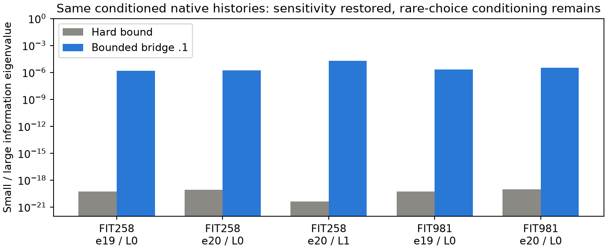

Fixed alpha.1 bridge: .9*clip(raw,-12,12)+.1*raw/sqrt(1+(raw/12)^2). It remains bounded, odd and monotone, with positive mathematical sensitivity beyond the hard clamp. On these same conditioned histories it restores the missing local direction. Ratios remain small because choices are rare; this is not measured noise reduction, useful-route credit or model-quality improvement. The hard-map near-zero ratios are numerical roundoff around theoretical rank1, not meaningful residual information.

Theory104; five primitive contracts and eight native comparisons pass 37.961s/371,992KiB. Alpha0 outputs/state/RNG and all parameter gradients exactly nest the old model. Positive complete native inference retains coupled clocks/ routes/real writes and target invariance; training refuses. Each prefix scores 168 logical keys/writes84; diagnostic hooks RECOMPUTE168 extra dot products, paid work. Live state576..720bytes,8available units. Prior fits paid; audit FLOPs unknown. No automatic fit, free scoring or hardware/quality advantage.

## Appendix B. Score-bound exposure and an exact gradient trap

| Seed | Encoder | Evidence | Capped races % | Expected capped winner % | Query races % |
| --- | --- | --- | --- | --- | --- |
| 6 | initial | Cap proxy | 0.00 | 0.00 | 0.00 |
| 6 | fixed_pass4 | Cap proxy | 9.53 | 9.53 | 32.62 |
| 7 | initial | Cap proxy | 0.00 | 0.00 | 0.00 |
| 7 | fixed_pass4 | Cap proxy | 7.43 | 7.43 | 25.78 |
| 6 | initial | Raw-confirmed | 0.00 | 0.00 | 0.00 |
| 6 | fixed_pass4 | Raw-confirmed | 8.56 | 8.56 | 34.38 |
| 7 | initial | Raw-confirmed | 0.00 | 0.00 | 0.00 |
| 7 | fixed_pass4 | Raw-confirmed | 6.99 | 6.99 | 25.00 |

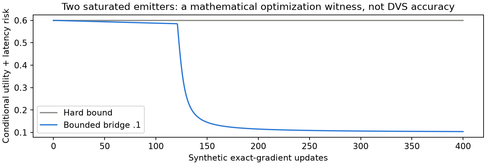

The43,008-race eight-history profile gives cap-occupancy proxies; the5,376 one-history score-pair decomposition independently confirms raw saturation using a2e-5 margin. Cohorts/noise scopes stay separate. No sampled race has both candidates saturated: the two-bound trap below is a mathematical witness, not an observed native condition. Late query cap exposure is stronger than all sites.

Theory105 exact conditional utility+bounded computational-latency risk: two raw emitters13/13,400 updates/step1. Hard remains .600003; bridge .600004 to.103999. A finite hard-map hop improves risk, proving an optimization flat cell rather than a representational impossibility. No stochastic estimator noise/native fitting/quality gate;800 scalar updates paid. Saved-array study .332s/245,116KiB; original fits retained, total audit FLOPs unknown.

## Appendix B. Completed fine-packet replay confirmations

| Seed | Credit/depth | Dev acc % | Dev NLL | Whole fit GF | Fit MF/presentation | Infer MF/prefix |
| --- | --- | --- | --- | --- | --- | --- |
| 6 | L2/all | 61.46 | 1.119163 | 1040.397 | 132.164 | 0.591737 |
| 7 | L2/all | 58.33 | 1.141794 | 1040.397 | 132.164 | 0.591779 |
| 8 | L2/all | 66.67 | 0.941821 | 1040.397 | 132.164 | 0.591849 |
| 7 | L4/k8 | 55.73 | 1.330390 | 214.394 | 27.235 | 1.068297 |
| 8 | L4/k8 | 57.29 | 1.101878 | 214.394 | 27.235 | 1.068297 |

Full984 FIT/192 DEV,20 observed packets plus query,8passes/7872 fitting presentations,U16/lr.003. All-race depth2 now has three completed seeds; depth4 sampled8 has seeds7/8. Original/factorized controls remain on the preceding replay ledger; missing matched deeper controls are not filled with predictions. Seed8 depth2 reaches66.667%/.941821; preserve it as a completed result with its1040.397GF fitting cost, not an isolated practical advantage.

Depth4 sampled8 is worse than same-seed depth2 on development loss in these runs. This is a restricted eight-site credit variant, not a test of all-race deeper credit or proof that depth cannot learn. The owner has queued matched depth4 all-race, depth6 sampled and growth-by-nesting comparisons.

Every column uses consistent units/denominators; core whole-fit and per-presentation work include replay, backward and Adam. Inference mean first11 DEV prefixes,2FLOPs/MAC plus unit specials. L2:8available units/168key scores/ 84writes per prefix;L4:16/336/168. FIT diagnostic scores use only32 fitting examples, not whole-FIT risk. DEV epoch selection and one-seed comparisons remain exploratory. Raw preprocessing, RNG, traffic and energy separate.

## Appendix B. AWS deeper all-race pilot: matched gates fail

| Coarse L4 seed7 | Dev acc % | Dev NLL | Whole fit GF | Fit MF/presentation | Infer MF/prefix |
| --- | --- | --- | --- | --- | --- |
| Original teacher | 56.77 | 1.342018 | 1.039740 | 1.015371 | 0.250529 |
| Factorized control | 55.73 | 1.368549 | 1.082407 | 1.057038 | 0.250487 |
| All40-race replay | 56.77 | 1.374384 | 28.968062 | 28.289123 | 0.250473 |

Coarse4/.25-clock,p16/L4/H2/pool2,256FIT/192DEV,fourpasses/1024 presentations,U16/lr.003. Every-parameter sequential/forked replay contracts and three actual recovery/accounting smokes precede these pilots. Full40 race sites/80shadow lanes preserve factual first time and actual forced writes. Teacher/factorized/replay share data and observation protocol; no weight decay or input noise is mixed into this comparison.

Replay NLL is worse by.032366 versus teacher and.005835 versus factorized, at27.861x/26.763x counted fitting work. Both fixed gates fail, confirmation is absent and no larger fit is nominated. This is a first small coarse/deep pilot; it does not replace the independently owned full-data fine-depth tests.

Completed summary234200Z,108.202s total campaign. Same common-unit denominator in every fitting column.16available receivers,8writes/event, 40factual races/prefix. Full replay/optimizer paid despite parallel wall execution. Inference first11 DEV prefixes; raw input preprocessing/traffic/ RNG/energy separate. No official test, comparable-quality work supremacy or claim that all deep counterfactual learning must fail.

## Appendix B. Parameter-targeted allocation retains a scoped positive gain

| Seed | Score variance/k4 | Parameter FIT96 ratio | Parameter FIT97 ratio | Each-case gate |
| --- | --- | --- | --- | --- |
| 7 | 0.906188 | 0.599166 | 0.486158 | True |
| 8 | 0.958262 | 0.614246 | 1.137133 | False |

Frozen priority predictor trains on true shared-parameter route norms on FIT0..31 and confirms on new FIT96..127. Exact distinct weighted sampling and inclusion correction remain. Both aggregate score ratios pass; one seed8 parameter case fails. Combined nomination stays FAIL. The two-case weighted parameter aggregates .516746/.658755 support48.3%/34.1% reductions and are preserved as diagnostics, not replacements of the every-case gate.

This is materially better allocation evidence than isolated score-space improvement, but four parameter examples cannot establish robustness or quality. No unchanged reduced-replay fit follows. Producer FIT labels were already seen; only priority supervision is held out. Every expensive training utility remains paid.

11.439s/531,560KiB;1280 training plus80confirmation VJPs,2560diagnostic shadow lanes, saved predictors/proposals. Whole fitting/diagnostic FLOPs unknown, not zero. No inference change, DEV/test quality or6-versus8 execution-lane work advantage. Main deeper replay/growth remains independently owned.

## Appendix B. AWS private state and shared maps: pilot gates fail

| Variant | Params | Available | Dev acc % | Dev NLL | Fit GF | Fit MF/target | Infer MF |
| --- | --- | --- | --- | --- | --- | --- | --- |
| Untied pool2 | 15523 | 8 | 55.73 | 1.274860 | 0.548517 | 0.535661 | 0.138133 |
| Shared pool2 | 11227 | 8 | 53.12 | 1.276615 | 0.544113 | 0.531360 | 0.138105 |
| Shared pool8 | 12019 | 32 | 54.69 | 1.233413 | 1.554905 | 1.518462 | 0.204447 |

Same256FIT/192DEV,fourpasses/1024presentations,seed6,coarse4/.25-clock, p16/L2/H2. Shared input/output/gate maps retain private keys, clock biases, timescales and receiver memories. Delays perform computation, hard addressed races select four real writes/event and separate keys/values remain. Pool8 adds32available receivers while keeping four selected writes.

Both fixed quality/resource nominations FAIL: tied2 loses.001754NLL and2.604accuracy points; tied8 improves NLL.041447 but misses.05 and loses 1.042points. Lower parameters and positive tied8 loss improvement remain supported. Pool growth also changes total hazard and per-unit exposure, so this is not isolated proof of capacity beyond scored work. No confirmation/full fit.

Every-parameter/state/batch and actual Adam/cursor/RNG/operator contracts pass before both learning smokes and pilots. Historical failed coalesce-adapter contract remains beside corrected admission. Campaign56.762s; all candidate keys/proposals/losing credit/optimizer work paid, same fitting denominator. Inference first11prefixes/2FLOPs perMAC plus unit specials; raw preprocessing, physical traffic/RNG/energy separate. Deeper replay owns the next integrated comparison; no unchanged shallow expansion.

## Appendix B. Query-only native admission: exact arithmetic saving

| Seed | Dev acc % | Dev NLL | Whole fit GF | Fit MF/presentation | Old infer MF | Query infer MF |
| --- | --- | --- | --- | --- | --- | --- |
| 6 | 66.67 | 0.890983 | 4.218015 | 0.535825 | 0.138119 | 0.135259 |
| 7 | 61.98 | 1.056934 | 4.218015 | 0.535825 | 0.138007 | 0.135147 |
| 8 | 69.27 | 0.920744 | 4.218015 | 0.535825 | 0.138035 | 0.135175 |

Three saved coarse4/.25-clock native producers,984FIT/eightpasses/7872 fitting presentations and192DEV. All576 paired prefix logits and ALLstate checks are bitwise identical. Only four unused intermediate affine classifiers are removed; clocks, races, keys, messages, persistent writes and terminal query remain. Original weights/fitting work and predictions are retained.

2860 counted operations per prefix,2.07%, are saved under full ATen coverage. Three counterbalanced wall repeats show the Python wrapper about2% SLOWER. Arithmetic saving is supported; practical speed/supremacy is not. This explicit-query inference-only helper cannot replace ongoing-label or silence-supervised streams without a separate contract.

65.025s/465,880KiB; target/repeat/query/parameter/training-rejection checks pass.8available units,4writes/event,all core scoring still paid. Same fit denominators/units and first11-prefix inference convention for both implementations.2FLOPs/MAC plus unit specials; raw preprocessing, traffic, RNG and measured energy remain separate. Verbatim former manual section preserved in appendices/aws_query_only_history_20261002T233000Z.md.

## Appendix B. Bounded score bridge: integrated training contracts

Eight double-precision contracts pass before fitting: alpha0 logits and all parameter/content gradients exactly nest the old batched path; positive bridge matches independent sequential factual and full first-time alternative replays; real addressed writes differ; full-route gradients, normalization, clipping and Adam agree. Partial-window model/Adam/RNG/cursor continuation is bitwise exact. Full/partial fitting stages and selected-value native inference have complete operation coverage. Explicit zero gradients in batch and absent unused sequential gradients are equivalent; any nonzero mismatch fails.

| Variant | Dev acc % | Dev NLL | Whole fit GF | Fit MF/presentation | Infer MF/prefix | Presentations |
| --- | --- | --- | --- | --- | --- | --- |
| Hard | 31.25 | 2.281937 | 9.769170 | 152.643283 | 0.333083 | 64 |
| Bridge .1 | 31.25 | 2.281964 | 9.827467 | 153.554179 | 0.335771 | 64 |
| Saved p16/L2/all | 58.33 | 1.141794 | 1040.396781 | 132.164225 | 0.591779 | 7872 |
| Saved p16/L4/k8 | 55.73 | 1.330390 | 214.394078 | 27.235020 | 1.068297 | 7872 |

Matched smoke arms: seed7,p8/L4/H2/pool2,32FIT/16DEV,two passes/64 presentations,U8/lr.003,eight Adam updates,all168 races and336 alternative shadow lanes per21-event prefix.7899 parameters,16available receivers, 16key scores/eight actual writes per event,720live state bytes in the 11audited DEV prefixes. Keys/values, temporal computation, source carry and sparse persistent writes remain; fitting computes all candidate values.

Both arms learn on FIT: initial/final NLL2.829119/2.037279 hard and 2.829112/2.039687 bridge. Equal31.25% small DEV accuracy; bridge NLL is worse by.00002646. Bridge adds.5967% counted fitting and.8070% inference work. Crucially, neither initial nor selected smoke model saturates a single one of5376 FIT races (max raw score2.59 initially/2.30 selected). This is integration evidence; it does not test saturation repair or nominate a larger fit.

Contracts9.065s/344424KiB; first missing-versus-zero comparison failure retained. Smokes61.158/64.604s,373200/374120KiB under one-host guard. Saved references use984FIT/192DEV/eightpasses/7872presentations: different width/data/quality; raw whole-fit gaps106.498x/21.947x versus hard smoke are unsupported as efficiency advantages. Same units and target denominators within each column;2FLOPs/MAC plus unit specials, first11 DEV inference convention. Preprocessing/traffic/RNG/energy separate; no official test.

## Appendix B. Restored native sensitivity has small, mixed route utility

| FIT | Event/layer/head | Raw capped score | L0 minus L1 | Hard emitter credit | Bridge emitter credit |
| --- | --- | --- | --- | --- | --- |
| 258 | 19/0/0 | 13.9539 | +0.003911 | 0.00e+00 | +9.07e-10 |
| 258 | 20/0/0 | 15.0771 | -0.001274 | 0.00e+00 | -2.52e-10 |
| 258 | 20/1/0 | 15.9095 | -0.019186 | 0.00e+00 | -6.14e-11 |
| 981 | 19/0/0 | 14.6482 | -0.007041 | 0.00e+00 | -1.57e-09 |
| 981 | 20/0/0 | 17.8833 | -0.037535 | 0.00e+00 | -5.36e-09 |

Five prespecified strictly saturated seed7 histories from theory104, fixed-pass4 producer, FIT258/981. For each, both actual alternatives write persistent receiver state at the factual FIRST arrival. Prefix winners/times are fixed; suffix clocks, messages and memory evolve with the original hard map. Original-winner replays recover all original logits/state/end RNG. Ten alternative plus five factual native forwards are paid;168additional raw dot products per diagnostic forward. These FIT labels are revealed for utility diagnosis and are no longer label-unused. No optimizer/DEV quality/test selection.

L0-L1 is positive in one case, so its alternative improves NLL; four negative gaps mean the factual winner is better. Every previously blocked emitter has nonzero bridge choice sensitivity, confirmed by double analytic derivatives and finite-difference gradcheck. Absolute restored derivatives are only6.14e-11 to5.36e-9: alternative probabilities remain1.46e-7 to 8.77e-6. Restoring rank does not by itself make those routes useful or their contribution to expected risk substantial.

Conditional choice risk is sum pi_i*L_i, so dR/draw0= pi0*pi1*(L0-L1)*f'(raw0). Utilities and first time are held fixed; this tests choice credit only. The bridge is applied to the current conditional score map in this derivative, not the suffix law. These numbers are not a full positive-bridge risk, joint time/content update or learning result.

Audit18.432s/328716KiB; diagnostic whole arithmetic/traffic/energy unknown, not zero. Conditional two-score Fisher determinant is pi0*pi1*d0^2*d1^2 times the raw-gradient Gram determinant. Positive slopes preserve existing raw rank; confidence and nearly parallel raw directions can still suppress useful learning. Theory106/107 retain exact scopes. No automatic bridge scale-up; independently owned integrated deeper replay and reserved AWS comparisons remain the quality priority.

## Appendix B. AWS depth8 replay: seed7 positive pilot

| Family/credit | Params | Dev acc % | Dev NLL | Whole fit GF | Fit MF/target | Infer MF |
| --- | --- | --- | --- | --- | --- | --- |
| private/teacher | 54571 | 48.438 | 1.369199 | 2.022431 | 1.975030 | 0.475853 |
| private/factorized | 54571 | 47.396 | 1.399592 | 2.124006 | 2.074225 | 0.475713 |
| private/replay | 54571 | 56.771 | 1.316790 | 109.118229 | 106.560770 | 0.475769 |
| depth/teacher | 22351 | 52.604 | 1.410495 | 1.989397 | 1.942771 | 0.475699 |
| depth/factorized | 22351 | 46.875 | 1.395239 | 2.090973 | 2.041966 | 0.475909 |
| depth/replay | 22351 | 52.083 | 1.348356 | 109.085195 | 106.528511 | 0.475923 |

Both families retain native computational delays/races, key/value separation, source carry, sparse writes and private persistent receiver state. Private maps differ perdepth/receiver; depth-shared maps are shared acrossdepth/pool perhead, with private keys/clocks/timescales. p16/L8/H2/pool2,256FIT/192DEV,fourpasses/1024presentations,U16/lr.003, coarse4/.25clock.32available units,32key scores/16writes per event; five-event prefix80factual races/160full shadow lanes. All163840 shadow lanes and819200 replay events perfit are charged.

Both seed7 families pass the predeclared .03NLL gain versus BOTH matched controls and at most1pp accuracy loss. Private replay improves NLL .052409/.082802 versus teacher/factorized and accuracy8.333/9.375pp. Depth-shared replay improves .062138/.046883NLL; teacher accuracy declines .521pp within the gate. These positive heldout results are preserved. The unchanged seed8 confirmation below subsequently fails both family gates: nomination is not robust, and no full984FIT promotion follows.

Original teacher, factorized clock/content control and corrected all-race first-time-preserving actual-write replay share data/order/noise/ optimizer budgets. Full every-parameter/recovery/state/shared-alias contracts and allsix learning smokes pass before pilot/confirmation. Replay costs about52–55x the controls in complete fitting arithmetic; equal sparse inference does not remove that expense. No comparable-quality total-resource advantage, officialtest or unchanged fullfit is claimed.

Same fitting denominator and units for every row/column; 2FLOPs/MAC plus unit specials, first11 DEV prefix inference mean. Reused DEV epoch selection, two seeds and fixed nomination scope. Input preprocessing, candidate index/RNG, traffic and measured energy separate. Verbatim shared report evidence preserved in appendices/ aws_depth8_history_20261003T003500Z.md. Source/result hashes checked; historical depth4 failed gate and local bridge evidence retained.

## Appendix B. AWS depth8 replay: seed8 confirmation fails

| Family/credit | Params | Dev acc % | Dev NLL | Whole fit GF | Fit MF/target | Infer MF |
| --- | --- | --- | --- | --- | --- | --- |
| private/teacher | 54571 | 55.729 | 1.331247 | 2.022431 | 1.975030 | 0.475909 |
| private/factorized | 54571 | 48.438 | 1.270459 | 2.124006 | 2.074225 | 0.475993 |
| private/replay | 54571 | 54.167 | 1.282510 | 109.118229 | 106.560770 | 0.475699 |
| depth/teacher | 22351 | 48.438 | 1.283150 | 1.989397 | 1.942771 | 0.475825 |
| depth/factorized | 22351 | 50.000 | 1.271398 | 2.090973 | 2.041966 | 0.475783 |
| depth/replay | 22351 | 48.958 | 1.270943 | 109.085195 | 106.528511 | 0.475811 |

Both families retain native computational delays/races, key/value separation, source carry, sparse writes and private persistent receiver state. Private maps differ perdepth/receiver; depth-shared maps are shared acrossdepth/pool perhead, with private keys/clocks/timescales. p16/L8/H2/pool2,256FIT/192DEV,fourpasses/1024presentations,U16/lr.003, coarse4/.25clock.32available units,32key scores/16writes per event; five-event prefix80factual races/160full shadow lanes. All163840 shadow lanes and819200 replay events perfit are charged.

Both unchanged seed8 confirmation gates FAIL. Private replay preserves .048736NLL improvement over teacher, but loses1.5625pp accuracy and is .012051NLL worse than factorized. Depth-shared replay improves only .012207/.000455NLL versus teacher/factorized, below .03, and declines 1.0417pp versus factorized accuracy. Keep the earlier positive seed7 result beside this failure; neither establishes broad failure of deep representation learning or practical advantage.

Original teacher, factorized clock/content control and corrected all-race first-time-preserving actual-write replay share data/order/noise/ optimizer budgets. Full every-parameter/recovery/state/shared-alias contracts and allsix learning smokes pass before pilot/confirmation. Replay costs about52–55x the controls in complete fitting arithmetic; equal sparse inference does not remove that expense. No comparable-quality total-resource advantage, officialtest or unchanged fullfit is claimed.

Same fitting denominator and units for every row/column; 2FLOPs/MAC plus unit specials, first11 DEV prefix inference mean. Reused DEV epoch selection, two seeds and fixed nomination scope. Input preprocessing, candidate index/RNG, traffic and measured energy separate. Verbatim shared report evidence preserved in appendices/ aws_depth8_history_20261003T003500Z.md. Source/result hashes checked; historical depth4 failed gate and local bridge evidence retained.

## Appendix B. Deep causal language: admission only; ten-million fits pending

| Family | Params | Fit targets | Initial BPC | Final BPC | Whole fit GF | Fit MF/char | Infer MF/char |
| --- | --- | --- | --- | --- | --- | --- | --- |
| private | 54907 | 1024 | 5.311638 | 4.832740 | 0.463220 | 0.452363 | 0.097376 |
| depth | 22687 | 1024 | 5.273659 | 4.807838 | 0.461066 | 0.450260 | 0.097376 |

Both integrated native depth8 families pass causal token/teacher parity and actual private-state/Adam/cursor/RNG/partial-window recovery contracts. These1025-character/1024target,513character/512target DEV,onepass,credit16/ U256 learning smokes use the ORIGINAL counterfactual teacher, not corrected full replay. Model key/value separation, sparse receiver writes and physical time evolution remain.32available units,32scored keys/16writes perchar; 512target DEV retains2448bytes addressed state in both families. Four optimizer updates, all core fitting work charged.

Private BPC5.311638 to4.832740,shared5.273659 to4.807838 are admission checks, not language advantage or evidence that deeper features generalize. AWS reserved coordinator now owns private/shared first10M-character FIT models,onepass,disjoint1M DEV at90M,seed7,credit16/U256/lr.002/warmup4096. No completed10M quality cell is filled here. Gesture replay nominations failed confirmation; language teacher runs remain distinct controls.

The corrected language choice return must sum ALL downstream token losses after the forced route, actually changing private memory at the factual FIRST time. A detached chunk omits later-chunk credit. Full replay at T16/L8/H2/pool2 costs512shadow lanes/8192shadow events perchunk; causal suffix snapshots can reduce about2x, not erase the quadratic work. A future language port needs full-parameter sequential/batched sum-return contracts, causal intervention, actual recovery and complete paid work.

Completed smokes250.174/251.253s,peak<534MiB; bounded long jobs stay in AWS tmux/coordinator with reserved2CPU slots and8GiB floor. Table uses CPU emulator arithmetic plus unit-special convention for both models; projected physical-event numbers remain separate. Credit graph freed each16target microchunk, persistent state crosses updates. DEV passes/ RNG/traffic/energy outside fitting FLOPs, not zero. Source snapshots frozen; all pending runs retained as pending and independently owned.

## Appendix B. Corrected causal language replay: sixteen contracts pass

| L8/p4 family | Params | Entering events | Entering bytes | Final bytes | Parameter grads | Shadow lanes |
| --- | --- | --- | --- | --- | --- | --- |
| private | 4411 | 2 | 1040 | 1320 | 384 | 96 |
| depth | 2071 | 2 | 1000 | 1320 | 174 | 96 |

A new sibling language helper emits EVERY token prediction from nonempty detached native receiver memories/arrivals/source context. For each race at event t, replay each alternative at the factual FIRST time with common future randomness, real private memory writes and coupled suffix clocks/messages; stopped-gradient utility sums losses t..T-1. Categorical local-expectation credit is added to factorized common-clock and realized-content derivatives. Original hard score map retained, no bounded bridge/calibration, token target in input or per-position KV bank.

Both private and depth-shared L8/H2/p4/pool2 double models pass EVERY-parameter sum-return gradient comparison with independent sequential full-write replays, all private state/arrivals/context comparisons, original-teacher/factorized exact forward-state parity and variable2/3 token lanes. Losing routes preserve factual first time, change actual suffix predictions and preserve preceding predictions. Future observed tokens and changed target labels cannot affect earlier factual output.

Actual partly accumulated gradients, native state, Adam, cursor and RNG recover bitwise exactly; independent sequential summed gradients agree after target normalization/clipping/Adam. All factual/shadow/backward and optimizer operations covered.96shadow lanes/288shadow events per three-target case are charged. The port closes a numerical mechanism gap; no benchmark fit or deep-feature advantage is inferred.

Theory108;23.973s/361084KiB,16contracts. State bytes are actual double-precision numerical states, not the production float ledger. Truncating/detaching entering credit still omits later-chunk derivatives and gives no whole expected-stream gradient theorem. Existing AWS10M original-teacher controls and their immutable sources stay distinct; no new10M quality cell or claimed language replay gain.

## Appendix B. Production-size language replay: paid resource admission

| p16/L8 case | Targets | Whole step/fit GF | Fit MF/target | Infer MF/target | Shadow lanes |
| --- | --- | --- | --- | --- | --- |
| private/full16 | 16 | 1.084409 | 67.775587 | 0.097256 | 512 |
| private/partial3 | 3 | 0.040100 | 13.366694 | 0.097256 | 96 |
| depth/full16 | 16 | 1.083893 | 67.743327 | 0.097247 | 512 |
| depth/partial3 | 3 | 0.039584 | 13.194644 | 0.097247 | 96 |
| private/teacher smoke | 1024 | 0.463220 | 0.452363 | 0.097376 | 0 |
| depth/teacher smoke | 1024 | 0.461066 | 0.450260 | 0.097376 | 0 |

Private54907/depth-shared22687 parameters,H2/pool2,32available receivers,32key scores/16actual writes per observed token. A full16target chunk executes512shadow lanes/8192shadow events; partial3 executes96/288. Actual original temporal state and hard races remain. Both full factual primal outputs/state match independent sequential native computation. Four prespecified suffix returns per family match sequential alternatives at factual first time; all eight earlier-loss/end-RNG checks pass.

After each real full-step Adam update, save model/nonempty optimizer/ private state/cursor/RNG and recover the next actual three-target partial update bitwise exactly. Total four test updates plus two recovery repeats are paid. First-state2376/2304bytes, final2448bytes, float32. Every factual/shadow/backward/normalization/clipping/Adam/native-inference operation has complete coverage. Numerical admission succeeds86.859s/ 429912KiB under guarded one-thread tmux,~11GiB host memory available.

Full replay costs67.78/67.74MF per target here versus saved original teacher smoke about.45MF. Tables show whole executed-step or whole fit work and the corresponding actual target denominator in the SAME units. Synthetic16/3target correctness strings and saved1024target text8 smokes have unequal data/quality/update context; raw work gaps are not efficiency claims. Native sparse inference stays~.097MF/target but does not remove counterfactual learning work. No DEV/test/BPC or fitted replay gain.

Theory109; production tests cover full execution and selected returns/recovery. Full EVERY-parameter sequential-return comparison is the prior T3/p4 double contract, not relabelled full T16 equality. TwoFLOPs/MAC plus unit specials; shadow-state export and taps are paid diagnostic execution/traffic. Development passes, physical traffic/RNG/ energy remain separate. Whole diagnostic-audit FLOPs unknown, not zero. No unchanged language training promotion follows from resource admission.

## Appendix B. Persistent representation and missing delayed credit

| Credit horizon H | Geometric weighting after H (%) | Absolute geometric tail |
| --- | --- | --- |
| 16 | 85.214 | 85.641161 |
| 32 | 72.615 | 72.978583 |
| 64 | 52.729 | 52.993328 |
| 128 | 27.804 | 27.942980 |

Exact constructed encoder: observe x,write theta*x,transport by rho^32 with rho=exp(-.01),predict delayed label x. At theta.3,full encoder gradient -.567961,credit16 with detached future state0; theta.31 reduces loss.305883 to.300230. Race writes x or0; delayed conditional choice gradient -.114477,within-chunk return gradient0 despite replaying both choices. Seven analytic/autograd/finite-difference and exhaustive-sampling contracts pass. This proves a training-credit obstruction with representational capacity retained, not a measured text8 failure.

The linear contraction-mode tail fraction rho^H is large for a 100event decay. Native whole-state contraction is NOT established: fixed-input unit damping/orthogonal rotation do not bound learned source carry, gates, clock history and addressed interactions. Shared parameters can get other later derivatives; that is not automatic recovery of the omitted original-write path. Decoder adaptation is also not proof of learning new long-range representations.

Fixed execution-count alternative: fullT16/L8/H2/pool2 has512 shadow events/target plus one factual; T64/k8 uniform distinct sites has16shadow events/target plus one factual. The longer factual graph and score discovery still cost work. Horvitz scalingR/k=128 makes single-informative-route covariance127*g*g^T. Exhaustive12race/k3 subsets independently verify mean and covariance. Unbiasedness can coexist with poor learning; these counts are not FLOPs/wall/quality advantage.

Theory110; .529s/282228KiB,no optimizer/DEV/test. Corrected within-chunk routing support, confidence/sensitivity and credit horizon are separate constraints. Next use exact-source saved language checkpoints for a frozen longer-suffix shared-parameter return/variance audit on unseen FIT inputs before selecting H/k. Existing10M teacher runs remain unchanged; no long sampled-credit fit or predicted benchmark gain is admitted by this synthetic witness.

## Appendix B. Native text8 horizon return: four credit reversals

| FIT start | Event/L/H | Q0-Q1 H16 | Q0-Q1 H32 | Late contrast | Param norm16 | Param norm32 | Flip |
| --- | --- | --- | --- | --- | --- | --- | --- |
| 8192 | 0/0/0 | +0.119169 | -0.009301 | -0.128470 | 0.003241 | 0.000253 | YES |
| 8192 | 0/7/0 | +0.045263 | +0.020573 | -0.024690 | 0.026251 | 0.011932 | No |
| 8192 | 8/0/0 | +0.164192 | -0.112556 | -0.276748 | 0.043189 | 0.029606 | YES |
| 8192 | 8/7/0 | +0.009205 | +0.007439 | -0.001766 | 0.000520 | 0.000420 | No |
| 8320 | 0/0/0 | +0.285896 | +0.381399 | +0.095503 | 0.000551 | 0.000735 | No |
| 8320 | 0/7/0 | -0.018730 | -0.022666 | -0.003936 | 0.000260 | 0.000315 | No |
| 8320 | 8/0/0 | -0.040859 | +0.151710 | +0.192568 | 0.007922 | 0.029413 | YES |
| 8320 | 8/7/0 | -0.009103 | +0.004196 | +0.013299 | 0.007070 | 0.003259 | YES |

Frozen private native p16/L8/H2/pool2,54907parameters,original 8192-character/fourpass seed6 producer. Fixed final-pass4 ONLINE weights, not DEV-selected state, converted to double for numerical VJPs. Two producer-unseen FIT spans8192/8320,16observed warmup tokens and32 causal next-token targets each. Prespecified sites(event0/8,layer0/7,head0), one fixed common-noise draw. Both receivers actually write private state at the factual FIRST time, then messages/clocks/memory evolve through all32targets. Original winner recovers ALLfactual logits/state/end RNG.

Four of eight sites reverse the conditional choice-credit sign when losses16..31 are included. Four-site aggregate native parameter-credit cosines -.600832/-.792626 show directional opposition on these contexts; norms .051372/.032006 and.010178/.029475 for16/32returns. None of these chosen scores is capped. This is real omitted downstream utility at this frozen point, beyond theory110 synthetic witnesses, not proof that truncation dominates global learning or longer credit improves quality.

Per-site credit is pi0*pi1*(Q0-Q1)*grad(scores0-scores1), with the SAMErealized-branch native score Jacobian for both horizons. Earlier pathwise clocks remain differentiable; this is not note103 fixed-clock likelihood geometry. The shown contrasts are SUMsuffix NLL, not average prediction quality. Future observed tokens/changed target labels leave earlier factual output unchanged. Allcases/full54907coordinate arrays saved; sampling only four of512sites excludes a full-chunk gradient claim.

Theory111;7.026s/426172KiB.16forced32token suffixes/two factual graphs/eightVJPs plus warmup/causality checks paid; diagnostic totalFLOPs unknown, not zero. Double live state4488..4624bytes,32available/32scores/ 16writes pertoken. No optimizer/DEV/test/changed-parent fit or benchmark advantage. The independent confirmation below FAILS aggregate-opposition replication; retain this original positive mechanism observation beside it.

## Appendix B. Horizon confirmation: downstream effects vary by context

| Fresh FIT | Draws | Site flips | Mean norm16 | Mean norm32 | Mean cosine | Opposition gate |
| --- | --- | --- | --- | --- | --- | --- |
| 8448 | 3 | 2/12 | 0.303282 | 0.536700 | +0.999383 | False |
| 8576 | 3 | 1/12 | 0.049228 | 0.021923 | +0.455223 | False |

Same frozen producer/sites/budgets,NEW FIT8448/8576 spans and three independent evaluated race draws111330/111331/111332. Warmup seed111329 stays fixed across draws.24cases/48actual forced suffix replays,24parameter VJPs,all outcomes and coordinate arrays retained. Before observing results, diagnostic replication required both span mean16/32parameter-credit cosines<0 and at least one site flip per span. Both gates FAIL: mean directions agree,despite three of24 individual site reversals. Do not replace this gate with a larger-gradient criterion.

First fresh span preserves direction across all draws,with mean longer-return norm.536700 versus.303282. Second has more variable perdraw norms/angles and mean cosine+.455223. These are supported context-dependent downstream effects; universal destructive short credit is not established. Neither frozen study measures expected fullstream risk, semantic feature content or a fitted benchmark gain. Original first-audit reversals remain valid within their scope.

The current mechanism priorities stay separate: corrected actual language shadow return is numerically installed; hard-score sensitivity repair has no demonstrated quality gain; full replay work is expensive; horizon changes utility but robust allocation/generalization remain open. Next broader frozen utility/covariance accounting can inform H/k; no unchanged long sampled-horizon training follows this failed diagnostic replication. Existing10M original-teacher controls continue independently.

Theory112;20.355s/470848KiB,one guarded CPU job/no optimizer/ DEV/test. Earlier-loss/factual-first-time/ALLoriginal-winner-state/RNG/ future-token/target invariance and unchanged parameters pass on all three draws. Same original fit work paid; whole audit arithmetic, physical traffic and energy unknown. More counterfactual support cannot automatically repair omitted future loss, while a longer return is also not automatically a better finite-data update. No supremacy claim.

## Appendix B. Stateful language replay accumulator: chronological RNG retained

| L8/p4 family | Params | Targets | Chunks | Shadow lanes | Shadow events | Partial LR | Live bytes |
| --- | --- | --- | --- | --- | --- | --- | --- |
| private | 4411 | 3 | 2 | 96 | 160 | 0.0015 | 1320 |
| depth | 2071 | 3 | 2 | 96 | 160 | 0.0015 | 1360 |

New sibling RNG-state kernel/helper and ReplayAccumulator preserve the original native stream randomness cadence: enter a chunk from its actual Torch RNG state, replay all alternatives from that SAMEstate, and advance the real stream only to the factual end RNG. No extra seed draw, repeated chunk seed or input/label/index randomness channel. Private addressed state crosses chunks/optimizer updates while its credit graph detaches each microchunk. Physical races/message evolution and original hard score map remain; numerical shadows are fully charged.

Ten double L8/H2/p4/pool2 private/shared contracts pass. Every factual prediction and ALLstate match original chronological-teacher forward before a delayed optimizer update; end RNG is exact. Independent sequential actual-write all-target returns match every accumulated parameter gradient over two-plus-one target microchunks. Save partly filled gradients/private state/Adam/cursor/RNG and all replay counters: recovered predictions/state/gradients and next actual update are bitwise exact.

Target labels change pending gradients but leave both chunks' pre-update factual predictions/state/RNG identical. Target-weighted normalization,clip1,warmup total3/4,partial lr.0015 and Adam match independently summed sequential credit. Complete actual shadow/backward plus normalize/clip/warmup/optimizer operation coverage.96shadow lanes/ 160shadow events across the2+1chunks are paid; this is not the288 events of one unbroken three-target credit chunk. Different boundaries are explicitly different training objectives.

Theory113;14.510s/345160KiB. Correctness-test optimizer steps, no trained data/DEV/test/quality claim. Successfully contracted note108 seeded sources are preserved; new stateful siblings are frozen too. Existing AWS10M original-teacher drivers and checkpoints unchanged. A new fitted driver must use this credit in BOTH traced and untraced windows, save replay counters and preserve accounting/chronological controls; merely swapping an accumulator into an old traced loop would omit replay in traced windows. No fitted comparator launched here.

## Appendix B. Replay fitting driver: interrupted learning recovers exactly

| L8/p4 family | Params | Targets | Updates | Whole fit GF | Fit MF/target | Infer MF/target |
| --- | --- | --- | --- | --- | --- | --- |
| private | 4411 | 8 | 2 | 0.008089 | 1.011185 | 0.009850 |
| depth | 2071 | 8 | 2 | 0.008013 | 1.001668 | 0.009810 |

New sibling benchmark driver ALWAYS calls the stateful full-write ReplayAccumulator. Operation tracing wraps that same call, preserving all-target shadow returns in both audited and ordinary windows. Twelve end-to-end private/shared depth8 contracts pass. Synthetic eight-target fits use two-target credit chunks, four-target optimizer windows, target-weighted normalization, clipping and warmup. This closes the traced-loop omission hazard identified in Theory114; the existing AWS original-teacher controls remain unchanged.

Interrupt after the first microchunk: two targets of pending gradients, zero updates, live private memory and an unfinished work trace. Interrupt separately after the first completed update. Both resumptions reproduce EVERY learned weight, Adam field, remaining gradient, state, RNG, counter and cursor bitwise, together with all output curves, DEV selection and fitting work. Tracing and untraced learning also agree bitwise; untraced runs explicitly carry no whole-fitting work estimate.

Changed source hashes, settings or input data refuse recovery; completed outputs refuse overwrite. All factual/shadow forward and backward, normalization, clipping and optimizer operations have complete numerical accounting coverage. The eight-target row pays 256 shadow lanes and512 shadow events across four detached chunks. Inference is the original cold native selected-value prefix. Whole-fit and per-target columns use the SAME actual eight-target denominator for both families; synthetic correctness fits provide no text8 quality comparison or benchmark advantage.

Theory114;83.791s/346016KiB. All numerical arms ran serially inside one guarded job with an8GiB host-memory floor. Original races, score clamp, key/value separation, deep persistent state and chronological noise are retained. No larger credit horizon, new timing operator or Transformer fit is admitted by these contracts; a real-data replay fit still requires its own frozen protocol and measured throughput budget. Older AWS DVS results retain their exact original source hashes: the shared regularization driver later evolved, so publication validates its archived original bytes from Git rather than requiring the current driver. Stored results and frozen report modules are unchanged.

## Appendix B. Factual-winner reuse: measured work and numerical limits

| L8/p16 family/arm | Params | Whole fit GF | Fit MF/target | Infer MF/target | Shadow lanes |
| --- | --- | --- | --- | --- | --- |
| private/original | 54907 | 1.084409 | 67.775587 | 0.096786 | 512 |
| private/reuse | 54907 | 0.546353 | 34.147058 | 0.096786 | 256 |
| depth/original | 22687 | 1.083893 | 67.743327 | 0.096786 | 512 |
| depth/reuse | 22687 | 0.545837 | 34.114799 | 0.096786 | 256 |

Every sampled factual winner already supplies its true downstream loss. Forcing that SAME receiver at the SAME first time, with the same entering state/future draws and actual write, reproduces the factual trajectory. Reuse this detached return and simulate only different outcomes. The categorical local expected-return objective and every earlier score/producer VJP are identical in exact arithmetic; native clock/content derivatives and inference stay unchanged. At two candidates this removes half the shadows; it changes neither credit horizon nor candidate support.

Theory115:28private/shared double depth8 contracts for pools1/2/4 match EVERY parameter gradient against both old batched and independent sequential enumeration. ALLfactual-winner replay outcomes agree, winner-recording primal/state/RNG/pathwise gradients nest bitwise, causal token/label and exact pending-gradient/Adam recovery pass. Production rows above each pay ONE synthetic sixteen-target update from the SAME nonempty state/parameters/RNG:512→256shadow lanes and 8192→4096shadow events. Actual normalization/clip/warmup/Adam and all factual/shadow backward are included, with complete operator coverage.

private: counted fitting work -49.617%; gradient relative L2 9.96e-07, max absolute 1.44e-05; 3 parameter tensors miss the coordinate tolerance; actual Adam-update relative difference 0.000257. Production numerical gate FAILS. depth: counted fitting work -49.641%; gradient relative L2 9.73e-07, max absolute 1.79e-05; 3 parameter tensors miss the coordinate tolerance; actual Adam-update relative difference 0.000594. Production numerical gate FAILS.

Theory116;98.060s/399744KiB. Predeclared float32 coordinate rtol3e-4/atol3e-6, global gradient relative error<=3e-5 and Adam-update relative error<=.005 are retained. Initial strict run stopped at a key-read coordinate mismatch; the completed audit reports all gates without weakening them. Nonempty Adam/private state/pending three-target recovery and next partial update are bitwise exact. Tables use the SAME16target denominator and2FLOPs/MAC+unit-special convention for all arms. Extra recovery steps are separately paid diagnostic work. No data-fit BPC, energy, physical projection or benchmark superiority claim; existing AWS10M teacher/factorized/full-replay sources and queues remain untouched.

## Appendix B. Production precision: equivalent gradients and every shadow route agree

| Family | Double reuse error | Float32 old error | Float32 reuse error | Old/new decisions | Mismatches |
| --- | --- | --- | --- | --- | --- |
| private | 1.44e-15 | 1.49e-06 | 1.6e-06 | 131328/65792 | 0 |
| depth | 2.73e-15 | 2.12e-06 | 2.1e-06 | 131328/65792 | 0 |

Same represented float32 p16/L8/H2/pool2 weights and nonempty private memory as Theory116, promoted to double without reinitializing the model. Same synthetic sixteen-target chunk and entering RNG. Compare EVERY native parameter gradient of original full enumeration and winner reuse at both precisions. In double the complete production gradients agree to1.44e-15/2.73e-15 relative error; factual logits/state are bitwise identical. All caller and factual-end RNG states match.

The table compares each float32 implementation against its OWN double program. Both show roughly one-to-two parts per million global gradient error. ALL131328 original and65792 optimized factual/shadow race decisions per family agree across precisions; there is no branch crossing to explain away the comparison. The prior tight-coordinate failure therefore coexists with exact mathematical estimator equivalence and floating arithmetic error in BOTH implementations. Prior failed gates remain recorded, and this diagnostic applies no optimizer or precision repair.

Different batch shapes can round contractions and return reductions differently despite representing the same trajectory. For local categorical credit g_i=pi_i(Q_i-mean_pi(Q)), a return error bounded by delta gives score-credit error at most2pi_i delta, before the score Jacobian pullback and its own rounding. A large common loss can amplify cancellation relative to a tiny advantage. A detached baseline leaves exact credit unchanged, but its numerical benefit must be measured before any fitted-rule change.

Theory117;13.556s/374828KiB, four contracts. Full gradient vectors and actual factual/shadow winner histories are preserved in the source-hashed vectors artifact. Total audit arithmetic/traffic/energy are unknown, not zero. No trained text8, DEV/test or Adam step. This small rounding floor does not establish a cause of underfitting or absent deep features; larger utility, horizon, exposure and resource questions remain separate.

## Appendix B. Production causal depth8 replay driver: numerical admission complete

| L8/p4 family/credit | Whole fit GF | Fit MF/target | Infer MF/char | Shadow lanes |
| --- | --- | --- | --- | --- |
| private/teacher | 0.002514 | 0.052384 | 0.010616 | 0 |
| private/factorized | 0.002687 | 0.055975 | 0.010616 | 0 |
| private/replay | 0.364215 | 7.587809 | 0.010616 | 1536 |
| depth/teacher | 0.002400 | 0.050005 | 0.010616 | 0 |
| depth/factorized | 0.002573 | 0.053596 | 0.010616 | 0 |
| depth/replay | 0.364101 | 7.585430 | 0.010616 | 1536 |

All SIX actual private/shared teacher/factorized/full-replay drivers pass bitwise interrupted/resumed model/Adam/private state/cursor/RNG/counter/work recovery, including an UNTRACED third credit chunk. Each row is the SAME48 text8 fitting targets, one pass, credit16/U16/lr.002/warmup32,33 disjoint DEV characters. Every stage covers actual shadows/backward/normalize/clip/Adam; the accumulator includes backward in its combined work bucket. None of these tiny correctness fits is a language quality comparison.

### Full corrected language replay: avoid the redundant winning shadow

| p4/L8 private replay | Fwd+back GF | Fwd+back MF/target | Shadow lanes |
| --- | --- | --- | --- |
| full | 0.004387707 | 1.462569 | 96 |
| reuse | 0.002269611 | 0.756537 | 48 |

Independent AWS winner-reuse proof: four private/shared one/three target double cases agree for EVERY gradient within3.26e-15 absolute error and have bitwise factual logits/state/end RNG. The second table uses the SAMEthree-target denominator and includes only forward+backward:48.2734% less work, optimizer/inference/traffic/RNG/energy excluded and not zero. Its subsequent TWO actual optimized driver recovery contracts pass, with768lanes/12288shadowevents per48-target fit. No candidate sampling or inference substitution.

All columns use2FLOPs/MAC+unit-special and consistent denominators within their table; whole actual fit and per-target work appear together. The isolated three-target audit is explicitly separate from full 48-target driver fits. Original teacher10M checkpoints were preserved at73728targets/288updates each for exact continuation. Original failed object-comparison test and source-scoped coordinator recovery remain historical; no learned weights were discarded. Source-backed AWS findings/manual report history are retained alongside these pages.

## Appendix B. AWS deep language smokes: same learning with half the replay work

| L8/p16 family/credit | Final DEV BPC | Whole fit GF | Fit MF/target | Infer MF/char |
| --- | --- | --- | --- | --- |
| private/teacher | 4.735412 | 0.463355 | 0.452495 | 0.097376 |
| private/factorized | 4.737501 | 0.476965 | 0.465786 | 0.097376 |
| private/replay | 4.730272 | 69.349421 | 67.724044 | 0.097376 |
| private/reuse | 4.730272 | 34.913923 | 34.095628 | 0.097376 |
| depth/teacher | 4.706595 | 0.461288 | 0.450477 | 0.097376 |
| depth/factorized | 4.698587 | 0.474900 | 0.463769 | 0.097376 |
| depth/replay | 4.695411 | 69.347356 | 67.722027 | 0.097376 |
| depth/reuse | 4.695411 | 34.911858 | 34.093611 | 0.097376 |

ALL eight completed real causal text8 learning/RSS admissions: 1025 observed FIT characters/1024 next-character targets, one pass, 129 disjoint DEV characters at90M/128targets, seed7, p16/L8/H2/pool2, credit16/U256/lr.002/warmup4096/clip1. Same chronological persistent sparse state, native computational delays, key/value separation and receiver maps. Private54907/shared22687parameters; 32available/32scored/16selected receiver writes pertarget. Original teacher, factorized clock/content and full-write choice credit are different learning estimators of this integrated model.

private: original→reuse BPC difference +3.44e-07; counted whole-fit work -49.655%; measured wall 554.1→379.2s. depth: original→reuse BPC difference -3.44e-07; counted whole-fit work -49.657%; measured wall 548.4→374.3s. Full replay pays32768shadow lanes/524288 shadow events; reuse pays16384/262144, retaining ALLalternative write returns and unchanged sparse inference. All fitting stages are counted together; inference is the same warm selected-value native prefix including next-character loss. The measured wall comparison spans separate same-host admitted jobs, not a controlled throughput or energy benchmark.

Every smoke lowers its initial DEV BPC and stays below1GBRSS. Private initial5.209543, shared5.134375; replay/reuse final scores agree within3.44e-7 BPC. These small fits demonstrate learning and implementation admission. They do not satisfy the user's10M character quality protocol, establish generalization advantage against counts/Transformers, or imply full replay's total training work is competitive with the much cheaper teacher/factorized controls.

Prioritized matrix aws_language_winner_matrix_20261003T014100Z: exact original10M teacher continuations, private and depth-shared optimized full-write replay10M, and factorized10M controls as slots permit. Long outcomes remain PENDING; no predicted BPC is entered. Three bounded one-thread CPU slots on the authorized AWS host, host+slot locks/RSS watchdogs/min8GiB and serialized publication. All earlier positive/failed depth8 gesture evidence and original full replay learning rows are retained. CPU arithmetic estimates include clock simulation/gradients/optimizer; DEV passes/RNG/traffic/energy separate, no physical cost projection or supremacy claim. Original teacher recovery may discard at most4095 uncheckpointed targets each (<=.041% extra relative to10M); exact discarded work is unknown. Original1M initial DEV versus new1025-character initial diagnostics also makes startup wall unequal; final1M DEV is matched.

## Appendix B. Cached causal prefixes: equivalent credit with fewer operations

| Family/arm | Whole fit GF | Fit MF/target | Infer MF/target | Shadow lanes | Shadow events |
| --- | --- | --- | --- | --- | --- |
| private/full | 0.069989 | 17.497187 | 0.095498 | 128 | 512 |
| private/winner | 0.036360 | 9.090061 | 0.095498 | 64 | 256 |
| private/cached | 0.023758 | 5.939437 | 0.095498 | 64 | 160 |
| depth/full | 0.069473 | 17.368150 | 0.095498 | 128 | 512 |
| depth/winner | 0.035844 | 8.961023 | 0.095498 | 64 | 256 |
| depth/cached | 0.023242 | 5.810399 | 0.095498 | 64 | 160 |

SAME synthetic FOUR targets, p16/L8/H2/pool2 represented weights, nonempty private state, entering RNG and targetweighted Adam update. All forward/shadow backward, cache copies/stacking, normalization, clipping and Adam stages have complete operator accounting. Both native families keep32 available receivers, 32 scored keys and16 selected updates per target. No quality/data comparison or T4-to-T16 FLOP projection. Inference uses selected values; cold native prefix accounting differs from AWS warm-prefix-plus-loss accounting.

Full enumeration repeats the factual prefix for every forced alternative. Winner reuse already removes the factual winning shadow. The new causal cache also saves detached pre-token memory/arrivals/context and RNG, then evaluates only each losing route's remaining suffix. Same complete future loss returns and every race alternative remain. This changes execution work, not the conditional-credit objective or sixteen-token detachment boundary.

Theory118's36 contracts cover private/shared p4/L8 U1/U2/U4, empty and nonempty memory, every causal snapshot and ALL losing suffixes against full-prefix shadows, EVERY gradient against old batched AND independent sequential enumeration, primal/private-state/RNG identity and exact pending gradient/Adam recovery. Theory119 adds productionT16 double EVERY-gradient equivalence and actual T4 complete-work admission for all three arms.

Contracts 29.071s/390804KiB; resource campaign 82.818s/431104KiB. Snapshot tensors and RNG are charged as bytes; Python metadata, graph memory, traffic/RNG/energy remain separate. Total campaign fitting work is unknown, not zero. Original winner-reuse tight-coordinate failures and precision audit are retained.

## Appendix B. Cached-prefix prototype: CPU wall regression prevents promotion

| Family | Full seconds | Winner seconds | Cached seconds | Cached/winner | Double cache bytes |
| --- | --- | --- | --- | --- | --- |
| private | 1.654061 | 1.221224 | 2.578835 | 2.112 | 154744 |
| depth | 1.631635 | 1.217643 | 2.615722 | 2.148 | 152568 |

T16 FLOAT32 learning-step wall, three fresh serial replicates per arm with rotated order, SAME inputs/noise/model/Adam/warmup. The table reports medians; all individual times are saved. Timing includes accumulation, one equal gradient-vector diagnostic extraction, normalization, clipping and Adam; it excludes initialization/DEV and is not an energy measurement. Cache-byte column is the separate T16 DOUBLE admission, not peak float32 memory.

The grouped cache is slower despite fewer counted T4 operations. AtT16 the original/reuse/cache shadow events are8192/4096/2176, while lanes are512/256/256. Cached suffix grouping expands sixteen batched shadow token iterations to136 smaller iterations. Repeated stacking, Python/operator launch overhead and smaller batches are plausible causes, not yet isolated by a profiler. Fewer event simulations do not guarantee lower wall, traffic or energy.

Every float32 replicate's factual logits/private state/endRNG matches exactly across arms, global gradient error stays within3e-5 and actual Adam displacement error within.005. The production double comparison matches EVERY gradient to both older programs. These newly fixed global budgets do not replace Theory116's failed coordinate gate. No quality benchmark was trained or selected.

Decision: retain exact winner reuse in the separately owned AWS10M matrix; do not promote this grouped cache. A compact executor for variable-length live shadow lanes is a future contract requiring per-lane chronology/noise identity. It must demonstrate actual wall and resource benefit before another long fit.

Theory118/119. All six T4 audited updates, eighteen T16 timed updates and six double gradient fits are paid diagnostic work. Inference and counterfactual coverage remain unchanged. Negative wall findings stay beside positive arithmetic savings; ten-million-character quality remains pending.

## Appendix B. Deep fitting diagnosis: looser clipping fails its prediction

| Depth/credit/cap | Seed | FIT32 NLL | DEV NLL | DEV % | Whole fit GF | Fit MF/target | Infer MF/target |
| --- | --- | --- | --- | --- | --- | --- | --- |
| D2 factorized | 7 | 0.576049 | 1.116189 | 56.771 | 18.244 | 2.318 | 0.592 |
| D2 clip4 | 7 | 0.683112 | 1.150943 | 56.250 | 18.244 | 2.318 | 0.592 |
| D4 factorized | 7 | 0.718192 | 1.130272 | 55.208 | 34.348 | 4.363 | 1.068 |
| D4 clip4 | 7 | 0.945086 | 1.172124 | 57.292 | 34.348 | 4.363 | 1.068 |
| D4 all-race | 7 | 0.763093 | 1.152624 | 55.208 | 3815.207 | 484.655 | 1.068 |
| D4 factorized | 8 | 0.587894 | 1.093247 | 59.896 | 34.348 | 4.363 | 1.068 |
| D4 clip4 | 8 | 0.711417 | 1.035432 | 58.854 | 34.348 | 4.363 | 1.068 |
| D4 all-race | 8 | 0.553204 | 1.020627 | 64.583 | 3815.207 | 484.655 | 1.068 |
| D4 lr.006 | 7 | 0.959557 | 1.325388 | 54.167 | 34.348 | 4.363 | 1.068 |

Same p16/H2/pool2 fine20 temporal packets,984 FIT/192 subject-disjoint DEV gestures, eight passes/7872 fitting presentations/496 Adam updates, U16/lr.003 except marked lr.006. Factorized/all-race cap1, clip4 changes only the cap. All rows use the SAME whole-fit and per-target denominators; work includes all candidates/shadows/backward/normalization/clipping/Adam, first/last-window estimates. No official test or measured energy.

Correction beside historical §408: clip4 WORSENS the saved FIT32 NLL in BOTH seeds; development accuracy/NLL change in mixed directions. The simple fitting-repair prediction fails on this diagnostic. FIT32 is the first32 fitting gestures at DEV-selected weights, not whole-training loss or a common final epoch. Newly completed D4 lr.006 also worsens FIT32 to.960, and D2 clip4 to.683 versus.576. These rule against the tested larger-step repairs, not every functional-step or optimizer-history explanation.

All-race credit gives a positive seed8 result: DEV accuracy4.6875 points higher and NLL.072620 lower, with better FIT32. Seed7 fails to improve. Thus the old categorical statement that routing credit cannot explain deep fitting is too strong. Sampled8 is a distinct noisy estimator: with21events D4 has168 races, each sampled contribution scaled21; D6 scales31.5. Full replay costs roughly 111 times factorized fitting here; useful occasional quality is not an efficient-learning advantage.

Three independent audits: completed evidence/protocol, optimizer mechanics, and architecture/transport. Theory122 records the ranked hypotheses, primary-paper analogies and discriminating tests. Small elementary transport decay does not establish good complete recurrent/message Jacobian conditioning; large norms do not establish useful features.

## Appendix B. Progressive depth growth: preserve the actual parent computation

| D6 layer | Legacy gain | Preserved gain | Construction origin |
| --- | --- | --- | --- |
| 1 | 0.250000000 | 0.353553391 | inherited D2 |
| 2 | 0.250000000 | 0.353553391 | inherited D2 |
| 3 | 0.250000000 | 0.250000000 | inherited D4 |
| 4 | 0.250000000 | 0.250000000 | inherited D4 |
| 5 | 0.204124145 | 0.204124145 | new D6 |
| 6 | 0.204124145 | 0.204124145 | new D6 |

Concrete bug: residual unit.gain is a Python float outside state_dict. Direct D2->D4 initializes the old layers at.353553 and new layers at.25. Legacy D4->D6 resets ALL old layers to.25, reducing the oldest two nonlinear amplitudes29.29% before fitting. Tensor-only checkpoint copying cannot preserve this part of the computation. Existing direct D2->D4 completed results remain valid for their original variant.

The new sibling reconstructs ordinary, legacy-grown and new parents from source-checked lineage, then preserves their ACTUAL gain vector. Existing historical resets are reconstructed as historical resets. Every checkpoint/result binds ancestor bytes and records gains, including interrupted snapshots. Unknown construction, missing/cyclic lineage, changed sources and contradictory state/metadata refuse admission.

Twelve completed contracts: direct D2->D4 bitwise old/new logits, EVERY gradient, persistent state and caller RNG; heterogeneous gains and old tensors retained at D6; artifact reload through D8; actual activated batched factory and interruption annotation; historical reset interpretation; invalid lineage rejection and parent/source immutability. Tiny synthetic numerical cases, no fitted quality.

Closed new sigmoid gates remain at bias-20, a plasticity concern requiring actual gate/branch/update measurements. Channel and clock paths remain live. Fresh Adam, extra passes, positive race delays and shifted parent RNG remain confounds. The fix preserves gains; it does not claim exact parent-function preservation or useful new nonlinear features. A matched shallow continuation is still required.

Theory121;1.560s/261216KiB. Original growth driver/queues/results frozen. Pending external legacy D6 queue is affected; use the new sibling with a unique tag after its owner checks parent artifacts. No temporal/sparse mechanism removed; total contract work/traffic/energy unknown, not zero.

## Appendix B. Actual Adam updates: clipping scale and moment history differ

| Protocol/FIT offset | Raw norm | Cap1 step | Cap4 step | Surrogate cosine1/4 | Anchor delta1 | Anchor delta4 |
| --- | --- | --- | --- | --- | --- | --- |
| D2 fine/0 | 5.8978 | 0.08956 | 0.14076 | 0.1652/0.4605 | -0.04537 | -0.13070 |
| D2 fine/16 | 2.7194 | 0.09672 | 0.13851 | 0.2205/0.3975 | -0.00149 | -0.07285 |
| D2 fine/32 | 3.1508 | 0.09686 | 0.14474 | 0.2520/0.4224 | +0.03192 | +0.06702 |
| D2 fine/fresh | 2.6687 | 0.37366 | 0.37373 | 0.3535/0.3535 | -0.19458 | -0.19458 |
| D4 coarse/0 | 5.6617 | 0.12771 | 0.17440 | 0.0905/0.3155 | +0.00487 | -0.07074 |
| D4 coarse/16 | 4.3436 | 0.13583 | 0.19905 | 0.1510/0.3455 | -0.08828 | -0.30569 |
| D4 coarse/32 | 3.6024 | 0.12242 | 0.16666 | 0.0545/0.2973 | +0.02082 | -0.01406 |
| D4 coarse/fresh | 3.3842 | 0.50187 | 0.50283 | 0.3362/0.3355 | -0.24643 | -0.24643 |

Within each row, SAME frozen parameters, normalized actual driver gradient, Adam moments and FIT inputs. Step columns are full parameter displacement L2; anchor delta is NLL on fixed independent FIT96..111, not DEV/test. Three trained windows FIT0..15/16..31/32..47 and one fresh first step per protocol; six discarded cap/LR forks per window. Quarter LR and no-cap outcomes plus every per-block/vector are saved.

Fresh Adam nearly cancels constant gradient rescaling: cap1/4 step norm differs.019% in D2/.190% in D4 despite substantial gradient shrinkage. With trained moments, cap4 changes direction and increases D4 step norm1.36-1.47x, rather than fourfold. Three D4 frozen FIT losses and anchors improve more at cap4. This changes CURRENT gradient weight against cap1-trained moments; it is not a history trained under cap4. The eight-pass cap4 failures remain valid.

Protocols differ: D2 fine20 seed6/eight-pass native teacher versus D4 coarse4 seed7/four-pass factorized pilot. No causal cross-depth comparison. D2 preprocessing hash reproduces; D4 ORIGINAL statistic hash differs from recomputation on this host, explicitly recorded. D4 uses controlled CURRENT FIT inputs at genuine paired online weights/moments. Exact original-input replay remains an artifact gap. Its frozen original batched-kernel bytes are archived and loaded.

Theory120/122;100.552s/382576KiB, five checks. Adam fresh-step formula and constant-history scaling pass. Directional cosine uses the declared SURROGATE, not exact hard branch derivatives; finite loss is observed. Four failed attempts remain archived. Total diagnostic FLOPs/traffic/energy unknown, not zero; no cap schedule or benchmark improvement established.

## Appendix B. Added message branches: float32 silence and Adam epsilon

| New bias | Layer | Mean gate | Visible delta % | Gate step L2 | Output step L2 | Gate active<eps % |
| --- | --- | --- | --- | --- | --- | --- |
| -20 | 3 | 2.28e-09 | 0.265 | 1.4e-05 | 1.96e-05 | 100.00 |
| -20 | 4 | 2.22e-09 | 0.251 | 1.5e-05 | 2.74e-05 | 100.00 |
| -8 | 3 | 0.000371 | 99.958 | 0.0777 | 0.0846 | 15.53 |
| -8 | 4 | 0.000361 | 99.963 | 0.075 | 0.0829 | 21.05 |
| -4 | 3 | 0.0198 | 100.000 | 0.0975 | 0.0955 | 0.28 |
| -4 | 4 | 0.0193 | 100.000 | 0.0971 | 0.0953 | 0.37 |
| 0 | 3 | 0.509 | 100.000 | 0.0988 | 0.096 | 0.09 |
| 0 | 4 | 0.502 | 100.000 | 0.0987 | 0.0959 | 0.00 |

Prespecified -20/-8/-4/0 gate-only interventions at identical grown p16/H2/pool2 D4 from a saved trained D2 parent. SAME sixteen FIT gestures0..15, exact fine transform, fixed common race noise, one fresh actual normalized clip1 Adam.003 update per arm. Visible delta is the fraction of candidate FP32 proposals differing from incoming content. Steps are actual stored-parameter displacement norms.

Legacy -20 gates average roughly2.2e-9. About99.7% of added candidate message contributions round away when added to incoming float32 values. ALL active gate/output gradients are below Adam eps after clipping; mean gate updates receive only about.007% of the unattenuated fresh sign step. Their aggregate displacement is about 1.4-1.5e-5, versus.097 at -4. This directly supports a practical nonlinear-message plasticity problem in this growth construction.

Added input maps remain live: -20 raw gradient norms.046/.139 and Adam displacement about.096 per layer, via persistent memory key/timing paths. Channel mixes and clocks also remain active. Therefore added depth is not entirely frozen, and its old accuracy gain cannot be attributed exclusively to either old layers or new channels without lesion/continuation controls.

At -4 all measured candidate contributions are visible and gate/output steps nearly escape epsilon attenuation. This is a GATE-ONLY counterpart to the other host's pending §410; its full scratch initialization/transport/fit protocol differs. All four one-step FIT losses decrease, including -20. No DEV/test, tuning or benchmark advantage, and no inference-cost gain established.

Theory123/122;6.142s/370288KiB. All four instrumented logits/EVERY gradient bitwise nest plain computation; fresh-step formulas, parent/source/RNG/kernel immutability pass. Four independent updates/64 target exposures plus verification work; total FLOPs/traffic/energy unknown, not zero. Reuse the owner's initialization comparisons before proposing another large fit.

## Appendix B. Deep race sampling: preserve mixed quality and complete work

| Model/credit | Seed | FIT32 NLL | DEV NLL | DEV % | Whole fit GF | Fit MF/target | Infer MF/target |
| --- | --- | --- | --- | --- | --- | --- | --- |
| D4 factor | 7 | 0.718192 | 1.130272 | 55.208 | 34.348 | 4.363 | 1.068 |
| D4 sampled8 | 7 | 0.715109 | 1.330390 | 55.729 | 214.394 | 27.235 | 1.068 |
| D4 full | 7 | 0.763093 | 1.152624 | 55.208 | 3815.207 | 484.655 | 1.068 |
| D4 factor | 8 | 0.587894 | 1.093247 | 59.896 | 34.348 | 4.363 | 1.068 |
| D4 sampled8 | 8 | 0.630686 | 1.101878 | 57.292 | 214.394 | 27.235 | 1.068 |
| D4 full | 8 | 0.553204 | 1.020627 | 64.583 | 3815.207 | 484.655 | 1.068 |
| D6 factor | 7 | 0.658653 | 1.085895 | 59.375 | 50.721 | 6.443 | 1.545 |
| D6 sampled8 | 7 | 0.952533 | 1.336483 | 47.917 | 313.463 | 39.820 | 1.545 |

Completed native p16/H2/pool2 fine20-packet models;984 FIT/192 subject-disjoint DEV gestures, eight passes/7872 presentations/496 Adam updates, U16/lr.003/clip1. All columns use identical units and target denominators. Work includes discovery, losing-value replay, backward and optimizer; first/last-window estimates, not energy. FIT32 is the first32 fitting examples at DEV-selected weights.

D6 factorized learns and improves over D4 seed7, while D6 sampled8 loses11.458 accuracy points and worsens both saved losses. Thus failure of this sampled-credit variant is not a universal depth-capacity failure. D4 full credit improves seed8 by4.6875 accuracy points and.072620 NLL, but seed7 fails. Preserve this positive result with replication limits and roughly111-fold factorized fitting cost. No practical superiority established.

With21 events, D2/D4/D6 have84/168/252 races per episode. Sampling eight multiplies every chosen contribution by10.5/21/31.5. That unbiased rescaling can increase variance; these counts alone do not quantify interference after the parameter Jacobian, global clipping or Adam. Theory124 computes that conditional parameter covariance directly, without a new quality fit.

Common versus independent race noise is a different question. The existing trained D2 covariance audit fails both improvement gates, with ratios near one. Earlier priority experiments also show score-variance improvements can worsen parameter variance. Neither a new noise policy nor priority-allocation fit is nominated from general variance intuition.

Sparse addressed persistent state, computational clocks and hard routes remain in every row. Counterfactual losses teach route choice through detached returns; they do not directly backpropagate through losing message contents. Language credit horizons and streaming/reset-segment protocols are separate from these full DVS episode graphs. No official test or pending result used.

## Appendix B. Conditional race variance: actual parameters and Adam updates

| Depth | k | k/R | Exact combined MSE ratio | Mean gradient cosine | Mean Adam rel error | Mean Adam cosine |
| --- | --- | --- | --- | --- | --- | --- |
| 2 | 8 | 0.095 | 0.01793 | 0.99122 | 0.7707 | 0.70207 |
| 2 | 32 | 0.381 | 0.003068 | 0.99833 | 0.6027 | 0.81773 |
| 4 | 8 | 0.048 | 0.08463 | 0.96108 | 0.9359 | 0.56121 |
| 4 | 32 | 0.190 | 0.01798 | 0.99159 | 0.7896 | 0.68761 |
| 6 | 8 | 0.032 | 0.3051 | 0.90586 | 0.9288 | 0.56706 |
| 6 | 32 | 0.127 | 0.06876 | 0.96771 | 0.8262 | 0.65810 |

Initialization-only double-precision audit: same represented float32-initialized p16/H2/pool2 weights promoted to double, seed7, FIT examples0/1, fixed common history noise. Factories change gain, parameter count and RNG consumption with depth; this is not an isolated causal depth perturbation. FIT-only normalization loads examples0..15 but only0/1 enter this probe; no DEV/test arrays read.

For every legal race, cache its normalized full factual-score parameter VJP of sum pi times detached alternative suffix losses. Its sum matches both the all-race objective and original driver. A fixed sampled8 cached sum matches a separately differentiated subset objective using the same returns; it does not independently execute the sampled8 driver. A tiny actual native R4/k2 case enumerates all six subsets to verify unbiasedness and covariance.

Exact trace covariance for uniform k without replacement is R(R-k)/(k(R-1)) times the sum of squared centered per-race parameter vectors; independent episode subset covariances add. The displayed MSE divides by squared FULL combined factual-plus-route gradient, not only a small canceling route mean. Sixty-four cached draws per row give descriptive cosine/update means, not fitted quality or Monte Carlo estimates of the exact covariance.

Fresh Adam transforms include actual clip1 normalization and epsilon1e-8; full and sampled updates are independently checked against two actual discarded Adam forks per depth. Results do not describe trained moments, convergence or heldout improvement. Kernel, original parameters and caller RNG are preserved. Sparse native inference is unchanged.

Five contract groups;292.571s/866372KiB. Accounting correction beside original artifact scope: every alternative forward bank is evaluated TWICE, once for vectors and once for full-driver equivalence; shadow_lanes/events in each case counts only the first bank. Tiny contracts add their own work. Cached draws add vector/Adam computation; total diagnostic FLOPs/traffic/energy unknown, not zero. Full per-race vectors are a228MiB generated local artifact with an immutable SHA and reproducible source/queue; report tables use the completed JSON. Local bank absent on this rendering host; vector-byte verification not rerun.

## Appendix B. Sampled credit: finite FIT predictions after actual Adam forks

| Depth/credit | Forks | Same FIT NLL delta | Anchor NLL delta | Fresh-noise anchor delta | Anchor KL vs full | Fresh-noise KL vs full |
| --- | --- | --- | --- | --- | --- | --- |
| D2 full | 1 | -0.80321 | +0.07646 | +0.06996 | 0.00000 | 0.00000 |
| D2 factorized | 1 | -0.80844 | +0.07066 | +0.07961 | 0.00051 | 0.00097 |
| D2 k8 | 8 | -0.78296 | +0.06691 | +0.07583 | 0.00076 | 0.00116 |
| D2 k32 | 8 | -0.78837 | +0.07762 | +0.07689 | 0.00044 | 0.00070 |
| D4 full | 1 | -1.26088 | +0.14452 | +0.11285 | 0.00000 | 0.00000 |
| D4 factorized | 1 | -1.27601 | +0.13249 | +0.10531 | 0.00092 | 0.00089 |
| D4 k8 | 8 | -1.20494 | +0.09725 | +0.09090 | 0.00899 | 0.00981 |
| D4 k32 | 8 | -1.22689 | +0.11830 | +0.10728 | 0.00241 | 0.00212 |
| D6 full | 1 | -1.41862 | +0.46718 | +0.46173 | 0.00000 | 0.00000 |
| D6 factorized | 1 | -1.45646 | +0.50830 | +0.55700 | 0.00460 | 0.00640 |
| D6 k8 | 8 | -1.36269 | +0.43364 | +0.46939 | 0.02407 | 0.02747 |
| D6 k32 | 8 | -1.41032 | +0.45229 | +0.49768 | 0.01226 | 0.01884 |

Same frozen initialization/parameters/gains and normalized two-example gradients as Theory124. Per depth: factual-only and full-choice controls, plus the FIRST EIGHT archived draws for k8 and k32; no selection by outcome. Every fork executes fresh clip1 Adam.003 and verifies its actual stored displacement. Parameter ordering and initial original-noise FIT NLL reproduce the source exactly.

NLL deltas are relative to each depth's unchanged model under the SAME evaluation noise; negative means improvement. Same FIT uses0/1, anchors are disjoint unused FIT2..15 with the original FIT-only normalization. Fresh-noise columns use a fixed second whole-history draw171324; other columns use original171323. Anchor examples are not an IID or heldout split. Prediction KL is from full-credit fork to each arm under matching noise.

All54 forks improve their two fitting examples under both noise draws, while ALL worsen these disjoint FIT anchors. AtD6 full-credit anchor NLL increases.46718/.46173 versus.14452/.11285 atD4. The tiny gradient batch covers classes0/1, whereas the anchors contain other classes and adjacent subject recordings. This exposes a first-step fitting-versus-anchor tradeoff, not a representative minibatch or trained generalization diagnosis.

Eight-fork rows show means, not a selected best fit. All54 actual outcomes, losses, logits and subset indices remain in the artifacts. Large parameter-step differences do not automatically mean worse predictions: the finite forward is the relevant functional check. Conversely, a favorable first step cannot demonstrate convergence, quality advantage or rescue of a trained deep model.

The conditional-choice/factorized-time surrogate need not descend every literal fixed-noise realized loss; two noises are a bounded diagnostic, not complete expected-risk integration. Detached losing contents, persistent addressed state, key/value separation and computational races remain unchanged. No DEV/test array, dense fit, architecture substitution or trained moment history was used.

Theory125;four contract groups,20.616s/576664KiB. 54 executed optimizer forks,1824 prediction-target evaluations; paid parent gradients are reused with no new counterfactual bank. Total diagnostic FLOPs/traffic/energy unknown, not zero. Other-host live-branch initialization comparisons and the AWS streaming10M quality matrix remain the integrated priorities.

## Appendix B. Actual training batch: contracted parameter projections

| Depth | Batch | k | Combined MSE ratio estimate | Empirical SE | Relative SE % | Sign probes |
| --- | --- | --- | --- | --- | --- | --- |
| 4 | 16 | 8 | 0.080239 | 0.003471 | 4.33 | 32 |
| 4 | 16 | 32 | 0.017051 | 0.000738 | 4.33 | 32 |
| 6 | 16 | 8 | 0.147045 | 0.006484 | 4.41 | 32 |
| 6 | 16 | 32 | 0.033145 | 0.001462 | 4.41 | 32 |

p16/H2/pool2, initialized seed7, SAME original fine FIT0..15 transform and fixed common race noise. Each full16-example episode graph retains computational delays, temporal races, private addressed state and separate keys/values. No DEV/test arrays, optimizer step, fit quality or inference saving. Different depth factories are a configuration ladder, not an isolated causal depth perturbation.

Pool2 conditional choice credit equals pi0*pi1*(Q0-Q1)/B times the complete parameter Jacobian of score0-score1. An artificial score cotangent gives that Jacobian times a random parameter-sign vector through reverse-over-reverse pullback. This differentiates cotangents, not a physical stochastic Hessian. Detached alternative returns and the native factorized clock/value backward remain unchanged.

THREE directions per D2/D4/D6 reproduce EVERY projected race contribution against Theory124's exact vectors, maximum error1.38e-14. Main estimates use32 independent Rademacher directions with no1/sqrt(parameter-count) scaling. Exact finite-population sampling covariance is projected and centered within each legal episode; its normalized trace estimate is unbiased. All probes are saved; empirical SE is descriptive, with no guaranteed95% interval. Worst-case relative RMS bound25%.

At actual B16, k8 relative raw-noise RMS is about.283/.383 for D4/D6. Compared with B2 exact MSE.08463/.30506, D4 scarcely changes while D6 about halves. Sampling interference remains measurable in this initialization history. Larger k reduces raw variance, but does not establish Adam-update precision, trained causality, heldout gain or a cure; the finite functional forks retain mixed anchor behavior.

Decision: reuse owned live-gate and gain-lineage comparisons and the original streaming AWS10M quality matrix. No sampling sweep admitted. The90M configuration-selection correction uses DEV metrics, preserving the old written test-based rule beside its correction; completed test scores remain reporting-only.

Theory127/128;56.096s/629624KiB. 13440 full shadow lanes/282240 shadow events,64 main mixed pullbacks plus9 contract projections and factual/full backwards; total diagnostic FLOPs/traffic/energy unknown, not zero. Randomized trace estimation is a known primitive (Avron/Toledo2011); our native conditional-covariance application is contracted, not a novelty or equivalent-work wall-speedup claim.

## Appendix B. Live counterfactual messages: conditional content and route credit

The prior replay learns route utility from detached alternative losses, while the realized winner supplies content gradients. This need not be biased, but losing message functions receive no direct payload derivative on that realization. The new training-only sibling differentiates through every alternative of ONE sampled race, including complete live prefixes and private writes.

At a uniformly sampled legal race r, objective = sum stopgrad(pi_i)*L_i + R*sum pi_i*stopgrad(L_i), averaged over actual examples. The branch-content average REPLACES factual loss gradient; adding both would double-count. Only sampled choice credit gets legal-race scaling R. Native computational delays, factorized first-time gradients, sparse private state, key/value separation and inference remain unchanged.

For ONE episode at fixed entering history/first time and independent future draws, the branch average is the conditional mean of the native pathwise estimator. It removes current-winner variance at that site. Conditioning on the entire candidate noise would reveal the winner. Shared noise across episodes means this is not a lower BATCH-variance theorem. Global clipping and Adam are nonlinear; their expected updates need not be preserved.

| Native one-event losing output map | Gradient L2 |
| --- | --- |
| Factual payload gradient | 0 |
| Joint conditional gradient | 0.0116820573 |
| Loser selection probability | 0.481761694 |

Eight contract groups cover EVERY parameter against explicit live branches/decomposition, independent pure-Torch factorized clock algebra, factual-forced-winner identity, actual first-time preservation, existing BLk1 choice credit, relabeling-invariant factual predictions, real normalized clip1 Adam, byte-serialized next-update recovery and complete operator coverage. Early/late and unequal-length native episodes are included.

The independent reference holds each recorded branch topology and clock latent Z=Lambda*T fixed, then differentiates T=Z/Lambda. It does not differentiate a fixed-candidate-noise minimum or detach physical time. Future hard-choice boundaries remain scoped native derivatives; this is not exact whole-risk differentiation.

Theory129;2.644s/343656KiB. Known conditional averaging and stochastic-computation-graph primitives (Schulman et al.2015); the native coupled-clock/content application is implemented and contracted, not a priority claim. Source/kernel/RNG preserved; total contract-campaign work unknown, not zero.

## Appendix B. Integrated depth4 content learning: paid FIT-only admission

| Credit | Initial FIT NLL | Final FIT NLL | Initial anchor | Final anchor | Learn gate |
| --- | --- | --- | --- | --- | --- |
| choice only | 2.674371 | 2.328692 | 2.604848 | 2.469267 | True |
| joint content choice | 2.674371 | 2.340674 | 2.604848 | 2.470372 | True |

| Model/credit | Data / passes | Eval split / NLL | Whole fit GF | Fit MF/target | Infer MF/target |
| --- | --- | --- | --- | --- | --- |
| choice only | 24 / 2 | FIT-anchor / 2.46927 | 0.039905 | 0.831357 | 0.162128 |
| joint content choice | 24 / 2 | FIT-anchor / 2.47037 | 0.068115 | 1.419073 | 0.162128 |
| Saved p16 D4 factorized | 984 / 8 | DEV / 1.13027 | 34.347614 | 4.363264 | 1.068283 |
| Saved p16 D4 full replay | 984 / 8 | DEV / 1.02063 | 3815.206646 | 484.655316 | 1.068437 |

Both pass the fixed learning gate, but joint content is worse by 0.011983 FIT NLL and 0.001105 anchor NLL, with 1.707x fitting work. No promotion or retuning. Saved factorized/full replay fitting work per presentation is 3.07x/341.53x the joint smoke; unequal width/data/quality prevent a superiority claim.

SAME fresh p4/D4/H2/pool2, original fine21-event FIT0..23, fixed disjoint FIT24..31 anchors, two passes/48 presentations/12 Adam updates per arm, B4/lr.003/clip1. Identical initialization/order/sites/common noise, ordinary gates, no growth or pretrained weights. Anchors are adjacent FIT recordings, not IID or official DEV/test. Every update is fully traced; source contracts include actual real-depth4 EVERY-gradient decomposition and BLk1 identity.

Each smoke keeps16 available private receivers, eight selected updates and16 key scores per event;21 events means168 selected updates/336 scores per target. Full-prefix shadows96 lanes/2016 events per fit are charged, including ALL live-branch backwards in the joint arm. Objective normalization is charged inside forward; no second scaling. Native inference is identical in structure and counted on the same32-target boundary.

The saved full-data rows retain stronger quality, other widths and7872 presentations, with first/last-window work estimates. Smoke work is exact over48 presentations. EVERY table column uses common units and presentation denominators; unequal quality/data make raw work gaps admission evidence, not comparable-quality superiority. Evaluation/verification and failed-attempt work are separate unknown work, not zero.

Original042000Z run hit its180s guard after choice-only completed; joint was incomplete. Preserve original source/protocol/logs and48-96 failed fitting-presentation bound. Retry changes only the timeout to420s based on measured tracing cost; same data/passes/settings, no loss-based tuning or extension. Incomplete scores are excluded from this paired table.

Theory130;230.670s/469892KiB. Tiny single-seed learning/resource admission only: no useful deep-feature attribution, batch variance reduction, heldout confirmation or supremacy. Existing integrated live-gate comparisons and AWS streaming10M remain priority; no active source replaced.

## Appendix B. Trained batch credit: empirical variance and real Adam moments

Recover the previous choice-only native p4/D4/H2/pool2 fit with its EXACT twelve steps,48 presentations, FIT0..23, normalization, sites/noise and clip1 Adam.003. Every saved per-step factual/conditional loss, final FIT/anchor prediction and parameter-group movement agrees. Reconstructed weights AND actual Adam history are archived and hashed. This is reconstruction, not another benchmark or seed.

| Quantity | Factual content trace | Conditional content trace | Joint/factual | Leave-one-pair-out |
| --- | --- | --- | --- | --- |
| raw | 7.86872441 | 7.85248081 | 0.997936 | 0.9967..1.0003 |
| clipped | 0.395247263 | 0.396003281 | 1.001913 | 1.0002..1.0029 |
| update | 0.000346709069 | 0.000345469077 | 0.996424 | 0.9958..0.9974 |

| Credit | Content trace | Choice trace | 2x cross trace | Total raw trace |
| --- | --- | --- | --- | --- |
| factual | 0.320772 | 7.571728 | -0.023776 | 7.868724 |
| joint | 0.300850 | 7.571728 | -0.020097 | 7.852481 |

Here content variance falls 6.21%, but choice credit alone is 96.23% of total raw trace. Total raw variance falls only 0.206%, while clipped variance rises and real-Adam variance falls only 0.358%. Exposure helps a small term in this restricted sampled-one-site teacher.

SAME trained state and original FIT0..3, B4,16 paired prespecified fresh-noise/uniform-site draws. Extract factual content C, conditional live content Cbar and the SAME R-scaled choice A. Shared race noise across episodes is retained. Raw vectors are actual float32 C+A versus Cbar+A. Full parameter covariance is measured; content/choice cross terms are signed. Zero gradients and disconnected None gradients remain distinct.

Each pair forks the SAME recovered warm moments through actual clip1 Adam;32 updates are discarded. Raw/clipped/update vectors and parameter-group statistics are retained. This tests the nonlinear optimizer, rather than equating its update with a raw gradient or fresh sign step. Sample traces and leave-one-pair-out ranges are descriptive;16 draws do not provide guaranteed intervals or exact expected-risk gradients.

Contracts compare EVERY parameter in double with isolated native objectives, then float32 gradients and real updates; serialized next-update recovery, causal fixed inference, source/data/state/moment/RNG preservation and operator coverage pass. No episode-noise independence assumption is inserted into the actual batch. Earlier per-episode conditional-mean theorem and its batch-covariance limitation remain explicit.

Theory132; 65.157s/430804KiB. One tiny restricted trained state, not all depths or the AWS language failure. No heldout nomination, convergence guarantee, larger fit or superiority claim.

## Appendix B. Trained content forks: paid work and fixed FIT predictions

| Credit | Isolated step GF | Fit MF/presentation | Infer MF/target |
| --- | --- | --- | --- |
| factual | 0.003325429 | 0.831357 | 0.162245 |
| joint | 0.005835553 | 1.458888 | 0.162245 |

| Variance quantity | Joint/factual trace | Step work ratio | Variance x work ratio |
| --- | --- | --- | --- |
| raw | 0.997936 | 1.754827 | 1.751205 |
| clipped | 1.001913 | 1.754827 | 1.758184 |
| update | 0.996424 | 1.754827 | 1.748551 |

| Credit | Split | Initial NLL | Mean delta NLL | Improved draws | Delta range |
| --- | --- | --- | --- | --- | --- |
| factual | fit | 2.030324 | -0.035250 | 16/16 | -0.04004..-0.02475 |
| factual | anchor | 2.469267 | -0.008652 | 14/16 | -0.01999..+0.00297 |
| joint | fit | 2.030324 | -0.035248 | 16/16 | -0.04004..-0.02474 |
| joint | anchor | 2.469267 | -0.008648 | 14/16 | -0.02006..+0.00303 |

Only TWO isolated actual fitting windows, four presentations each, are charged in the work table: normalized forward/loss, all forced branches, live backward where applicable, clipping and restored historical Adam. Native inference uses the SAME twelve targets. One special-function evaluation counts as one. This is not the whole ensemble campaign or a new whole fit. The prior page retains complete48-presentation fits and saved full-data references with consistent units/denominators.

Same16 available private receivers,8 selected state updates and16 key scores per event;21 events gives168 selected/336 scored per target. Inference structure and capacity are identical. The live losing-message derivative changes learning work, not available state or candidate discovery support. No inference saving follows from this estimator.

All32 discarded updates are evaluated on fixed FIT0..3 and FIT24..31 anchors under common inference noise314159;384 prediction-target evaluations plus baseline12. Adjacent FIT anchors are not IID, DEV or test. Every outcome is saved; none selects a configuration. Mean loss changes from one warm update are local effects, not generalization or sustained learning.

Reconstruction48 presentations/12 updates; ensemble64 factual targets,128 full shadow lanes/2688 events and48 component reverse calls; extra two isolated paid updates and two recovery forks, plus admissions/evaluation. Total campaign FLOPs/traffic/energy remain unknown, not zero. Variance-times-work is a declared optimization heuristic, not a convergence theorem for clipping, Adam or nonlinear sparse temporal models.

Preserve the tiny paired-fit negative result and these trained-state measurements together. No long content fit is admitted. Priority remains completed AWS corrected full replay10M and matched teachers/controls; other-host live-gate and calibrated reset-segment language runs use distinct protocols.

## Appendix B. Separate site sampling from native race history

| Sites per episode | Mean site trace | History mean trace | Total raw trace | Site share % |
| --- | --- | --- | --- | --- |
| 1 | 7.046586 | 0.341525 | 7.388111 | 95.38 |
| 8 | 0.843903 | 0.341525 | 1.185427 | 71.19 |
| 32 | 0.179329 | 0.341525 | 0.520854 | 34.43 |
| 168 | 0.000000 | 0.341525 | 0.341525 | 0.00 |

SAME source-bound12-step trained p4/D4/H2/pool2 and original FIT0..3/B4, FIRST FOUR prior noise histories, with represented weights promoted to DOUBLE. Each history pays complete detached returns for ALL168 races per episode; the original native full-site teacher is the conditional mean. Uniform without-replacement site sampling is the only random axis in each conditional covariance.

At fixed E, v_jr=pi0*pi1*(Q0-Q1)/B times the COMPLETE parameter Jacobian of score0-score1. Site covariance trace S_k=sum_j R_j*(R_j-k)/(k*(R_j-1))*sum_r ||v_jr-mean_r(v_jr)||^2. Full-site sampling has zero such variance. Across histories, mu(E)=factual+all-site credit; Var(G)=E[Var_sites(G|E)]+Var(mu(E)). Native computational clock/content coupling remains in the Jacobian.

Here about95% of estimated k1 total variance is site sampling. k8 reduces estimated total raw trace by about84%. These are FOUR-history descriptive estimates, not an attribution of all deep training failure.32 Rademacher parameter signs per history estimate conditional traces without dimension scaling; all probes saved, empirical SE descriptive, worst-case relative RMS25%, no guaranteed interval or actual Adam variance.

Same TRAINED model short2/1-event contract matches EVERY route VJP under three projection signs, full original teacher and explicit subset mean/covariance. Maximum error4.58e-16. All128 main projected sums match actual full gradients. Float32 factual CE reproduces prior draws exactly; all2688 factual winners agree with double, max logit error2.85e-7. This does not prove forced-branch cross-precision equivalence.

Theory134; 59.326s/390920KiB. Main5376 full-return lanes/112896 events and128 projections; tiny equivalence evaluates returns TWICE,96 lanes/160 events. No optimizer step; total FLOPs/traffic/energy unknown, not zero. Stored gradients/returns/signs/projections retain scope; no policy or benchmark promotion from raw variance alone.

## Appendix B. Existing route coverage: actual fitting cost versus variance

| Sites | Actual step GF | Fit MF/presentation | Infer MF/target | Shadow lanes |
| --- | --- | --- | --- | --- |
| No choice | 0.002028565 | 0.507141 | 0.162245 | 0 |
| 1 | 0.003327802 | 0.831951 | 0.162245 | 8 |
| 8 | 0.012406626 | 3.101656 | 0.162245 | 64 |
| 32 | 0.043533818 | 10.883454 | 0.162245 | 256 |
| 168 | 0.219918762 | 54.979690 | 0.162245 | 1344 |

| Sites | Raw variance ratio | Actual work ratio | Variance x work |
| --- | --- | --- | --- |
| 1 | 1.000000 | 1.000000 | 1.000000 |
| 8 | 0.160451 | 3.728174 | 0.598188 |
| 32 | 0.070499 | 13.081853 | 0.922257 |
| 168 | 0.046226 | 66.085291 | 3.054878 |

FIVE EXISTING BL windows, four targets/one update each, SAME trained weights/history, FIRST noise seed and original sampler. Sampled1/8/32, all168 and factorized no-choice. All forward/loss/return/backward/normalization/clip1/Adam.003 work traced. EVERY traced/untraced next weight/moment and serialized full recovery agrees. All updates discarded.

All five use2379 parameters,16 available private receivers, 168 selected updates/336 key scores per target. Losing full returns still compute candidate keys and values; optimizer work is charged. Native inference uses the same12-target boundary. Whole-step and per-presentation work share units/denominators across ALL rows. No choice changes the mean teacher and is not a k0 point on the same route-variance curve.

With equal R, V(k)=a+b/k; approximately affine C(k)=C0+c*k. The interior variance-work optimum is sqrt(C0*b/(c*a)) when a>0, bounded by1..R. Here it is about6.09 sites; k8 is the best MEASURED heuristic point. This is fixed-state estimation math, not a validated adaptive policy or sustained learning guarantee.

Variance-times-work pairs four-history DOUBLE projected raw variance with one-window FLOAT32 actual work. It is an optimization HEURISTIC, not an actual Adam-variance, convergence or quality guarantee. Broader site support buys less sampling noise but costs additional full returns; the remaining race history floor prevents unlimited benefit. No larger fit is selected from local FIT predictions.

Eleven discarded updates: five traced, five exact untraced verifications and one serialized full recovery. Fixed FIT0..3 and adjacent unused FIT24..31 predictions saved for every arm; not IID, DEV or test. Inference traces/reconstruction/admission/verification/evaluation remain additional work. Total campaign FLOPs/traffic/energy unknown, not zero; measured step work is not the campaign total. Earlier negative content evidence retained.

Theory136; 60.076s/362876KiB. Numerically admitted cost/variance tradeoff only. Temporal races, private sparse state/key-values and counterfactual learning retained. AWS corrected replay10M plus exact teachers/controls and other-host live-gate/calibrated language quality remain priority.
