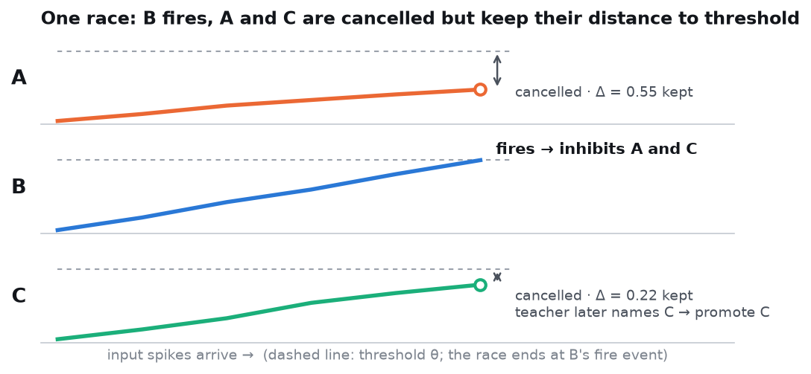
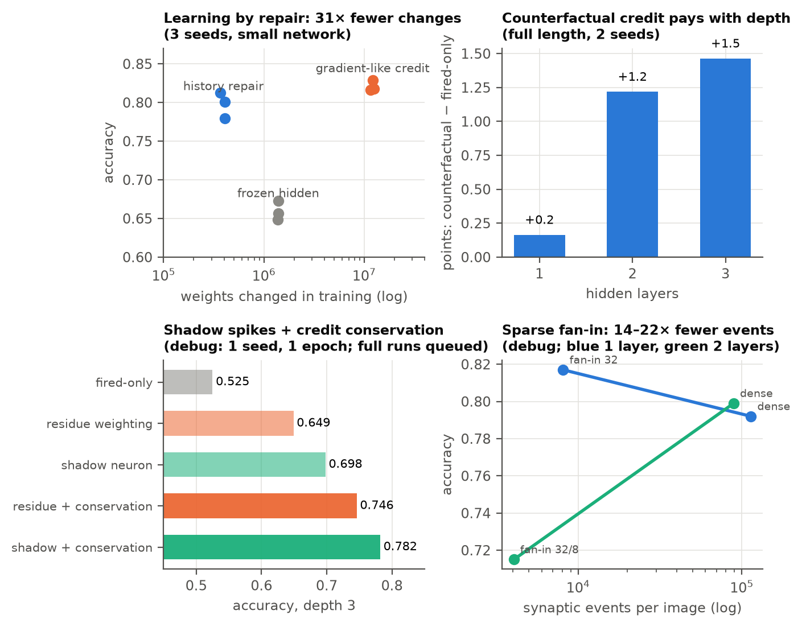
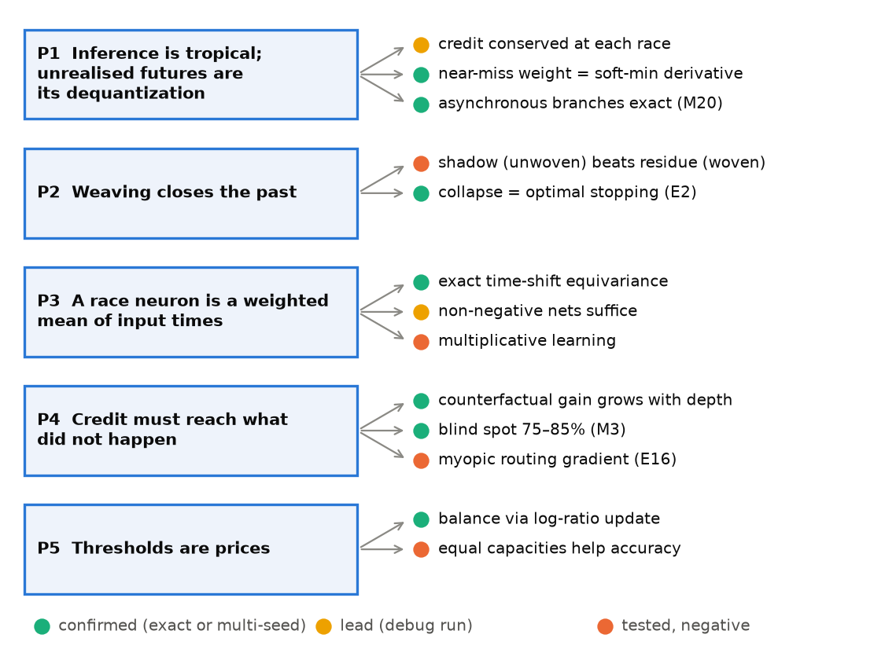

# Sleeping Machines: status report

*Status as of 27 September 2026 (PDF regenerated the same day). The fuller, illustrated version is the PDF built by `report/make_pdf.py`
(`report/sleeping_machines_status.pdf`). The theory is in `experiments/THEORY.md`, the running log in
`experiments/FINDINGS.md`, and every experiment's predictions in `experiments/E*_PREREGISTRATION.md`,
written before evaluation.*

Sleeping Machines proposes that computation can happen **in time rather than memory**: candidate events
race, the first to fire cancels the rest, and the cancelled ones keep a **trace of how close they came**, so
that a later teaching signal can use it. This report says what has held up, what has not, what the theory
now explains, and what is being tested.



**Contents:** [In one page](#in-one-page) · [The model](#the-model) · [Experiments](#experiments) ·
[Theory](#theory) · [E7 and E17: living in time](#e7-and-e17-living-in-time) · [E24–E29: computing with time](#e24e29-computing-with-time) · [Energy](#energy) ·
[Lessons](#lessons) · [Next](#next) · [Reproducing](#reproducing)

## Headline (27 September): a learned event network beats a clocked dense model at ~10⁵× lower cost

On a timing task ("B within Δ after A, unless C", 4 patterns + none, 12 channels; E27's task), with **nothing given**
(each detector learns which channel holds, which triggers, how long it holds and which channels veto; errors-only,
local updates):

| model | test accuracy | cost per episode | learning |
|---|---|---|---|
| **event network (E35)** | **1.000, 1.000, 1.000, 1.000, 0.9995** (5 seeds) | **7.5 synaptic events** | 443–1,530 updates in 200k episodes |
| clocked conv net, best (E32) | 0.995 | 3.07M multiply-adds | backprop, 200k episodes |
| clocked conv net, cheapest ≥ 0.99 | 0.992 | 768k multiply-adds | backprop |
| clocked conv net at ≈ 0.91 | 0.895 | 1.9k multiply-adds | backprop |

More accurate than the best dense model at about 10⁵× fewer operations, and the event cost does not grow with
silence while the clocked cost does. **Against Transformers (E36):** a Transformer on event tokens (one token per
spike, so it also pays nothing for silence) trained 10× longer (2M episodes) reaches 0.989–0.996 at 146k–1.16M
multiply-adds per episode: accuracy parity within half a point, at ≈ 2·10⁴–1.5·10⁵× the event network's cost and with
backprop over 2M episodes versus ~1,000 local updates. Priors on both sides: the event network is built from directional hold/veto
nodes (§64); the conv net gets a receptive field matched to the pattern length. What made it work is theory, not
tuning: order is an asymmetry of PSP durations and veto needs the held interval (§61, §64), and a node computing one
interval predicate needs only O(its few parameters) mistakes (§64.3). **Depth now pays too (E34):** on hierarchical
motifs, hold/trigger chains reach 0.97 (tuned part windows; 0.86 with a generic window bank) vs 0.39 at depth 1,
5 seeds. **Grokking (E37):** a network that can memorize (pair-node lookup, ρ ≈ 0.016) and also has a rhythm resource
memorizes and stays at chance without sleep (3/3 seeds); with sleep, the relation becomes the absorbing state and it
generalizes to 0.93–0.97 on unseen pairs in 2 of 3 seeds, with a genuine delay (memorized by epoch 5, generalizing
from epoch 70 at λ = 0.02). The rhythm is a generic resource, not the answer: the controls on relations it cannot
express are running.

**A theorem (§71, proved, and checked by exhaustive search in E39).** A single hold/trigger/veto node accepts exactly
a product set in lag coordinates relative to its trigger; consequently one node can put at most three events in order
(on the scale-free domain), depth 2 computes every conjunction of bounded-difference constraints (every zone), and
depth 3 every finite union of zones. This corrects an earlier claim (§64: "depth = chain length") and explains where
depth is needed: to order two events that fall on the same side of a node's trigger.

## In one page

**What holds up**
- **A cancelled node can be taught (E4).** At K = 128 classes, crediting near misses reaches 0.79 where the
  reward-modulated rule is at chance, with 6% of the weight updates of uniform credit.
- **Races decide as fast as the evidence allows (E2).** An accumulator race beats a fixed-time decoder at
  every decision time and matches the optimal MSPRT with additions and a threshold.
- **Learning work tracks activity, not capacity (E5):** about 300× fewer weight updates than a sparse
  softmax on the same connectivity.
- **Local, event-driven learning reaches about 96% on latency-coded MNIST** (E6 round 3, test; E14 with
  credit conservation, validation, 2 seeds: 0.960).
- **Counterfactual credit pays with depth (E14, full length).** Over fired-only credit: +0.2, +1.2, +1.5
  points at depths 1–3 (2 seeds), +1.9 and +2.5 at depths 4–5 (1 seed). A frozen hidden stack collapses.
- **Credit conservation, predicted by the theory, holds at full length:** +1.0 to +1.7 points at every
  depth, both seeds (0.960 / 0.952 / 0.941 vs 0.949 / 0.942 / 0.924 at depths 1 / 2 / 3).

**New on 26–27 September (E24–E29, THEORY §53–§58; pilots unless marked)**
- **Local learning in the race network does not grok (E24, complete).** Every race variant, with or without sleep,
  ends at or below chance on unseen pairs (≤ 0.008 vs 0.032). Among dense MLPs, backprop and Kolen–Pollack grok
  (0.87, 0.956), feedback alignment does not (0.000; Fourier-shaped feedback 0.033).
- **Delays compute where weights look up (E25).** A ring of relays computes (a + b) mod p for all pairs with no
  learning, 4p synapses. Learned as phases, 3p delays reach test 1.000 from 15–20% of pairs (5 seeds, p = 31–97),
  including a·b mod p (the delays find the discrete log). But this is **restriction, not grokking** (§58): the
  single-phase readout can express only one-character relations.
- **In a race, winning is positional (E26, E27).** Punishing the wrong winner in time collapses all detectors onto
  one phase (chance in all 15 runs, 3 seeds × 5 fractions); pull-only learning, sparse and error-driven, learns
  the relation from random delays (**full runs, 3 seeds: p = 31 test 0.97–0.98 at 50% of pairs, 0.81–0.94 at
  30%; p = 59 0.95 and 0.91–0.97**), with 10× fewer updates than the push. Timing noise makes generalization
  reliable at 20% (3/3 seeds vs 1/3) but, annealed by the error rate, caps accuracy near 0.75; **cooled to zero with
  the learner's own update count it keeps the reliability and lifts the cap** (p = 31: 3/3 seeds at 20%, 1.00 / 1.00 /
  0.92 at 30%; smaller gain at p = 59). False positives must not be displaced in time (E27, 5 seeds: 0.195 vs 0.914 with veto, 0.896 with none).
- **Depth is learnable with routing credit, but does not pay yet (E28b/E28c).** With §60's fixes, depth 2 needs
  counterfactual routing credit (path-only 0.17, chance 0.14; with it 0.72–0.74, 3 seeds, vs depth 1 0.68). But
  with 15 classes built from 6 shared motifs (5 seeds), depth 1 beats depth 2 at 20k (0.50 vs 0.42) and 60k
  episodes (0.51 vs 0.44): the shared-part advantage depth should have is not realized by the native rule.
- **Routing credit (E28, full runs, 3 seeds, before the readout fix): counterfactuals help, the near-miss lead
  reversed, depth does not pay yet.** Counterfactual credit beats path-only (0.31–0.33 vs 0.17); near-miss adds nothing over fired credit at
  k = 2 (0.31 both; the pilot's 0.41 vs 0.34 did not survive); near-miss at k = 1 matches it with 28% fewer events
  but high variance; depth 2 ≈ depth 1 (0.29). No arm solves the task (chance 0.14): the readout lacks §60's fixes.
- **The operator basis is Turing-complete, and restoration makes it scalable (E30, complete).** A two-counter
  Minsky machine wired only from Delay/Or/And/Veto nodes and one reference oscillator runs every test program
  exactly. With timing jitter, a comb coincidence once per cycle makes success independent of program length
  (q/σ = 20: 1.00 over 25 and 81 steps; without restoration 0.60 and 0.30).
- **A measured frontier against a clocked dense model (E32).** On E27's timing task, at matched accuracy (≈ 0.91):
  event learner 10.2 synaptic events per episode vs 1.9k multiply-adds for the cheapest clocked conv net (≈ 190×;
  ≈ 80× in energy), ≈ 19,000× when the episode sits in 99% silence, ≈ 6,000× fewer training operations. Caveats:
  the dense model reaches 0.995 at 3M multiply-adds, and a sparse (event-driven) dense model narrows the gap to ≈ 10×:
  the advantage belongs to the event paradigm and grows with silence (§63).
- **SHD with the new architecture: not yet (E38, E40, negative).** On real speech the representation is the bottleneck.
  A dense softmax on local temporal-pair parts reaches only 0.40; adding onset-referenced parts (§56.2's reference)
  lifts it to 0.566, matching the dense MLP; normalizing time by utterance duration (a second reference, for tempo)
  lowers it (0.46). The native zone learner on those parts overfits (train 0.65, test 0.27–0.33, sleep does not help).
- **Stateful nodes are strictly stronger (E39b).** "B after A and C not between them" (an order-XNOR) is computed by one
  arm/disarm node and by no stateless node (exhaustive search), extending §71.
- **§72's collapse phase observed (E37).** With sleep but no shared route, training accuracy falls to 0.45 and test is
  0.00 in all seeds: memorization cannot persist under decay and nothing takes over.
- **Pull-only does not transfer to weights (E26b, negative).** Dropping the competitor push in the main race
  collapses SHD from 0.35 to 0.06. For weights the native counter-force is a conserved per-node budget (§60).
- **True grokking test (E29): no grokking yet (1 seed).** Frozen random loops memorize (test 0.015); with hidden
  learning, training collapses with learned or fixed periods: hidden-layer credit is the open problem. Earlier: Readout fixed by conservation, prices, and
  enough hidden nodes (96 cannot memorize 480 pairs by Cover's bound; 384 can: train 0.88).

**What does not (yet)**
- **Depth still costs accuracy.** The theory now names three reasons (credit contraction, activity drift,
  pattern chaos), each with a predicted remedy; all are untested.
- **Energy.** Only the single racing layer beats an equally accurate dense model at inference (about 2.4×).
  Sparse fan-in (14–22× fewer events in pilots) is the candidate fix.
- **Leads that reversed.** The shadow neuron (+5 points in debug runs, −0.8 at full length); the
  counterfactual routing gradient in mixture-of-experts (a tie with load balancing at 10 seeds).
- **Spiking Heidelberg Digits (E22), the first event-native benchmark: poor.** Race 0.35–0.36 vs dense MLP
  0.56–0.59 (validation), and a frozen random hidden layer (0.385) beats trained ones. Later decisions help only
  slightly (0.30 → 0.36); the local learning rule is the main problem there.
- **Residual streams did not rescue depth** under local learning (depth 3: 0.915 with delay-matched skips, 0.898
  with plain skips, 0.937 without), at 2–4× the synaptic events.
- **Market stream (E17): no edge.** The race matches simple baselines while deciding a third earlier, but
  continual learning did not help, learned trade selection had no skill, and every learner loses money after costs.
- **Class-incremental split-MNIST (E23), first readout: the race forgets more than SGD, against §50's
  prediction.** With a single head both forget everything (0.97 / 0.98): the newest classes win every input, so
  that metric cannot separate them. Task-aware (only the task's own classes may win): race forgetting 0.17 vs
  MLP 0.03 at 1k frames per task, MLP 0.03 again at 4k (1 seed). Diagnosis (§51): the race output has no class
  prior, since its thresholds are fixed, so each new block's prior shift is written into old classes' feature weights.
  Learned output prices (M52) are being tested.
- **Not yet run:** the E7 stream learner and most theory predictions (M31–M43).

## Direction (decided 26 September)

**The project's identity is local, sparse, error-gated learning on an asynchronous substrate:** learning whose
cost follows events and errors, decisions that take as long as the evidence needs, and credit through what did
not happen. Matching dense accuracy by training spiking networks with backpropagation is an established field in
which this project would only be catching up. Consequences (ROADMAP.md):

- **Exact-gradient training is a diagnostic ceiling, not the method.** It showed the race architecture itself is
  close to dense: with exact gradients and no cancellation, 0.9675 vs 0.976 for an MLP (MNIST, depth 2, matched
  budget). So the remaining gap is mostly the local learning rule, plus about 2 points for cancellation
  (Fermi–Dirac training recovers ~60% of that, as a training-time technique).
- **Every result reports its energy side** (synaptic events, spikes, weight updates) and is judged on the
  accuracy-vs-energy frontier against dense models.
- **Every mechanism gets a locality audit**: per node is fine; a slow per-layer broadcast is acceptable; a global
  backward pass is diagnostic only.
- **Benchmarks where asynchrony and continual learning are native:** SHD (E22), class-incremental streams (E23), and
  next NeuroBench's keyword few-shot class-incremental task.
- **Generalization beyond the overfit/underfit compromise (added 26 September):** grokking (E24), with sleep as
  synaptic downscaling. Theory §52: without sleep the race's memorization is absorbing; with sleep it becomes a
  phase transition. No demonstration of grokking in spiking or event networks was found in a web search.

## Direction update (27 September)

The 26 September direction still holds, with one sharpening: **every mechanism must be native** (an event handler:
local state, triggered by events, cost proportional to events; no batches, epochs, global sums, normalisation
across units, replay, or scans over all classes). E25's replay and trace learners worked by going dense and are
kept as diagnostics only. The research questions are now the gaps named in THEORY §55–§58:

- **G0, where supremacy can live (§55).** Not in operation counts for static functions (an encoding effect), but in
  cost per information event on sparse streams, evidence-limited latency, and learning cost per error, all three
  at once and against dense models given the same priors. The input-side factor is 1 / (spikes per channel per
  precision bin): SHD gives only ~6× at the 10 ms bins dense models use (59× at 1 ms), so it is not the supremacy
  benchmark; that needs streams with density ≪ 0.01 per bin.
- **G1, native credit.** Pull-only toward partners, veto for false positives, near-miss routing (§54, §56.5, §57).
- **G2, time that computes.** Delay, k-of-n threshold with window, veto, hold, and one oscillator reference as the
  operator basis (§56); clockless networks cannot add times, one rhythm gives one cyclic character.
- **Generalization standard (§58).** Report the capacity ratio ρ = n / params; grokking only when memorizers exist
  in the class and the learner still finds the relation.

## The model

Nodes are non-leaky integrate-to-threshold units with ramp synapses, in groups of 10; the first k = 3 to cross
threshold in a group fire, and the rest are cancelled, each freezing its distance to threshold. There is no
global clock: the simulator jumps from event to event and counts every operation.

**How a decision unfolds (weaving; [WEAVING.md](experiments/WEAVING.md)).** Each group holds an open set of
possible futures: its members' projected crossing times, which only move earlier as input arrives. A crossing
is *woven*, fixed history. When k members have crossed, the group closes and each loser's residue is frozen as
a near miss. Spikes from closed groups drive the next layer, so the settled region spreads through the network
as a diagonal front in layers and time, until the first output crossing decides. Learning rereads the woven
record, near misses included.

## Experiments

| experiment | question | result |
|---|---|---|
| **E4** counterfactual credit | can a cancelled node be taught? | yes: K = 128, 0.79 vs chance for fired-only rules; 6% of the updates of uniform credit; global-gradient reference 0.93 |
| **E2** adaptive decisions | does a race decide as fast as the evidence allows? | yes: dominates fixed-time decoding, matches MSPRT; 0.29 s easy vs 1.69 s hard |
| **E5** capacity | does work track activity? | inference flat in K (as is sparse softmax); learning 25–560× fewer updates |
| **E6** hidden layers | does local learning train hidden layers on MNIST? | round 3: about 0.96 (test); hidden learning +6 points over frozen random |
| **E14** depth | where does counterfactual credit pay? | gap over fired-only grows with depth (+0.2 → +2.5, depths 1–5); conservation +1.0–1.7 at every depth |
| **E16** routing (MoE) | does the counterfactual routing gradient help MoE? | myopic as derived; with lookahead, ties load balancing (10 seeds). No MoE claim |
| **M18** history repair | learn by fixing the pivotal event? | within 2.3 points of gradient-like rules with 31× fewer weight changes (3 seeds) |



**Depth, full length (validation; mean of 2 seeds unless noted).**

| hidden layers | counterfactual | fired-only | frozen | counterfactual + conservation |
|---|---|---|---|---|
| 1 | 0.949 | 0.947 | 0.873 | **0.960** |
| 2 | 0.942 | 0.930 | 0.708 | **0.952** |
| 3 | 0.924 | 0.909 | 0.565 | **0.941** |
| 4 (1 seed) | 0.910 | 0.891 | | |
| 5 (1 seed) | 0.897 | 0.872 | | |

Non-negative (excitatory-only) weights cost 0.5 points at depth 3 (0.932 vs 0.937, 1 seed).

## Theory

The theory note (`experiments/THEORY.md`, §1–41) reduces to five principles, now extended by a set of exact
results and derived mechanisms.



**What the theory added since (§27–41).** *Exact* means a derivation without approximation. *Scaling* means
an order-of-magnitude argument whose exponent or sign is the prediction. None of the predictions has been
confirmed yet; the tests are queued.

| result | kind | prediction / status |
|---|---|---|
| Timing credit sums to the deadline's credit: a Ward identity from time-shift symmetry (§30.1) | exact | centring timing credit is the symmetry, not a heuristic |
| Excitatory race networks are topical maps: timing noise is never amplified; each decision has a certified jitter radius (§34) | exact | zero flips among certified samples (M36) |
| Committing to a branch costs σ × surprisal; near-miss credit is the gradient of that cost; the supervised loss is the cost of weaving the teacher's branch (§35) | exact | self-supervised commitment objective widens margins (M37) |
| Deep credit contracts like a Markov chain; exact kernels conserve errors in the sum (§30–31) | scaling | share Jacobian + centring trains depth 3 (M34) |
| Credit through positive weights collapses to an activity (Perron) mode (§27, §29) | scaling; the outlier mode is prior art | Perron centring ≥ mean centring (M33) |
| Prices (thresholds) must be the faster timescale; our default is 10× too slow (§36) | scaling | threshold near κ ≈ η for pivotal credit (M38) |
| Firing *patterns* are chaotic, ρ' ≈ A√ρ, with no ordered phase; A ∝ 1/√k; topographic codes damp it (§41) | scaling | slope ½ in log ρ across layers (M43) |
| Winner–fan-in coupling k·F ≥ G; widths from the data's entropy exponent (§37) | scaling | entropy exponent measured as α ≈ 0.95, which **refuted** an input-redundancy pyramid |
| Optimal weaving prices commitment cost (MSPRT); race neurons are blind to absence unless referenced to their own onset (§38) | scaling; MSPRT is prior art | relative stopping beats the absolute race (M40) |
| A neuron's firing time is concave piecewise-linear, one piece per causal set (§34.1) | prior art | polyhedral geometry of first-spike networks (2026) |
| Deep exact training collapses; fast homeostasis + Ward centering of timing credit rescue it (§27, §30, §36) | scaling, **confirmed** | depth 3 exact training 0.10 → 0.87 (debug); the first theory-derived fix that changed a result materially |
| A race layer cannot learn the identity, so depth needs identity paths; skips must be delay-matched, or the shallow path wins the race (§47) | scaling, **partly refuted** | delay matching beats plain skips (0.915 vs 0.898), but no skips is best under local learning (0.937) |
| The entropic k-winner race is Fermi–Dirac; its chemical potential is the price (§48) | exact; soft top-k is prior art | soft-race training recovers ~60% of the cancellation cost (0.942 vs 0.930 / 0.951) |
| Race layers are equivariant under dilation as well as shift; temporal collapse shrinks deep weight gradients; temporal normalisation is a gauge choice (§49) | exact symmetry; scaling for the collapse | queued |
| The conserved near-miss rule is Crammer–Singer's ultraconservative algorithm, so forgetting is bounded by the new task's mistakes, vs O(log T) for softmax SGD; homeostasis is the non-conservative leak (§50) | mistake bound is prior art; the continual-learning consequence is new | **contradicted so far** (E23, task-aware: race 0.17 vs MLP 0.03); §51 locates the gap |
| A norm bound is not a discrimination bound: without a class-prior channel the prior shift of each new block is written into old classes' feature weights; in time, a class bias is a price (output threshold) (§51) | scaling; task-recency bias is prior art (BiC) | learned output prices cut task-aware forgetting (M52), queued |
| Grokking: memorization is memory indexing (norm grows with data), the relation has a fixed norm; the ultraconservative rule makes memorization absorbing; sleep downscaling makes waking + sleeping Pegasos, which converges to the max-margin relation; one dial trades forgetting for generalization; plasticity peaks and hidden codes merge at the transition (§52) | exact at the output (via §44); scaling for delays | E24 running: dense MLP groks on CPU (test 0.00 → 0.87); race without sleep memorizes, test below chance |
| Delays instead of lookup: a ring adds mod p; delays as phasors learn exactly the one-character relations; replay is power-method synchronization (§53) | exact class; synchronization is prior art | E25: test 1.000 above a capacity threshold; restriction, not grokking (§58) |
| In a race, winning is positional: pull-only error-driven learning converges, pushing the wrong winner collapses the detectors (§54) | scaling | E26 pilot: chance with push, 0.86–0.91 without; transfer to the main race queued |
| Supremacy is not in op counts for static functions (encoding effect); it can only be in cost per information event, evidence-limited latency and learning cost per error (§55) | argument; Neuro-RAM separation is prior art | defines the benchmark target |
| Clockless = shift-equivariant: no sums of times; one oscillator reference gives one cyclic character; credit follows one critical path; losers are specialized by veto, never displaced; coincidence targets are partners (§56) | exact (symmetry); space-time algebra is prior art (Smith 2018) | E27 pilot: veto 0.87–0.92 vs push 0.21 |
| Routing needs counterfactuals; cancelled near-misses supply them at no extra events (§57) | new rule; top-k MoE is prior art | E28, 3 seeds: counterfactual 0.31–0.33 vs path-only 0.17; near-miss ≈ fired at k = 2 (pilot lead reversed); depth 2 ≈ depth 1 |
| Restriction vs forced generalization vs grokking; report ρ = n / params (§58) | criterion | E29 (true grokking test) running |
| The basis + one reference is Turing-complete; restoration in time makes reliability length-independent (§59) | construction; Minsky/Maass completeness is prior art | E30: exact; q/σ = 20 restored 1.00 at 25 and 81 steps |
| Pull-only on weights needs conservation; readout capacity (Cover) bounds memorization (§60) | refutes §54's transfer | E26b: SHD 0.06 without push; E29 readout 0.45 → 0.88 with 384 hidden |

**Honest assessment of the theory.** Most of it applies known mathematics to race networks. It is correct and
sometimes useful, but not new mathematics. It changed results in four places: conservation (+1.0 to +1.7), the
depth-3 rescue (0.10 → 0.87), delay-matched skips (+1.6 over plain), and Fermi–Dirac training (+1.2). Several
predictions were refuted, and many remain untested. The next genuine step is a result about what local learning
can and cannot learn. §50 (bounded forgetting) was the first aimed at the project's own niche, and its first test
went against it; §51 names why. §52 (grokking) is the second: it predicts that the same property, error-gated
updates that stop at margin, both protects old tasks and forbids generalizing past memorization, with sleep as
the dial between them.

The mathematics is borrowed (Noether and Ward identities, Perron–Frobenius and topical maps, Birkhoff
contraction, Gibbs and Landauer identities, two-timescale stochastic approximation, mean-field propagation).
Its application to race networks was not found in a few targeted searches (THEORY §32), which is not a claim
of priority.

**Open problems the theory names but does not solve:** learning dynamics beyond the timescale argument,
generalisation (only a robustness-based trend, §40), what σ is on real hardware (§39), and recurrent,
asynchronous regimes (only stability, §34.5).

## E7 and E17: living in time

**E7 (causal stream with scarce, late, or requested labels)** is built and tested, with its preregistration
written; its pilots have not run yet.

**E17 (a continually learning race on a live market stream; [preregistration](experiments/E17_PREREGISTRATION.md)).**
Binance BTCUSDT trades (a crypto market; freely available stock tick data with raw timestamps was not found),
7 pilot days and 21 confirmatory days as one stream. Every 10 s the race restarts, trades stream in as spikes,
and the network commits at its first output crossing or abstains; the label is the move over the next 10 s
from the moment it decided. The backtest is prequential: every learner except the frozen control keeps
learning at test time, and look-ahead is impossible by construction. A three-output variant (up / down /
**hold**) learns whether a move will pay the trading cost, that is, when to trade. **Not a trading system; no
live trading.**

**Results (21 confirmatory days, prequential; 95% day-block intervals).**

| learner | direction accuracy | episodes decided | mean decision time | profit proxy, bp per episode (2 bp cost) |
|---|---|---|---|---|
| race (continual) | 0.593 [0.583, 0.605] | 88% | 6.7 s | −1.61 |
| race, frozen after pilot | 0.595 [0.585, 0.608] | 78% | 7.0 s | −1.42 |
| race with **hold** (learns when to trade) | 0.511 [0.493, 0.524] | 1.4% | 3.6 s | −0.03 |
| online logistic regression (B1) | 0.583 [0.574, 0.594] | 100% | 10 s | −1.85 |
| momentum (B0) | 0.591 [0.580, 0.604] | 79% | 10 s | −1.44 |

- **Preregistered verdicts:** the race is *competitive* (met: it decides 33% earlier) and nominally *better*
  than B1 (+1.0 point [0.6, 1.5]). **A fairness check made after seeing the results overturns "better":** B1
  restricted to its most confident 88% of episodes, the race's coverage, is as accurate (race − B1 = +0.1
  [−0.3, +0.5]), and the race ties plain momentum (+0.2 [−0.3, +0.6]). The race's edge came from abstaining on
  hard windows. **What survives: baseline accuracy while deciding a third earlier.**
- **Continual learning did not help:** continual − frozen = −0.2 points [−0.6, +0.1]. Over these three weeks
  the market's short-term dynamics did not drift in a way that test-time learning could exploit, or the rule
  did not find it.
- **Learning when to trade:** the hold race learned to almost never trade (1.4% of episodes), which is what
  the costs justify, but its trades are at chance (0.51), and its profit ties B1's most confident trades at
  the same rate (−0.03 vs −0.02 bp). No trade-selection skill.
- **Every learner loses money after costs.** Short-term direction is predictable at about 59% on moves of
  at least 1 bp (more than the ~50% null the preregistration expected; checked for look-ahead), but not by
  enough to pay a 2 bp cost, let alone the 10 bp taker fee.

## E24–E29: computing with time

**E24 (grokking, complete).** p = 31, half the pairs. The race with local credit memorizes: train ≈ 1.0, test
≤ 0.008 in all 17 runs (sleep 0 to 3·10⁻², with and without a deadline); sleep at 10⁻² or stronger destroys
training accuracy instead. Dense MLPs: backprop 0.87, Kolen–Pollack 0.956, feedback alignment 0.000. At p = 97,
backprop fails at 10% and 20% of pairs and groks at 30% (0.937).

**E25 (delays instead of lookup).** The compiled ring: all p² pairs correct, 4p synapses, 2b + p + 1 synaptic
events per query. Delays as phases, learned by replay (power-method synchronization): test 1.000 on unseen pairs
from 20% of pairs at p = 31, 15% at p = 59 and 97 (5 seeds each); below the capacity threshold it memorizes
(train 1.0, test at chance). Learnable class: exactly y = h(f(a) + g(b) mod p), including a·b; a² + ab + b² and
random tables are not (a DFT-rank argument, §53.5). Kept as a diagnostic: the learner is dense, and the
generalization is restriction by the readout (§58).

**E26 (native delay learning).** Same ring, but learning is sparse, local and error-driven, with a race readout.
400k samples per run, 3 seeds.

| p | fraction | pull-only (test) | with push (test) | pull-only + noise σ = 1 (test) |
|---|---|---|---|---|
| 31 | 0.05–0.10 | memorizes (train 0.3–0.75, test at chance) | chance | memorizes |
| 31 | 0.2 | 0.78 (1 of 3 seeds), others fail | chance | 0.73 (3 of 3) |
| 31 | 0.3 | 0.81–0.94 | chance | 0.69–0.77 |
| 31 | 0.5 | 0.97–0.98 | chance | 0.75–0.77 |
| 59 | 0.2 | 0.89 (1 of 3) | – | queued |
| 59 | 0.3 | 0.91–0.97 | – | queued |
| 59 | 0.5 | 0.95 | – | – |

The push makes about 386k updates per run (an error on nearly every sample); pull-only about 40k at 50% of pairs.
Noise annealed by the error rate stays near σ ≈ 0.25 and limits accuracy. **E26c** cools σ = 1 to zero with the
learner's own update count (3 seeds): p = 31 generalizes at 20% in 3/3 seeds (0.74–0.83) and reaches 1.00, 1.00,
0.92 at 30%; p = 59 0.93–0.97 at 30%, 1/3 seeds at 20% (as without noise). Transfer test to the main race (`--compete 0` on SHD and E24) queued.

**E27 (delays + coincidence windows + veto, full runs, 5 seeds, 200k episodes).** Patterns "B within Δ after A
unless C"; 10% of episodes are vetoed near-misses, so a network without veto is capped near 0.9.

| false positives handled by | test | updates |
|---|---|---|
| veto (specialize) | 0.914 (0.887–0.934) | 15–20k |
| none (no veto synapses) | 0.896 (0.881–0.918) | 18–23k |
| push (displace in time) | 0.195 (0.18–0.20) | ~155k |

Displacement is decisively destructive. Veto helps (+1.8 points) but does not yet approach 1.0, so veto learning is
only partly working. (The first task version did not need veto; fixed by planting vetoed near-misses.)

**E28 (depth and routing, full runs, 3 seeds, 60k episodes).** Hierarchical motifs (ordered pairs of sub-motifs;
chance 0.14).

| arm | test (mean; seeds) | events / episode |
|---|---|---|
| depth 1 | 0.29 (0.34, 0.22, 0.32) | 11.7 |
| depth 2, critical path only | 0.17 (0.18, 0.12, 0.21) | 17.9 |
| depth 2, fired runners-up (k = 2, MoE-style) | 0.31 (0.34, 0.30, 0.30) | 24.6 |
| depth 2, + near-miss pull (k = 2) | 0.31 (0.34, 0.30, 0.29) | 24.6 |
| depth 2, near-miss (k = 1) | 0.33 (0.43, 0.36, 0.18) | 17.9 |
| depth 2, near-miss + push | 0.17 (0.08, 0.14, 0.29) | 24.6 |

**E28b (the same, with §60's readout and hidden-layer conservation, 192 hidden, k = 1; 3 seeds).**

| arm | test (mean; seeds) |
|---|---|
| depth 1 | 0.68 (0.72, 0.59, 0.73) |
| depth 2, fired credit | 0.74 (0.69, 0.83, 0.70) |
| depth 2, + near-miss credit | 0.72 (0.72, 0.77, 0.68) |
| depth 2, critical path only | 0.17 (0.15, 0.12, 0.22) |

With a working readout, depth 2 with routing credit edges past depth 1, and without routing credit it stays at
chance. **E28c** (15 classes from 6 motifs, 5 seeds) tests the case depth should win, shared parts:

| training | depth 1 | depth 2, fired credit |
|---|---|---|
| 20k episodes | 0.50 (0.43–0.56) | 0.42 (0.38–0.46) |
| 60k episodes | 0.51 (0.42–0.56) | 0.44 (0.40–0.47) |

Depth 1 wins at both lengths: the hidden layer does not learn reusable motif detectors under the current rule.

**E36 vs E34 on the hierarchical task (important):** a Transformer on event tokens trained on 2M episodes reaches
0.9975–0.998, above E34's 0.97 (tuned windows, 40k episodes) and 0.86 (window bank), at ≈ 175k–690k multiply-adds per
episode vs ≈ 14 events. On composition, a well-trained Transformer currently wins on accuracy; E34 keeps a ≈ 10⁴×
cost advantage. E34 with 5× and 25× more training is queued for a fair budget. E34's errors with the window bank are
mostly classes sharing one motif, caused largely by *dead classes* (no synapse ever crosses threshold: tied copies of
the same channel pair at several scales split the pulls); Winnow-style multiplicative pulls help slightly (0.916 vs
0.912, 3 seeds, 20k) and one-shot recruitment of dead classes hurts (0.79–0.94: routes latch onto early distractors).
**Corrected diagnosis (§62):** receptive fields show the trained hidden nodes *are* part detectors (86 of 124 take
both strongest inputs from one motif; untrained 2 of 35); the §60 readout accumulates without a window and so
discards the parts' order, which is what E28's classes are made of. **Refuted by the error breakdown:** depth 2
makes no order errors (0% reversed-class errors vs 13% at depth 1); 56% of its answers are a class that shares one
motif with the right one. It fails at *conjunction*: one detected part fires a class. Neither a cap on single
synapses (0.36–0.45; ~14 redundant detectors per motif still sum past threshold), windowed readouts (0.35–0.46),
nor global hidden competition (0.23–0.36), nor input consumption by the first hidden spike (the manifesto's
self-cancelling events; 0.16–0.35: early distractor coincidences consume the motifs' spikes) fixed it. Open: how a
native readout requires two *distinct* parts. (Superseded first diagnosis: a selectivity
metric suggested class detectors, median class selectivity 0.21 vs motif 0.12, with label-gated or label-free credit; motifs span up to 1.5 but a window is 0.6, so pulls never
reach the motif's second spike. Hold-then-align hidden learning, the predicted fix, did not help (accuracy unchanged,
class selectivity rose further): the missing piece is a pressure toward parts over wholes. Sparse hidden fan-in (2–3 random channels per node) was
worse (0.17–0.36, 2 seeds): with 192 nodes a given motif pair is covered by ~1.6 nodes.) A windowed readout
that can see order is being tested. (Before the fix:) Counterfactual routing credit is needed (path-only fails), but the one-seed near-miss lead
reversed, and depth did not beat depth 1. All arms were far from solving the task; the readout uses pull-only weights without §60's
conservation and prices, and 48 hidden nodes, which E29 showed cannot work. Rerun with those fixes is next. Two
bugs found on the way were theory errors: a one-sided "make it earlier" rule drifts every delay past the anchor,
and counterfactual pulls must use the near-miss's partial window only.

**E29 (true grokking test).** A general race network that can memorize, given recurrent delay loops with random
learnable periods, native credit, E24's encoding. Getting the no-loop control to memorize took four fixes, each a
theory point (§60): output nodes accumulate without leak; pulls conserve a per-node budget in fractional steps;
weakening conserves too; per-node prices break up hub classes; and the hidden layer must exceed the readout's
Cover capacity (96 nodes cannot separate 480 pairs; 384 memorize, train 0.88). First full runs (p = 31, half the
pairs, 80 epochs, ρ ≈ 0.006, 1 seed): **no grokking yet.**

| arm | train | test (chance 0.032) |
|---|---|---|
| loops, hidden and periods learned | collapses to 0.03 (periods random-walk between 1 and 29) | 0.04 |
| no loops, hidden learned | 0.38 | 0.006 |
| loops frozen (random reservoir), hidden frozen | 0.64 | 0.015 |

Frozen random loops only memorize, as §56.2 predicts for unlearned injection delays. With learned hidden weights and
delays the network collapses whether loop periods are learned or fixed (E29c, fixed periods: train 0.05, test
0.015), so the cause is not period credit (my first diagnosis) but hidden-layer learning among many loop-lap
arrivals. Native hidden-layer credit is the open problem shared with E28c.

**E30 (completeness, complete).** A two-counter machine as a netlist of Delay, Or, And (a PSP window per input) and
Veto nodes plus one reference oscillator; counters are phases of spikes in hold loops. Exact on add, double and
parity (10 inputs). Under timing jitter:

| q/σ | 25 steps, plain | 81 steps, plain | 25 steps, restored | 81 steps, restored |
|---|---|---|---|---|
| 20 | 0.60 | 0.30 | 1.00 | 1.00 |
| 10 | 0.23 | 0.13 | 0.975 | 0.975 |
| 6.7 | 0.15 | 0.05 | 0.75 | 0.58 |

Restoration (one comb coincidence per counter per cycle) makes reliability independent of length where q/σ ≥ 10.

**E32 (frontier vs a clocked dense model).** E27's task; dense = 1-D temporal conv on binned spikes (F filters,
receptive field 4 units), backprop + Adam, 200k episodes, 2 seeds; event = E27's learner, 5 seeds.

| model | test | cost / episode |
|---|---|---|
| event learner | 0.914 | 10.2 synaptic events |
| dense F = 16, δ = 0.05 / 0.25 / 1.0 | 0.995 / 0.984 / 0.935 | 3.07M / 123k / 7.8k MACs |
| dense F = 4, δ = 1.0 (cheapest at ≈ 0.91) | 0.895 | 1.9k MACs |
| dense F = 4 / 2, δ = 2.0 / 1.0 | 0.845 / 0.686 | 500 / 970 MACs |

With 99% silence around each episode the dense costs grow 100×; the event cost does not. See §63 for caveats.

**E26b/E26d (transfer to the main race, negative).** SHD, depth 1, 10 epochs, 1 seed:

| output rule | SHD validation |
|---|---|
| competitor push (baseline) | 0.35 |
| no push | 0.061 |
| no push + conserved budget (3 or 10 thresholds) | 0.056 (both; chance 0.05) |
| push + conserved budget (3) | 0.276 |

In the main weight race, pull-only fails and a conserved budget alone does not rescue it (it also costs 7 points
with the push). **E31** added per-class prices to the main race (SHD, depth 1, 10 epochs, 1 seed): price step
0.003 → 0.291, 0.01 → 0.266, prices + conserved budget → 0.203, prices + budget without the push → 0.043, all
below the 0.35 baseline. §60's readout, which rescued E28, does not transfer to the main race.

## Energy

Operation counts priced with published per-operation energies (45 nm logic and SRAM; measured Loihi): order-of-
magnitude estimates, not chip measurements. At inference, only the single racing layer beats an equally
accurate dense model (about 2.4× at batch 1; it loses at batch 256). The dense hidden-layer networks use about
108k synaptic events per image, more than an equally accurate 32-unit MLP. Training is 1.2–1.5× cheaper than
unbatched dense training. Sparse fan-in is the lever: 14–22× fewer events in pilots.

## Lessons

- **The queue is not optional (26 September).** A fourth host hang: ten ad-hoc E24 jobs launched beside two queue
  runners in a 3-CPU, 10 GB, no-swap container. All runs now go through `experiments/queue/run_safe.sh`: one job
  at a time under a global lock, one BLAS thread, a watchdog at 70% of the container's memory.
- **Dense machinery creeps in.** Replay, phasor sums, restarts selected offline, dense updates: each rescued a
  result by leaving the event-driven world. Such results are diagnostics, not the direction.
- **Check what a structure gives away.** E25's generalization came from its readout's hypothesis class; §58's
  capacity ratio is now reported with every generalization claim.

- **Compute discipline.** Two heavy jobs at once hung the host three times (no swap and no container memory
  limit; two hard reboots corrupted the filesystem). The third time, an ad-hoc debug run ran beside the queue.
  Every computation now goes through a one-job queue (watchdog at 6 GB free, checked every second), and the
  container gets hard memory and CPU caps (`dev.sh`).
- **Debug leads reverse.** The shadow neuron led by 5 points in 1-epoch runs and trailed at full length;
  conservation's +8–10 became +1–1.7. Short runs are reported as leads only.
- **Theory can be wrong in informative ways.** A predicted pyramid was refuted by measuring the data; an early
  smoke test contradicts the predicted size of the activity mode. Both sit next to the claims they test.
- **Controls before claims.** Round 3 looked like a win for counterfactual hidden credit until the fired-only
  ablation matched it at one layer; the depth study then showed where it does pay.

## Next

1. **E26–E28 full runs (queued):** do pull-only, veto and near-miss routing hold across seeds; does depth 2 beat
   depth 1; does `--compete 0` transfer to SHD and E24.
2. **E29 redesign:** activity levels so the general network can memorize, then the grokking test at ρ ≪ 1 with
   and without loops and counterfactual credit.
3. **Hold and rate operators:** temporal memory and interval scaling, completing the operator basis (§56).
4. **Conservation in the main race:** `--compete 0` plus per-node conserved budgets on SHD, to see whether the
   native counter-force recovers or beats the push.
5. **The supremacy benchmark (§55):** a sparse event stream where cost per information event, latency and updates
   per error can all be measured against dense models given the same priors.

## Reproducing

```bash
experiments/run_queue.sh experiments/queue/e14_next.txt PYTHON   # all runs, strictly one at a time
python experiments/e17_market.py --learner race                  # E17 (data: data/binance, see the preregistration)
python experiments/e17_analyze.py                                # E17 decision rules
python report/make_pdf.py                                        # the PDF report
```

Earlier experiments (E2, E4, E5, E6) keep their exact commands in this file's git history
(`git log -p REPORT.md`) and in each script's docstring. Dependencies: `numpy`, `matplotlib`, `reportlab`.
